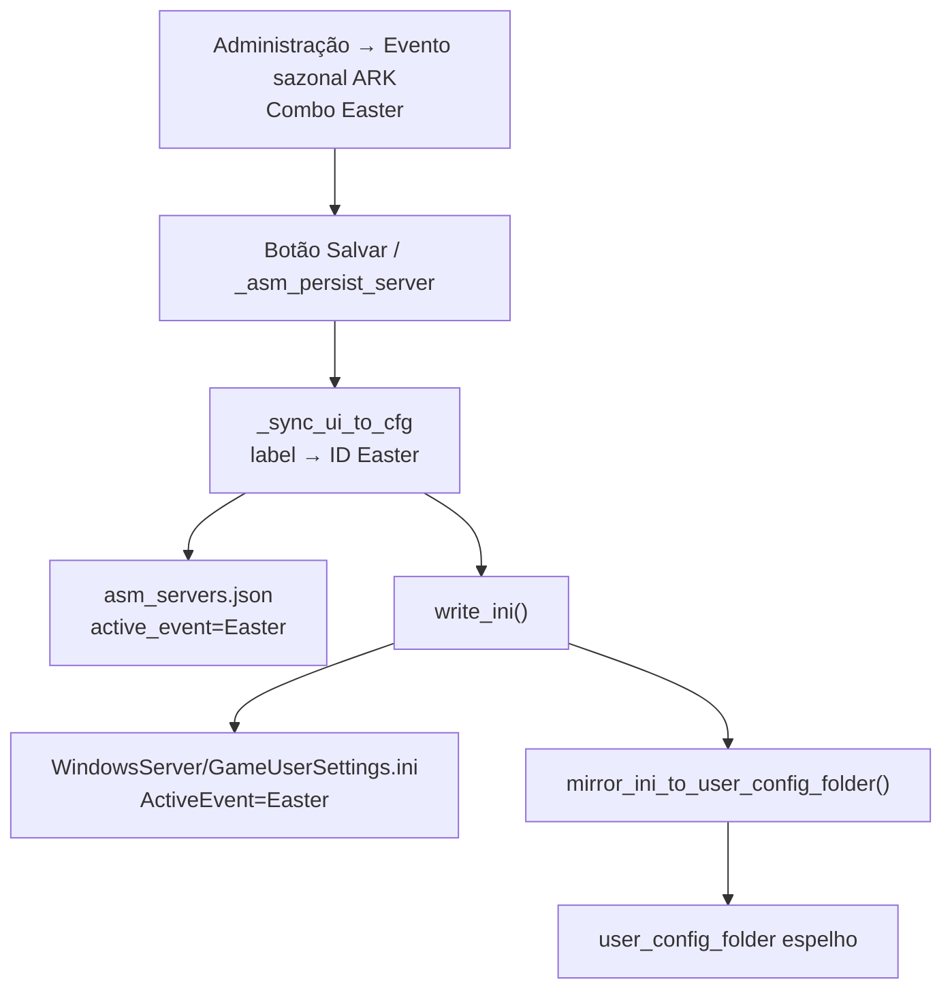
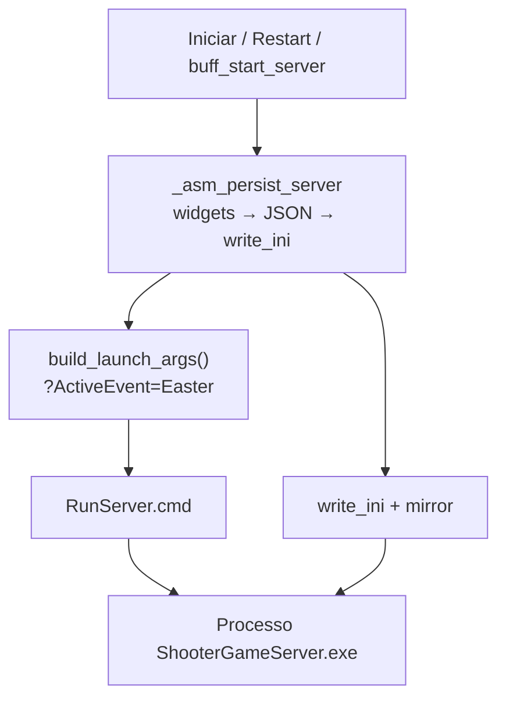

# ActiveEvent — rastreamento end-to-end (TEK / ARKLAND)

Documentação do fluxo `active_event` (Evento sazonal ARK) desde a UI até dinos coloridos no servidor.

> **Dois sistemas distintos:**  
> - **Evento sazonal ARK** (`active_event`) → `ActiveEvent=Easter` no INI + `?ActiveEvent=Easter` na CLI → dinos/itens de evento oficial.  
> - **Eventos Sazonais (buff)** → só altera rates no INI; **não** ativa Páscoa/Halloween.

---

## Onde o ActiveEvent pode existir

| Local | Caminho / campo | Notas |
|-------|-----------------|-------|
| Perfil TEK JSON | `%APPDATA%\ARKLAND-ServerManager\asm_servers.json` → `"active_event": "Easter"` | Fonte de verdade na UI |
| Perfil legado | `%APPDATA%\ARKLAND-ServerManager\servers.json` → `active_event` | Modo primitivo |
| GUS (runtime) | `{install_dir}\ShooterGame\Saved\Config\WindowsServer\GameUserSettings.ini` | Seção `[ServerSettings]`, chave `ActiveEvent=Easter` |
| Pasta custom INI | `user_config_folder\GameUserSettings.ini` | **Espelho** — ARK não lê diretamente |
| CLI / RunServer.cmd | `funny_map?listen?Port=…?ActiveEvent=Easter` | Gerado em `build_launch_args()` |
| Backup buff | `ARKLAND SERVER\BACKUP\.ini\{pasta_servidor}\*.zip` | Zip de GUS+Game.ini antes de buff de rates |
| Web Store | `seasonal_event_active` | Reflete **BuffManager**, não `active_event` |

**Exemplo Brighamia:** `install_dir` = `C:\ARKLAND SERVER\MAPAS\BR`, mapa CLI = `funny_map` (vanilla path ou 4º segmento de `/Game/Mods/{id}/funny_map`).

---

## Fluxo ao salvar (servidor parado)



**Arquivos:** `asm_server_panel._save` → `asm_config_manager.update_server` → `asm_ini_manager.write_ini`.

---

## Fluxo ao iniciar / reiniciar



O ARK aplica `ActiveEvent` **somente no startup**. Dinosaurs já spawnados precisam de `DestroyWildDinos` (RCON) ou `-ForceRespawnDinos` na CLI.

**Reconexão sem restart:** se `try_reconnect_server` anexa a processo já rodando, a nova config **não** entra em vigor até reinício completo.

---

## Bugs encontrados e correções

### 1. Pasta `user_config_folder` dessincronizada (causa provável Brighamia)

**Problema:** `read_ini` lia da pasta custom; `write_ini` gravava em `WindowsServer` e copiava para custom. Após restore de buff ou edição manual só na pasta custom, o **servidor lia INI sem `ActiveEvent`** enquanto o perfil/UI ainda mostravam Easter.

**Correção:** `_ini_path_for_cfg` usa sempre `WindowsServer` para leitura e escrita; `mirror_ini_to_user_config_folder()` espelha após gravação e após restore de buff.

### 2. BuffManager apagava ActiveEvent no restore

**Problema:** `restore_ini_from_backup` substituía GUS inteiro pelo zip pré-buff (sem Easter). `_sync_profile_from_ini` relia rates do backup.

**Correção:** `resolve_preserve_active_event()` mantém `cfg.active_event` / GUS após restore; espelho para pasta custom.

### 3. `custom_gus_ini_raw` podia sobrescrever ActiveEvent

**Problema:** injeção de raw INI ocorria depois do `INI_MAP`, podendo remover ou alterar `ActiveEvent`.

**Correção:** re-aplicar `ActiveEvent` do perfil **depois** de todos os blocos raw, antes de gravar.

### 4. Buff start sem persistir perfil

**Problema:** `buff_start_server` chamava `asm_server_manager.start` sem `_asm_persist_server`.

**Correção:** `buff_start_server` chama `_asm_persist_server` antes do start (TEK).

---

## O que NÃO é bug de código

| Sintoma | Causa |
|---------|--------|
| UI mostra Easter, dinos normais | Falta `DestroyWildDinos` após restart com evento novo |
| Web mostra “evento sazonal” | Buff de rates ativo — não é `ActiveEvent` |
| Mapa mod `funny_map` | CLI `?ActiveEvent=Easter` funciona igual; evento é global do ASE |

---

## Como verificar (Brighamia / funny_map)

1. Parar servidor.
2. TEK → Administração → Evento sazonal ARK → Easter → **Salvar**.
3. Confirmar perfil:
   ```powershell
   Select-String -Path "$env:APPDATA\ARKLAND-ServerManager\asm_servers.json" -Pattern "active_event|Brighamia"
   ```
4. Confirmar GUS:
   ```powershell
   Select-String -Path "C:\ARKLAND SERVER\MAPAS\BR\ShooterGame\Saved\Config\WindowsServer\GameUserSettings.ini" -Pattern "ActiveEvent"
   ```
5. Iniciar servidor pelo TEK.
6. Confirmar CLI:
   ```powershell
   Select-String -Path "C:\ARKLAND SERVER\MAPAS\BR\ShooterGame\Saved\Config\WindowsServer\RunServer.cmd" -Pattern "ActiveEvent"
   ```
7. No jogo (RCON): `DestroyWildDinos` — respawn aplica skins de Páscoa.

---

## Referências de código

| Etapa | Arquivo | Linhas (aprox.) |
|-------|---------|-----------------|
| Campo UI | `src/asm_ui/asm_server_panel.py` | `_event_combo_entry`, `_save`, `_sync_ui_to_cfg` |
| INI_MAP | `src/asm_engine/asm_ini_manager.py` | `active_event` → `ServerSettings/ActiveEvent` |
| write_ini + mirror | `src/asm_engine/asm_ini_manager.py` | `write_ini`, `mirror_ini_to_user_config_folder` |
| CLI | `src/asm_engine/asm_ini_manager.py` | `_launch_url_params`, `build_launch_args` |
| Start | `src/asm_engine/asm_server_manager.py` | `start`, `_start_worker` |
| Persist start | `src/app_tek.py` | `_asm_persist_server` |
| Buff restore | `src/buff_ini_backups.py` | `restore_ini_from_backup` |
| Buff start | `src/buff_server_bridge.py` | `buff_start_server` |
| Normalização IDs | `src/ui_constants.py` | `normalize_active_event`, `ARKEaster`→`Easter` |
