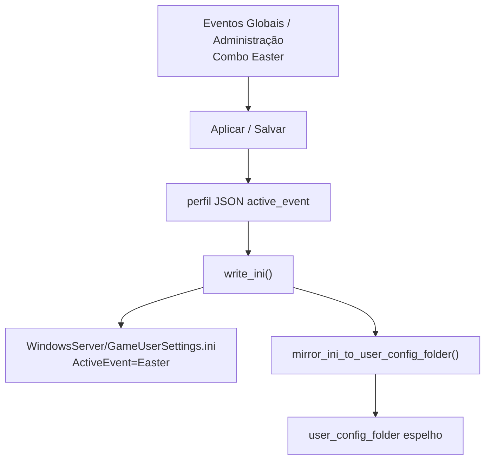
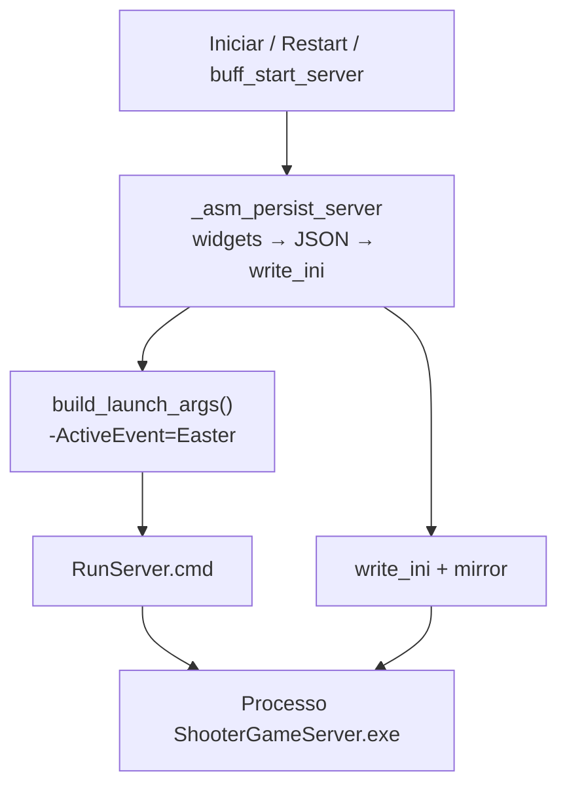

# ActiveEvent — rastreamento end-to-end (TEK / ARKLAND)

Documentação do fluxo `active_event` (Evento sazonal ARK) desde a UI até dinos coloridos no servidor.

> **Dois sistemas distintos:**  
> - **Evento sazonal ARK** (`active_event`) → `ActiveEvent=Easter` no INI + **`-ActiveEvent=Easter`** na CLI → dinos/itens de evento oficial.  
> - **Eventos Globais / rates (buff)** → só altera rates no INI; **não** ativa Páscoa/Halloween.

---

## Onde o ActiveEvent pode existir

| Local | Caminho / campo | Notas |
|-------|-----------------|-------|
| Perfil TEK JSON | `%APPDATA%\ARKLAND-ServerManager\asm_servers.json` → `"active_event": "Easter"` | Fonte de verdade na UI |
| Perfil legado | `%APPDATA%\ARKLAND-ServerManager\servers.json` → `active_event` | Modo primitivo |
| GUS (runtime) | `{install_dir}\ShooterGame\Saved\Config\WindowsServer\GameUserSettings.ini` | Seção `[ServerSettings]`, chave `ActiveEvent=Easter` (espelho / admin) |
| Pasta custom INI | `user_config_folder\GameUserSettings.ini` | **Espelho** — ARK não lê diretamente |
| CLI / RunServer.cmd | `… -ActiveEvent=Easter` | **Flag ASE oficial** (wiki). Gerado em `build_launch_args()` |
| Backup buff | `ARKLAND SERVER\BACKUP\.ini\{pasta_servidor}\*.zip` | Zip de GUS+Game.ini antes de buff de rates |
| Web Store | `seasonal_event_active` | Reflete **BuffManager**, não `active_event` |

**Exemplo Brighamia:** `install_dir` = `C:\ARKLAND SERVER\MAPAS\BR`, mapa CLI = `funny_map` (vanilla path ou 4º segmento de `/Game/Mods/{id}/funny_map`).

---

## Causa raiz (v1.10.24+)

A wiki ASE documenta **`-ActiveEvent=`** (flag com hífen). O TEK emitia **`?ActiveEvent=`** dentro da travel URL do mapa. O processo podia mostrar `ActiveEvent=vday` no cmdline (como query), mas o motor de eventos oficiais **não** tratava isso como a flag — daí Páscoa/Namorados “marcados” na UI sem dinos coloridos.

Correção: emitir **`-ActiveEvent=<id>`** em `_launch_dash_flags` / `ServerConfig.build_launch_args`; manter `ActiveEvent=` no GUS; sincronizar o combo do painel aberto ao aplicar Eventos Globais (evita wipe no restart).

---

## Fluxo ao salvar (servidor parado)



**Arquivos:** `global_active_event.apply_active_event_to_server` / `asm_server_panel._save` → `asm_config_manager.update_server` → `asm_ini_manager.write_ini`.

---

## Fluxo ao iniciar / reiniciar



O ARK aplica `ActiveEvent` **somente no startup**. Dinosaurs já spawnados precisam de `DestroyWildDinos` (RCON) ou `-ForceRespawnDinos` na CLI.

**Reconexão sem restart:** se `try_reconnect_server` anexa a processo já rodando, a nova config **não** entra em vigor até reinício completo.

---

## IDs oficiais (UI → CLI)

| ID (`-ActiveEvent=`) | Rótulo UI |
|----------------------|-----------|
| `Easter` | Páscoa |
| `vday` | Dia dos Namorados |
| `FearEvolved` | Halloween |
| `WinterWonderland` | Natal |
| `TurkeyTrial` | Ação de Graças |
| `Summer` | Verão |
| `birthday` | Aniversário ARK |
| `Arkaeology` | Arkaeology |
| `ExtinctionChronicles` | Extinction Chronicles |

Aliases legados → canônicos: `ARKEaster`→`Easter`, `LoveEvolved`→`vday`, `Anniversary`→`birthday`, `SummerBash`→`Summer`.

---

## Como o admin aplica e verifica

1. **Eventos Globais** → escolher evento (ex. Easter) → marcar mapas → **Aplicar e reiniciar**.
2. No log do start: `ActiveEvent CLI: -ActiveEvent=Easter`.
3. Confirmar perfil:
   ```powershell
   Select-String -Path "$env:APPDATA\ARKLAND-ServerManager\asm_servers.json" -Pattern "active_event"
   ```
4. Confirmar GUS:
   ```powershell
   Select-String -Path "C:\ARKLAND SERVER\MAPAS\CRYSTAL\ShooterGame\Saved\Config\WindowsServer\GameUserSettings.ini" -Pattern "ActiveEvent"
   ```
5. Confirmar CLI (tem de ser **hífen**, não `?`):
   ```powershell
   Select-String -Path "C:\ARKLAND SERVER\MAPAS\CRYSTAL\ShooterGame\Saved\Config\WindowsServer\RunServer.cmd" -Pattern "ActiveEvent"
   ```
   Esperado: `-ActiveEvent=Easter` (ou `vday`, etc.).
6. No jogo (RCON): `DestroyWildDinos` — respawn aplica skins de evento.

---

## Referências de código

| Etapa | Arquivo |
|-------|---------|
| IDs + `-ActiveEvent=` helper | `src/ui_constants.py` |
| Campo UI servidor | `src/asm_ui/asm_server_panel.py` |
| Eventos Globais | `src/pages/global_active_event.py` |
| INI + CLI TEK | `src/asm_engine/asm_ini_manager.py` |
| CLI legado | `src/server_config.py` |
| Start TEK | `src/asm_engine/asm_server_manager.py` |
| Persist start | `src/app_tek.py` (`_asm_persist_server`) |
| Buff restore | `src/buff_ini_backups.py` |
