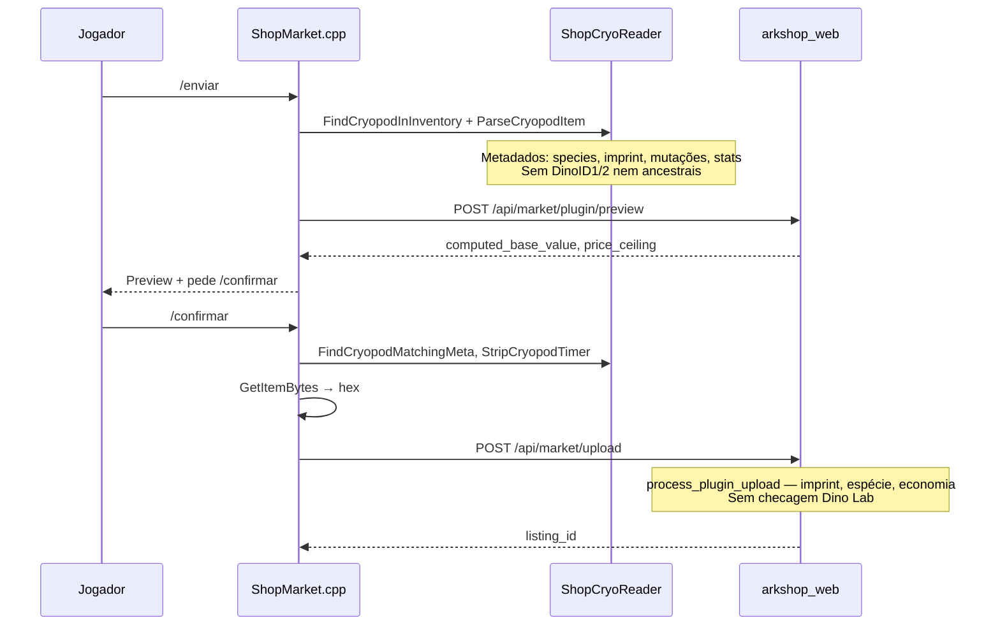
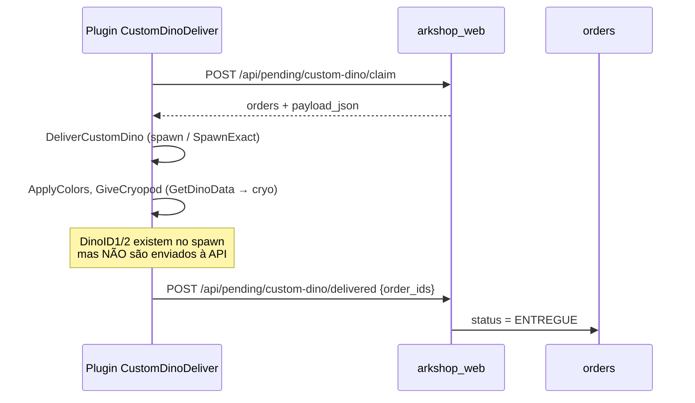
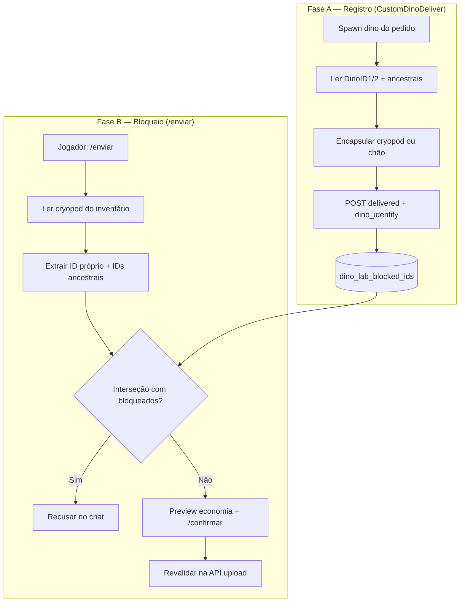

# Bloqueio de venda no mercado — criaturas do Dino Lab

| Campo | Valor |
|-------|-------|
| **Status** | 📋 Análise de viabilidade — sem implementação |
| **Versão** | 1.0 |
| **Data** | 2026-07-07 |
| **Escopo** | Impedir `/enviar` de dinos originados no Dino Lab (criatura + linhagem) |
| **Fora de escopo** | Implementação completa, migrações em produção, deploy |
| **Dependências** | [`DINO_LAB_SPEC.md`](DINO_LAB_SPEC.md), [`DINO_LAB_GUIA.md`](DINO_LAB_GUIA.md), [`PROJETO_MERCADO_CRYOPOD.md`](PROJETO_MERCADO_CRYOPOD.md), [`ENCOMENDA_DINO_SPEC.md`](ENCOMENDA_DINO_SPEC.md) |

---

## Resposta direta

| Pergunta | Veredito |
|----------|----------|
| **É viável bloquear Dino Lab no mercado?** | **Parcialmente viável** — tecnicamente realizável com extensões moderadas em C++ (CustomDinoDeliver + CustomShop) e Python (arkshop_web), mas **não** com o código atual |
| **Capturar ID na entrega Dino Lab (sem jogador)?** | **Viável** — após spawn, `APrimalDinoCharacter` expõe `DinoID1`/`DinoID2` e ancestrais no mesmo tick; **não implementado** hoje (prova indireta: `GetDinoData` no mesmo actor em `BuildCryoCustomData`) |
| **Ler linhagem na cryopod em `/enviar`?** | **Sim, com ressalvas** — hoje `ShopCryoReader` **não** extrai IDs; é necessário novo código (spawn probe off-map ou parse do blob `DinoData`) |
| **Performance de checagem no DB** | **Trivial** — lookup indexado em tabela pequena/média; opcional cache no plugin |
| **Descendentes de dino do Lab?** | **Sim** — ARK propaga `FDinoAncestorsEntry` na criação; IDs dos pais entram na cadeia visível in-game e na cryopod do filho |

**Síntese:** implementação **recomendada**. O bloqueio **completo** (criatura + linhagem + descendentes) exige duas peças novas: (1) registro de IDs na entrega e (2) extração de IDs + ancestrais na leitura da cryopod no `/enviar`. Sem isso, o requisito **não** é atendido.

---

## 1. Contexto e requisito

### 1.1 Regra de negócio

- Criaturas entregues pelo **Dino Lab** (`item_type=custom_dino`, plugin `CustomDinoDeliver`) **não** podem ser vendidas no mercado P2P via `/enviar` → `/confirmar`.
- O bloqueio cobre:
  1. A **própria criatura** (par `DinoID1` + `DinoID2` únicos no servidor).
  2. Qualquer criatura cuja **linhagem** (ancestrais exibidos in-game) inclua um ID bloqueado.
- Todos os IDs únicos relevantes devem ser **persistidos no banco**.
- A verificação ocorre em **cada** tentativa de `/enviar` (e, por defesa em profundidade, em `/confirmar` e na API de upload).

### 1.2 Motivação

O Dino Lab é canal **admin gratuito** (compensação, evento, suporte). Permitir revenda no mercado P2P cria bypass econômico frente a breeding legítimo e à futura **Encomenda de Dino** paga ([`ENCOMENDA_DINO_SPEC.md`](ENCOMENDA_DINO_SPEC.md)).

### 1.3 Por que o gate do mercado é `/enviar` → `/confirmar` (MVP)

O mercado P2P segue um **pipeline fechado** em três etapas:

| Etapa | Comando / endpoint | Papel |
|-------|-------------------|-------|
| Preview | `/enviar` | Lê a cryopod, calcula economia, mostra preço ao jogador — **sem** remover item nem gravar listing |
| Upload | `/confirmar` | Único momento em que a cryopod sai do inventário e o vault + listing são criados (`POST /api/market/upload`) |
| Resgate | `/mercado` | Comprador retira o dino do vault — fora do fluxo de venda |

Bloquear **somente** em `/enviar` cobre o jogador honesto que não troca a cryopod entre preview e confirmação, mas **não basta sozinho**:

- Entre `/enviar` e `/confirmar` o jogador pode **substituir** a cryopod no inventário. O `/confirmar` revalida via `FindCryopodMatchingMeta` / `CryoMetadataMatches` — que compara espécie, imprint, stats e mutações, **sem** `DinoID1`/`DinoID2`. Um dino bloqueado do Lab pode ser trocado por outro cryopod “equivalente” nos metadados visíveis e passar no confirm.
- Qualquer cliente que fale direto com a API (`POST /api/market/upload`) **ignora** os gates do plugin. A autoridade final deve estar em `process_plugin_upload` (Python), que recebe o blob hex e pode extrair/validar identidade server-side — **anti-bypass** independente do C++.

**MVP mínimo seguro:** checagem de bloqueio em **três pontos** — `/enviar` (feedback imediato), `/confirmar` (fecha a brecha de troca) e `process_plugin_upload` (garantia server-side). Os três são complementares; omitir qualquer um deixa uma brecha distinta.

### 1.4 Viabilidade da captura automatizada (sem jogador)

| Critério | Veredito |
|----------|----------|
| Captura 100% server-side na entrega | **VIÁVEL** — `DeliverCustomDino` roda na game thread; jogador não precisa cryopodar manualmente |
| Momento exato | **`DeliverCustomDino` ~L478** (`DinoDeliver.cpp`) — após `ApplyGender`/`ApplyColors`/`custom_name`, **antes** de `GiveCryopod` ou `return` ground |
| Sem interação do jogador | **Sim** — o plugin já chama `GetDinoData` no dino vivo; basta acrescentar `GetDinoIDs` + `DinoAncestors*` no mesmo ponto |
| Cobre todos os modos | **cryopod**, **`deliver_as=ground`** explícito e **fallback ground** (inventário cheio) — actor vivo em todos até `Destroy` |

**Limitação:** `DeliverCustomDino` retorna só `bool` hoje; `DinoHttpClient::PostDeliveredCallback` envia só `order_ids`. É necessário estender o retorno para `dino_records` chegar à API antes de marcar `ENTREGUE`.

**Risco SpawnExact:** ponteiro obtido via `FindNearestTamedDino` (raio 600 u) após `SpawnExactDino` — se outro dino tameado do jogador estiver perto, a identidade capturada pode ser a **errada** (bug pré-existente no deliver, não na leitura de ID).

---

## 2. Estado atual do código (investigação)

### 2.1 Fluxo `/enviar` e `/confirmar` (CustomShop)



**Arquivos principais:**

| Componente | Caminho | Papel |
|------------|---------|-------|
| Comandos mercado | `plugin/CustomShop/src/ShopMarket.cpp` | `/enviar`, `/confirmar`, upload HTTP |
| Leitor cryopod | `plugin/CustomShop/src/ShopCryoReader.{h,cpp}` | `ParseCryopodItem`, `CryoParsedMetadata` |
| Validação upload | `plugin/arkshop_web/market_listings.py` | `process_plugin_upload`, `preview_plugin_economy` |
| Rotas plugin | `plugin/arkshop_web/market_routes.py` | `/api/market/plugin/preview`, `/api/market/upload` |

**`CryoParsedMetadata` hoje inclui:** espécie, nomes, sexo, imprint, mutações, stats, timer — **não** inclui `dino_id1`, `dino_id2` nem ancestrais.

### 2.2 O que a cryopod contém (ARK / ArkApi)

**Nota:** os headers ArkServerAPI (`API/ARK/Actor.h`, `Other.h`, etc.) são **dependência de build** em `plugin/CustomShop/ArkServerAPI/` — **não estão commitados** neste repositório. A tabela abaixo reflete a API ASE documentada e usada pelos plugins na compilação.

A API ARK expõe:

| Campo / tipo | Onde | Uso |
|--------------|------|-----|
| `DinoID1`, `DinoID2` | `APrimalDinoCharacter` | Par único da criatura (uint32 cada) |
| `GetDinoIDs(int* OutDinoID1, int* OutDinoID2)` | `APrimalDinoCharacter` | Leitura conveniente (ASE); serializar como `uint32_t` |
| `GetDinoIDsAsStrings()` | `APrimalDinoCharacter` | Alternativa string hex |
| `DinoAncestors`, `DinoAncestorsMale` | `APrimalDinoCharacter` | `TArray<FDinoAncestorsEntry>` |
| `FDinoAncestorsEntry` | `API/ARK/Other.h` | ASE: membros `MaleDinoID1/2`, `FemaleDinoID1/2` + nomes; ASA usa `*Field()` |
| `FARKDinoData.DinoData` | Blob binário na cryopod | Serialização completa do dino (inclui IDs e linhagem) |

`ShopCryoReader` lê o blob via `CustomDataBytes` e, quando necessário, usa **spawn probe** off-map (`TryParseViaSpawnProbe`) com `bGenerateNewDinoID=true` para stats — mas **descarta** o dino sem extrair IDs. Para bloqueio no mercado, o probe de identidade deve usar `bGenerateNewDinoID=false` (preservar IDs do blob).

### 2.3 Entrega Dino Lab (CustomDinoDeliver)



**Arquivos:** `plugin/CustomDinoDeliver/src/DinoDeliver.cpp`, `DinoHttpClient.cpp`, `plugin/arkshop_web/custom_dino_service.py`.

O callback `delivered` recebe apenas `steam_id` + `order_ids`. **Nenhum ID de dino** é persistido hoje.

**Modos de entrega** (dois eixos independentes: `spawn_exact` controla *como* nasce; `deliver_as` controla *como* entrega):

| Modo | Comportamento | ID capturável (automático)? |
|------|---------------|----------------------------|
| `deliver_as=cryopod` (padrão) | Spawn → `GiveCryopod` → `dino->Destroy` | **Sim** — hook ~L478, antes de `GiveCryopod` |
| `deliver_as=ground` (explícito no payload) | Spawn → dino permanece no mapa (`DinoDeliver.cpp` ~L503–505) | **Sim** — hook ~L478; **não** passa por `GiveCryopod` |
| Fallback ground (`GroundFallbackOnFullInventory`) | `cryopod` falha (inventário cheio) → dino vivo no mapa (~L489–494) | **Sim** — `BuildCryoCustomData` já rodou (`GetDinoData` OK); ID legível no actor |

Nenhum dos modos exige que o **jogador** cryopode manualmente para registrar o ID — a captura é responsabilidade do plugin no spawn.

---

## 3. Fluxo proposto

### 3.1 Diagrama geral



### 3.2 Formato canônico de ID

ARK usa par `(DinoID1, DinoID2)` como `unsigned int`. Para armazenamento e comparação:

```
canonical_id = f"{dino_id1:08X}-{dino_id2:08X}"
```

Exemplo in-game: IDs exibidos como string hex concatenada — normalizar sempre para o par de colunas ou string canônica acima.

**Cada ancestral** em `FDinoAncestorsEntry` contribui até **quatro** pares (pai macho + mãe fêmea, cada um com ID1/ID2). Todos devem entrar na tabela de bloqueio quando registrados na entrega do Lab.

### 3.3 Pontos de hook

| Hook | Momento | Ação |
|------|---------|------|
| **Deliver** | `DeliverCustomDino` ~L478: após spawn/cores/nome, **antes** de `GiveCryopod` **ou** `return` ground | `GetDinoIDs(int*,int*)` + copiar `DinoAncestors*` → `dino_records` no callback; estender retorno `bool` → struct com identidade |
| **Market `/enviar`** | Após `ParseCryopodItem`, antes de preview HTTP | Nova função `ExtractDinoIdentityFromCryopod` → checagem local ou API |
| **Market `/confirmar`** | Antes de remover cryopod / upload | Revalidar (cryopod pode ter trocado entre preview e confirmar) |
| **API preview** | `preview_plugin_economy` | Se metadata incluir `dino_identity`, recusar com mensagem clara |
| **API upload** | `process_plugin_upload` | Checagem obrigatória server-side (cliente/plugin pode ser bypassado) |
| **`/rastrear`** | Cryopod equipada ou primeira parseável (mesma lógica de `/enviar`) | Checagem **somente** — sem preview, sem upload, sem remover item |

### 3.4 Comando `/rastrear` (checagem opcional, sem nuvem)

Comando in-game de **consulta** — não envia cryopod, blob hex nem listing para a nuvem.

| Aspecto | Detalhe |
|---------|---------|
| **Entrada** | Jogador com cryopod equipada (slot arma) ou primeira parseável no inventário — mesma prioridade de `FindCryopodInInventory` |
| **Leitura** | `ExtractDinoIdentityFromCryopod` (spawn probe local, `bGenerateNewDinoID=false`) → par próprio + ancestrais |
| **Checagem** | Cache local de IDs bloqueados **ou** `POST /api/market/plugin/check-dino-blocked` enviando **apenas** `dino_id_pairs` (~KB, sem blob) |
| **Saída** | Mensagem no chat: permitido / bloqueado (Dino Lab ou linhagem) |
| **Diferença de `/enviar`** | Sem `PendingUpload`, sem economia, sem HTTP de preview/upload |
| **Diferença de `/enviardebug`** | Foco em regra de negócio (bloqueio), não diagnóstico técnico de metadados |

**Quem usa:**

| Ator | Momento | Valor |
|------|---------|-------|
| **Vendedor** | Antes de `/enviar` / `/confirmar` | Alto — evita preview/upload rejeitado |
| **Comprador pós-resgate** | Cryopod no inventário após `/mercado` | Médio — saber se pode revender ou se tem linhagem Lab |
| **Comprador pré-compra (web)** | Sem cryopod | **Fora de escopo** — listing público não expõe `DinoID`; sinal na vitrine exigiria flag no upload, não `/rastrear` |

**Nota:** após resgate com `MarketAssignNewDinoId` (padrão), o comprador recebe ID novo — bloqueio detectado via **linhagem no blob da cryopod**, não via listing do vault.

`/rastrear` **não substitui** checagem obrigatória em `/confirmar` e `process_plugin_upload` — é UX complementar.

---

## 4. Schema de banco de dados

### 4.1 Tabela principal: `dino_lab_blocked_ids`

```sql
-- SQLite / MySQL (adaptar tipos)
CREATE TABLE dino_lab_blocked_ids (
    id              INTEGER PRIMARY KEY AUTO_INCREMENT,
    dino_id1        INTEGER UNSIGNED NOT NULL,
    dino_id2        INTEGER UNSIGNED NOT NULL,
    canonical_id    VARCHAR(24) NOT NULL,   -- "XXXXXXXX-XXXXXXXX"
    order_id        VARCHAR(64) NOT NULL,   -- FK lógica → orders.order_id
    steam_id        VARCHAR(32) NOT NULL,   -- destinatário da entrega
    source          VARCHAR(32) NOT NULL DEFAULT 'dino_lab',
    -- 'self' = ID da criatura entregue; 'ancestor' = ID na cadeia de linhagem
    role            VARCHAR(16) NOT NULL DEFAULT 'self',
    generation      SMALLINT NULL,          -- 0=self, 1=pais, 2=avós, ...
    delivered_at    DATETIME NOT NULL,
    created_at      DATETIME NOT NULL,
    UNIQUE KEY uq_dino_pair (dino_id1, dino_id2),
    INDEX idx_canonical (canonical_id),
    INDEX idx_order (order_id),
    INDEX idx_steam (steam_id)
);
```

**Notas:**

- `UNIQUE (dino_id1, dino_id2)` evita duplicatas se o mesmo ID aparecer em múltiplos pedidos (improvável, mas seguro).
- Na entrega, inserir **1 linha `role=self`** + **N linhas `role=ancestor`** para todos os pares encontrados em `DinoAncestors` / `DinoAncestorsMale`.
- Pedidos futuros de **Encomenda de Dino** (`order_source=dino_encomenda`) devem usar o mesmo mecanismo com `source='dino_encomenda'` se a política for idêntica.

### 4.2 Extensão opcional em `orders`

Não obrigatório no MVP; útil para auditoria:

```sql
ALTER TABLE orders ADD COLUMN delivered_dino_id1 INTEGER UNSIGNED NULL;
ALTER TABLE orders ADD COLUMN delivered_dino_id2 INTEGER UNSIGNED NULL;
```

### 4.3 Serviço Python (proposta)

Novo módulo `dino_lab_block_service.py`:

| Função | Descrição |
|--------|-----------|
| `ensure_dino_lab_block_schema(engine)` | Cria tabela idempotente (padrão `market_migrate` / `custom_dino_service`) |
| `register_blocked_dino_ids(db, order_id, steam_id, identities)` | Upsert após entrega |
| `is_any_id_blocked(db, id_pairs: list[tuple[int,int]]) -> bool` | Usado em preview/upload |
| `check_blocked_from_metadata(db, metadata) -> str \| None` | Mensagem de erro ou None |

### 4.4 API estendida

**Estender** `POST /api/pending/custom-dino/delivered`:

```json
{
  "steam_id": "76561198…",
  "order_ids": ["cd-abc123"],
  "dino_records": [
    {
      "order_id": "cd-abc123",
      "dino_id1": 1234567890,
      "dino_id2": 987654321,
      "ancestors": [
        {"dino_id1": 1, "dino_id2": 2, "side": "male", "generation": 1}
      ]
    }
  ]
}
```

**Novo** `POST /api/market/plugin/check-dino-blocked` (opcional — para plugin sem cache):

```json
{ "dino_id_pairs": [[123, 456], [1, 2]] }
→ { "ok": true, "blocked": true, "reason": "dino_lab", "order_id": "cd-abc123" }
```

---

## 5. Extração de IDs na cryopod (`/enviar`)

### 5.1 Opções avaliadas

| Abordagem | Prós | Contras | Recomendação |
|-----------|------|---------|--------------|
| **A. Spawn probe off-map** (padrão existente) | Já usado em `ShopCryoReader`; acesso direto a `DinoAncestors*` | Custo CPU; risco `duped=true` se mesmo ID no mapa (metadados ainda legíveis) | **MVP** |
| **B. Parse binário `DinoData`** | Sem spawn; mais rápido | Formato interno não documentado no repo; fragilidade entre patches/mods | Spike futuro |
| **C. Só metadados CustomData** | Leve | IDs **não** estão nos floats/strings atuais | Insuficiente |

### 5.2 Proposta MVP (spawn probe dedicado)

Nova função em `ShopCryoReader`:

```cpp
struct DinoIdentity {
    uint32_t dino_id1 = 0;
    uint32_t dino_id2 = 0;
    std::vector<std::pair<uint32_t,uint32_t>> ancestor_pairs;
};

bool ExtractDinoIdentityFromCryopod(UPrimalItem* item,
    AShooterPlayerController* player, DinoIdentity& out);
```

Implementação sugerida:

1. `CollectCryoCustomDataBlob` → `BuildDinoDataFromCustomData`
2. `SpawnFromDinoDataEx` em `(0,0,-50000)` com `bGenerateNewDinoID=false`
3. Se `duped` ou spawn OK: ler `GetDinoIDs` + iterar `DinoAncestors` / `DinoAncestorsMale`
4. `SafeDestroyProbeDino` (nunca destroy se `duped=true` — já documentado no código)
5. Retornar pares para checagem

**Importante:** não reutilizar o probe de stats do `/mercado` no mesmo fluxo de entrega — o código já evita probe antes de `SpawnMarketDinoFromCryopod` para não duplicar estado.

### 5.3 Checagem

```text
blocked = ∃ (id1,id2) ∈ {self} ∪ ancestors(cryo) : (id1,id2) ∈ dino_lab_blocked_ids
```

Mensagem sugerida no chat (ASCII):

`Comercio: este dino ou sua linhagem pertence ao Dino Lab e nao pode ser vendido.`

---

## 6. Performance

| Cenário | Impacto estimado |
|---------|------------------|
| Tabela com 10k–100k IDs bloqueados | `SELECT 1 ... WHERE (dino_id1,dino_id2) IN (...)` com ≤ ~20 pares por cryopod — **< 5 ms** com índice |
| Spawn probe por `/enviar` | **~50–200 ms** CPU no game thread — aceitável para comando manual; monitorar se abusado |
| Cache no plugin | Lista de `canonical_id` em memória, refresh a cada N min via `GET /api/market/plugin/blocked-ids?since=` | Reduz latência; **API upload continua autoritativa** |

---

## 7. Casos de borda e limitações

| Caso | Comportamento esperado | Gap atual |
|------|------------------------|-----------|
| **Filho de dino Lab** (breeding) | Ancestrais incluem pais → **bloqueado** | Requer extração de ancestrais na cryopod ✅ |
| **Dino Lab entregue em cryopod** | ID registrado na entrega (~L478) | Hook antes de `GiveCryopod` ✅ |
| **`deliver_as=ground` explícito** | ID capturado no spawn (~L478) | **Viável** — sem cryopod |
| **Fallback ground** (inventário cheio) | ID capturado no spawn (actor vivo após cryo falhar) | **Viável** — registro na entrega; `/enviar` futuro depende da fase B |
| **Filho breedado depois** | Ancestrais na cryopod do filho | Bloqueio via fase B (extração na cryopod), não na entrega |
| **Soul Trap / DinoStorage2** | Fora de escopo mercado (só cryopod vanilla) | Já alinhado com [`DINO_LAB_SPEC.md`](DINO_LAB_SPEC.md) N4 |
| **Mods de cryopod** | `/enviar` já rejeita não-oficial | OK |
| **Transferência cluster** | IDs são por save/servidor ASE — bloqueio no mesmo cluster | OK para ARKLAND |
| **Admin re-entrega mesmo pedido** | `UNIQUE (dino_id1,dino_id2)` — segundo spawn gera **novos** IDs | Cada entrega nova = novos bloqueios (correto) |
| **MarketAssignNewDinoId na compra** | Comprador recebe **novo** ID ao resgatar — não herda bloqueio do vault | Correto; bloqueio é na **origem do upload**, não no vault |
| **Bypass API** | Upload direto sem checagem | **Deve** validar em `process_plugin_upload` |
| **Pedido Encomenda paga** | Mesmo plugin de entrega | Reusar tabela com `source` distinto se política igual |

### 7.1 Linhagem em spawns SpawnExact do Lab

**Risco de identidade errada:** `SpawnExactFromPayload` chama `SpawnExactDino` e depois `FindNearestTamedDino(controller, 600.f)`. Se outro dino tameado do mesmo jogador estiver a ≤600 u, o ponteiro retornado pode **não** ser o recém-spawnado — IDs capturados seriam de outra criatura. Mitigação futura: handle direto do spawn ou filtro por timestamp/proximidade imediata.

Dinos admin SpawnExact **geralmente** nascem **sem** ancestrais (linhagem vazia). O bloqueio por linhagem importa sobretudo para:

- Crias obtidas por breeding a partir do dino entregue;
- Futuras entregas que simulem pedigree.

O ID `self` do dino entregue **sempre** deve ser registrado.

---

## 8. MVP vs implementação completa

### 8.1 MVP (recomendado para primeira release)

| Item | Incluído |
|------|----------|
| Tabela `dino_lab_blocked_ids` | ✅ |
| Registro na entrega cryopod (`role=self` + ancestrais presentes) | ✅ |
| `ExtractDinoIdentityFromCryopod` via spawn probe | ✅ |
| Bloqueio em `/enviar` + `process_plugin_upload` | ✅ |
| Comando `/rastrear` (consulta sem nuvem) | ✅ (opcional UX; reutiliza `ExtractDinoIdentityFromCryopod`) |
| Mensagem clara ao jogador | ✅ |
| Auditoria `MARKET_UPLOAD_REJECTED` com `reason=dino_lab_blocked` | ✅ |

**Fora do MVP:**

- Parse binário sem spawn;
- Cache distribuído no plugin;
- Bloqueio em `/confirmar` apenas se `/enviar` já checar (recomendado incluir confirmar no MVP mínimo — baixo custo);
- UI admin para listar/remover IDs bloqueados;
- Obrigar cryopod no ground fallback.

### 8.2 Completo

| Item | Descrição |
|------|-----------|
| Cobertura Encomenda de Dino | Mesmo pipeline quando `order_source=dino_encomenda` |
| Painel admin | Listar IDs, pedido origem, steam_id, export CSV |
| Cache plugin + ETag | Reduzir chamadas HTTP |
| Parse `DinoData` sem spawn | Performance e evitar probe |
| Política ground | Timer: jogador deve cryopodar em X min ou kick automático de registro (complexo — evitar) |
| Sincronização cluster multi-save | Se ARKLAND unificar saves — revisar escopo |

---

## 9. Plano de spike (prova de conceito mínima)

Se quiser validar antes da implementação completa:

1. **Spike C++ (CustomDinoDeliver):** logar `DinoID1/2` após spawn de um pedido teste — ~15 linhas em `DeliverCustomDino`.
2. **Spike C++ (ShopCryoReader):** `ExtractDinoIdentityFromCryopod` + log em `/enviardebug` ou comando `/rastrear` (checagem sem `PendingUpload`).
3. **Spike Python:** script/manual insert em `dino_lab_blocked_ids` + rejeitar em `process_plugin_upload` se par presente no metadata (plugin envia IDs no metadata após spike 2).

Nenhum spike é obrigatório para aprovar o desenho — a API Ark já expõe os campos necessários.

---

## 10. Arquivos a alterar (implementação futura)

| Camada | Arquivo | Mudança |
|--------|---------|---------|
| C++ Deliver | `plugin/CustomDinoDeliver/src/DinoDeliver.cpp` | Capturar IDs + ancestrais |
| C++ Deliver | `plugin/CustomDinoDeliver/src/DinoHttpClient.cpp` | Incluir `dino_records` no POST delivered |
| C++ Market | `plugin/CustomShop/src/ShopCryoReader.{h,cpp}` | `DinoIdentity`, `ExtractDinoIdentityFromCryopod` |
| C++ Market | `plugin/CustomShop/src/ShopMarket.cpp` | Checagem em `CmdEnviar` / `CmdConfirmar`; **`CmdRastrear`** (consulta sem upload) |
| Python | `plugin/arkshop_web/dino_lab_block_service.py` | **Novo** — schema + registro + checagem |
| Python | `plugin/arkshop_web/custom_dino_routes.py` | Persistir IDs no `delivered` |
| Python | `plugin/arkshop_web/market_listings.py` | `process_plugin_upload`, `preview_plugin_economy` |
| Python | `plugin/arkshop_web/app.py` | `ensure_*_schema` no boot |
| Docs | `docs/DINO_LAB_SPEC.md` | Referência cruzada anti-revenda |
| Docs | `docs/REGULAMENTO_SERVIDOR.md` | Regra explícita (opcional) |

---

## 11. Veredito final

| Critério | Avaliação |
|----------|-----------|
| Capturar ID no spawn Dino Lab (sem jogador) | ✅ Viável — não implementado |
| Persistir no banco | ✅ Viável |
| Checar em cada `/enviar` | ✅ Viável (com novo código) |
| Bloquear linhagem / descendentes | ✅ Viável (ancestrais na cryopod + breeding ARK) |
| Sem alteração de código | ❌ Não atende o requisito |
| Cobertura 100% (ground, mods, parse sem probe) | ⚠️ Parcial |

**Classificação geral: PARCIALMENTE VIÁVEL → implementação recomendada com escopo MVP definido acima.**

O gap principal não é o motor ARK nem o banco — é a **ausência de pipeline de identidade** entre `CustomDinoDeliver` (entrega) e `ShopCryoReader` (mercado). Fechar esse gap é trabalho incremental e alinhado aos padrões já usados no projeto.

---

## 12. Perguntas abertas

| # | Pergunta | Proposta default |
|---|----------|------------------|
| Q1 | Encomenda de Dino paga também bloqueada no mercado? | **Sim** — mesma tabela, `source=dino_encomenda` |
| Q2 | Desbloqueio manual admin (exceção suporte)? | Flag `revoked_at` na linha ou delete com auditoria |
| Q3 | Bloquear só `custom_dino` ou qualquer `orders` com `payload.created_by` admin? | Só IDs registrados na entrega — não inferir por metadata |
| Q4 | Exigir cryopod no ground fallback? | MVP: capturar ID no spawn; política operacional no guia admin |

---

## 13. Debug e observabilidade (MVP)

| Camada | Mecanismo |
|--------|-----------|
| **Python** | Setting `dino_lab_block_debug` em `settings.json`; eventos `audit_events` via `audit_dino_lab_block_event` (`dino_lab_id_registered`, `dino_lab_block_hit`, `dino_lab_block_miss`, `dino_lab_identity_capture_failed`) |
| **Admin** | `GET /api/admin/dino-lab-block/debug` — últimas N linhas bloqueadas + estatísticas |
| **API plugin** | `check-dino-blocked` / preview retornam `canonical_id` e `matched_pair` quando bloqueado; com debug, incluem `trace_id` |
| **C++ CustomShop** | Logs `[DinoLabBlock]` em `/enviar`, `/confirmar`, `/rastrear`; `/rastreardebug` expõe IDs hex + resultado HTTP no chat |
| **C++ CustomDinoDeliver** | Logs `[DinoLabDeliver]`; entrega abortada se `DinoID1/2` = 0 |

---

## Referências de código

- `CryoParsedMetadata` sem IDs: `plugin/CustomShop/src/ShopCryoReader.h`
- `/enviar` → preview: `plugin/CustomShop/src/ShopMarket.cpp` (~L262–351)
- `/confirmar` → upload: `plugin/CustomShop/src/ShopMarket.cpp` (~L361–575)
- Callback entrega sem IDs: `plugin/CustomDinoDeliver/src/DinoHttpClient.cpp` (~L158–170)
- Build cryo com `GetDinoData`: `plugin/CustomDinoDeliver/src/DinoDeliver.cpp` (~L263–341)
- API ARK `FDinoAncestorsEntry`: `plugin/CustomShop/ArkServerAPI/.../API/ARK/Other.h` (dependência de build, não commitada)
- `GetDinoIDs(int*,int*)` / `GetDinoData`: `plugin/CustomShop/ArkServerAPI/.../API/ARK/Actor.h` (idem)
- Hook captura recomendado: `plugin/CustomDinoDeliver/src/DinoDeliver.cpp` (~L478)
