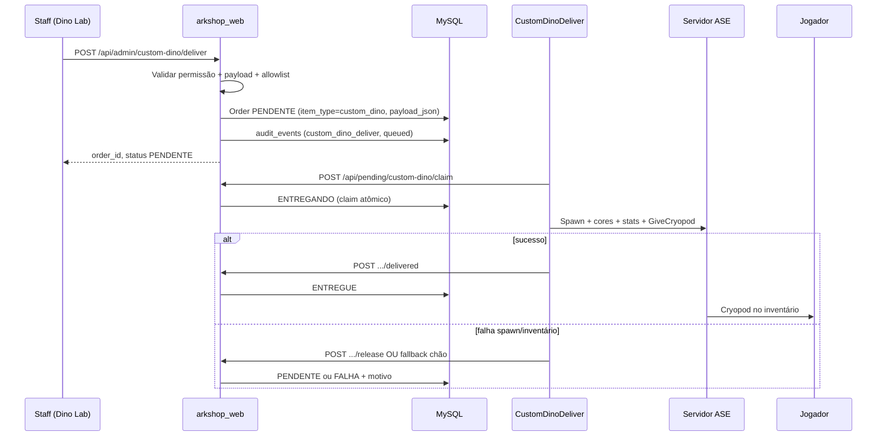

# Dino Lab — Entrega administrativa de dinos customizados (ARKLAND)

| Campo | Valor |
|-------|-------|
| **Status** | 📋 Especificação para **discussão** — sem implementação |
| **Versão do documento** | 1.0 |
| **Data** | 2026-07-05 |
| **Escopo** | Produto, arquitetura, dados, UI, segurança, fases e perguntas abertas |
| **Fora de escopo** | Código C++/Python, migrações SQL definitivas, deploy |
| **Documento anterior** | [`docs/dino_custom_colors_delivery_spec.md`](dino_custom_colors_delivery_spec.md) — **consolidado e expandido aqui** |

> **Ver também:** [`docs/PROJETO_MERCADO_CRYOPOD.md`](PROJETO_MERCADO_CRYOPOD.md) (cryopod, cores, mercado P2P), [`docs/PROJETO_SISTEMA_SUPORTE_TICKETS.md`](PROJETO_SISTEMA_SUPORTE_TICKETS.md) (compensações), [`docs/PROJETO_ARKLAND_MASTER.md`](PROJETO_ARKLAND_MASTER.md) (SpawnExact TEK), [`docs/market_admin_audit_improvements.md`](market_admin_audit_improvements.md) (padrões de auditoria).

---

## Sumário executivo

| Pergunta | Resposta |
|----------|----------|
| **O que é o Dino Lab?** | Ferramenta **admin-only** para entregar dinos com parâmetros precisos (cores, stats, imprint, etc.) a jogadores específicos — **fora** do catálogo da loja e **fora** do mercado P2P |
| **Por que existe?** | Compensações de suporte, prêmios de eventos, testes de breeding, entregas pontuais que não devem virar item de catálogo |
| **Onde vive tecnicamente?** | Plugin separado **`CustomDinoDeliver.dll`** + área admin **Dino Lab** na Web Store + fila HTTP compartilhada (`orders`) |
| **É viável hoje sem código?** | **Parcial** — workaround manual via SpawnExact no TEK ou `Commands[]` do catálogo CustomShop |
| **Decisão arquitetural (AD-001)** | **Não** estender `CustomShop.DeliverDino` nem poluir Jogadores & Entregas |

**Top finding:** a infraestrutura de cryopod **já persiste cores** (`ColorSetIndices` + blob `FARKDinoData`), mas nem `DeliverDino` nem `/api/admin/deliver` aplicam paleta customizada. Um plugin dedicado pode spawnar, colorir e entregar em cryopod **sem acoplar** loja, promoções ou mercado.

---

## 1. Visão e objetivos

### 1.1 Visão de produto

O **Dino Lab** é o “laboratório de entrega” do cluster ARKLAND: staff autorizado monta um dino com especificação completa e enfileira entrega in-game para um jogador, com **motivo auditável** e rastreio opcional a ticket de suporte.

Posicionamento explícito:

| Canal | Público | Moeda | Propósito |
|-------|---------|-------|-----------|
| **Catálogo Web / `/shop`** | Jogadores | Âmbares | Itens e kits padronizados, preço fixo |
| **Mercado P2P (Genoma)** | Jogadores | Âmbares | Comércio entre jogadores, cryopod do inventário |
| **Dino Lab** | Staff | **Gratuito** (sem débito de pontos) | Compensação, evento, suporte, QA |

### 1.2 Objetivos mensuráveis

| # | Objetivo | Indicador de sucesso |
|---|----------|----------------------|
| O1 | Entregar cores exatas em cryopod | Releitura via `ShopCryoReader` confirma 6 regiões após entrega |
| O2 | Separar domínio de loja/mercado | Zero alteração em `config.json` da loja (~11k linhas) para entregas ad-hoc |
| O3 | Auditoria clara | 100% das entregas com `event_type=custom_dino_deliver`, actor admin, motivo |
| O4 | Integração suporte | ≥80% das compensações de dino vinculadas a `ticket_id` (meta operacional) |
| O5 | Reduzir workarounds manuais | SpawnExact/RCON manual só para casos excepcionais |

### 1.3 Princípios de design

1. **Isolamento de domínio** — entrega ad-hoc ≠ item de catálogo ≠ listing P2P.
2. **Mesma experiência do jogador** — cryopod no inventário (ou nuvem, se configurado); jogador usa `/shop` ou equivalente para resgatar pedidos pendentes **somente se** unificarmos fila (ver §11).
3. **Payload rico na web, spawn no plugin** — a Web Store valida e persiste JSON; **nunca** monta blob binário de cryopod.
4. **Paridade cryo com mercado** — layout `CustomDataStrings[2]` de cores igual a `ShopCryoDino.cpp` para consistência futura com Genoma.
5. **Fail-safe** — pedido preso em `PENDENTE` gera alerta; release após falha de spawn.

### 1.4 Não-objetivos (fora de escopo do Dino Lab)

| # | Fora de escopo | Motivo |
|---|----------------|--------|
| N1 | Venda de dinos customizados a jogadores | Catálogo ou mercado P2P |
| N2 | Jogador montar próprio dino na web | Apenas staff |
| N3 | Certificado Genoma / vitrine pública | Ver [`GENOMA_ARKLAND_SPEC.md`](GENOMA_ARKLAND_SPEC.md) |
| N4 | Soul Trap / DinoStorage2 | Cryopod vanilla only (paridade mercado) |
| N5 | ASA / mapas `_WP` | Cluster ASE |
| N6 | Spawn em massa automatizado (bots) | Rate limits e permissão restrita |

---

## 2. Personas

### 2.1 Admin (dono / superuser)

- **Objetivo:** aprovar política, conceder permissão `admin.custom_dino`, revisar histórico e volume de entregas.
- **Necessidades:** dashboard de entregas por staff, export CSV, alertas de abuso.
- **Frustração atual:** SpawnExact manual + RCON + screenshot Discord para provar compensação.

### 2.2 Staff / moderador de suporte

- **Objetivo:** resolver ticket de compensação entregando dino exato prometido ao jogador.
- **Necessidades:** buscar jogador (SteamID, online/offline), espécie com swatches, vincular ticket, ver status da fila.
- **Frustração atual:** misturar entrega de item de catálogo (`/api/admin/deliver`) com pedidos customizados.

### 2.3 Jogador receptor

- **Objetivo:** receber o dino prometido sem fricção.
- **Necessidades:** notificação clara (in-game ou web), cryopod íntegra, cores corretas.
- **Expectativa:** mesma qualidade visual de um dino breedado no servidor — **não** “dino genérico da loja”.

---

## 3. Escopo: MVP vs completo vs fora

### 3.1 MVP (Fase 1–2)

| Item | Incluído |
|------|----------|
| Plugin `CustomDinoDeliver.dll` mínimo | Spawn + 6 cores + cryopod |
| Fila HTTP dedicada | `item_type=custom_dino`, `/api/pending/custom-dino/*` |
| Web admin **Dino Lab** | Formulário: jogador, espécie, nível, sexo, 6 cores, motivo |
| Histórico admin | Lista filtrada `custom_dino` |
| Auditoria | `custom_dino_deliver` em `audit_events` |
| Espécies vanilla homologadas | Allowlist web + validação plugin |

### 3.2 Escopo completo (Fase 3–4)

| Item | Incluído |
|------|----------|
| Swatches Obelisk / ASB na UI | Preview visual por região |
| SpawnExact stats | 7 wild + 7 tamed, imprint, mutações declaradas |
| Presets / templates | “Rex evento vermelho”, “Compensação padrão #3” |
| Integração tickets | `ticket_id` obrigatório ou fortemente sugerido |
| Notificação in-game | Mensagem ao receber cryopod |
| Fallback spawn no chão | Inventário cheio |
| Mods allowlist | Blueprints de mods do cluster |
| Health check | Alerta se pedido `custom_dino` pendente > N min |

### 3.3 Explicitamente fora (v1 e provavelmente sempre)

- Catálogo jogador-facing de “dinos lab”
- Cobrança em Âmbares pelo Dino Lab
- Edição de dino já entregue (reentrega = novo pedido)
- Integração direta com mercado (listar dino do Lab na vitrine)

---

## 4. Arquitetura

### 4.1 Diagrama de alto nível

```
┌──────────────────┐     ┌─────────────────────┐     ┌──────────────────────┐
│  Web Admin       │     │   arkshop_web       │     │ CustomDinoDeliver    │
│  Dino Lab UI     │────▶│  /api/admin/        │◀────│  Poll claim/delivered  │
│  #/admin/dino-lab│     │  custom-dino/*      │     │  (WinHTTP, X-API-Key)│
└──────────────────┘     └──────────┬──────────┘     └──────────┬───────────┘
                                    │                            │
                                    ▼                            ▼
                         ┌─────────────────────┐     ┌──────────────────────┐
                         │  MySQL orders       │     │  Servidor ASE          │
                         │  item_type=         │     │  SpawnDino + cores +   │
                         │  custom_dino        │     │  GiveCryopod           │
                         │  payload_json       │     └──────────────────────┘
                         │  audit_events       │
                         └─────────────────────┘

┌──────────────────┐
│  CustomShop.dll  │  ← NÃO participa do fluxo custom_dino (AD-001)
│  shop/kit poll   │
└──────────────────┘
```

### 4.2 Decisão: plugin separado vs extensão CustomShop

| Opção | Veredito |
|-------|----------|
| **`CustomDinoDeliver.dll` separado** | ✅ **Recomendado (AD-001)** |
| Estender `CustomShop.DeliverDino` | ❌ Rejeitado — risco de regressão em loja/mercado |
| Módulo estático compartilhado `ArklandPluginCommon` | ⚠️ Fase futura — duplicação controlada na v1 |

**Motivos da separação:** deploy independente, permissões distintas, auditoria isolada, `config.json` da loja estável. Ver tabela comparativa em §8.

### 4.3 Infraestrutura compartilhada

| Recurso | Compartilhado? | Namespace |
|---------|----------------|-----------|
| `arkshop_web` Flask | ✅ | Rotas `/custom-dino/*` |
| MySQL `orders` | ✅ | `item_type = 'custom_dino'` |
| `X-API-Key` plugin | ✅ | Mesma chave, User-Agent distinto |
| Poll `/api/pending/claim` | ❌ | CustomShop ignora `custom_dino` |
| Poll `/api/pending/custom-dino/claim` | ✅ | Só CustomDinoDeliver |

**Opção A (preferida):** endpoint de claim **filtrado** — zero ambiguidade, CustomShop sem alteração no loop.

### 4.4 Referência de código existente

| Arquivo | Uso no Dino Lab |
|---------|-----------------|
| `plugin/CustomShop/src/ShopCryoDino.cpp` | **Referência** para `BuildCryoCustomData`, cores, cryopod — **não estender** |
| `plugin/CustomShop/src/HttpClient.cpp` | Padrão WinHTTP a replicar |
| `plugin/CustomShop/src/ShopCryoReader.cpp` | Validação pós-entrega (QA) |
| `src/spawn_exact.py` | Formato SpawnExact / 6 cores (TEK) |
| `plugin/arkshop_web/app.py` | Modelo `Order`, fila pending |

### 4.5 Estrutura proposta do plugin

```
plugin/CustomDinoDeliver/
├── CMakeLists.txt / CustomDinoDeliver.vcxproj
├── configs/
│   ├── PluginInfo.json
│   └── config.json              # URL web, API key, defaults cryo, allowlist espécies
├── src/
│   ├── Main.cpp                 # Load/UnLoad Ark API
│   ├── DinoConfig.cpp/h
│   ├── DinoDeliver.cpp/h        # Spawn, ApplyColors, SpawnExact stats, GiveCryopod
│   ├── DinoHttpClient.cpp/h     # Poll claim/delivered/release
│   ├── DinoCommands.cpp/h       # Opcional: /dinodeliver status, reload
│   └── pch.h
└── ArkServerAPI/                # Mesma versão mínima que CustomShop
```

---

## 5. Fluxos operacionais

### 5.1 Fluxo principal — criar pedido → fila → entrega → auditoria



### 5.2 Fluxo — compensação via ticket

```
1. Jogador abre ticket categoria "compensação" / "dino"
2. Staff analisa → decisão: entregar dino X com specs Y
3. Staff abre Dino Lab → preenche formulário → ticket_id = #4521
4. Sistema grava original_order_id = "ticket:#4521" (opcional)
5. Entrega concluída → staff fecha ticket com link order_id
6. Auditoria correlaciona ticket ↔ order ↔ admin actor
```

### 5.3 Fluxo — evento / prêmio

```
1. Admin prepara preset "Rex Evento Julho" (fase 3)
2. Durante evento: staff seleciona preset + jogador vencedor
3. Motivo: "Evento PvP #3 — 2026-07-04"
4. Sem ticket_id (opcional) — auditoria basta
```

### 5.4 Fluxo — jogador offline

| Estado | Comportamento |
|--------|---------------|
| Jogador offline | Pedido permanece `PENDENTE` até claim bem-sucedido quando online |
| Mapa sem plugin | Pedido não claimado — alerta health check |
| Inventário cheio | Config: fallback spawn no chão **ou** release + retry |

### 5.5 Comparativo: shop vs Dino Lab

| Aspecto | `POST /api/admin/deliver` | `POST /api/admin/custom-dino/deliver` |
|---------|---------------------------|---------------------------------------|
| Origem | Jogadores & Entregas | Dino Lab |
| `item_id` | ID do catálogo | UUID / slug custom |
| Payload | Tipo + quantidade | JSON completo do dino |
| Plugin | CustomShop | CustomDinoDeliver |
| Cores | ❌ | ✅ |
| Cobrança jogador | N/A (admin) | N/A (admin) |

---

## 6. Modelo de dados

### 6.1 Abordagem recomendada: `orders` + `payload_json`

Reutilizar tabela `orders` existente:

| Campo | Valor para Dino Lab |
|-------|---------------------|
| `item_type` | `custom_dino` |
| `item_id` | `cd_<uuid_curto>` ou `__custom_dino__` |
| `amount` | `1` |
| `points_spent` | `0` |
| `payload_json` | **TEXT/JSON** — spec completa (§6.3) |
| `original_order_id` | Opcional: `ticket:#4521` |
| `status` | `PENDENTE` → `ENTREGANDO` → `ENTREGUE` / `FALHA` |

**Migration v1:** adicionar coluna `payload_json` se ausente.

### 6.2 Alternativa: tabela `custom_dino_orders`

| Prós | Contras |
|------|---------|
| Schema limpo | Duplicar lógica claim/status |
| Relatórios isolados | Jogador veria dois lugares de pedidos |

**Decisão proposta:** `orders` na v1; tabela dedicada só se volume > ~500/mês ou relatórios exigirem.

### 6.3 Schema `payload_json` (v1 mínimo → completo)

```json
{
  "schema_version": 1,
  "species_blueprint": "Blueprint'/Game/PrimalEarth/Dinos/Rex/Rex_Character_BP.Rex_Character_BP'",
  "species_key": "rex",
  "level": 150,
  "gender": "female",
  "neutered": false,
  "colors": [14, 14, 14, 0, 0, 0],
  "deliver_as": "cryopod",
  "note": "Compensação suporte ticket #4521",
  "ticket_id": "4521",
  "preset_id": null,
  "spawn_exact": {
    "enabled": false,
    "wild_stats": [0, 0, 0, 0, 0, 0, 0],
    "tamed_stats": [0, 0, 0, 0, 0, 0, 0],
    "imprint_pct": 1.0,
    "imprinter_name": "",
    "imprinter_id_hex": ""
  },
  "saddle_blueprint": null,
  "force_tame": true,
  "custom_name": null
}
```

### 6.4 Tabela opcional `custom_dino_presets` (fase 3)

| Coluna | Tipo | Descrição |
|--------|------|-----------|
| `id` | PK | Auto |
| `slug` | string unique | `rex-evento-vermelho` |
| `label` | string | Nome exibido na UI |
| `payload_template` | JSON | Template sem steam_id |
| `created_by` | steam_id | Admin |
| `created_at` | datetime | Auditoria |

### 6.5 Metadados de paleta (cache Web)

```json
{
  "species_key": "rex",
  "blueprint": "Blueprint'/Game/.../Rex_Character_BP.Rex_Character_BP'",
  "color_regions": [
    { "index": 0, "label": "Body", "max_index": 40, "prevent_colorization": false,
      "swatches": [{ "id": 14, "name": "Red", "hex": "#8B0000" }] }
  ]
}
```

Fonte: cache Obelisk ASB (mesmo padrão TEK `obelisk_client.py`). Fallback: entrada numérica 0–255.

### 6.6 Auditoria

Evento em `audit_events`:

```json
{
  "event_type": "custom_dino_deliver",
  "severity": "INFO",
  "actor_steam_id": "76561198…",
  "target_steam_id": "76561199…",
  "order_id": "cd_20260705_abc123",
  "details": {
    "species_key": "rex",
    "colors": [14, 14, 14, 0, 0, 0],
    "level": 150,
    "ticket_id": "4521",
    "delivered_as": "cryopod",
    "map": "TheIsland"
  }
}
```

Eventos adicionais sugeridos: `custom_dino_deliver_failed`, `custom_dino_deliver_ground_fallback`.

---

## 7. APIs

### 7.1 Rotas admin (novas)

| Método | Rota | Uso |
|--------|------|-----|
| `POST` | `/api/admin/custom-dino/deliver` | Criar pedido |
| `GET` | `/api/admin/custom-dino/species` | Lista espécies + paletas (cache Obelisk) |
| `GET` | `/api/admin/custom-dino/orders` | Histórico paginado |
| `GET` | `/api/admin/custom-dino/orders/<id>` | Detalhe + payload + tentativas |
| `GET` | `/api/admin/custom-dino/presets` | Listar presets (fase 3) |
| `POST` | `/api/admin/custom-dino/presets` | Criar preset (fase 3) |
| `POST` | `/api/admin/custom-dino/validate` | Dry-run validação payload (opcional) |

**Resposta `deliver`:**

```json
{
  "ok": true,
  "order_id": "cd_20260705_abc123",
  "status": "PENDENTE",
  "queued": true
}
```

### 7.2 Rotas plugin (novas)

| Método | Rota | Uso |
|--------|------|-----|
| `POST` | `/api/pending/custom-dino/claim` | Reserva pedidos `custom_dino` |
| `POST` | `/api/pending/custom-dino/delivered` | Confirma entrega |
| `POST` | `/api/pending/custom-dino/release` | Reabre após falha |

### 7.3 Rotas existentes — sem alteração de contrato

| Rota | Continua para |
|------|---------------|
| `POST /api/admin/deliver` | Shop / kit catálogo |
| `POST /api/pending/claim` | CustomShop apenas |

**Não** usar `/api/admin/deliver` com hack de `item_type` — payload estruturalmente diferente.

---

## 8. UI Web Store — aba admin Dino Lab

### 8.1 Navegação

| Label (PT-BR) | Rota front | Permissão |
|---------------|------------|-----------|
| **Dino Lab** | `#/admin/dino-lab` | `admin.custom_dino` (nova) |

Ícone sugerido: paleta / DNA — **distinto** de “Jogadores & Entregas”.

Sub-abas:

- **Nova entrega**
- **Histórico**
- **Presets** (fase 3)
- **Espécies / paletas** (fase 3, ou link TEK)

### 8.2 Wireframe — Nova entrega

```
┌──────────────────────────────────────────────────────────────────┐
│  Admin › Dino Lab › Nova entrega                                 │
├──────────────────────────────────────────────────────────────────┤
│  Jogador     [🔍 Buscar nome/SteamID ▼]  7656119…  [Online: ●]   │
│  Ticket      [ #4521 (opcional)        ]  [Abrir ticket ↗]       │
│  Espécie     [🔍 Rex — Tyrannosaurus     ▼]  [Vanilla] [Mod: —]  │
│  Nível       [ 150 ]    Sexo (●) M  ( ) F    [ ] Castrado        │
│  ── Cores (6 regiões) ─────────────────────────────────────────  │
│  Região 0 Body    [14 ▼] ████ Red    … Região 5 [ 0 ▼]           │
│  ── Avançado (fase 3) ──────────────────────────────────────────  │
│  [ ] SpawnExact stats   Wild [···]  Tamed [···]  Imprint [100%]  │
│  Sela        [ Nenhuma ▼ ]                                        │
│  Entrega     (●) Cryopod  ( ) No chão (inventário cheio)         │
│  Motivo *    [ Compensação suporte #4521          ]              │
│              [ Pré-visualizar JSON ]  [ 🚚 Entregar agora ]     │
└──────────────────────────────────────────────────────────────────┘
```

### 8.3 Wireframe — Histórico

```
┌──────────────────────────────────────────────────────────────────┐
│  Filtros: [Status ▼] [Staff ▼] [Espécie ▼] [Ticket #] [Datas]    │
├──────┬──────────┬─────────┬───────┬──────────┬─────────┬─────────┤
│ Data │ Order ID │ Jogador │ Espécie│ Cores    │ Staff   │ Status  │
├──────┼──────────┼─────────┼───────┼──────────┼─────────┼─────────┤
│ …    │ cd_…     │ PlayerX │ Rex   │ 14,14,…  │ AdminA  │ ENTREGUE│
└──────┴──────────┴─────────┴───────┴──────────┴─────────┴─────────┘
  [Detalhe] → payload JSON, timeline claim, link ticket
```

### 8.4 O que **não** fazer na UI

- Botão “Dino customizado” em **Jogadores & Entregas**
- Campo `Colors[]` no editor de catálogo CustomShop (ASM)
- Histórico misturado com resgates de catálogo sem filtro explícito

---

## 9. Parâmetros do dino

### 9.1 Matriz de suporte por fase

| Parâmetro | MVP | Completo | API ARK / notas |
|-----------|-----|----------|-----------------|
| Blueprint espécie | ✅ | ✅ | Allowlist web + plugin |
| Nível | ✅ | ✅ | Default 150 |
| Sexo M/F | ✅ | ✅ | `bIsFemale` |
| Castrado (neutered) | ✅ | ✅ | |
| 6 regiões de cor | ✅ | ✅ | `ColorSetIndices`, índice Obelisk — **não RGB** |
| Cryopod vs chão | ✅ cryo | ✅ + fallback | `GiveCryopod` |
| Force tame | ✅ implícito | ✅ toggle | Default true |
| Sela equipada | ❌ | ✅ | `SaddleBlueprint` |
| Nome custom | ❌ | ✅ | `DinoName` |
| Stats wild (7) | ❌ | ✅ | SpawnExact |
| Stats tamed (7) | ❌ | ✅ | SpawnExact |
| Imprint % + nome | ❌ | ✅ | SpawnExact |
| Mutações declaradas | ❌ | ⚠️ | SpawnExact parcial; mutações reais exigem breeding |
| Timer cryo | N/A | N/A | Lab entrega **sem** timer (paridade mercado) |

### 9.2 Semântica de cores

| Aspecto | Valor |
|---------|-------|
| Regiões | **6** (fixo ASE) |
| Faixa típica | 0–255; **0 = wild/default** na região |
| Regiões bloqueadas | `PreventColorizationRegions` — UI desabilita |
| Mods | Paletas próprias; allowlist ou disclaimer |

### 9.3 Pseudocódigo núcleo (referência)

```cpp
// DinoDeliver.cpp — após SpawnDino + ApplyGender:
if (payload.colors.size() == 6) {
  for (int i = 0; i < 6; ++i)
    dino->ColorSetIndicesField()[i] = static_cast<char>(payload.colors[i]);
  dino->MulticastUpdateAllColorSets_Implementation(c[0], …, c[5]);
  dino->RefreshColorization(true);
}
// Fase 3: SpawnExactDino ou equivalente API para stats
GiveCryopod(player, dino);  // CustomDataStrings[2] = cores (paridade mercado)
```

### 9.4 Onde as cores vivem (pipeline)

```
Admin (Dino Lab) → payload colors[6]
       → CustomDinoDeliver spawn + paint
       → ColorSetIndices + RefreshColorization
       → GetColorSetInidcesAsString → cryo strings[2]
       → FARKDinoData.DinoData (blob)
```

---

## 10. Segurança, permissões e rate limits

### 10.1 Permissões

| Camada | Mecanismo |
|--------|-----------|
| Web | Nova flag `admin.custom_dino` em roles admin; gate em todas rotas `/api/admin/custom-dino/*` |
| In-game | Opcional: grupo Permissions `DinoLab` para `/dinodeliver` debug |
| API plugin | `X-API-Key` — mesma chave cluster, sem rotas admin expostas ao plugin |

**Decisão pendente:** grupo Permissions vs flag web apenas (§14 Q9).

### 10.2 Controles anti-abuso

| Controle | Valor sugerido |
|----------|----------------|
| Rate limit admin | 30 entregas / hora / staff (configurável) |
| Rate limit global | 200 entregas / dia cluster (alerta) |
| Allowlist espécies | Web valida; plugin segunda barreira se `AllowedSpecies[]` preenchido |
| Blueprint livre (mods) | Desabilitado no MVP; fase 3 com disclaimer + log |
| Auditoria imutável | Todo POST gera `audit_events`; sem DELETE |
| IP / User-Agent | Gravar em metadata admin (padrão auditoria loja) |

### 10.3 Feature flags

```json
{
  "custom_dino_enabled": true,
  "custom_dino_plugin_poll": true,
  "custom_dino_require_ticket": false,
  "custom_dino_ground_fallback": true,
  "custom_dino_spawn_exact": false
}
```

### 10.4 Segregação de dados

- Payload JSON pode conter blueprint de mods — **não** expor em APIs públicas.
- Histórico Dino Lab visível **somente** admin com permissão — jogador vê pedido genérico “Entrega especial” se unificado na Minha Área (decisão UX).

---

## 11. Integração tickets / suporte

### 11.1 Vínculos propostos

| Campo | Uso |
|-------|-----|
| `payload.ticket_id` | Referência ao ticket de suporte |
| `orders.original_order_id` | `ticket:#4521` para busca reversa |
| Ticket widget | Botão “Entregar via Dino Lab” pré-preenche jogador + ticket (fase 3) |

### 11.2 Categorias de ticket relevantes

Conforme [`PROJETO_SISTEMA_SUPORTE_TICKETS.md`](PROJETO_SISTEMA_SUPORTE_TICKETS.md):

- Compensação por perda de dino/item
- Evento / prêmio não recebido
- Erro de entrega admin

### 11.3 Playbook suporte (resumo)

1. Validar identidade e motivo no ticket.
2. Confirmar specs com jogador (screenshot ASB opcional).
3. Entregar via Dino Lab com `ticket_id`.
4. Pedir confirmação in-game; fechar ticket.
5. Se falha: verificar order `FALHA` + retry ou escalação admin.

---

## 12. Riscos técnicos e mitigações

| Risco | Impacto | Mitigação |
|-------|---------|-----------|
| Índice de cor inválido | Cor errada / visual quebrado | Obelisk swatches + validação plugin |
| Região `PreventColorization` | Cor ignorada | UI desabilita região; doc staff |
| Plugin ausente em um mapa | Pedido preso `PENDENTE` | Health check; alerta Discord |
| Patch ASE altera cryo layout | Regressão parser/entrega | Testes pós-patch; `parser_version` |
| Duas DLLs com lógica cryo | Divergência de bugs | Comentário paridade `ShopCryoDino.cpp`; testes compartilhados |
| SpawnExact stats incorretos | Dino não match prometido | MVP só cores; stats fase 3 com QA |
| Crash cliente (cores extremas) | Raro | Testar combinações comuns; allowlist cores |
| Jogador offline | Demora na entrega | Comportamento esperado; comunicar no ticket |
| Inventário cheio | Falha cryo | Fallback chão (config) ou pedido pendente |
| Abuso staff | Economia comprometida | Auditoria + rate limits + revisão semanal |

---

## 13. Fases de implementação e estimativas

### Fase 0 — Fundação web + schema (1–2 dias)

- [ ] Migration: `payload_json` em `orders` (se ausente)
- [ ] Documentar `item_type = 'custom_dino'` no ORM
- [ ] Rotas stub `/api/pending/custom-dino/*` e `/api/admin/custom-dino/deliver`
- [ ] Feature flag `custom_dino_enabled`
- [ ] Permissão `admin.custom_dino`

### Fase 1 — Plugin mínimo MVP (3–4 dias) — **prioridade**

- [ ] Scaffold `plugin/CustomDinoDeliver/`
- [ ] `DinoDeliver`: spawn + `Colors[6]` + `GiveCryopod`
- [ ] `DinoHttpClient`: poll claim → delivered/release
- [ ] Teste manual: Rex vanilla, cryo, releitura via `ParseCryopodItem`

### Fase 2 — Web UI Dino Lab (2–3 dias)

- [ ] Nav **Dino Lab** (menu admin separado)
- [ ] Formulário MVP + histórico paginado
- [ ] Auditoria `custom_dino_deliver`
- [ ] Busca jogador (reutilizar padrão admin existente)

### Fase 3 — Paletas, qualidade, tickets (3–4 dias)

- [ ] Cache Obelisk swatches + validação regiões
- [ ] `ticket_id` + link ticket admin
- [ ] Testes API Python + checklist in-game (2–3 espécies + 1 mod)
- [ ] Health check pedidos pendentes

### Fase 4 — SpawnExact e extras (4–6 dias)

- [ ] Stats wild/tamed, imprint, sela, nome
- [ ] Presets/templates
- [ ] Notificação in-game
- [ ] Comandos `/dinodeliver` debug (opcional)

| Fase | Dias | Acumulado |
|------|------|-----------|
| 0 | 1–2 | 2 |
| 1 | 3–4 | 6 |
| 2 | 2–3 | 9 |
| 3 | 3–4 | 13 |
| 4 | 4–6 | **~19 dias** |

**Estimativa total:** 4–6 semanas calendário com testes in-game e deploy multi-mapa.

### O que **não** fazer

- Estender `CustomShop.DeliverDino` ou catálogo com `Colors[]`
- Unificar poll no CustomShop sem filtro
- Montar blob `DinoData` na Web

---

## 14. Perguntas abertas para discussão (Ciano)

### Resolvidas (confirmar se ainda válidas)

| # | Pergunta | Decisão documentada |
|---|----------|---------------------|
| Q0a | Plugin único vs separado? | **Separado** — `CustomDinoDeliver.dll` |
| Q0b | UI dentro de Jogadores & Entregas? | **Não** — Dino Lab dedicado |
| Q0c | Reutilizar `/api/admin/deliver`? | **Não** |

### Ainda em aberto

| # | Pergunta | Opções |
|---|----------|--------|
| Q1 | Escopo stats MVP: só cores+nível ou SpawnExact na v1? | **Proposta:** cores na v1; stats fase 4 |
| Q2 | Cryopod obrigatório ou spawn no chão quando inventário cheio? | **Proposta:** cryo default + fallback configurável |
| Q3 | Mods: allowlist fechada ou blueprint livre? | **Proposta:** allowlist MVP |
| Q4 | Preview visual Obelisk na v1 ou campos numéricos? | **Proposta:** numéricos MVP, swatches fase 3 |
| Q5 | Presets na v1 ou fase 3? | **Proposta:** fase 3 |
| Q6 | Notificação in-game ao receber? | **Proposta:** fase 4 |
| Q7 | Tabela dedicada `custom_dino_orders` no futuro? | **Proposta:** só se volume exigir |
| Q8 | `ticket_id` obrigatório para compensações? | **Proposta:** fortemente sugerido, flag `require_ticket` |
| Q9 | Permissão: grupo `DinoLab` Permissions ou só web? | Discutir |
| Q10 | Jogador vê pedido na Minha Área ou só recebe cryo silencioso? | UX |
| Q11 | Unificar resgate com fila `/shop` existente? | Pode simplificar UX |
| Q12 | Integração TEK: botão “Enviar para Dino Lab” a partir do SpawnExact panel? | Nice-to-have fase 4 |
| Q13 | Limite diário por staff ou só alerta? | Governança |
| Q14 | Nome público: **Dino Lab** vs **Entrega Custom** vs outro? | Branding |

---

## 15. Relação com documento anterior

O arquivo [`docs/dino_custom_colors_delivery_spec.md`](dino_custom_colors_delivery_spec.md) permanece como **referência técnica histórica** (pesquisa API ARK, apêndices de pseudocódigo, diagramas mermaid shop vs custom).

**Este documento (`DINO_LAB_SPEC.md`) é o canônico para discussão de produto** e consolida:

- Visão, personas e escopo MVP/completo
- Integração tickets e suporte
- Parâmetros completos do dino e fases SpawnExact
- UI wireframes expandidos
- Perguntas abertas atualizadas
- Estimativas de implementação

Após aprovação, recomenda-se:

1. Marcar `dino_custom_colors_delivery_spec.md` com banner “supersedido por DINO_LAB_SPEC.md”.
2. Implementar conforme fases §13.
3. Atualizar `CHANGELOG.md` na entrega de cada fase.

---

## 16. Referências no repositório

| Arquivo | Relevância |
|---------|------------|
| `docs/dino_custom_colors_delivery_spec.md` | Pesquisa técnica base (AD-001) |
| `plugin/CustomShop/src/ShopCryoDino.cpp` | Pipeline cryo/cores |
| `plugin/CustomShop/src/ShopCryoReader.cpp` | Validação metadados |
| `plugin/CustomShop/src/HttpClient.cpp` | Padrão HTTP plugin |
| `plugin/arkshop_web/app.py` | Orders, pending, admin deliver |
| `src/spawn_exact.py` | SpawnExact TEK |
| `src/obelisk_client.py` | Cache espécies/cores |
| `docs/PROJETO_SISTEMA_SUPORTE_TICKETS.md` | Tickets compensação |
| `docs/market_admin_audit_improvements.md` | Padrões auditoria admin |
| `docs/GENOMA_ARKLAND_SPEC.md` | Mercado P2P — **separado** do Dino Lab |

---

*Documento para discussão — validação in-game recomendada antes da implementação. Responder com aprovação, ajustes ou respostas às perguntas §14.*
