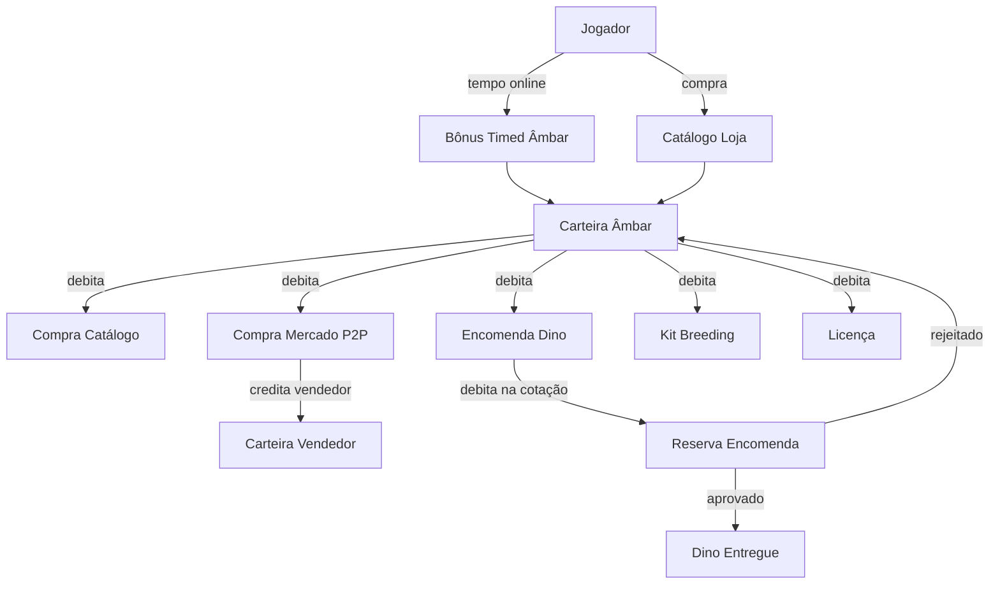
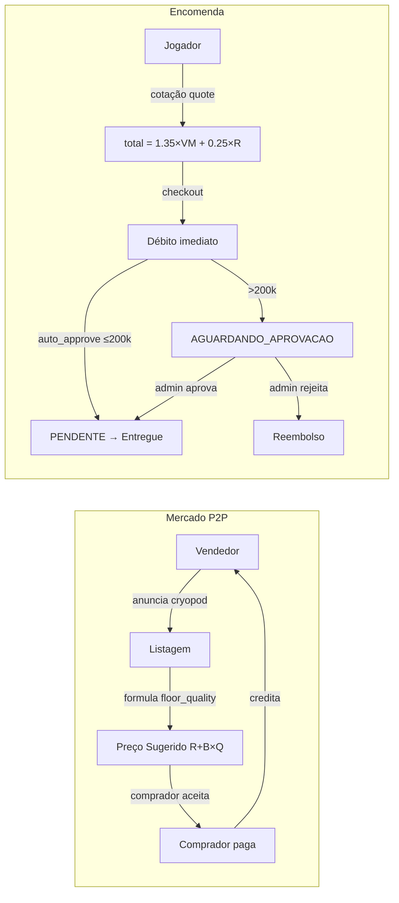

# ECONOMIA ARKLAND — Bíblia Completa

> **Status:** Implementado e em produção  
> **Versão do documento:** 1.0 — Jul 2026  
> **Moeda base:** Âmbar (amber points)  
> **Arquivos-fonte:** `plugin/arkshop_web/market_economy.py`, `dino_order_service.py`, `app.py`, `data/market_species_defaults.json`, `data/species_root_ladder.json`, `plugin/CustomShop/configs/config.json`  
> **Proposta de evolução:** [`docs/PROJETO_ECONOMIA_IDEAL.md`](./PROJETO_ECONOMIA_IDEAL.md)  
> **Tabela completa de preços:** [**→ TABELA_PRECOS_DINOS.md**](./TABELA_PRECOS_DINOS.md) — 79 espécies com preços atuais vs propostos, mercado 254pts e encomenda máxima  
> **Meta do catálogo:** 79 espécies é o subconjunto inicial (premium/endgame); o objetivo é cobrir **todos os domesticáveis vanilla ASE + DLCs + mods ativos** (~240–260 espécies). Ver análise de lacunas em [**→ CATALOGO_DINOS_COMPLETO.md**](./CATALOGO_DINOS_COMPLETO.md)

---

## Sumário Executivo

O ARKLAND opera uma economia centralizada em **Âmbar** — uma moeda virtual que circula entre jogadores (P2P), loja administrada (catálogo), encomendas personalizadas, kits de breeding e licenças de assinatura.

O motor econômico tem dois pilares principais:

1. **Catálogo (CustomShop)** — Loja estática administrada, itens com preço fixo, dinos nível 1 e recursos.
2. **Mercado P2P** — Jogadores anunciam cryopods com preço calculado pelo modelo `floor_quality` (piso R + orçamento B × índice Q).

Todas as transações debitam ou creditam Âmbar da carteira do jogador, gerenciada pelo plugin `CustomShop` com banco de dados MySQL centralizado.

---

## 1. Modelo de Moeda — Âmbar

### 1.1 Fontes de Âmbar (entradas)

| Fonte | Valor | Status |
|-------|-------|--------|
| Bônus por tempo online (Default) | 25 Âmbar / 30 min | Implementado |
| Bônus Licença Gamma | +25 Âmbar / 30 min | Implementado |
| Bônus Licença Beta | +50 Âmbar / 30 min | Implementado |
| Bônus Licença Alfa | +75 Âmbar / 30 min | Implementado |
| Kit Inicial (starter) | Valor fixo na compra | Implementado |
| Venda P2P no Mercado | Âmbar do comprador | Implementado |
| Eventos/administração manual | A definir | Planejado |
| Doações (monetização) | Conversão Âmbar | Planejado |

**Tabela de bônus acumulados por licença:**

| Grupo | Bônus base (Default) | Bônus licença | Total / 30 min |
|-------|---------------------|---------------|----------------|
| Default (todos) | 25 | 0 | **25** |
| Gamma | 25 | 25 | **50** |
| Beta | 25 | 50 | **75** |
| Alfa | 25 | 75 | **100** |
| Moderação (staff) | 25 | 500 | **525** |

> Fonte: `app.py` linhas 3324–3328 — `LICENSE_TIMED_BONUS`

### 1.2 Sumidouros de Âmbar (saídas)

| Sumidouro | Tipo |
|-----------|------|
| Compra de dinos no catálogo | Fixo |
| Compra de kits de breeding | Fixo |
| Compra de licenças | Fixo, 30 dias |
| Licença Nuvem (/upload, /download) | Fixo |
| Compra de itens/comandos | Fixo |
| Encomenda de dino customizado | Dinâmico |
| Anúncio e compra no Mercado P2P | Dinâmico |

---

## 2. Fluxos Econômicos





---

## 3. Catálogo (CustomShop)

### 3.1 Estrutura

O catálogo é definido em `plugin/CustomShop/configs/config.json` e tem três seções principais:

- **`Items`** — Itens individuais à venda (dinos L1, comandos, licenças, recursos)
- **`Kits`** — Pacotes de breeding (múltiplos dinos L1)
- **`Database`** — Conexão MySQL

### 3.2 Categorias de Items

| Categoria | Descrição |
|-----------|-----------|
| Dinos (Type: dino) | Dinos L1 prontos para breeding |
| Licenças (Type: license) | Assinaturas de bônus Âmbar |
| Comandos (Type: command) | Executam comandos RCON (licença Nuvem, etc.) |
| Ferramentas | Itens utilitários |
| Recursos | Materiais do jogo |

### 3.3 Dinos Nível 1 — Tabela de Preços (L1 = R)

O preço de catálogo do L1 **é idêntico ao valor R (piso)** da economia de mercado.

| Espécie | Tier | Papel | Preço L1 (Âmbar) | Antes (v1) |
|---------|------|-------|------------------|------------|
| Armaedron | S+ | boss | **35.000** | ~~95.000~~ |
| Dread Wyvern | S+ | boss | **33.000** | ~~91.464~~ |
| Ancient Wyvern | S+ | boss | **32.000** | ~~90.757~~ |
| IndoRaptor | S+ | boss | **32.000** | ~~90.404~~ |
| Indominus Rex | S+ | boss | **28.000** | ~~70.000~~ |
| Small Hydra | S | boss | **24.000** | ~~52.121~~ |
| Giganotossauro Tek | S+ | ataque | **22.000** | ~~46.464~~ |
| Rex Tek | S+ | ataque | **21.000** | ~~45.959~~ |
| Shadowmane | S | raid | **22.000** | ~~35.555~~ |
| Tek Strider | S+ | boss | **26.000** | ~~35.000~~ |
| Volcano Small Dragon | A | boss | 25.757 |
| Small Dragon | A | boss | 25.454 |
| Fire Elemental | A | boss | 25.151 |
| Carcharodontosaurus | S+ | raid | 25.000 |
| Crystal Wyvern Queen | A | boss | 25.000 |
| Small Desert Titan | A | boss | 25.000 |
| Giganotosaurus | S | ataque | 22.636 |
| Acrocantossauro | S | ataque | 22.373 |
| Rex | S | ataque | 18.000 |
| Rex Abissal | A | raid | 16.606 |
| Reaper Abissal | A | raid | 16.363 |
| Reaper Gen2 | A | raid | 16.242 |
| Reaper | A | raid | 16.121 |

> **Nota:** `Tek Strider` tem `commerce_channel: catalog_only` — disponível apenas na loja, não no Mercado P2P.

### 3.4 Categorias de Tier

| Tier | Legenda |
|------|---------|
| S+ | Apex/boss/tek — breeding extremamente difícil ou raro |
| S | Apex PvP — linhagens premium (Giga, Bionic, Lionfish) |
| A | Meta breeding — alto impacto competitivo |
| B | Intermediário — utilidade ou breeding moderado |
| C | Entrada — mais acessível na loja, stats ainda relevantes |

---

## 4. Mercado P2P (Mercado Cryopod)

### 4.1 Visão Geral

O Mercado P2P permite que jogadores anunciem e vendam dinos criados via breeding. O preço é calculado automaticamente pelo sistema usando o modelo **`floor_quality`**.

### 4.2 Modelo floor_quality

**Fórmula principal:**

```
Valor_Sugerido = min(R + B × Q, market_absolute_max)
```

Onde:
- **R** = `root_value` — preço piso para a espécie (= preço L1 no catálogo)
- **B** = `premium_budget` — orçamento de prêmio por qualidade de breeding
- **Q** = Índice de Qualidade [0, 1] — função dos pontos de stat do dino
- **market_absolute_max** = **150.000 Âmbar** (teto global de anúncio)

**Cálculo do Índice Q:**

```
Q = Σ(w_s × (pts_s / pts_ref)^γ) / Σ(w_s)
```

Onde:
- `pts_s` = pontos de stat breedáveis do dino (≤ 254)
- `pts_ref` = **254** (referência máxima)
- `γ` = **0.82** (coeficiente de retornos decrescentes)
- `w_s` = peso do stat por `dino_role`

**Pesos por papel (dino_role):**

| Stat | utilitario | locomocao | ataque | raid | boss |
|------|-----------|-----------|--------|------|------|
| Vida | 0.15 | 0.15 | 0.35 | 0.30 | 0.40 |
| Dano | 0.05 | 0.05 | 0.45 | 0.50 | 0.40 |
| Peso | 0.40 | 0.30 | 0.10 | 0.15 | 0.10 |
| Estamina | 0.25 | 0.35 | 0.10 | 0.05 | 0.10 |
| Velocidade | 0.05 | 0.10 | 0.00 | 0.00 | 0.00 |
| Comida | 0.10 | 0.05 | 0.00 | 0.00 | 0.00 |

### 4.3 Teto de Preço (Price Ceiling)

O teto de preço (`_price_ceiling`) está **DESABILITADO** em produção (`"enabled": false`). Quando habilitado, funcionaria como:

```
teto = min(sugerido × mult_tier, porte_cap, absolute_max)
```

Multiplicadores por tier (quando habilitado):
- S+: 12× | S: 10× | A: 10× | B: 8× | C: 6×

### 4.4 Tetos por Porte

| Porte | Teto de anúncio |
|-------|----------------|
| large | 300.000 Âmbar |
| medium | 250.000 Âmbar |
| small | 100.000 Âmbar |

> **Na prática:** como o `market_absolute_max` é 150.000, todos os anúncios são limitados a **150.000 Âmbar** independente do porte.

### 4.5 Tabela Completa R/B e Valores de Mercado

> Dados extraídos de `tools/blueprint_catalog_matrix.csv` — valores calculados para dino com 0 pts (L1) e 254 pts (máximo breedado).

> **v2 Jul/2026:** R e B recalibrados para S+ e S topo. Teto de mercado 150.000 mantido — B aumentou para incentivar breeding.

| Espécie | Tier | Papel | R | B | Mercado L1 | Mercado 254pts |
|---------|------|-------|---|---|-----------|----------------|
| Armaedron | S+ | boss | **35.000** | **115.000** | 35.000 | **150.000** |
| Dread Wyvern | S+ | boss | **33.000** | **117.000** | 33.000 | **150.000** |
| Ancient Wyvern | S+ | boss | **32.000** | **118.000** | 32.000 | **150.000** |
| IndoRaptor | S+ | boss | **32.000** | **118.000** | 32.000 | **150.000** |
| Indominus Rex | S+ | boss | **28.000** | **122.000** | 28.000 | **150.000** |
| Small Hydra | S | boss | **24.000** | **126.000** | 24.000 | **150.000** |
| Giganotossauro Tek | S+ | ataque | **22.000** | **128.000** | 22.000 | **150.000** |
| Rex Tek | S+ | ataque | **21.000** | **129.000** | 21.000 | **150.000** |
| Shadowmane | S | raid | **22.000** | **108.000** | 22.000 | 130.000 |
| Tek Strider* | S+ | boss | **26.000** | **124.000** | 26.000 | **150.000** |
| Volcano Small Dragon | A | boss | 25.757 | 94.243 | 25.757 | 120.000 |
| Carcharodontosaurus | S+ | raid | 25.000 | 125.000 | 25.000 | **150.000** |
| Giganotosaurus | S | ataque | 22.636 | 85.364 | 22.636 | 108.000 |
| Acrocantossauro | S | ataque | 22.373 | 85.627 | 22.373 | 108.000 |
| Rex | S | ataque | 18.000 | 90.000 | 18.000 | 108.000 |
| Reaper | A | raid | 16.121 | 73.879 | 16.121 | 90.000 |
| Yutyrannus Abissal | A | ataque | 9.737 | 65.263 | 9.737 | 75.000 |
| Deinonychus | A | ataque | 9.525 | 65.475 | 9.525 | 75.000 |
| Astrodelphis | A | locomocao | 6.868 | 35.132 | 6.868 | 42.000 |
| Desmodus | A | locomocao | 6.787 | 35.213 | 6.787 | 42.000 |
| Small Dodowyvern | B | raid | 5.878 | 39.122 | 5.878 | 45.000 |
| Small Moeder | B | boss | 5.000 | 20.000 | 5.000 | 25.000 |
| Dakosaurus | B | ataque | 3.545 | 31.455 | 3.545 | 35.000 |
| Cryolophosaurus | B | ataque | 3.333 | 31.667 | 3.333 | 35.000 |
| Brachiosaurus | B | utilitario | 2.318 | 12.682 | 2.318 | 15.000 |
| Diru-Ya-Ku | C | ataque | 1.311 | 13.689 | 1.311 | 15.000 |
| Camarão-mantis | C | ataque | 1.244 | 13.756 | 1.244 | 15.000 |
| Stegossauro Abissal | C | utilitario | 696 | 7.304 | 696 | 8.000 |
| Cavalo-marinho | C | utilitario | 595 | 7.405 | 595 | 8.000 |

> (*) Tek Strider: `commerce_channel=catalog_only` — não disponível no mercado P2P.

**Âncoras canonizadas v2** (recalibradas Jul/2026):

| Espécie | Papel | Tier | prestige_rank | R antes | **R depois** |
|---------|-------|------|---------------|---------|-------------|
| Armaedron | boss | S+ | 98 | 95.000 | **35.000** |
| Indominus Rex | boss | S+ | 92 | 70.000 | **28.000** |
| Carcharodontosaurus | raid | S+ | 88 | 25.000 | **25.000** |
| Rex | ataque | S | 75 | 18.000 | **18.000** |
| Tek Strider | boss | S+ | 85 | 35.000 | **26.000** |

---

## 5. Encomendas de Dino (Dino Orders)

### 5.1 O que é

O sistema de encomendas permite que jogadores solicitem dinos customizados (cores específicas, nível, stat_points de health/melee) pagando um adicional de serviço sobre o valor de mercado equivalente.

**Somente espécies vanilla** são aceitas em encomendas. Espécies de mods (Abyss, Grand Hunt, Brighamia, etc.) são bloqueadas.

### 5.2 Fórmula de Cotação

```
market_value = calculate_suggested_value(espécie, stat_points)  # Valor floor_quality
color_component = f(R, cores_solicitadas, deltas)
base_surcharge = R × α           # α = 0.25
service_premium = (market_value + color_component) × β   # β = 0.35
total = market_value + color_component + base_surcharge + service_premium
total = clamp(total, max(market_value, R), 275.000)
```

**Parâmetros padrão:**

| Parâmetro | Valor | Descrição |
|-----------|-------|-----------|
| α (alpha) | 0.25 | Taxa base de serviço sobre R |
| β (beta) | 0.35 | Taxa sobre valor de mercado |
| δ_uniform | 0.08 | Cor uniforme (todas 6 regiões iguais) |
| δ_base | 0.05 | Base para cor customizada |
| δ_region | 0.02 | Por região colorida adicional |
| κ (kappa) | 1.15 | Multiplicador global (reservado) |
| encomenda_absolute_max | 275.000 | Teto absoluto de encomenda |
| auto_approve_max | 200.000 | Abaixo disso → aprovação automática |

### 5.3 Exemplo de Cálculo

Para um **Rex** (R=18.000) sem stats especiais e sem cores:
- `market_value` = 18.000 (Q=0, piso L1)
- `color_component` = 0
- `base_surcharge` = 18.000 × 0.25 = 4.500
- `service_premium` = 18.000 × 0.35 = 6.300
- **Total = 28.800 Âmbar** (auto-aprovado, < 200k)

Para um Rex com 254 pts em HP e Dano:
- `market_value` ≈ 108.000 (teto tier S/ataque)
- `base_surcharge` = 18.000 × 0.25 = 4.500
- `service_premium` = 108.000 × 0.35 = 37.800
- `total antes do teto` = 150.300 → **clamped a 150.300**
- Como 150.300 < 275.000 → total = **150.300 Âmbar** (aguarda aprovação admin, > 200k)

### 5.4 Componente de Cor

| Situação | Fórmula | Exemplo (R=18.000) |
|----------|---------|---------------------|
| Sem cores | 0 | 0 |
| Todas 6 regiões igual | R × 0.08 | 1.440 |
| Cor customizada base | R × 0.05 + regiões × R × 0.02 | 900 + N×360 |

### 5.5 Fluxo de Status

```
COTAÇÃO (quote) → sem débito
  ↓ checkout() → DÉBITO IMEDIATO
  ├── total ≤ 200.000 → PENDENTE → processamento automático → ENTREGUE
  └── total > 200.000 → AGUARDANDO_APROVACAO
        ├── admin aprova → PENDENTE → ENTREGUE
        └── admin rejeita → REJEITADO + REEMBOLSO
```

### 5.6 Rate Limit

Removido. Encomendas não têm teto semanal por Steam ID — o bloqueio Dino Lab no mercado cobre o risco de farm/revenda que motivava o limite original (3 / 7 dias).

---

## 6. Kits de Breeding

### 6.1 Estrutura

Kits são pacotes de 10 dinos L1 fêmeas para breeding, com desconto de **25%** em relação ao preço unitário de referência do kit. Definidos em `config.json → Kits`.

Total de kits disponíveis: **43**

### 6.2 Tabela de Kits — Preços

| Kit | Descrição | Preço Kit (Âmbar) |
|-----|-----------|-------------------|
| indominus_pack10 | 10x Indominus Rex L1 | 375.000 |
| indoraptor_pack10 | 10x IndoRaptor L1 | 337.500 |
| armaedron_pack10 | 10x Armaedron L1 | 262.500 |
| tekstrider_pack10 | 10x Tek Strider L1 | 225.000 |
| bionicgigant_pack10 | 10x Giganotossauro Tek L1 | 187.500 |
| bionicrex_pack10 | 10x Rex Tek L1 | 150.000 |
| sb_fire_elemental_pack10 | 10x Fire Elemental L1 | 562.500 |
| sb_hydra_pack10 | 10x Small Hydra L1 | 547.500 |
| sb_crystal_queen_pack10 | 10x Crystal Wyvern Queen L1 | 555.000 |
| sb_volcano_dragon_pack10 | 10x Volcano Small Dragon L1 | 536.250 |
| sb_broodmother_pack10 | 10x Small Broodmother L1 | 543.750 |
| lionfish_pack10 | 10x Shadowmane L1 | 112.500 |
| giga_pack10 | 10x Giganotosaurus L1 | 112.500 |
| carcha_pack10 | 10x Carcharodontosaurus L1 | 90.000 |
| volcanorex_pack10 | 10x Volcano Rex L1 | 75.000 |
| acro_pack10 | 10x Acrocantossauro L1 | 60.000 |
| desmodus_pack10 | 10x Desmodus L1 | 60.000 |
| xenomorphgen2_pack10 | 10x Reaper Gen2 L1 | 60.000 |
| xenomorph_pack10 | 10x Reaper L1 | 52.500 |
| megalosaurus_aberrant_pack10 | 10x Megalosaurus Aberrante L1 | 52.500 |
| megalosaurus_pack10 | 10x Megalosaurus L1 | 45.000 |
| rex_pack10 | 10x Rex L1 | 37.500 |
| deinonychus_pack10 | 10x Deinonychus L1 | 37.500 |
| kit_alfa | KIT ALFA (30 dias) | 50.000 |
| kit_beta | KIT BETA (30 dias) | 37.500 |
| kit_gamma | KIT GAMMA (30 dias) | 25.000 |
| recursos | Kit Recursos Emergencial (75% off) | 3.543 |
| starter | Kit Inicial | 0 (gratuito) |

> Kits `kit_alfa/beta/gamma` são pacotes de licença + benefícios de bônus temporal.

---

## 7. Licenças

### 7.1 O que são

Licenças são assinaturas de 30 dias que aumentam a taxa de ganho de Âmbar por tempo online. São compradas na loja e ficam registradas em `player_entitlements`.

### 7.2 Tabela de Licenças

| ID Catálogo | Grupo | Duração | Preço | Bônus /30min | Total /30min |
|-------------|-------|---------|-------|--------------|--------------|
| `licenca_gamma` | Gamma | 30 dias | 50.000 Â | +25 Â | 50 Â |
| `licenca_beta` | Beta | 30 dias | 75.000 Â | +50 Â | 75 Â |
| `licenca_alfa` | Alfa | 30 dias | 100.000 Â | +75 Â | 100 Â |
| `licenca_nuvem` | keyvault | 30 dias | 5.000 Â | — | — |

> **Licença Nuvem:** não é bônus de Âmbar. Concede acesso aos comandos `/upload`, `/download` e `/nuvem` em todos os mapas do cluster via permissão `keyvault`.

> **Expansão aprovada para 12 tiers:** consulte [**→ LICENCAS_PRECOS_PROPOSTA.md**](./LICENCAS_PRECOS_PROPOSTA.md) — escada Delta → Exótico com acesso aos itens do mod ItensAlfa (armadura/armas/selas TEK 30%–130%), preços **6k–230k Âmbar** *(v3.0 — Opção Aprovada, escada de subscrição TEK pré-recalibração Armaedron; Gama 50k / Beta 75k / Alfa 100k / Exótico 230k).*

### 7.3 ROI das Licenças

Assumindo 2h de jogo por dia (4 blocos de 30min):

| Licença | Custo | Âmbar/dia (base+bônus) | Âmbar/30 dias | ROI (dias para recuperar) |
|---------|-------|------------------------|----------------|--------------------------|
| Gamma | 50.000 | 200 | 6.000 | ~250 dias jogando 2h/dia |
| Beta | 75.000 | 300 | 9.000 | ~250 dias |
| Alfa | 100.000 | 400 | 12.000 | ~250 dias |

> As licenças têm valor principalmente pelo **acesso e status**, não pelo ROI direto de Âmbar.

### 7.4 Gestão de Licenças

- Ao renovar uma licença, kits associados têm seus limites de resgate resetados automaticamente (`_reset_dependent_kit_limits_tx`)
- Tiers pagos distintos **ilimitados** em `player_entitlements`; renovar o mesmo SKU soma +30 dias
- Timed Points: com `StackRewards` (default), **todas** as licenças activas **somam** o Amount com Default/staff/MOD; com `StackRewards=false`, só o maior Amount
- `PAID_LICENSE_GROUPS` = Delta…Exotico — licenças pagas com controlo em `player_entitlements` (Nuvem/`keyvault` à parte)
- Admin pode conceder/revogar licenças via painel web (`_admin_player_license`)

---

## 8. Ganhos e Progressão

### 8.1 Progressão de Ganho por Tempo Online

```
Âmbar total / 30min = 25 (Default) + bonus_licenca
```

| Perfil | Âmbar/hora | Âmbar/dia (2h) | Âmbar/semana (2h/dia) |
|--------|-----------|----------------|----------------------|
| Sem licença | 50 | 100 | 700 |
| Gamma | 100 | 200 | 1.400 |
| Beta | 150 | 300 | 2.100 |
| Alfa | 200 | 400 | 2.800 |

### 8.2 Marcos de Progressão

| Meta | Custo | Tempo para acumular (sem licença) |
|------|-------|-----------------------------------|
| Rex L1 (breeding) | 18.000 | ~180 horas online |
| Kit Rex 10x | 37.500 | ~375 horas |
| Giga L1 | 22.636 | ~226 horas |
| Carcha L1 | 25.000 | ~250 horas |
| Licença Gamma | 50.000 | ~500 horas |
| Indominus Rex L1 | **28.000** ~~70.000~~ | ~280 horas ~~700~~ |
| Armaedron L1 | **35.000** ~~95.000~~ | ~350 horas ~~950~~ |

> **v2 Jul/2026:** Armaedron caiu de 950h para ~350h sem licença (2h/dia = 175 dias). Com Licença Alfa (200Â/h, 4h/dia) = ~44 dias. Ver `docs/TABELA_PRECOS_DINOS.md` §Rationale para análise completa.

---

## 9. Ferramentas Administrativas

### 9.1 recalibrate_market_economy.py

Script em `tools/recalibrate_market_economy.py` — recalibra valores R e B das espécies de acordo com a matriz de calibração do `species_root_ladder.json`.

Gera como saída: `tools/blueprint_catalog_matrix.csv` com colunas:
- `R` — novo valor raiz proposto
- `B` — orçamento de prêmio proposto
- `mercado_0` — valor de mercado para dino L1 (0 pts)
- `mercado_254` — valor de mercado para dino com 254 pts em todos os stats
- `encomenda_0`, `encomenda_254` — equivalentes para encomenda

### 9.2 species_root_ladder.json

Arquivo de configuração econômica em `plugin/arkshop_web/data/species_root_ladder.json`.

Contém:
- **`gamma`** (0.82) — curvatura da função de retornos decrescentes
- **`market_absolute_max`** (150.000) — teto de anúncio
- **`encomenda_absolute_max`** (275.000) — teto de encomenda
- **`encomenda_alpha`** (0.25) — taxa base de serviço
- **`encomenda_beta`** (0.35) — taxa sobre valor de mercado
- **`r_ranges`** — faixas R por dino_role × tier
- **`mercado_254_targets`** — alvos de preço com 254 pts por dino_role × tier
- **`role_stat_weights`** — pesos de stat por papel
- **`anchors`** — âncoras canônicas de espécies chave
- **`blueprint_overrides`** — mapeamento blueprint → dados econômicos

### 9.3 market_species_defaults.json

Arquivo mestre em `plugin/arkshop_web/data/market_species_defaults.json`.

Contém:
- Lista completa de **55 espécies** com R, B, tier, dino_role, prestige_rank
- Configurações globais: `_size_caps`, `_price_ceiling`, `_pts_reference`, `_stat_weights`, `_floor_quality`, `_role_stat_weights`, `_tier_legend`
- Editável pelo admin via painel web (PATCH de economia global e por espécie)

### 9.4 sync_abyss_shop_catalog.py

Sincroniza espécies do mod Abyss com o catálogo de loja, atualizando preços R conforme a recalibração.

### 9.5 sync_market_species_to_shop_catalog.py

Propaga atualizações de R do `market_species_defaults.json` para o `config.json` do CustomShop.

---

## 10. Arquivos de Dados — Referência

| Arquivo | Propósito | Editável |
|---------|-----------|----------|
| `plugin/arkshop_web/data/market_species_defaults.json` | Mestre de espécies e config global | Sim (admin web) |
| `plugin/arkshop_web/data/species_root_ladder.json` | Matriz de calibração e parâmetros | Manual |
| `plugin/arkshop_web/data/ark_species_registry.json` | Registro de espécies de mods (overlay) | Manual |
| `plugin/arkshop_web/data/resource_icons_manifest.json` | Ícones da UI | Manual |
| `plugin/CustomShop/configs/config.json` | Catálogo completo de loja | Manual / sync tools |
| `tools/blueprint_catalog_matrix.csv` | Saída da recalibração | Gerado automaticamente |
| `tools/catalog_id_migration.json` | Mapeamento de IDs migrados | Manual |

---

## 11. Pontos de Integração

| Sistema | Como Integra | Arquivo |
|---------|--------------|---------|
| CustomShop (C++) | Lê `config.json`, debita/credita Âmbar via MySQL | `plugin/CustomShop/` |
| Web Store (Python/Flask) | API REST para mercado, encomendas, admin | `plugin/arkshop_web/app.py` |
| ASM (Server Manager) | Gerencia instâncias, eventos, sincronização | `src/server_manager.py` |
| TEK UI | Interface de painel para admin e jogadores | `src/app_tek.py` |
| Permissions (MySQL) | Controle de licenças e grupos ARK | Servidor ARK |

---

## 12. Gaps e Limitações Conhecidas

| Item | Status | Nota |
|------|--------|------|
| Eventos com multiplicador de Âmbar | Planejado | Não implementado |
| Doações → Âmbar automático | Planejado | Sem pipeline |
| Taxa/taxa de listagem no Mercado P2P | Não implementado | Solteiros: vendedor recebe 100% (`fee_amount=0`) |
| Taxa de transação na compra P2P (solteiro) | Zero fee | Mantido |
| Venda em casal (M+F) + contribuição 40% ao Sorteio | **Implementado** ([§8.7.3–8.7.4](./REGULAMENTO_SERVIDOR.md)) | Checkout `Y=0,60×S`; pote `prize_amber_from_market += 0,40×S`; tribo reparte sobre **Y**; solteiros inalterados (`fee_amount=0`); desistência/expiração: reembolso `0,60×Y` (pote sem estorno) |
| Expiração de anúncios ACTIVE | Não implementado / sem prazo automático | Só claim de resgate (~24h) tem expiração |
| Kits para espécies Abyss | Não implementado | Apenas vanilla+mods populares |
| Price ceiling | Implementado mas desabilitado | `"enabled": false` |

---

*Documento gerado em Jul/2026 — cross-referência com código-fonte de produção.*
