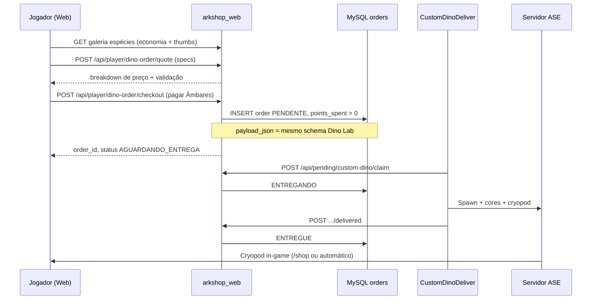
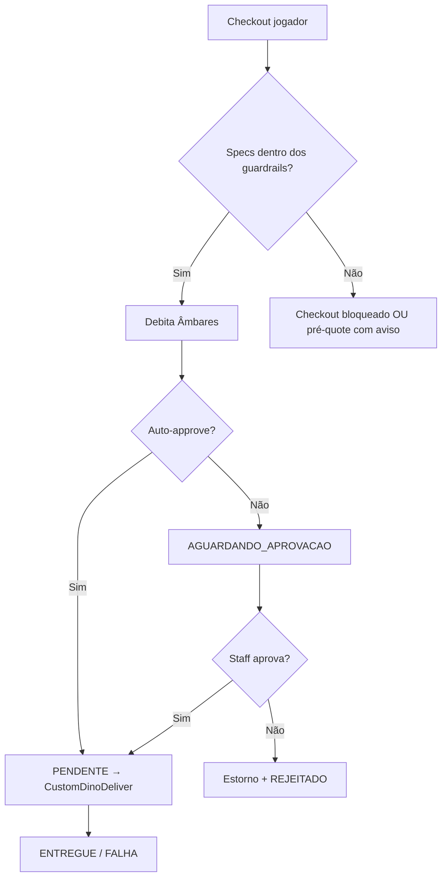

# Encomenda de Dino — Especificação e análise de viabilidade (ARKLAND)

| Campo | Valor |
|-------|-------|
| **Status** | ✅ **MVP + galeria visual** (2026-07-07) — backend, rotas, UI jogador/admin, vitrines de cor, testes |
| **Versão do documento** | 1.0 |
| **Data** | 2026-07-07 |
| **Escopo** | Produto, fluxos, modelo de preços, viabilidade econômica, integração técnica |
| **Fora de escopo** | Código, deploy, release, migrações SQL |
| **Dependências** | [`DINO_LAB_SPEC.md`](DINO_LAB_SPEC.md), [`DINO_LAB_GUIA.md`](DINO_LAB_GUIA.md), [`PROJETO_MERCADO_CRYOPOD.md`](PROJETO_MERCADO_CRYOPOD.md) |

> **Resumo:** canal **jogador-facing** para encomendar dinos customizados (espécie, cores, stats) com cobrança em Âmbares, reutilizando a fila e o plugin **CustomDinoDeliver** do Dino Lab. Distinto do catálogo fixo, do mercado P2P e da entrega admin gratuita.

---

## Sumário executivo

| Pergunta | Resposta |
|----------|----------|
| **O que é?** | Galeria de espécies com botão **「ENCOMENDAR MEU DINO」** → formulário de customização → pagamento em Âmbares → fila de entrega in-game |
| **Por que agora?** | O **Dino Lab** já entrega dinos com cores, SpawnExact, cryopod e fila HTTP — a entrega técnica existe; falta o **produto comercial** jogador-facing com preço equilibrado |
| **É viável tecnicamente?** | **Alta** — reutiliza `validate_payload`, `payload_json`, `item_type` na tabela `orders`, poll `/api/pending/custom-dino/*` e `CustomDinoDeliver.dll` |
| **É viável economicamente?** | **Condicional** — viável se o preço for **≥ valor sugerido do mercado** para os mesmos stats **+ prêmio de serviço**, com tetos e guardrails anti-abuso |
| **Principal risco** | Inflação de Âmbares e bypass do staff (encomenda barata vs. breeding / mercado P2P / Dino Lab admin gratuito) |

**Recomendação de produto (proposta):** lançar em **MVP** com espécies vanilla homologadas, cores + nível simples, stats via pontos Spyglass (não SpawnExact), fila automática após pagamento, e **revisão admin** apenas para pedidos fora dos limites ou acima de um valor configurável.

---

## 1. Visão do produto

### 1.1 Posicionamento no ecossistema ARKLAND

| Canal | Público | O que o jogador recebe | Preço |
|-------|---------|------------------------|-------|
| **Catálogo `/shop` (aba Dinos)** | Jogadores | Dino **fixo** do `config.json` (nível, sexo, blueprint) | Preço fixo do item (ex.: Rex L1 = **5.000** Âmbar) |
| **Mercado P2P (Genoma)** | Jogadores | Cryopod de **outro jogador** (imprint, mutações reais) | Livre ≥ valor sugerido (`market_economy`) |
| **Encomenda de Dino** *(novo)* | Jogadores | Dino **sob medida** (cores, stats desejados, sexo) | Calculado — base mercado + prêmios |
| **Dino Lab (admin)** | Staff | Compensação / evento / suporte | **Gratuito** (`points_spent = 0`) |

### 1.2 Proposta de UX — galeria

Inspirada na aba **🦕 Dinos** existente em `static/index.html` (`renderCatalogDinos`, cards `item-card` com thumbnail):

```
┌─────────────────────────────────────────────────────────────────┐
│  Catálogo › Encomenda de Dino                                   │
├─────────────────────────────────────────────────────────────────┤
│  [🔍 Buscar espécie…]     Ordenar: Nome ▼   Tier ▼              │
│                                                                 │
│  ┌──────────┐  ┌──────────┐  ┌──────────┐                       │
│  │ [thumb]  │  │ [thumb]  │  │ [thumb]  │   ← imagem + tier    │
│  │   Rex    │  │  Giga    │  │ Carcha   │                       │
│  │ Tier A   │  │ Tier S   │  │ Tier A   │                       │
│  │ a partir │  │ a partir │  │ a partir │   ← preço mínimo     │
│  │ 5.000 ᐃ  │  │ 12.000 ᐃ │  │ 29.994 ᐃ │                       │
│  │[ENCOMENDAR│  │[ENCOMENDAR│  │[ENCOMENDAR│                    │
│  │ MEU DINO]│  │ MEU DINO]│  │ MEU DINO]│                       │
│  └──────────┘  └──────────┘  └──────────┘                       │
└─────────────────────────────────────────────────────────────────┘
```

- **Não** misturar com cards de resgate direto (`Resgatar`) — aba ou seção dedicada **「Encomenda」** evita confusão com itens de preço fixo.
- **「a partir de」** = `root_value` da tabela de economia (mesmo piso do mercado).
- Thumbnails: reutilizar `thumbnail_url` do catálogo ou sprites da tabela oficial do mercado.

### 1.3 O que o jogador configura

| Campo | MVP | Fase 2+ |
|-------|-----|---------|
| Espécie | ✅ Allowlist (`market_species_defaults.json`) | Mods homologados |
| Sexo / castrado | ✅ | ✅ |
| Nível (modo simples) | ✅ Default 150, teto configurável | — |
| 6 regiões de cor | ✅ Índices Obelisk 0–255 | Swatches visuais |
| Stats desejados | ✅ Pontos por stat (HP, Dano, …) via UI simplificada | SpawnExact wild/tamed |
| Imprint | ❌ | ⚠️ Opcional com prêmio alto |
| Nome custom / sela | ❌ | Fase 3 |
| Entrega | Cryopod (padrão) | Fallback chão |

---

## 2. Fluxo do jogador



### 2.1 Passo a passo (narrativa)

1. **Galeria** — jogador autenticado navega espécies elegíveis; vê tier, imagem e preço mínimo.
2. **Formulário** — ao clicar **ENCOMENDAR MEU DINO**, abre wizard: sexo, nível, cores (6 regiões), stats desejados.
3. **Cotação em tempo real** — front chama API de quote; exibe breakdown (base, stats, cores, taxa encomenda, total).
4. **Pagamento** — débito de Âmbares (mesmo fluxo de saldo que `/api/player/purchase`); pedido só é criado se saldo ≥ total.
5. **Fila** — pedido entra em `orders` com status `PENDENTE`; plugin faz claim e entrega.
6. **Resgate** — jogador online no mapa com plugin; cryopod no inventário (paridade Dino Lab).
7. **Acompanhamento** — área **Minha Área / Pedidos** com status, specs e breakdown pago (reembolso só por política admin — ver §8).

### 2.2 Estados do pedido (proposta)

| Status | Significado |
|--------|-------------|
| `COTACAO` | *(opcional, só sessão)* — não persistido |
| `AGUARDANDO_APROVACAO` | Pagamento recebido mas specs exigem staff (SpawnExact, acima do teto auto, mod) |
| `PENDENTE` | Aprovado / auto-aprovado — aguardando plugin |
| `ENTREGANDO` | Claim ativo |
| `ENTREGUE` | Sucesso |
| `FALHA` | Erro de spawn — retry ou estorno manual |
| `CANCELADO` | Estorno admin antes da entrega |
| `REJEITADO` | Staff recusou specs — estorno |

---

## 3. Fluxo admin

### 3.1 Automático vs. aprovação manual

| Cenário | Proposta |
|---------|----------|
| Espécie vanilla ACTIVE, stats dentro dos limites, cores válidas, total ≤ `dino_order_auto_approve_max` | **Automático** → `PENDENTE` imediato após pagamento |
| SpawnExact habilitado, stats no topo (ex. >90% do teto), blueprint mod, ou total acima do limite | **Fila de aprovação** → `AGUARDANDO_APROVACAO` |
| Suspeita de abuso (muitos pedidos/dia, mesmo IP) | Flag para revisão |



### 3.2 UI admin (extensão do Dino Lab ou módulo novo)

| Área | Função |
|------|--------|
| **Fila de encomendas** | Pedidos pagos aguardando aprovação ou com falha |
| **Detalhe** | Payload JSON, breakdown de preço, histórico de transações |
| **Ações** | Aprovar, rejeitar com estorno, reenviar fila, converter em compensação gratuita *(proibido sem estorno do pagamento original)* |
| **Config** | Multiplicadores, tetos, espécies elegíveis, flag global `dino_order_enabled` |

**Regra de ouro:** staff **não** deve usar Dino Lab gratuito para entregar o que o jogador poderia encomendar pago — auditoria cruzada `points_spent` vs. `created_by` admin.

---

## 4. Integração técnica com Dino Lab

### 4.1 O que reutilizar (já implementado)

| Componente | Caminho | Reuso |
|------------|---------|-------|
| Validação de payload | `custom_dino_service.validate_payload()` | **100%** — mesmo schema `payload_json` |
| Fila plugin | `custom_dino_routes` → `/api/pending/custom-dino/*` | **100%** — mesmo poll |
| Plugin entrega | `CustomDinoDeliver.dll` | **100%** — SpawnExact, cores, cryopod |
| Catálogo de espécies | `market_economy.load_default_species_map()` | Galeria + blueprints |
| Cálculo de valor stats | `market_economy.calculate_suggested_value()` | Base do preço |
| Economia global | `market_species_defaults.json` | `root_value`, tiers, tetos |

### 4.2 O que diferenciar (novo)

| Aspecto | Dino Lab admin | Encomenda jogador |
|---------|----------------|-------------------|
| `points_spent` | `0` | `> 0` (preço calculado) |
| `payload.created_by` | SteamID admin | `"player"` ou SteamID jogador |
| `payload.order_source` | implícito admin | `"dino_encomenda"` |
| `item_type` | `custom_dino` | **Proposta:** manter `custom_dino` + discriminar por `order_source` **ou** novo `dino_encomenda` |
| Rotas criação | `POST /api/admin/custom-dino/deliver` | `POST /api/player/dino-order/checkout` |
| Permissão | `admin` + `custom_dino_enabled` | Jogador autenticado + `dino_order_enabled` |
| Rate limit | 30/h por admin | Ex.: 3 pedidos/dia/jogador, 1 ativo por espécie |

**Recomendação `item_type`:** usar `custom_dino` no MVP (zero alteração no plugin) e campo `payload.order_source = "dino_encomenda"`; filtrar na UI admin. Se relatórios ficarem confusos, migrar para `dino_encomenda` com extensão mínima do plugin (filtro no claim).

### 4.3 Schema `payload_json` (extensão)

Campos adicionais sugeridos sobre o schema Dino Lab v1:

```json
{
  "order_source": "dino_encomenda",
  "pricing": {
    "version": 1,
    "root_value": 5000,
    "stats_component": 104702,
    "color_component": 8200,
    "service_surcharge_pct": 35,
    "service_surcharge": 38446,
    "total": 156348,
    "market_equivalent": 109702,
    "quote_id": "qt_abc123",
    "quoted_at": "2026-07-07T12:00:00Z"
  },
  "stat_points_requested": {
    "health": 78,
    "melee": 105
  },
  "note": "Encomenda web — Rex PvP vermelho"
}
```

### 4.4 APIs novas (proposta)

| Método | Rota | Descrição |
|--------|------|-----------|
| `GET` | `/api/player/dino-order/species` | Galeria: espécies elegíveis + thumb + `root_value` + tier |
| `POST` | `/api/player/dino-order/quote` | Cotação sem débito |
| `POST` | `/api/player/dino-order/checkout` | Paga e enfileira |
| `GET` | `/api/player/dino-order/orders` | Histórico do jogador |
| `GET` | `/api/admin/dino-order/queue` | Fila aprovação + falhas |
| `POST` | `/api/admin/dino-order/<id>/approve` | Aprova manualmente |
| `POST` | `/api/admin/dino-order/<id>/reject` | Rejeita + estorno |

### 4.5 Front-end (`static/index.html`)

- Nova aba **「Encomenda」** no catálogo ou sub-aba dentro de **Dinos**.
- Reutilizar estilos `item-card`, `catalog-dinos-grid`, componentes de preço `amberPriceHtml`.
- Mercado (`#/market`) permanece separado — vitrine P2P, não confundir com encomenda factory.

---

## 5. Modelo de preços detalhado

### 5.1 Princípios

1. **Paridade com mercado** — o componente de stats usa **o mesmo motor** que o mercado P2P (`calculate_suggested_value`), garantindo paridade loja ↔ mercado (decisão P15 em `PROJETO_MERCADO_CRYOPOD.md`).
2. **Piso anti-exploit** — preço final **nunca** abaixo do valor sugerido para os stats pedidos.
3. **Prêmio de serviço** — encomenda é **manufatura sob demanda**; deve custar **mais** que comprar cryopod equivalente no mercado (se existir).
4. **Transparência** — breakdown visível antes do pagamento (requisito P13 do mercado).
5. **Tetos** — respeitar `size_cap` por porte e teto absoluto de encomenda.

### 5.2 Fórmulas

Notação:

- `R` = `root_value` da espécie (preço catálogo nível 1 ou JSON economia)
- `V(s)` = `calculate_suggested_value(species, stat_points)` — valor mercado
- `B(s)` = `V(s) - R` — componente bônus de stats (espaço proporcional no modelo padrão)
- `C` = componente de cores (§5.3)
- `α` = taxa base de encomenda (acréscimo sobre `R`) — ex. **25%**
- `β` = prêmio de serviço sobre `(V(s) + C)` — ex. **35%**
- `γ` = prêmio SpawnExact / imprint (se habilitado) — ex. **20%** sobre `V(s)`

**Componentes:**

```
stats_component   = V(s)
color_component   = C
base_surcharge    = round(R × α)
service_premium   = round((V(s) + C) × β)
spawnexact_extra  = round(V(s) × γ)   // somente se spawn_exact.enabled

subtotal          = V(s) + C + base_surcharge + service_premium + spawnexact_extra
```

**Piso e teto:**

```
floor             = max(V(s), R)
ceiling_species   = size_cap_for_class(size_class)        // ex. large = 300.000
ceiling_encomenda = min(ceiling_species × κ, absolute_max)  // κ ex. 1.15

total             = clamp(subtotal, floor × (1 + β_min), ceiling_encomenda)
```

Onde `β_min` opcional (ex. 15%) garante que mesmo Rex L1 customizado pague algum prêmio: `max(subtotal, floor × 1.15)`.

**Implementação (arkshop_web):** `dino_order_service.quote` + `market_economy.calculate_encomenda_value` usam α/β de `_floor_quality` (`encomenda_alpha` / `encomenda_beta`, default 0.25 / 0.35) e teto `encomenda_absolute_max`. A UI do wizard e do Dino Lab («Simular preço») exibe breakdown: stats (V), cores (C), taxa α, prêmio β e total. Objetivo: encomenda sempre acima do equivalente P2P (`total > V`).

### 5.3 Componente de cores

| Regra | Fórmula proposta |
|-------|------------------|
| Todas as regiões **0** (wild/default) | `C = 0` |
| **Cor uniforme** — 6 regiões com o mesmo índice > 0 | `C = round(R × δ_uniform)` — **δ_uniform = 8%** |
| **Cores variadas** — 2+ índices distintos > 0 | `C = round(R × δ_base) + Σ regiões distintas (round(R × δ_region))` |

Valores sugeridos:

- `δ_base` = **5%** de `R` (taxa de personalização paleta)
- `δ_region` = **2%** de `R` por região com cor **não default** (máx. 6 regiões → cap de paleta em **17%** de `R` além do uniforme)

**Simplificação MVP:** tratar região `0` como “não customizada”; regiões `> 0` contam para variabilidade.

### 5.4 Multiplicadores sugeridos (configuráveis)

| Parâmetro | Valor inicial | Faixa discussão | Função |
|-----------|---------------|-----------------|--------|
| `α` — acréscimo base encomenda | **25%** | 20–40% | Compensa risco operacional / fila |
| `β` — prêmio serviço | **35%** | 25–50% | Diferencia de mercado P2P |
| `δ_uniform` — cor única | **8%** de R | 5–12% | Paleta monocromática |
| `δ_base` + `δ_region` — cores variadas | **5% + 2%/região** | ajustável | Trabalho de especificação + pintura |
| `γ` — SpawnExact | **20%** de V(s) | 15–30% | Stats exatos / imprint |
| `κ` — teto encomenda vs. porte | **1.15** | 1.0–1.25 | Evita dinos acima do mercado |
| `absolute_max` | **500.000** | igual mercado | Teto cluster |
| `dino_order_auto_approve_max` | **200.000** | por tier | Acima disso → aprovação manual |

### 5.5 Exemplos numéricos (Rex — dados reais do cluster)

**Referência de catálogo** (`docs/config.json`): `rex_femea` → **R = 5.000** Âmbar, tier **A**, porte **large**, teto **300.000**.

Parâmetros do exemplo: `α=25%`, `β=35%`, cores e stats conforme indicado.

#### Exemplo A — Rex nível 1, cores default (sem customização)

| Componente | Cálculo | Valor |
|------------|---------|------:|
| `V(s)` | stats zero | 5.000 |
| `C` | sem cores | 0 |
| `base_surcharge` | 5.000 × 25% | 1.250 |
| `service_premium` | 5.000 × 35% | 1.750 |
| **Total** | | **8.000** |

*Comparativo:* catálogo fixo **5.000** — encomenda mínima **60% mais cara**, desincentivando encomendar dino “vazio” quando o catálogo basta.

#### Exemplo B — Rex stats moderados (78 HP, 105 Dano) + 6 cores variadas

Stats: mesmo perfil do teste `test_carcha_moderate_stats` adaptado ao Rex.

| Componente | Cálculo | Valor |
|------------|---------|------:|
| `V(s)` | `calculate_suggested_value` | **109.702** |
| `C` | 5%×R + 6×2%×R = 17%×5.000 | **850** |
| `base_surcharge` | 25%×5.000 | 1.250 |
| `service_premium` | 35%×(109.702+850) | **38.744** |
| **Total** | | **150.546** |

*Comparativo:* valor mercado **109.702** — encomenda **~37% acima** do equivalente P2P (prêmio de serviço + taxas).

#### Exemplo C — Rex stats máximos (254 HP, 254 Dano) + 6 cores variadas

| Componente | Cálculo | Valor |
|------------|---------|------:|
| `V(s)` | atinge teto porte | **300.000** |
| `C` | 17%×5.000 | 850 |
| `base_surcharge` | 1.250 | 1.250 |
| `service_premium` | 35%×300.850 | 105.298 |
| **Subtotal** | | 407.398 |
| **Teto encomenda** | min(300k×1.15, 500k) = **345.000** | |
| **Total final** | clamp | **345.000** |

*Comparativo:* mercado max **300.000** — encomenda top capped **+15%** (κ=1.15), exige **aprovação manual** se limite auto = 200k.

#### Exemplo D — Rex cor uniforme vermelha (6× índice 14), stats moderados

| Componente | Valor |
|------------|------:|
| `V(s)` | 109.702 |
| `C` | 8%×5.000 = **400** |
| `base_surcharge` | 1.250 |
| `service_premium` | 35%×110.102 = **38.536** |
| **Total** | **149.888** |

*Cor uniforme é ligeiramente mais barata que 6 cores variadas (850 vs 400) — coerente com menor complexidade estética.*

---

## 6. Análise de viabilidade econômica

### 6.1 Benefícios

| Benefício | Detalhe |
|-----------|---------|
| Monetização de customização | Captura jogadores que pagariam por conveniência sem querer breeding |
| Uso da infra Dino Lab | ROI do plugin CustomDinoDeliver além de compensações |
| Transparência | Mesma tabela econômica do mercado — confiança |
| Controle admin | Tetos, aprovação e auditoria vs. economia cinza |

### 6.2 Riscos

| Risco | Severidade | Mitigação |
|-------|------------|-----------|
| **Inflação de Âmbares** | Alta | Tetos, prêmio β alto, sinks existentes, monitorar `transactions` |
| **Bypass via Dino Lab admin** | Alta | Auditoria: bloquear `created_by` admin + mesmas specs de pedido pago; alertas |
| **Canibalização do catálogo** | Média | α+β tornam encomenda L1 não competitiva vs. `rex_femea` 5k |
| **Canibalização do mercado P2P** | Média | Preço ≥ V(s)×(1+β); jogadores breeding continuam mais baratos abaixo do teto |
| **Expectativa de mutações/imprint** | Alta | Comunicar claramente: encomenda **não** replica mutações de breeding; imprint só fase 2+ com γ alto |
| **Fila / jogador offline** | Baixa | Mesmo SLA do `/shop`; mensagem de espera |
| **Exploit de cores inválidas** | Média | Validação Obelisk + plugin; regiões `PreventColorization` bloqueadas na UI |
| **Pedidos impossíveis** | Média | Limites `custom_dino_level_max`; cap stats ≤ pts_reference (254) no MVP |

### 6.3 Comparativo resumido

| Critério | Catálogo fixo | Mercado P2P | Encomenda | Dino Lab admin |
|----------|---------------|-------------|-----------|--------------|
| Customização | ❌ | ⚠️ O que existir no cryo | ✅ Sob medida | ✅ Total |
| Preço | Fixo baixo | ≥ V(s), negociável | V(s)+prêmios | Grátis |
| Tempo | Imediato | Depende listing | Fila (minutos) | Fila / manual |
| Mutações reais | ❌ | ✅ | ❌ (MVP) | ⚠️ SpawnExact |
| Cores exatas | ❌ | ✅ se breedado | ✅ | ✅ |
| Auditoria comercial | Compra | P2P | Transação + order | Staff only |

### 6.4 «Valorização considerada» — recomendações

Objetivo: **saudável para o comércio**, sem matar a economia nem incentivar bypass.

1. **Manter β entre 30–40%** no lançamento — encomenda é luxo/conveniência, não substituto do mercado.
2. **Piso em V(s)** — nunca desconto abaixo do valor sugerido.
3. **Rex L1 encomenda ~8k vs. catálogo 5k** — gap suficiente para não virar default.
4. **Stats altos** — total encosta no teto κ=1.15× mercado; acima de 200k exige olho humano.
5. **SpawnExact / imprint** — só com γ≥20% e flag admin; caso contrário jogadores pedem “100% imprint” de graça via stats.
6. **Limite 3 encomendas / jogador / semana** (configurável) — anti-farm de revenda.
7. **Revisão mensal** — comparar volume encomenda vs. listings mercado vs. entregas Dino Lab gratuitas.

---

## 7. MVP vs. fases futuras

### 7.1 MVP (implementado 2026-07-07)

| Item | Incluído |
|------|----------|
| Flag `dino_order_enabled` | Configurações web |
| Galeria espécies vanilla ACTIVE | Aba Encomenda no catálogo |
| Formulário | Sexo, nível, 6 cores numéricas, stats HP/Dano (sliders) |
| Quote + checkout | Débito Âmbares, `payload.order_source` |
| Entrega | Reuso fila `custom_dino` + CustomDinoDeliver |
| Admin | Lista pedidos pagos, aprovar/rejeitar acima do limite |
| Auditoria | `dino_encomenda_created`, `dino_encomenda_approved/rejected` |

**Ativação:** `custom_dino_enabled` + `dino_order_enabled` em Configurações. Arquivos: `dino_order_service.py`, `dino_order_routes.py`, `dino_order_vitrine_service.py`, `dino_order_showcase_service.py`, aba Encomenda em `static/index.html`.

### 7.1.1 Vitrine rotativa de encomenda (implementado 2026-07-12)

| Item | Detalhe |
|------|---------|
| **Catálogo encomendável** | União de **10 slots rotativos** + até **5 permanentes** (admin) |
| **Mix de porte** | Alvo **6 large + 2 medium + 2 small** (`size_class` dos defaults). Se o pool de um porte for curto, preenche com outros portes (**fallback**) |
| **Ciclo** | Admin define só a **duração em dias** (presets 7/15 ou custom 1–90). Ao expirar, auto-sorteio + novo timer (sem admin online). **Rodar agora** força novo sorteio e reinicia o prazo |
| **Armazenamento** | JSON `data/dino_order_vitrine.json` |
| **Admin** | Dino Lab → aba **Vitrine** |
| **Pool** | Espécies vanilla ACTIVE do mercado; permanentes excluídas do sorteio |

Espécies fora da vitrine **não** são encomendáveis (`species_not_in_gallery` em quote/checkout).

### 7.1.2 Galeria visual de cores (implementado 2026-07-07)

| Item | Detalhe |
|------|---------|
| **Papel** | Referências **opcionais** de cor (não controlam mais o allowlist) |
| **Armazenamento** | JSON `data/dino_order_color_showcases.json` + uploads em `data/encomenda_showcase_uploads/` |
| **Limite** | Máx. **10 imagens por espécie** (API + contador admin `X/10`) |
| **Admin** | Dino Lab → aba **Galeria cores** — upload/URL, nome da cor, regiões, descrição, cores Obelisk |
| **Jogador** | Botão **Ver cores**; modal com grid; wizard aplica cores ao clicar |

### 7.2 Fase 2

- Swatches Obelisk visuais (paleta clicável além dos inputs numéricos)
- Mais stats (peso, stamina) conforme `economy_stats` por espécie
- Notificações in-game / web quando `ENTREGUE`
- Histórico jogador em Minha Área

### 7.3 Fase 3

- SpawnExact (wild/tamed) com γ configurável
- Mods homologados na galeria
- Presets (“Rex PvP meta”, “Farm weight”) — preço pré-calculado
- Integração ticket se encomenda falhar (abertura automática)

### 7.4 Fora de escopo / não fazer

- Encomenda abaixo do valor sugerido do mercado
- Entrega via CustomShop `DeliverDino` sem cores
- Unificar com Dino Lab admin na mesma UI sem segregação de permissões
- Reembolso automático em `FALHA` sem política escrita (risco de double-spend)

---

## 8. Questões em aberto para discussão (admin)

| # | Pergunta | Opções / proposta |
|---|----------|-------------------|
| Q1 | Nome público: **Encomenda de Dino** vs. **Fábrica** vs. **Dino Studio**? | Branding |
| Q2 | Onde na navegação? Aba catálogo vs. item no menu principal | UX |
| Q3 | `item_type` separado `dino_encomenda` ou `custom_dino` + `order_source`? | **Proposta:** MVP com `order_source` |
| Q4 | Aprovação automática até qual valor? | **Proposta:** 200.000 Âmbar |
| Q5 | β = 35% é aceitável ou agressivo demais? | Simular com jogadores-chave |
| Q6 | Permitir encomenda de **mods** no MVP? | **Proposta:** não — só vanilla |
| Q7 | Stats: pontos Spyglass ou SpawnExact no MVP? | **Proposta:** pontos desejados; plugin usa nível simples |
| Q8 | Reembolso em `FALHA` técnica? | Automático vs. ticket manual |
| Q9 | Limite de pedidos por jogador? | 3/semana proposto |
| Q10 | Imprint na encomenda — algum dia? | Se sim, γ mínimo 25% + só 100% |
| Q11 | Exibir encomenda na mesma fila Dino Lab admin ou módulo **Encomendas** separado? | Segregar visualmente |
| Q12 | Política anti-revenda: bloquear revenda imediata no mercado? | Complexo — discutir |
| Q13 | κ = 1.15 no teto — manter ou igual ao mercado (1.0)? | **Proposta:** 1.15 com aprovação >200k |
| Q14 | Integrar com PIX/doação (pacotes promocionais encomenda)? | Fase 3 marketing |
| Q15 | Jogador pode cancelar antes do claim? | Estorno parcial? |

---

## 9. Referências no repositório

| Arquivo | Relevância |
|---------|------------|
| `plugin/arkshop_web/market_economy.py` | Motor de preços stats, tetos, espécies |
| `plugin/arkshop_web/data/market_species_defaults.json` | Tabela oficial, tiers, caps |
| `plugin/arkshop_web/custom_dino_service.py` | Payload, fila, validação |
| `plugin/arkshop_web/custom_dino_routes.py` | Rotas admin + plugin poll |
| `plugin/CustomDinoDeliver/` | SpawnExact, cores, cryopod |
| `plugin/arkshop_web/static/index.html` | Catálogo (galeria), mercado |
| `docs/DINO_LAB_SPEC.md` | Arquitetura entrega custom |
| `docs/DINO_LAB_GUIA.md` | Operação staff |
| `docs/PROJETO_MERCADO_CRYOPOD.md` | Regras mercado P2P e paridade preços |
| `docs/config.json` | Preços catálogo (ex. `rex_femea` Price 5000) |

---

*dino_encomenda MVP entregue — ver §7.1 e `plugin/arkshop_web/dino_order_service.py`.*
