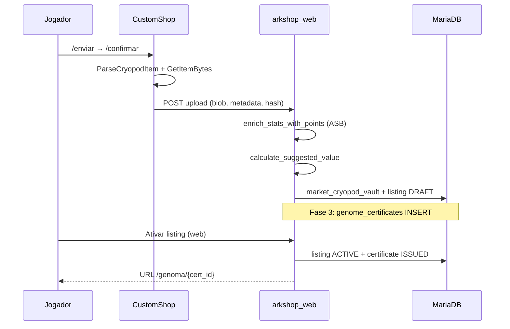

# Genoma ARKLAND — Marketplace genético verificado, certificados e reputação de criador

| Campo | Valor |
|-------|-------|
| **Status** | 📋 Especificação para **discussão** — sem implementação |
| **Versão do documento** | 1.0 |
| **Data** | 2026-07-05 |
| **Escopo** | Visão de produto, arquitetura sobre mercado existente, dados, APIs, UX, fases e perguntas abertas |
| **Fora de escopo** | Código, schema SQL definitivo, deploy |
| **Base técnica** | Mercado cryopod P2P já especificado/implementado parcialmente |

> **Ver também:** [`docs/PROJETO_MERCADO_CRYOPOD.md`](PROJETO_MERCADO_CRYOPOD.md), [`docs/market_admin_audit_improvements.md`](market_admin_audit_improvements.md), [`docs/PLANO_INVENTARIO_NUVEM.md`](PLANO_INVENTARIO_NUVEM.md), [`docs/ambarmeter_spec.md`](ambarmeter_spec.md), [`docs/DINO_LAB_SPEC.md`](DINO_LAB_SPEC.md) (entrega admin — **separado**), [`docs/REGULAMENTO_SERVIDOR.md`](REGULAMENTO_SERVIDOR.md).

---

## Sumário executivo

| Pergunta | Resposta |
|----------|----------|
| **O que é o Genoma ARKLAND?** | Camada de **produto e confiança** sobre o mercado P2P de cryopods: calculadora ASB visível, fichas de dino enriquecidas, certificado público verificável, perfil de criador e (fases futuras) oráculo de preço e listagem direta da Nuvem |
| **Qual o diferencial do cluster?** | Transparência genética estilo **ARK Smart Breeding (ASB)** integrada ao ecossistema ARKLAND — não apenas “anúncio + preço”, mas **prova parseada do cryopod** + histórico do criador |
| **O que já existe?** | `market_listings`, `ShopCryoReader`, `stat_points_asb.py`, vitrine, economia oficial, auditoria mercado |
| **O que falta?** | Certificados imutáveis, página pública `/genoma/{id}`, ranking criador, price history, UX “Genoma” distinta do browse genérico |
| **Moeda** | Exclusivamente **Âmbares** no marketplace — alinhado a P10 do mercado cryopod |

**Tagline proposta:** *“Cada cryopod conta uma história — verificada pelo Genoma ARKLAND.”*

---

## 1. Visão e posicionamento

### 1.1 Visão de produto

O **Genoma ARKLAND** transforma o Comércio de Dinos (mercado P2P cryopod) no **recurso principal de diferenciação** do cluster: um ecossistema onde criadores de linhagem são reconhecidos, compradores confiam nos stats exibidos, e cada animal vendável pode carregar um **certificado digital** derivado do blob cryopod real — não de capturas de tela ou promessas no Discord.

### 1.2 Pilares

| Pilar | Descrição |
|-------|-----------|
| **Verificação** | Metadados extraídos via `ParseCryopodItem` + hash SHA-256 do vault — o que está no anúncio = o que será entregue |
| **Transparência ASB** | Pontos de breeding (wild/mut/dom) calculados ou invertidos via `stat_points_asb.py` — mesma linguagem da comunidade breeding |
| **Reputação** | Perfil público do criador: vendas, tempo no cluster, flags, espécies forte |
| **Certificado** | URL pública `/genoma/{certificate_id}` compartilhável — snapshot imutável no momento do upload/ativação |
| **Economia oficial** | Paridade com valor sugerido, teto de preço e breakdown já definidos no mercado (§5.7–5.9 PROJETO_MERCADO) |

### 1.3 O Genoma **não é**

| Não é | É sim |
|-------|-------|
| Loja admin de kits | Mercado jogador ↔ jogador |
| Dino Lab (entrega staff) | Upload cryopod do inventário do vendedor |
| Pagamento em dinheiro real | Âmbares only |
| Marketplace de itens/consumíveis | Unidade atômica = 1 cryopod vanilla com dino |
| ASB desktop embutido | Port parcial Python + metadados C++ |

### 1.4 Relação com sistemas existentes

```
┌─────────────────────────────────────────────────────────────────┐
│                     GENOMA ARKLAND (camada UX + confiança)       │
│  Certificados │ Perfil criador │ ASB cards │ Oráculo │ Ranking   │
└───────────────────────────────┬─────────────────────────────────┘
                                │ estende
┌───────────────────────────────▼─────────────────────────────────┐
│              MERCADO CRYOPOD P2P (já especificado / parcial)       │
│  market_listings │ vault │ claims │ economy │ ShopCryoReader     │
└───────────────────────────────┬─────────────────────────────────┘
                                │
┌───────────────────────────────▼─────────────────────────────────┐
│  CustomShop.dll │ arkshop_web │ MariaDB │ Licença Nuvem          │
└─────────────────────────────────────────────────────────────────┘
```

---

## 2. Personas

### 2.1 Criador (vendedor / breeder)

- **Objetivo:** monetizar linhagens de qualidade e construir marca no cluster.
- **Necessidades:** ficha rica do dino (stats ASB, mutações, cores), certificado compartilhável, perfil “Loja de {nome}”, ranking justo.
- **Frustração:** compradores desconfiam de stats; Discord como única prova social.
- **Requisitos:** Licença Nuvem, `market_display_name`, imprint mínimo (regras mercado existentes).

### 2.2 Comprador

- **Objetivo:** adquirir dino com stats prometidos, sem golpe ou cryopod errada.
- **Necessidades:** comparar fichas, ver breakdown de preço, certificado antes/depois da compra, filtros ASB (pts HP, pts Melee, mutações).
- **Frustração:** cards do mercado sem linguagem breeding; incerteza pós-compra.

### 2.3 Visitante público (não logado)

- **Objetivo:** explorar vitrine, entender economia do cluster, compartilhar link de certificado.
- **Necessidades:** páginas públicas SEO-friendly (`/genoma/{id}`, `/criador/{slug}`), tabela de espécies, sem expor SteamID bruto desnecessariamente.
- **Conversão:** CTA login Steam para comprar.

### 2.4 Admin / moderador

- **Objetivo:** fiscalizar abusos, validar espécies, resolver disputas com contexto genético.
- **Necessidades:** timeline listing + certificado + vault hash, correlacionar certificado revogado vs listing ativo.
- **Referência:** [`market_admin_audit_improvements.md`](market_admin_audit_improvements.md).

---

## 3. Escopo por fases (MVP → completo)

### 3.1 Fase 1 — MVP Genoma (calculadora ASB + cards)

| Entregável | Detalhe |
|------------|---------|
| Cards enriquecidos no browse | Stats com **pontos ASB** além de valores float (via `enrich_stats_with_points`) |
| Breakdown visível | “Como calculamos” já previsto no mercado — estilo Genoma |
| Filtros por pontos | Min/max HP, Melee, Weight, etc. |
| Branding UI | Seção **Genoma** ou rename visual do Comércio |
| Tabela espécies pública | Nível 1, piso, multiplicadores (P14 mercado) |

**Fora do MVP:** certificado URL, ranking, oráculo.

### 3.2 Fase 2 — Oráculo de preço + ranking criador

| Entregável | Detalhe |
|------------|---------|
| Oráculo | Faixa sugerida + comparável (“Rex S+ similar vendeu por X”) |
| `price_history` | Snapshots de vendas por espécie/tier |
| Ranking criadores | Score composto: volume, rating, tempo, flags inversas |
| Perfil criador público | `/criador/{market_display_name}` ou slug |

### 3.3 Fase 3 — Certificado `/genoma/{id}`

| Entregável | Detalhe |
|------------|---------|
| Emissão certificado | No upload confirmado ou ativação listing |
| Página pública | Snapshot imutável: stats, cores, hash, criador, data |
| Badge “Verificado Genoma” | No card do mercado |
| Compartilhamento | Open Graph meta, QR opcional |
| Revogação admin | Certificado `REVOKED` se listing removido por fraude |

### 3.4 Fase 4 — Listar da Nuvem

| Entregável | Detalhe |
|------------|---------|
| Inventário cofre `/upload` | Selecionar cryopod armazenada → enviar ao mercado sem estar online in-game |
| Pré-requisito | Licença Nuvem + parser confiável + anti-duplicação |
| UX | Minha Área → Nuvem → “Anunciar no Genoma” |

**Dependência:** [`PLANO_INVENTARIO_NUVEM.md`](PLANO_INVENTARIO_NUVEM.md) maduro + extensão mercado.

### 3.5 Fora de escopo (todas as fases)

- Certificação de dinos **não** originados de cryopod vault do mercado (ex.: screenshot ASB externo)
- NFT / blockchain
- Pagamento fiat no Genoma
- Cross-server marketplace externo ao cluster ARKLAND
- Dino Lab / entregas admin como “certificado Genoma”

---

## 4. Arquitetura técnica

### 4.1 Componentes existentes (reutilizar)

| Componente | Caminho | Papel no Genoma |
|------------|---------|-----------------|
| Parser cryopod C++ | `ShopCryoReader.cpp` | Fonte primária metadados upload |
| Serialização vault | `GetItemBytes` / vault `MEDIUMBLOB` | Integridade bit-a-bit |
| Listings | `market_listings.py` | Core comercial |
| ASB Python | `stat_points_asb.py` | Inverso valor → pontos |
| Subset espécies | `data/asb_species_subset.json` | Cálculo offline |
| Economia | `market_economy.py` | Valor sugerido, teto |
| Auditoria | `market_audit.py` | Trace por `market_trace_id` |
| Registry espécies | `ark_species_registry.py` | Imagens, tier, labels |
| Nuvem | `ShopCloudInventory.cpp` | Fase 4 listagem offline |

### 4.2 Novos módulos propostos (web)

```
plugin/arkshop_web/
├── genome_service.py          # Certificados, emissão, revogação
├── genome_routes.py           # APIs públicas /genoma/*
├── creator_stats.py           # Agregação reputação (fase 2)
├── price_oracle.py            # Histórico + sugestão comparável (fase 2)
└── static/                    # Templates certificado, OG tags
```

**Sem novo plugin C++ na fase 1–3** — Genoma é camada web + dados sobre fluxo mercado existente.

### 4.3 Fluxo de dados — upload → certificado



### 4.4 Pipeline ASB (pontos de breeding)

Conforme [`PROJETO_MERCADO_CRYOPOD.md`](PROJETO_MERCADO_CRYOPOD.md) §4.5–4.6:

1. **C++** extrai `stats_max` (floats) da cryopod.
2. **Python** `enrich_stats_with_points(species_key, stats_max, imprint_pct)` preenche `points`, `levels_wild`, `levels_mut`, `levels_dom`.
3. UI Genoma exibe formato ASB familiar:

```
Vida:    80 pts  (12.480)
Dano:    59 pts  (254,0%)
Peso:    42 pts  (920)
```

4. Se inversão ASB falhar → exibir valor float + badge “pontos estimados” ou “N/A” (nunca inventar pontos).

---

## 5. Modelo de dados (novas tabelas)

### 5.1 `genome_certificates`

| Coluna | Tipo | Descrição |
|--------|------|-----------|
| `id` | PK (UUID ou slug curto) | Público em `/genoma/{id}` |
| `listing_id` | FK nullable | Vínculo listing ativo/histórico |
| `vault_id` | FK | Cryopod vault source |
| `seller_steam_id` | string | Criador no momento emissão |
| `blob_hash` | char(64) | SHA-256 imutável |
| `species_key` | string | |
| `snapshot_json` | TEXT/JSON | Stats, cores, mutações, imprint — **imutável** |
| `parser_version` | string | Ex.: `1.0.0` |
| `asb_species_version` | string | Versão subset ASB usada |
| `status` | enum | `ISSUED`, `REVOKED`, `SUPERSEDED` |
| `issued_at` | datetime | |
| `revoked_at` | datetime nullable | |
| `revoke_reason` | string nullable | Admin |
| `public_slug` | string unique nullable | URL amigável opcional |

**Regra:** snapshot gravado **uma vez** na emissão; alterações de preço no listing **não** alteram certificado.

### 5.2 `creator_stats` (materialized / agregado — fase 2)

| Coluna | Tipo | Descrição |
|--------|------|-----------|
| `steam_id` | PK | |
| `market_display_name` | string | Denormalizado |
| `total_sales_count` | int | |
| `total_sales_amber` | bigint | Volume Âmbar |
| `active_listings` | int | |
| `avg_rating` | float nullable | Se reviews fase 2+ |
| `flag_count_90d` | int | Moderação |
| `genome_score` | float | Ranking composto |
| `top_species_json` | JSON | Top 3 espécies vendidas |
| `first_sale_at` | datetime | |
| `updated_at` | datetime | Job batch |

### 5.3 `genome_price_history` (fase 2)

| Coluna | Tipo | Descrição |
|--------|------|-----------|
| `id` | PK | |
| `species_key` | string | Index |
| `tier` | string nullable | S+, S, A… |
| `sale_price` | int | Preço pago |
| `computed_base_value` | int | Valor sugerido na venda |
| `stats_snapshot` | JSON | HP/melee pts para comparáveis |
| `listing_id` | FK | |
| `sold_at` | datetime | |

Alimentado por trigger/hook em `MARKET_PURCHASE_COMPLETED`.

### 5.4 Extensões em tabelas existentes (opcional)

| Tabela | Coluna nova | Uso |
|--------|-------------|-----|
| `market_listings` | `genome_certificate_id` | FK rápida |
| `market_listings` | `genome_verified` | bool — parse OK + cert issued |
| `market_player_profiles` | `creator_slug` | URL pública |
| `market_player_profiles` | `creator_bio` | Texto curto vitrine |

---

## 6. APIs

### 6.1 Públicas (sem auth)

| Método | Rota | Fase | Descrição |
|--------|------|------|-----------|
| `GET` | `/api/genome/certificate/{id}` | 3 | JSON snapshot certificado |
| `GET` | `/genoma/{id}` | 3 | Página HTML certificado (SSR ou SPA) |
| `GET` | `/api/genome/species-table` | 1 | Tabela oficial espécies + multiplicadores |
| `GET` | `/api/genome/browse` | 1 | Extensão browse com pts ASB + filtros |
| `GET` | `/api/genome/creator/{slug}` | 2 | Perfil público criador |
| `GET` | `/api/genome/oracle?species=&tier=` | 2 | Faixa preço comparável |

### 6.2 Autenticadas (jogador)

| Método | Rota | Fase | Descrição |
|--------|------|------|-----------|
| `GET` | `/api/genome/my/certificates` | 3 | Certificados dos meus listings |
| `POST` | `/api/genome/listing/{id}/share` | 3 | Gerar link OG / copiar |
| `GET` | `/api/genome/my/creator-stats` | 2 | Próprio ranking (privado extras) |

### 6.3 Admin

| Método | Rota | Fase | Descrição |
|--------|------|------|-----------|
| `POST` | `/api/genome/admin/certificate/{id}/revoke` | 3 | Fraude / moderação |
| `POST` | `/api/genome/admin/recalculate-creator-stats` | 2 | Job manual |
| `GET` | `/api/genome/admin/certificates` | 3 | Lista + filtros |

### 6.4 Contrato exemplo — certificado público

```json
{
  "certificate_id": "g_7f3a9c2e",
  "status": "ISSUED",
  "issued_at": "2026-07-05T14:22:00Z",
  "species_display_name": "Rex",
  "species_key": "rex",
  "custom_name": "Alpha Rex",
  "seller_display_name": "BreederBR",
  "creator_slug": "breederbr",
  "imprint_pct": 100,
  "mutations_male": 20,
  "mutations_female": 38,
  "stats": {
    "health": { "value": 12480, "points": 80 },
    "melee": { "value": 254, "points": 59 }
  },
  "colors": [14, 14, 14, 0, 0, 0],
  "blob_hash": "a1b2c3…",
  "parser_version": "1.0.0",
  "listing_id": 1234,
  "verification_label": "Cryopod verificada — hash confere com vault ARKLAND",
  "disclaimer": "Certificado emitido no upload. Compra e entrega sujeitas ao regulamento do mercado."
}
```

---

## 7. UI/UX — wireframes textuais

### 7.1 Vitrine Genoma (browse — fase 1)

```
┌─────────────────────────────────────────────────────────────────────────┐
│  🧬 GENOMA ARKLAND — Comércio verificado de linhagens                    │
│  [Espécie ▼] [Sexo ▼] [HP pts ≥] [Melee pts ≥] [Preço Âmbar] [Buscar…]  │
├─────────────────────────────────────────────────────────────────────────┤
│ ┌─────────────────────┐  ┌─────────────────────┐  ┌──────────────────┐ │
│ │ [img Rex]  S+       │  │ [img Wyvern]  S     │  │ …                │ │
│ │ Alpha Rex      ♀    │  │ Storm F      ♂      │  │                  │ │
│ │ 80 HP · 59 DMG      │  │ 70 HP · 45 DMG      │  │                  │ │
│ │ Imprint 100%        │  │ Imprint 100%        │  │                  │ │
│ │ Mut 20 / 38         │  │ Mut 12 / 15         │  │                  │ │
│ │ [Verificado 🧬]     │  │                     │  │                  │ │
│ │ 245.000 Âmbar       │  │ 180.000 Âmbar       │  │                  │ │
│ │ Loja de BreederBR   │  │ Loja de ArkMaster   │  │                  │ │
│ │ [Ver ficha] [Comprar│  │ …                   │  │                  │ │
│ └─────────────────────┘  └─────────────────────┘  └──────────────────┘ │
│  [▼ Tabela oficial de espécies — valor raiz nível 1]                    │
└─────────────────────────────────────────────────────────────────────────┘
```

### 7.2 Ficha do dino (detalhe listing)

```
┌─────────────────────────────────────────────────────────────────────────┐
│  ← Voltar    Rex — "Alpha Rex"                    [Compartilhar cert ↗] │
├──────────────────────────────┬──────────────────────────────────────────┤
│  [Arte espécie / tier S+]    │  Vendedor: BreederBR  [Ver perfil criador]│
│                              │  Preço: 245.000 Âmbar (≥ sugerido ✓)    │
│  ♀ Fêmea · Nível 371         │  Certificado: g_7f3a9c2e [Abrir ↗]       │
│  Imprint 100% · Mut 20/38    │                                          │
├──────────────────────────────┴──────────────────────────────────────────┤
│  STATS (formato ASB)                                                     │
│  ┌────────┬─────────┬──────────┬─────────┐                              │
│  │ Stat   │ Valor   │ Pontos   │ Tier    │                              │
│  ├────────┼─────────┼──────────┼─────────┤                              │
│  │ Vida   │ 12.480  │ 80 pts   │ ████    │                              │
│  │ Dano   │ 254%    │ 59 pts   │ ████    │                              │
│  │ Peso   │ 920     │ 42 pts   │ ███     │                              │
│  └────────┴─────────┴──────────┴─────────┘                              │
│  [▼ Como calculamos o valor sugerido]                                    │
│  [▼ Oráculo: Rex S+ similares venderam por 220k–280k] (fase 2)          │
│                              [ Comprar — 245.000 Âmbar ]                 │
└─────────────────────────────────────────────────────────────────────────┘
```

### 7.3 Perfil criador (fase 2)

```
┌─────────────────────────────────────────────────────────────────────────┐
│  Criador: BreederBR                          Genoma Score: 847 / 1000   │
│  Membro desde 2025 · 142 vendas · 12,4M Âmbar movimentado               │
├─────────────────────────────────────────────────────────────────────────┤
│  Especialidades: Rex (S+), Giga (S), Wyvern (A)                          │
│  Listings ativos (8)  │  Histórico vendas  │  Certificados emitidos     │
├─────────────────────────────────────────────────────────────────────────┤
│  [Grid de listings ACTIVE — mesmo card vitrine]                          │
└─────────────────────────────────────────────────────────────────────────┘
```

### 7.4 Página certificado `/genoma/{id}` (fase 3)

```
┌─────────────────────────────────────────────────────────────────────────┐
│  🧬 CERTIFICADO GENOMA ARKLAND                                            │
│  ID: g_7f3a9c2e · Emitido em 05/07/2026 · Status: VÁLIDO                │
├─────────────────────────────────────────────────────────────────────────┤
│  Espécie: Tyrannosaurus Rex · "Alpha Rex"                                │
│  Criador: BreederBR · Imprint 100% · ♀                                    │
│  Hash cryopod: a1b2c3… [copiar]                                          │
│  ── Stats verificados no upload ──                                       │
│  (tabela ASB igual ficha)                                                │
│  ── Cores ──                                                             │
│  Regiões: 14, 14, 14, 0, 0, 0                                            │
├─────────────────────────────────────────────────────────────────────────┤
│  Este certificado attesta metadados parseados do cryopod oficial         │
│  ARKLAND no momento do envio. Não garante comportamento in-game pós-     │
│  breed. Compras via mercado sujeitas ao regulamento.                     │
│  [Ver anúncio no mercado] (se ACTIVE)                                    │
└─────────────────────────────────────────────────────────────────────────┘
```

---

## 8. Regras de negócio

### 8.1 O que significa “Verificado Genoma”

| Critério | Obrigatório para badge |
|----------|------------------------|
| Cryopod vanilla oficial | ✅ |
| `ParseCryopodItem` OK | ✅ |
| Imprint ≥ mínimo configurável (ex. 100%) | ✅ (regra mercado P4) |
| `blob_hash` único no vault ativo | ✅ |
| Espécie `ACTIVE` em `economy_species` | ✅ para mercado público |
| Certificado `ISSUED` não revogado | ✅ (fase 3) |
| Pontos ASB calculados | ⚠️ Desejável — badge secundário “ASB OK” se inversão OK |

**Não verificado:** dinos prometidos só via Discord; Soul Trap; listing `PENDING_CLASSIFICATION` (privado).

### 8.2 Anti-fraude

| Ameaça | Mitigação |
|--------|-----------|
| Duplicar cryo in-game + listing | Anti-duplicação §3.1.1 mercado (`/confirmar` remove item) |
| Alterar stats após upload | Vault imutável; entrega `CreateFromBytes` |
| Certificado de listing alheio | `seller_steam_id` + vault ownership |
| Revenda com certificado antigo | Certificado liga `listing_id`; novo upload = novo cert |
| Preço abaixo do piso | Bloqueio existente P7 |
| Conta smurf criador | Ranking exige histórico; flags pesam no score |
| Screenshot ASB falso | Genoma **só** confia parser + hash — não upload imagem |

### 8.3 Paridade com mercado existente

Todas as regras de [`PROJETO_MERCADO_CRYOPOD.md`](PROJETO_MERCADO_CRYOPOD.md) **permanecem**:

- Licença Nuvem para enviar
- Zero taxas transação
- Valor mínimo = sugerido
- Resgate manual in-game
- Auditoria `market_trace_id`

Genoma **adiciona** camada UX/confiança — **não substitui** economia nem claims.

### 8.4 Revogação de certificado

| Motivo | Ação |
|--------|------|
| Listing removido admin (fraude) | `REVOKED` + motivo público genérico |
| Venda concluída | Certificado permanece histórico (`SUPERSEDED` opcional) |
| Re-upload mesmo dino | Novo cert; anterior `SUPERSEDED` |

---

## 9. Marketing e métricas de sucesso

### 9.1 Taglines e mensagens

| Contexto | Texto |
|----------|-------|
| Hero home | *Genoma ARKLAND — linhagens verificadas, criadores reconhecidos.* |
| Badge card | `Verificado 🧬` |
| Certificado | *Emitido pelo parser oficial ARKLAND — hash cryopod confere.* |
| Regulamento | Link para [`REGULAMENTO_SERVIDOR.md`](REGULAMENTO_SERVIDOR.md) seção mercado |

### 9.2 KPIs (90 dias pós MVP fase 1)

| Métrica | Meta inicial | Fonte |
|---------|--------------|-------|
| Listings ACTIVE com stats ASB exibidos | 100% | UI |
| Uploads com parse OK | >95% | `market_audit_events` |
| Vendas mercado / mês | +20% vs baseline | `market_transactions` |
| Certificados emitidos (fase 3) | 1 por listing ativo | `genome_certificates` |
| Visitantes `/genoma/*` únicos | tracking | Analytics |
| Tempo médio disputa mercado | −30% | Tickets categoria mercado |
| NPS criadores (opcional survey) | >7 | Discord/form |

### 9.3 Integração Âmbarômetro

Vendas Genoma alimentam canal **mercado** no [`ambarmeter_spec.md`](ambarmeter_spec.md) — gross turnover 2× `price_paid` (comprador + vendedor). Certificados **não** movimentam Âmbares por si.

---

## 10. Integração regulamento, licenças e tickets

### 10.1 Regulamento

- Compras sujeitas a regras P2P do cluster (sem dinheiro real, sem golpe, moderação).
- Certificado **não** é garantia legal — é prova técnica de metadados no upload.
- Atualizar [`REGULAMENTO_SERVIDOR.md`](REGULAMENTO_SERVIDOR.md) com seção **Genoma** após aprovação.

### 10.2 Licenças

| Licença | Relação Genoma |
|---------|----------------|
| **Licença Nuvem** (`keyvault`) | Obrigatória para **enviar** ao mercado (existente) |
| Fase 4 listar da Nuvem | Mesma licença + cryopod no snapshot cloud |

### 10.3 Tickets suporte

- Categoria `mercado` / `genoma`: campo `listing_id`, `certificate_id`, `market_trace_id`.
- Widget ticket: embed certificado + hash + stats (ver [`market_admin_audit_improvements.md`](market_admin_audit_improvements.md) §3.4).

---

## 11. Riscos e mitigações

| Risco | Impacto | Mitigação |
|-------|---------|-----------|
| Inversão ASB falha para espécie/mod | Pontos errados na UI | Badge “ASB indisponível”; só floats; não bloquear venda |
| Patch ASE altera CustomData | Parser quebra | `parser_version`; testes cryo referência |
| Expectativa “certificado = perfeito breed” | Reclamações | Disclaimer claro; regulamento |
| Ranking manipulado (wash trading) | Reputação falsa | Detectar auto-compra; peso flags admin |
| SEO certificados com dados sensíveis | Privacidade | Não expor SteamID; só display name |
| Oráculo mal calibrado | Preços distorcidos | Mostrar faixa + N amostras; não auto-fix preço |
| Escopo creep vs mercado base | Atraso | Fases estritas; MVP = cards ASB only |
| Nuvem fase 4 complexidade | Duplicação cryo | Mesmas garantias anti-dup do upload in-game |

---

## 12. Fases de implementação e estimativas

### Fase G1 — ASB cards + browse Genoma (5–7 dias)

- [ ] Garantir `enrich_stats_with_points` em todo upload/listing público
- [ ] UI cards com pontos ASB + mutações formatadas
- [ ] Filtros min/max pontos por stat
- [ ] Renome/branding seção Comércio → Genoma (ou sub-brand)
- [ ] Tabela espécies pública (dados `economy_species`)
- [ ] Testes `test_stat_points_asb.py` expandidos

### Fase G2 — Oráculo + ranking criador (5–8 dias)

- [ ] Migration `genome_price_history`
- [ ] Hook em compra completada
- [ ] `creator_stats` job batch
- [ ] API `/api/genome/creator/{slug}`
- [ ] UI perfil criador + widget oráculo na ficha

### Fase G3 — Certificados (6–10 dias)

- [ ] Migration `genome_certificates`
- [ ] Emissão no activate listing
- [ ] Página `/genoma/{id}` + API pública
- [ ] Badge Verificado nos cards
- [ ] Revogação admin + auditoria
- [ ] Open Graph / share

### Fase G4 — Listar da Nuvem (8–12 dias)

- [ ] Inventário cloud: listar cryopods parseáveis
- [ ] Fluxo web “Anunciar da Nuvem”
- [ ] Anti-duplicação cloud ↔ mercado
- [ ] Entrega/resgate inalterada

| Fase | Dias | Acumulado |
|------|------|-----------|
| G1 | 5–7 | 7 |
| G2 | 5–8 | 15 |
| G3 | 6–10 | 25 |
| G4 | 8–12 | **~37 dias** |

**Dependência crítica:** mercado cryopod base (upload, vault, compra, claim) **estável** antes de G3.

---

## 13. Perguntas abertas para discussão (Ciano)

| # | Pergunta | Opções / notas |
|---|----------|----------------|
| Q1 | Nome público: **Genoma ARKLAND** vs **Comércio Genético** vs manter “Mercado”? | Branding |
| Q2 | Certificado emitido no **upload** ou só na **ativação** pública? | Upload = mais cedo; ativação = menos lixo |
| Q3 | Certificado permanece após venda para histórico público? | Proposta: sim, status `SOLD` |
| Q4 | Reviews/rating de compradores (fase 2+)? | Complexidade moderação |
| Q5 | Exibir **cores** nos cards (parser já tem)? | UX breeding |
| Q6 | Ranking: fórmula `genome_score` — pesos volume vs flags vs idade? | Gamificação |
| Q7 | Oráculo visível a **não logados**? | Marketing vs vantagem logado |
| Q8 | URL criador: `market_display_name` ou slug editável? | Colisões nomes |
| Q9 | Integrar certificado em **Discord embed** (bot futuro)? | Fora v1 |
| Q10 | Espécies sem subset ASB: bloquear badge ASB ou só floats? | Proposta: floats + “ASB pending” |
| Q11 | Genoma como **aba separada** na nav ou rename total do Comércio? | IA navegação |
| Q12 | Prioridade G1 vs outras frentes (Dino Lab, promoções, Âmbarômetro)? | Roadmap cluster |
| Q13 | Regulamento: certificado tem peso em disputas (“prova primária”)? | Jurídico interno |
| Q14 | Criadores VIP / parceiros com badge extra? | Monetização simbólica? |
| Q15 | Fase 4 Nuvem: priorizar ou adiar até mercado in-game maduro? | Risco dup |

---

## 14. Critérios de aceite (fase G1 MVP)

1. Todo listing ACTIVE exibe stats com pontos ASB quando inversão disponível.
2. Filtros por pontos funcionam no browse.
3. Breakdown “Como calculamos” visível na ficha.
4. Nenhuma regressão em upload/compra/claim existentes.
5. Documentação regulamento atualizada (rascunho) após aprovação produto.

---

## 15. Referências no repositório

| Arquivo | Relevância |
|---------|------------|
| `docs/PROJETO_MERCADO_CRYOPOD.md` | Regras mercado base |
| `plugin/arkshop_web/market_listings.py` | Listings, `listing_to_public`, economia |
| `plugin/arkshop_web/stat_points_asb.py` | Cálculo/inversão ASB |
| `plugin/arkshop_web/data/asb_species_subset.json` | Dados espécies |
| `plugin/CustomShop/src/ShopCryoReader.cpp` | Parser cryopod |
| `plugin/CustomShop/src/ShopCryoDino.cpp` | Layout CustomData referência |
| `docs/market_admin_audit_improvements.md` | Admin ops |
| `docs/PLANO_INVENTARIO_NUVEM.md` | Fase 4 nuvem |
| `docs/ambarmeter_spec.md` | Métricas economia |
| `docs/DINO_LAB_SPEC.md` | Entrega admin — separado |
| `tools/extract_asb_species.py` | Sync subset ASB |

---

*Documento para discussão — Genoma ARKLAND assume mercado cryopod como fundação. Responder com aprovação por fase (G1–G4), ajustes de branding ou respostas às perguntas §13.*
