# Nível Máximo do Jogador — Especificação e análise de confusão (ARKLAND)

| Campo | Valor |
|-------|-------|
| **Status** | ✅ **Implementado** (v1.10.9+) |
| **Versão do documento** | 1.0 |
| **Data** | 2026-07-07 |
| **Escopo** | Mapeamento de fontes de verdade, matemática ARK, bugs de UX, proposta de unificação |
| **Fora de escopo** | Código, deploy, migração de servidores em produção |
| **Relacionado** | [`ARK_SERVER_CONFIG_REFERENCE.md`](../ARK_SERVER_CONFIG_REFERENCE.md), [`ARKLAND_TEK.md`](../ARKLAND_TEK.md) |

> **Resumo (atualizado 2026-07-13 / v1.10.34):** o ARK espera progresso custom do jogador em **`Game.ini`** sob `[/Script/ShooterGame.ShooterGameMode]`: `LevelExperienceRampOverrides`, `OverrideMaxExperiencePointsPlayer` e opcionalmente `OverridePlayerLevelEngramPoints`. Gravar só `OverrideMaxExperiencePointsPlayer` em **GameUserSettings.ini** **não** estende o teto além da rampa default. O ARKLAND escreve o cap no **Game.ini** quando **progressões estão ON** (curva soft 70×1.05^i + 400 EP/nível). O checkbox é **livre**: base **>105** com progressões **OFF** mostra aviso na UI — o jogo reverte para progressão vanilla. O painel TEK e a Web Store podem divergir se a rampa custom no disco não for regenerada após mudar o nível base.

---

## Sumário executivo

| Pergunta | Resposta |
|----------|----------|
| **Por que a Web mostra 250?** | `compute_max_player_level()` usa `resolve_max_player_level()`, que prioriza `override_max_xp_player` convertido pela **curva vanilla** — refletindo o painel «Nível máximo do jogador», não a rampa do `Game.ini`. |
| **Por que o jogo para em ~215?** | O teto **efetivo** é imposto pela **rampa customizada** (`LevelExperienceRampOverrides`) e/ou pelo cruzamento dessa rampa com `OverrideMaxExperiencePointsPlayer`. XP calculado na curva vanilla para nível 250 **não equivale** ao mesmo nível numa rampa geométrica customizada. |
| **Por que o gerador mostra 100?** | Valor **hardcoded** no UI (`asm_server_panel.py`); não há parser que leia `player_level_stats_raw` nem vínculo com `player_base_level`. |
| **Índice 229 = nível 230?** | Sim, convenção ARK: `ExperiencePointsForLevel[N]` usa índice **0-based**; entrada `[229]` = slot do **nível 230** na rampa de XP. |
| **Causa-raiz** | **Fontes de verdade desconectadas** + **duas semânticas de «nível máximo»** (teto teórico com ascensões vs. comprimento/curva da rampa INI) + **conversão XP vanilla vs. rampa custom**. |

---

## 1. Estado atual — mapa de fontes de verdade

### 1.1 Inventário de caminhos no código

| # | Superfície UI | Seção TEK / ASM | Campo(s) internos | Destino no INI | Usado por Web Store? | Usado pelo jogo? |
|---|---------------|-----------------|-------------------|----------------|----------------------|------------------|
| A | **Nível máximo do jogador** | Configurações do Jogador | `player_base_level`, `override_max_xp_player`, `player_level_progressions_enabled` | **Game.ini** → `OverrideMaxExperiencePointsPlayer` (+ rampa/engrams se progressões ON) | ✅ Sim (`resolve_max_player_level`) | ✅ Só com progressões ON |
| B | **Override de Nível do Jogador** | Progressões de Nível | `player_level_stats_raw` | `Game.ini` → `LevelExperienceRampOverrides` (+ engrams no raw) | ❌ Não | ✅ Sim (define rampa de XP) |
| C | **Multiplicador de engramas** | Configurações do Jogador | `player_engram_points_multiplier` | `Game.ini` → `OverridePlayerLevelEngramPoints` (gerado, N linhas) | ❌ Não (só nível) | ✅ Sim |
| D | **Fallback dificuldade** | Configurações do Dino / Dificuldade | `enable_difficulty_override`, `override_official_difficulty` | `GameUserSettings.ini` | ✅ Se A vazio | ❌ Não para jogador |
| E | **ASM clássico** | Aba Jogo | `player_level_cap`, `player_base_level`, `player_ascension_state` | Game.ini (cap+rampa) + GUS demais | ✅ (via `game_settings`) | ✅ |

### 1.2 Persistência

| Dado | Onde é salvo | Relido do INI em `read_ini()`? |
|------|--------------|--------------------------------|
| `player_base_level`, `player_ascension_state` | `%APPDATA%\ARKLAND-ServerManager\asm_servers.json` | ❌ Não |
| `override_max_xp_player` | `asm_servers.json` **e** espelhado em **Game.ini** (não GUS) | ✅ Sim (Game.ini; GUS legado só na leitura) |
| `player_level_stats_raw` | `asm_servers.json` apenas | ❌ Não (textbox carrega do JSON, não re-parseia `Game.ini`) |

**Regra UI (2026-07-13 / v1.10.34):** checkbox de progressões é **livre**. Base **>105** sem progressões: aviso claro — sem `LevelExperienceRampOverrides` no Game.ini o ARK **não** honra o teto elevado (reverte ~vanilla). OFF limpa rampa + OverrideMaxXP + engrams do Game.ini (e remove legado no GUS).

### 1.3 Fluxo de escrita (`write_ini`)

```
asm_servers.json
       │
       ├─► INI_MAP ──────────────────► Game.ini [/Script/ShooterGame.ShooterGameMode]
       │     override_max_xp_player → OverrideMaxExperiencePointsPlayer
       │     (legado GUS ServerSettings é removido no save)
       │
       ├─► patch_game_ini_repeated_lines
       │         ├─► LevelExperienceRampOverrides (rampa player)
       │         └─► OverridePlayerLevelEngramPoints × N
       │
       └─► (progressões OFF = vanilla stock, sem overrides; base>105 OFF = aviso UI)
```

### 1.4 Fluxo de exibição Web Store

```
collect_server_snapshot()
    └─► compute_max_player_level(cfg)
            └─► resolve_max_player_level(cfg)   [player_level_ascension.py]
                    1. override_max_xp_player > 0 → xp_to_level()  [curva vanilla]
                    2. game_settings.override_max_experience_points_player
                    3. game_settings.player_level_cap
                    4. player_base_level + ascensões (JSON)
                    5. fallback dificuldade: 105 + round(diff × 15)
```

**`player_level_stats_raw` nunca entra nesta cadeia.**

---

## 2. Diagrama de fluxo (estado atual)

```mermaid
flowchart TB
    subgraph UI["Painéis TEK / ASM"]
        P1["Nível máximo do jogador<br/>base + ascensões + extras"]
        P2["Override de Nível — Gerador rápido<br/>defaults: max=100"]
        P3["Multiplicador engramas"]
    end

    subgraph JSON["asm_servers.json"]
        F1["player_base_level<br/>player_ascension_state"]
        F2["override_max_xp_player"]
        F3["player_level_stats_raw"]
        F4["player_engram_points_multiplier"]
    end

    subgraph GUS["GameUserSettings.ini"]
        G1["OverrideMaxExperiencePointsPlayer"]
    end

    subgraph GAME["Game.ini"]
        G2["LevelExperienceRampOverrides[0..N]"]
        G3["OverridePlayerLevelEngramPoints × M"]
    end

    subgraph OUT["Saídas"]
        WEB["Web Store pill<br/>Nív. máx. 250"]
        INGAME["Jogo in-game<br/>cap ~215–216"]
    end

    P1 --> F1 & F2
    P2 --> F3
    P3 --> F4

    F2 --> G1
    F3 --> G2
    F4 --> G3
    F2 --> G3

    F2 --> WEB
    F1 --> WEB
    G1 & G2 --> INGAME

    P1 -.->|"sem sync"| P2
    F3 -.->|"não lido"| WEB
    G2 -.->|"não lido"| WEB

    style P1 fill:#1a3a2a
    style P2 fill:#3a1a1a
    style WEB fill:#1a2a4a
    style INGAME fill:#4a2a1a
```



---

## 3. Matemática de níveis ARK (relevante ao bug)

### 3.1 Nível base vs. bônus de ascensão (implante)

No modelo ARKLAND (`player_level_ascension.py`):

| Componente | Cálculo |
|------------|---------|
| Nível base | `player_base_level` (default 105 vanilla) |
| Ascensões γ/β/α | +5 / +10 / +15 **por mapa** (cumulativo por boss) |
| Extras | Notas +10, Runas Fjordur +10, Chibi +5, Aquatica +5, Pygocentrus +15 |
| **Total teórico UI** | `calc_total_player_level(base, bosses, extras)` |

**No jogo**, o nível exibido no personagem combina:
- níveis ganhos por **XP** (limitados pela rampa + cap de XP), e
- níveis de **ascensão** registrados no implante (bônus de boss / descobertas).

Um personagem **nível 216** com bônus de implante listados é consistente com: **~215 níveis de XP** + **+1 de bônus visível** (ou arredondamento / ascensão parcial), **não** com teto 250.

### 3.2 Índice da rampa vs. nível exibido

| INI | Significado |
|-----|-------------|
| `ExperiencePointsForLevel[0]` | XP para o **1º** level-up (slot nível 1) |
| `ExperiencePointsForLevel[N]` | Slot do nível **N+1** |
| `ExperiencePointsForLevel[229]` | Slot do nível **230** |
| **Comprimento da rampa** | `max(índices) + 1` entradas → teto de níveis **por XP** |

O painel TEK «Nível máximo» fala em **250 total com bônus**; a rampa com índice até **229** só garante **230 slots de XP** — já uma divergência de **20 níveis** antes de considerar curvas diferentes.

### 3.3 Curva vanilla vs. rampa customizada

Função usada pelo painel unificado (`ark_ini._level_to_xp`):

```
XP(nível) = Σ round(0.667 × i^2.04)  para i = 1 .. nível-1
```

O gerador rápido de «Progressões de Nível» usa outra fórmula:

```
XP[i] = xp_base × mult^i     (geométrica; defaults ARKLAND: base=70, mult=1.05)
```

> **Equilíbrio (1.10.32+):** o default geométrico passou de **1.15 → 1.05** (presets Hard/Extreme também suavizados, mult ≤1.08). Rampas longas com 1.15+ tornam o pós-100 impraticável. Servidores já gravados **não** são migrados automaticamente — o admin deve **regenerar a rampa** (Progressões → Gerar e aplicar, ou reativar progressões no painel) e salvar o perfil / reiniciar o mapa.
>
> **Correção de destino INI (Unreleased / pós-1.10.32):** `OverrideMaxExperiencePointsPlayer` sai do GUS e vai para **Game.ini**. Caminho «vanilla só GUS para base 160» foi **removido** — não funciona no ARK. Base >105 força Game.ini completo (rampa + cap + 400 EP).

| Mecanismo | Curva | Efeito |
|-----------|-------|--------|
| Painel ascensões → `override_max_xp_player` | **Vanilla** | GUS recebe XP equivalente ao nível 250 vanilla |
| Gerador → `LevelExperienceRampOverrides` | **Custom** | Cada slot tem XP próprio; cap real depende da soma acumulada |
| `xp_to_level()` na Web | **Vanilla** | Converte XP do GUS de volta para «nível» — **ignora rampa custom** |

**Hipótese principal da discrepância 250 vs 215:** `OverrideMaxExperiencePointsPlayer` foi gravado com XP da curva vanilla para nível 250, mas o servidor usa rampa geométrica custom (230 entradas). O motor ARK compara XP acumulado do jogador contra **ambos**; o jogador atinge o teto de XP da rampa/cap **antes** de chegar ao nível 250 — na prática ~**215**.

### 3.4 Bug estrutural na escrita da rampa (TEK)

`inject_raw_ini_text()` armazena chaves em um `dict` Python — chaves repetidas como `LevelExperienceRampOverrides` **sobrescrevem** a anterior. O `configparser` na leitura/escrita do `Game.ini` tem a mesma limitação.

`LevelExperienceRampOverrides` **não** está em `REPEATED_KEY_PREFIXES` (`asm_game_list_ini.py`), portanto **não** passa por `patch_game_ini_repeated_lines()` (ao contrário de `OverridePlayerLevelEngramPoints`).

**Implicação:** o caminho TEK atual pode **não persistir corretamente** tabelas completas de rampa via `write_ini`, embora entradas antigas no `Game.ini` (escritas por ASM legado ou edição manual) continuem no disco — reforçando o descompasso entre UI, JSON e INI real.

---

## 4. Análise da discrepância reportada

Cenário do admin (valores do relato):

| Fonte | Valor | Interpretação |
|-------|-------|---------------|
| TEK «Nível máximo do jogador» | base **120**, total **250** | Modelo ascensão: 120 + bônus marcados |
| Web Store pill | **Nív. máx. 250** | `resolve_max_player_level` → `override_max_xp_player` → `xp_to_level` ≈ 250 |
| Personagem in-game | **216** | Cap prático de XP + bônus de implante |
| Relato prático | teto ~**215** | Consistente com rampa/cap, não com 250 |
| `Game.ini` | `ExperiencePointsForLevel[229]` | Rampa de **230** níveis XP (índice 0-based) |
| Gerador rápido | mostra **100** | Default UI; **não** reflete rampa nem painel ascensões |

### 4.1 Por que o gerador não «registra» o nível máx.

| Problema | Detalhe no código |
|----------|-------------------|
| Default fixo | `_fields_p = [("Nível máx.", "100"), ...]` em `_build_level_progressions` |
| Sem parser inverso | Não existe função que conte entradas `ExperiencePointsForLevel[N]` no raw |
| Sem campo dedicado | `AsmServerConfig` não tem `player_ramp_max_level` |
| Raw não relido do disco | `read_ini()` não popula `player_level_stats_raw` a partir do `Game.ini` |
| Gerador só preenche textbox | `_apply_player_gen()` atualiza o widget `_raw_player_level_stats_raw`; não sincroniza com painel A |

### 4.2 Por que Web ≠ jogo

| Web (250) | Jogo (~215) |
|-----------|-------------|
| Lê config **intencional** (JSON + GUS XP vanilla) | Aplica **rampa INI** + cap XP real |
| Inclui todos os bônus de ascensão no total | Ascensões no implante são mecânica separada |
| Ignora comprimento da rampa | Teto = f(rampa, OverrideMaxExperiencePointsPlayer) |

---

## 5. Projeto de correção — área única unificada

### 5.1 Princípio

> **Uma intenção de admin → um objeto de configuração → N saídas INI derivadas automaticamente.**

O admin define **o que quer** (nível base, bônus habilitados no servidor, curva de XP opcional). O sistema **deriva** GUS + Game.ini e **exibe o mesmo número** na Web e na UI.

### 5.2 Responsabilidades do painel único (proposta UX)

| Bloco | Responsabilidade | Não deve fazer |
|-------|------------------|----------------|
| **Resumo** | Mostrar: nível base XP, bônus ascensão, **teto efetivo in-game**, XP total, entradas na rampa | — |
| **Nível base (XP)** | Quantos level-ups por XP existem **sem** contar implante | Misturar com rampa manual solta |
| **Ascensões / extras** | Checkboxes γ/β/α + extras (como hoje) | Calcular rampa geométrica manualmente |
| **Curva de XP** | Preset: Vanilla / Oficial 70 / Custom 100 / Importar ASM | Editar 230 linhas na mão |
| **Engramas** | Multiplicador → pontos/nível (como hoje) | Duplicar `OverridePlayerLevelEngramPoints` no raw |
| **Avançado** | Textarea somente leitura ou «exportar/importar» rampa | Ser a via **primária** de edição |

**Seções a deprecar como primárias:**
- «Override de Nível do Jogador» gerador solto → absorvido pelo painel unificado.
- Campo oculto `override_max_xp_player` → derivado, não editável diretamente.

### 5.3 Schema de dados unificado (proposta)

```json
{
  "player_level": {
    "base_level": 120,
    "ascension": {
      "bosses": { "island": 3, "scorched": 3, "…": 0 },
      "extras": {
        "explorer_notes": true,
        "fjordur_runes": true,
        "chibi": true,
        "aquatica": false,
        "pygocentrus": true
      }
    },
    "xp_curve": {
      "mode": "vanilla",
      "preset": null,
      "custom": { "xp_base": 70, "mult": 1.05, "formula": "base * (mult ** i)" }
    },
    "engram_multiplier": 5.0,
    "derived": {
      "total_display_level": 250,
      "ramp_entries": 120,
      "override_max_xp_player": 0,
      "effective_ingame_cap": 0
    }
  }
}
```

**Campos derivados** recalculados em save — nunca editados à mão.

Mapeamento para estruturas atuais (migração):

| Novo | Atual |
|------|-------|
| `player_level.base_level` | `player_base_level` |
| `player_level.ascension` | `player_ascension_state` (JSON) |
| `player_level.xp_curve` | **novo** (substitui uso primário de `player_level_stats_raw`) |
| `player_level.engram_multiplier` | `player_engram_points_multiplier` |
| `derived.override_max_xp_player` | `override_max_xp_player` |
| `player_level_stats_raw` | gerado na exportação / modo avançado |

### 5.4 Regras de derivação INI (alvo)

| Saída | Regra |
|-------|-------|
| `OverrideMaxExperiencePointsPlayer` | XP acumulado na **mesma curva** usada pela rampa, no **nível base** (não no total com implante, se o servidor ARK separa) — **validar com teste in-game** |
| `LevelExperienceRampOverrides` | `base_level` entradas; mesma fórmula do bloco `xp_curve`; escrita via `patch_game_ini_repeated_lines` (tratar como chave repetida) |
| `OverridePlayerLevelEngramPoints` | `base_level` linhas (ou `total_display_level` — **decisão admin**, ver §7) |
| Web `max_player_level` | `derived.effective_ingame_cap` (não o total teórico com todos os bônus, a menos que o admin opte por exibir «teto teórico») |

---

## 6. Fases de implementação

### Fase 0 — Documentação e spike (atual)

- [x] Mapear fontes de verdade
- [ ] Spike in-game: servidor de teste com base 120, rampa 230, Override vanilla 250 — medir nível real de cap
- [ ] Confirmar com wiki/API ARK se `OverrideMaxExperiencePointsPlayer` conta ascensões no teto

### Fase 1 — MVP (correção mínima)

1. **Parser de rampa:** contar `ExperiencePointsForLevel[N]` em `Game.ini` → exibir no gerador e no resumo.
2. **Sync leitura:** `read_ini()` popular `player_level_stats_raw` ou campo `ramp_entry_count` a partir do disco.
3. **Web Store:** `resolve_max_player_level` considerar `min(total_teórico, ramp_entry_count, xp_cap_em_rampa)`.
4. **Aviso na UI** quando painel A e rampa B divergirem (>5 níveis).

### Fase 2 — Unificação UX

1. Painel único em «Configurações do Jogador»; «Progressões de Nível» vira avançado.
2. Gerador rápido pré-preenche a partir do painel unificado.
3. Escrita de rampa via `patch_game_ini_repeated_lines` (chave repetida).

### Fase 3 — Completo

1. Schema JSON unificado em `asm_servers.json` com migração automática.
2. Preview «o que o jogador verá» vs «teto teórico com implante».
3. Validação pré-restart: diff INI, contagem de entradas, alerta de restart obrigatório.
4. Paridade ASM clássico ↔ TEK.

---

## 7. Riscos

| Risco | Impacto | Mitigação |
|-------|---------|-----------|
| Reescrita da rampa no `write_ini` | Perda de curva custom existente | Backup automático do `Game.ini`; import antes de sobrescrever |
| `configparser` colapsar chaves repetidas | Rampa truncada a 1 entrada | Escrita somente via patch de linhas repetidas (padrão já usado para engrams) |
| Restart obrigatório | Jogadores não veem mudança até reinício | Banner na UI + MOTD configurável |
| Exibir 250 vs cap 215 na loja | Expectativa errada do jogador | Pill separado: «Nív. base XP» vs «Teto com ascensões» |
| Ascensões variam por jogador | Admin marca todos os bônus; jogador pode não ter | Deixar claro que bônus de implante são **por personagem** |
| Servidores com INI legado ASM | Migração incompleta | Ferramenta «Importar rampa do Game.ini» na Fase 1 |

---

## 8. Questões para o admin decidir

1. **O que a Web Store deve mostrar?**
   - (A) Teto teórico com todos os bônus marcados (250 hoje), ou
   - (B) Nível máximo **por XP** na rampa (230 no exemplo), ou
   - (C) Ambos em pills separados.

2. **`OverrideMaxExperiencePointsPlayer` deve refletir nível base ou total com ascensões?**
   - O código atual usa **total** (`sync_player_level_vars` → `level_to_xp(total)`).
   - Mecânica ARK pode tratar ascensões separadamente — requer confirmação empírica.

3. **Rampa vanilla ou custom por padrão em servidores novos?**
   - Vanilla: menos surpresas, alinhado ao painel ascensões.
   - Custom geométrica: mais controle, maior risco de descompasso.

4. **Ao unificar, sobrescrever `Game.ini` existente automaticamente ou pedir confirmação?**

5. **Engramas: quantas linhas `OverridePlayerLevelEngramPoints`?**
   - Hoje: `resolve_max_player_level` (pode ser 250) enquanto rampa tem 230 — inconsistência.

6. **Manter «Progressões de Nível» como textarea livre para power users?**
   - Recomendação: sim, somente leitura + export, na Fase 2.

---

## 9. Referências de código

| Arquivo | Papel |
|---------|-------|
| `src/player_level_ascension.py` | Modelo ascensão, `resolve_max_player_level`, `level_to_xp` / `xp_to_level` |
| `src/ui/player_level_panel.py` | Painel unificado TEK/ASM, `sync_player_level_vars` |
| `src/asm_ui/asm_server_panel.py` | Seção «Progressões de Nível», gerador rápido (defaults 100) |
| `src/server_config_snapshot.py` | `compute_max_player_level` → Web Store |
| `src/asm_engine/asm_ini_manager.py` | `write_ini`, `read_ini`, `INI_MAP`, `inject_raw_ini_text` |
| `src/asm_engine/asm_game_list_ini.py` | Chaves repetidas; **sem** `LevelExperienceRampOverrides` |
| `src/player_engram_points.py` | Geração de engrams por nível |
| `src/ark_ini.py` | `_level_to_xp` (curva vanilla) |
| `src/asm_engine/asm_server_config.py` | Campos `player_*`, `override_max_xp_player`, `player_level_stats_raw` |

---

## 10. Hipótese de causa-raiz (executiva)

**O ARKLAND chegou a gravar `OverrideMaxExperiencePointsPlayer` só em `GameUserSettings.ini` (caminho «vanilla GUS» para base 160) — isso contradiz a documentação oficial do ARK e não estende níveis sem `LevelExperienceRampOverrides` no `Game.ini`. Corrigido (1.10.33+): cap + rampa + engrams em `[/Script/ShooterGame.ShooterGameMode]` quando progressões ON (curva soft 1.05, 400 EP). Em 1.10.34 o toggle voltou a ser livre: base >105 OFF avisa e limpa overrides (vanilla). A Web Store lê intenção do perfil; o jogo aplica a rampa no disco — regenerar INI e reiniciar após mudar o nível base.**

---

*Documento gerado a partir de análise estática do código ARKLAND Multi (2026-07-07). Validação empírica in-game recomendada na Fase 0 antes de implementar derivações INI.*
