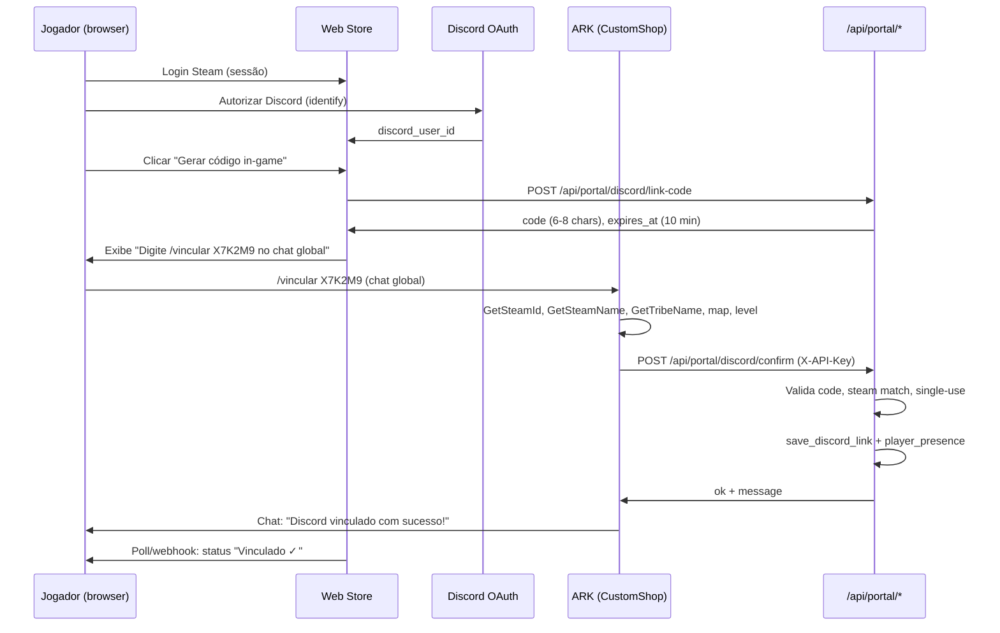
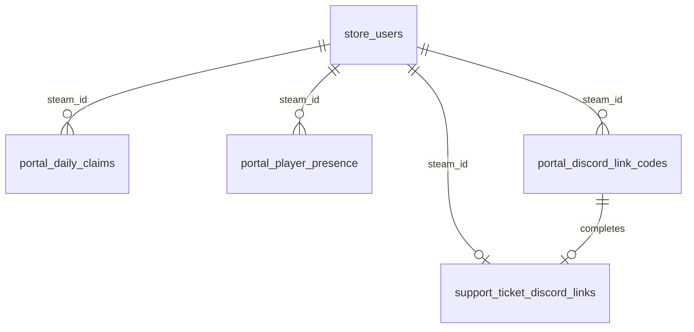

# Portal do Jogador ARKLAND — Especificação (Web Store)

| Campo | Valor |
|-------|-------|
| **Status** | 📋 Discussão — **sem implementação** |
| **Versão do documento** | 1.0 |
| **Data** | 05 de julho de 2026 |
| **Escopo** | Área **Minha Área** na Web Store: resgate diário, vínculo Discord↔Steam via chat in-game, perfil enriquecido |
| **Fora de escopo** | Código, deploy, bot Discord como UI principal |
| **Substitui** | Direção Discord-first de [`PORTAL_DISCORD_ARKLAND_SPEC.md`](PORTAL_DISCORD_ARKLAND_SPEC.md) |

> **Ver também:** [`REGULAMENTO_SITE_IMPLEMENTACAO.md`](REGULAMENTO_SITE_IMPLEMENTACAO.md), [`PROJETO_MERCADO_CRYOPOD.md`](PROJETO_MERCADO_CRYOPOD.md), [`plugin/arkshop_web/app.py`](../plugin/arkshop_web/app.py), [`plugin/CustomShop/src/Commands.cpp`](../plugin/CustomShop/src/Commands.cpp), [`plugin/CustomShop/src/HttpClient.cpp`](../plugin/CustomShop/src/HttpClient.cpp).

---

## Sumário executivo

O **Portal do Jogador** é a extensão da **Minha Área** na Web Store ARKLAND — não um bot Discord. O site é a interface principal; Discord entra como **canal opcional de notificação** (tickets, mercado) e destino do vínculo de identidade.

Três pilares do MVP:

1. **Resgate diário** — claim único a cada 24 h por `steam_id`, com bônus conforme licença ativa (Gamma / Beta / Alfa).
2. **Vínculo Discord↔Steam** — site gera código de curta duração; jogador confirma **in-game** digitando no chat; CustomShop detecta e chama API interna.
3. **Perfil enriquecido** — ao vincular in-game, capturar personagem, tribo, mapa e metadados úteis para suporte, mercado e admin.

**Decisão de arquitetura:** Web Store (`/api/portal/*`) como fonte da verdade + CustomShop como sensor in-game (chat hook + `HttpClient` com `X-API-Key`). Reutilizar `support_ticket_discord_links`, `store_users`, `player_entitlements` e padrões existentes de auth Steam.

---

## 1. Visão

### 1.1 O que é

Uma seção dedicada dentro de **Minha Área** (`#/area` ou sub-rota `#/area/portal`) onde o jogador autenticado via Steam OpenID:

| Função | Descrição |
|--------|-----------|
| **Resgate diário** | Botão para creditar Âmbares uma vez por dia; valor base + bônus por licença paga ativa |
| **Vincular Discord** | OAuth Discord no site + confirmação in-game via código |
| **Perfil de jogo** | Exibe último personagem, tribo, mapa e status de presença capturados pelo plugin |
| **Atalhos existentes** | Saldo, licenças, Timed Points (informativo), histórico — já presentes em Minha Área |

### 1.2 Princípios

| Princípio | Descrição |
|-----------|-----------|
| **Site primeiro** | Toda ação de valor começa na web; in-game só confirma identidade e enriquece dados |
| **Steam como conta** | `steam_id` é a chave primária; Discord é identidade complementar |
| **Licenças ARKLAND** | Gamma / Beta / Alfa / Nuvem — nunca VIP/ArkShop na UI |
| **Economia única** | Resgate diário complementa (não substitui) Timed Points e enquetes |
| **Reuso técnico** | `HttpClient`, `AddOnChatMessageCallback`, `@api_key_required`, `save_discord_link` |

### 1.3 Baseline técnico existente

#### Web Store (`plugin/arkshop_web`)

| Área | Estado | Referência |
|------|--------|------------|
| Login Steam OpenID | ✅ | `app.py` — `/login/steam`, `/api/auth/me` |
| Minha Área (perfil, resumo, licenças, histórico) | ✅ | `static/index.html` — `#page-myarea` |
| Saldo / entitlements | ✅ | `GET /api/player/points`, `/api/player/entitlements` |
| Vínculo Discord manual | ⚠️ | `ticket_routes.py` — `POST /api/tickets/discord-link`, `oauth_available: False` |
| Tabela discord links | ✅ | `SupportTicketDiscordLink` → `support_ticket_discord_links` |
| Contas jogador | ✅ | `StoreUser` → `store_users` |
| Licenças + bônus Timed Points | ✅ | `LICENSE_TIMED_BONUS`, `_get_player_entitlements` |
| API interna plugin | ✅ | `X-API-Key` — `/api/pending/*`, `/api/market/plugin/*` |
| Resgate diário 24 h | ❌ | **Novo** |
| Código vínculo in-game | ❌ | **Novo** |
| Presença in-game (char/tribe) | ❌ | **Novo** |

#### CustomShop (`plugin/CustomShop`)

| Mecanismo | Uso atual | Reuso portal |
|-----------|-----------|--------------|
| `AddOnChatMessageCallback` | Nuvem (`OnCloudChatMessage`), CrossChat | Hook para `/vincular <codigo>` |
| `AddChatCommand` | `/shop`, `/mercado`, `/engramas` | Comando explícito `/vincular` |
| `Bridge::GetSteamId` | Entitlements, Timed Points, mercado | Identificar jogador no vínculo |
| `CrossChat::GetTribeName` | Nome da tribo no relay | Captura de tribo |
| `ArkApi::GetApiUtils().GetSteamName` | CrossChat player_name | Nome do personagem/conta |
| `HttpClient::PostJson` | Mercado, entregas | `POST /api/portal/discord/confirm` |
| `HandleNewPlayer` hook | Sync entitlements, entregas | Opcional: sync presença ao logar |

#### Timed Points (referência de tiers — **não** é resgate diário)

Config atual (`config.json` / `LICENSE_TIMED_BONUS`):

| Grupo | Bônus / ciclo (30 min online) |
|-------|-------------------------------|
| Default | 25 Âmbares |
| Gamma | +25 |
| Beta | +50 |
| Alfa | +75 |
| Nuvem | — (licença de cofre; sem bônus Timed Points) |

O resgate diário usa **valores próprios** (§3), inspirados na escala de tiers mas desacoplados do tick in-game.

---

## 2. Resgate diário

### 2.1 Regras de negócio

| Regra | Detalhe |
|-------|---------|
| **Cooldown** | 24 h corridas desde o último resgate bem-sucedido por `steam_id` |
| **Unicidade** | Máximo **1 resgate por `steam_id` por dia civil UTC** (ou UTC-3 — ver §12) |
| **Autenticação** | Sessão Steam obrigatória; `steam_id` da sessão = beneficiário |
| **Regulamento** | Gate opcional: exigir aceite vigente antes do primeiro resgate (alinhado a tickets/mercado) |
| **Conta bloqueada** | `store_users.site_access_blocked = true` → resgate negado |
| **Offline** | Resgate é **ação web**; jogador não precisa estar online (diferente de Timed Points) |

### 2.2 Valores propostos (discussão)

Valores **iniciais sugeridos** — calibrar com economia do cluster:

| Tier ativo | Base | Bônus licença | Total/dia |
|------------|------|---------------|-----------|
| Sem licença paga | 10 | — | **10** |
| Gamma | 10 | +5 | **15** |
| Beta | 10 | +10 | **20** |
| Alfa | 10 | +15 | **25** |
| Nuvem (sem Gamma+) | 10 | +0 | **10** |
| Gamma + Nuvem | 10 | +5 | **15** |

Notas:

- Apenas **uma** licença paga de tier (Gamma/Beta/Alfa) conta para bônus — a de **maior tier** prevalece (não empilhar Gamma+Beta+Alfa).
- **Nuvem** não adiciona bônus ao resgate diário (consistente com Timed Points).
- Staff (Moderacao/STAFF) — sem bônus extra no resgate diário salvo decisão explícita (§12).

### 2.3 Anti-abuso

| Controle | Implementação |
|----------|---------------|
| Rate limit web | `POST /api/portal/daily-claim` — 5 req/min por IP + 1 claim efetivo/24h por steam |
| Idempotência | Transação DB: insert em `portal_daily_claims` com unique `(steam_id, claim_date)` |
| Auditoria | `audit_events` — `portal_daily_claim`, amount, tier, ip |
| Alt accounts | Mesmo cooldown por steam; sem bônus Discord |
| Fraude API | Sem endpoint plugin para claim — somente sessão web |

### 2.4 UX resgate

```
Estado: disponível
┌─────────────────────────────────────────┐
│  🎁 Resgate diário                      │
│  Hoje você pode resgatar: 20 Âmbares    │
│  (Base 10 + Licença Beta +10)         │
│  [ Resgatar agora ]                     │
└─────────────────────────────────────────┘

Estado: cooldown
┌─────────────────────────────────────────┐
│  🎁 Resgate diário                      │
│  Próximo resgate em: 14h 32m            │
│  Último: 20 Âmbares em 04/07 08:15      │
│  [ Indisponível ]                       │
└─────────────────────────────────────────┘
```

---

## 3. Vínculo Discord ↔ Steam (via chat in-game)

### 3.1 User story

Como jogador, quero vincular meu Discord à conta Steam ARKLAND para receber notificações e abrir tickets com dados corretos, **confirmando que sou eu** no servidor digitando um código no chat.

### 3.2 Fluxo completo



### 3.3 Detalhes do código

| Campo | Valor |
|-------|-------|
| Formato | 6–8 caracteres **A-Z 2-9** (sem O/0/I/1 para legibilidade) |
| TTL | **10 minutos** |
| Uso | **Single-use**; invalidado após confirmação ou expiração |
| Escopo | Atrelado a `steam_id` (sessão web) + `discord_user_id` (OAuth prévio) |
| Limite geração | 3 códigos ativos simultâneos por steam; 10/hora |

### 3.4 Comando in-game

**Comando recomendado:** `/vincular <codigo>`

- Modo: chat global (`EChatSendMode::GlobalChat`) — evita confusão em tribe/local.
- Mensagem de ajuda se digitar só `/vincular`: *"Uso: /vincular CODIGO — gere o código em Minha Área no site."*
- Alternativa futura: prefixo configurável em `config.json` → `PortalLink.Command`.

**Por que comando e não código solto no chat?**

- Reduz spam e falsos positivos (CrossChat relay, conversa normal).
- Padrão já usado em `/confirmar`, `/mercado`, `/upload`.
- Facilita rate limit por jogador no plugin.

### 3.5 Dados capturados na confirmação

| Campo | Fonte CustomShop | Obrigatório |
|-------|------------------|-------------|
| `steam_id` | `Bridge::GetSteamId(player)` | ✅ |
| `character_name` | `GetSteamName(player)` ou nome do personagem se distinto | ✅ |
| `tribe_name` | `CrossChat::GetTribeName` (extrair para helper compartilhado) | ⚠️ vazio se solo |
| `tribe_id` | Investigar `FTribeData` / `AShooterPlayerState` (ArkApi) | ⚠️ fase 1.1 |
| `player_level` | `GetPlayerCharacter()->GetCharacterLevel()` ou equivalente | ⚠️ fase 1.1 |
| `map_id` / `server_id` | `ShopConfig::ServerId()` ou nome do mapa | ✅ |
| `linked_at` | timestamp servidor web | ✅ |

Persistir em `portal_player_presence` (histórico) + snapshot em `store_users` ou colunas JSON.

### 3.6 Discord OAuth vs manual

| Método | MVP | Notas |
|--------|-----|-------|
| **OAuth Discord** | ✅ Recomendado | `discord_user_id` confiável; substitui entrada manual |
| Manual (ID/username) | ⚠️ Manter fallback | Já existe em tickets; marcar `link_method: manual` vs `ingame_code` |

Ordem obrigatória no fluxo feliz: **Steam login → Discord OAuth → gerar código → confirmar in-game**.

---

## 4. Design técnico — CustomShop

### 4.1 Novo módulo sugerido

```
plugin/CustomShop/src/
  ShopPortalLink.h
  ShopPortalLink.cpp   ← hook chat + POST confirm
```

Registro em `Commands::Register()`:

```cpp
ArkApi::GetCommands().AddChatCommand("/vincular", &ShopPortalLink::CmdVincular);
ArkApi::GetCommands().AddOnChatMessageCallback(
    "CustomShopPortalLink", &ShopPortalLink::OnChatMessage);
```

`OnChatMessage` segue o padrão de `OnCloudChatMessage` (`Commands.cpp:181-198`):

- Retorna `true` se consumiu a mensagem (evita echo no CrossChat quando `IgnoreCommands` estiver ativo).
- Executa **antes** ou **depois** do CrossChat conforme ordem de registro — testar para não relayar `/vincular`.

### 4.2 Payload POST confirm (plugin → web)

```json
{
  "code": "X7K2M9",
  "steam_id": "76561198012345678",
  "character_name": "Caçador",
  "tribe_name": "ARKLAND BR",
  "tribe_id": 123456789,
  "player_level": 105,
  "server_id": "ragnarok",
  "map_name": "Ragnarok"
}
```

Headers: `X-API-Key: {ARKSHOP_API_KEY}`, `Content-Type: application/json`

Resposta:

```json
{
  "ok": true,
  "message": "Discord vinculado!",
  "discord_username": "jogador#1234"
}
```

Plugin envia mensagem local ao jogador (padrão `SendMsg` / `SanitizeForGameChat` do mercado).

### 4.3 Rate limit plugin

| Limite | Valor |
|--------|-------|
| Tentativas `/vincular` | 5/min por `steam_id` |
| Código inválido | mensagem genérica (não revelar se expirou vs typo) |
| Steam offline após gerar código | código ainda válido se steam_id bater na confirmação |

### 4.4 Config JSON (opcional)

```json
"PortalLink": {
  "Enabled": true,
  "Command": "/vincular",
  "RateLimitSeconds": 12
}
```

---

## 5. APIs Web Store

Prefixo público (sessão Steam): `/api/portal/`  
Prefixo interno (plugin): mesmas rotas confirm com `@api_key_required`.

### 5.1 Resgate diário

| Método | Rota | Auth | Descrição |
|--------|------|------|-----------|
| GET | `/api/portal/daily-claim/status` | `@login_required` | `{ available, next_at, amount_preview, last_claim }` |
| POST | `/api/portal/daily-claim` | `@login_required` | Executa resgate; credita pontos via `_add_points` / ledger |

**GET status — exemplo:**

```json
{
  "ok": true,
  "available": false,
  "next_claim_at": "2026-07-06T08:15:00Z",
  "amount_preview": {
    "base": 10,
    "license_bonus": 10,
    "license_tier": "Beta",
    "total": 20
  },
  "last_claim": {
    "at": "2026-07-05T08:15:00Z",
    "amount": 20
  }
}
```

**POST claim — erros:**

| HTTP | error | Motivo |
|------|-------|--------|
| 429 | `cooldown` | Ainda dentro das 24 h |
| 403 | `blocked` | Conta bloqueada |
| 403 | `regulamento` | Aceite pendente |
| 503 | `db_offline` | Banco indisponível |

### 5.2 Vínculo Discord

| Método | Rota | Auth | Descrição |
|--------|------|------|-----------|
| GET | `/api/portal/discord/status` | `@login_required` | Link atual + presença + pending code |
| POST | `/api/portal/discord/link-code` | `@login_required` | Gera código (exige `discord_user_id` na sessão ou body pós-OAuth) |
| DELETE | `/api/portal/discord/link-code` | `@login_required` | Cancela código pendente |
| POST | `/api/portal/discord/confirm` | `@api_key_required` | Callback CustomShop — **não** expor ao browser |
| GET | `/api/portal/discord/oauth/start` | `@login_required` | Redirect Discord OAuth (fase 1) |
| GET | `/api/portal/discord/oauth/callback` | sessão | Finaliza OAuth; grava discord na sessão |

**Migrar/evoluir** rotas existentes:

- `GET/POST /api/tickets/discord-link` → redirecionar documentação para `/api/portal/discord/*`; manter compat alias 1–2 releases.

### 5.3 Enriquecimento `/api/auth/me` (fase 2)

Estender payload autenticado:

```json
{
  "portal": {
    "daily_claim_available": true,
    "discord_linked": true,
    "ingame_character": "Caçador",
    "ingame_tribe": "ARKLAND BR",
    "last_seen_map": "ragnarok",
    "last_seen_at": "2026-07-05T11:00:00Z"
  }
}
```

---

## 6. Schema de banco de dados

### 6.1 `portal_daily_claims` (nova)

```sql
CREATE TABLE portal_daily_claims (
  id            INT AUTO_INCREMENT PRIMARY KEY,
  steam_id      VARCHAR(32) NOT NULL,
  claim_date    DATE NOT NULL,              -- dia UTC (ou TZ cluster)
  amount        INT NOT NULL,
  base_amount   INT NOT NULL,
  license_bonus INT NOT NULL DEFAULT 0,
  license_tier  VARCHAR(16) NULL,           -- Gamma|Beta|Alfa|null
  created_at    DATETIME(6) NOT NULL,
  UNIQUE KEY uq_daily_steam_date (steam_id, claim_date),
  KEY idx_steam_created (steam_id, created_at)
);
```

### 6.2 `portal_discord_link_codes` (nova)

```sql
CREATE TABLE portal_discord_link_codes (
  id               INT AUTO_INCREMENT PRIMARY KEY,
  code             VARCHAR(8) NOT NULL,
  steam_id         VARCHAR(32) NOT NULL,
  discord_user_id  VARCHAR(32) NOT NULL,
  discord_username VARCHAR(128) NULL,
  expires_at       DATETIME(6) NOT NULL,
  used_at          DATETIME(6) NULL,
  created_at       DATETIME(6) NOT NULL,
  UNIQUE KEY uq_code (code),
  KEY idx_steam_pending (steam_id, used_at, expires_at)
);
```

### 6.3 `portal_player_presence` (nova — histórico)

```sql
CREATE TABLE portal_player_presence (
  id              INT AUTO_INCREMENT PRIMARY KEY,
  steam_id        VARCHAR(32) NOT NULL,
  character_name  VARCHAR(128) NULL,
  tribe_name      VARCHAR(128) NULL,
  tribe_id        BIGINT NULL,
  player_level    INT NULL,
  server_id       VARCHAR(64) NULL,
  map_name        VARCHAR(64) NULL,
  source          VARCHAR(16) NOT NULL DEFAULT 'link_confirm',
  captured_at     DATETIME(6) NOT NULL,
  KEY idx_steam_captured (steam_id, captured_at DESC)
);
```

### 6.4 Evolução de tabelas existentes

**`support_ticket_discord_links`** — manter; adicionar:

| Coluna | Tipo | Notas |
|--------|------|-------|
| `link_method` | já existe | valores: `manual`, `oauth`, **`ingame_code`** |
| `verified_ingame_at` | DATETIME NULL | timestamp confirmação chat |

**`store_users`** — snapshot rápido (opcional, evita join):

| Coluna | Tipo |
|--------|------|
| `ingame_character` | VARCHAR(128) NULL |
| `ingame_tribe` | VARCHAR(128) NULL |
| `ingame_last_map` | VARCHAR(64) NULL |
| `ingame_last_seen_at` | DATETIME NULL |

### 6.5 Diagrama ER (simplificado)



---

## 7. Segurança

| Ameaça | Mitigação |
|--------|-----------|
| Sniffing código no chat | TTL 10 min; single-use; código longo o suficiente (≥ 31 bits entropia) |
| Brute force código | Rate limit plugin + web; lock temporário após N falhas |
| Vincular steam de outro | Código amarrado ao `steam_id` da sessão web; confirm exige mesmo steam in-game |
| Discord hijack | OAuth com `state` CSRF; validar guild membership opcional (fase 2) |
| Replay API confirm | Código marcado `used_at`; reject duplicata |
| Spoof plugin | `@api_key_required(allow_admin_session=False)` — mesma chave `ARKSHOP_API_KEY` |
| Claim duplicado | UNIQUE `(steam_id, claim_date)` + transação |
| Enumeração | Respostas genéricas para código inválido/expirado |

**Importante:** rotas `/api/portal/discord/confirm` e qualquer callback plugin **nunca** aceitam sessão browser — apenas `X-API-Key`.

---

## 8. UI — Minha Área (wireframes)

### 8.1 Estrutura de abas proposta

Reorganizar `#page-myarea` em tabs (nav horizontal):

```
[ Resumo ] [ Resgate diário ] [ Discord & Jogo ] [ Licenças ] [ Histórico ]
```

### 8.2 Tab Resumo (existente + atalhos)

```
┌──────────────────────────────────────────────────────────────┐
│ Minha Área                                                    │
├──────────────────────────────────────────────────────────────┤
│ [Resumo] [Resgate diário] [Discord & Jogo] [Licenças] [Hist] │
├──────────────────────────────────────────────────────────────┤
│  💎 Saldo: 1.250 Âmbares    │  📜 Licença Beta (12 dias)     │
│  ⏱ Timed Points: 75/30min   │  🎁 Resgate diário: disponível │
│                              │  💬 Discord: não vinculado     │
│  [ Ir para resgate ]         │  [ Vincular Discord ]          │
└──────────────────────────────────────────────────────────────┘
```

### 8.3 Tab Resgate diário

Ver §2.4 — card central + histórico dos últimos 7 resgates.

### 8.4 Tab Discord & Jogo

```
┌──────────────────────────────────────────────────────────────┐
│  💬 Discord                                                   │
│  Status: ○ Não vinculado                                      │
│  [ Conectar Discord ]  ← OAuth                                 │
│                                                               │
│  ── Passo 2: Confirmar no jogo ──                             │
│  Código:  X 7 K 2 M 9        Expira em: 08:42                 │
│  No chat global do servidor, digite:                          │
│      /vincular X7K2M9                                         │
│  [ Gerar novo código ]  [ Cancelar ]                          │
│                                                               │
│  🎮 Presença in-game (atualizada ao vincular)                 │
│  Personagem:  —                                                 │
│  Tribo:       —                                                 │
│  Mapa:        —                                                 │
│  Visto em:    —                                                 │
└──────────────────────────────────────────────────────────────┘

Estado vinculado:
│  Status: ✓ @jogador (vinculado em 05/07 via código in-game)  │
│  [ Desvincular ]  (confirmação modal)                         │
```

### 8.5 Mobile

- Tabs scroll horizontal; botão resgate sticky no Resumo.
- Código com botão **Copiar** + QR opcional (fase 3).

---

## 9. Relação com Portal Discord (doc anterior)

| Aspecto | [`PORTAL_DISCORD_ARKLAND_SPEC.md`](PORTAL_DISCORD_ARKLAND_SPEC.md) | Este documento |
|---------|-------------------------------------------------------------------|----------------|
| UI principal | Bot Discord (botões) | **Web Minha Área** |
| Resgate diário | Rejeitado / anti-pattern | **Feature central** |
| Vínculo Discord | OAuth web only | OAuth web + **confirmação in-game** |
| Código no chat | Anti-pattern explícito | **Requisito** — via `/vincular` |
| Auto-kick Discord | MVP sugerido | Fora do MVP portal; pode ir para Minha Área fase 3 |
| Notificações Discord | N/A | **Opcional** — webhook quando resgate disponível, ticket reply, mercado |

O bot Discord (`oBobonicClean`) pode, no futuro, **espelhar** status (link profundo para Minha Área) — não substituir o portal web.

---

## 10. Fases, estimativas e dependências

Estimativas para **1 dev** familiarizado com o repo; incluem testes básicos, não deploy prod.

| Fase | Entregável | Esforço |
|------|------------|---------|
| **F0 — Design** | Aprovar valores resgate, TZ, OAuth app Discord | 0,5 dia |
| **F1 — Resgate diário** | Tabela, APIs, UI tab, crédito pontos, audit | 2–3 dias |
| **F2 — Código vínculo** | Tabelas codes/presence, APIs web, OAuth Discord | 2–3 dias |
| **F3 — CustomShop hook** | `ShopPortalLink`, `/vincular`, POST confirm | 1–2 dias |
| **F4 — UI Discord & Jogo** | Tab completa, poll status, copy código | 1–2 dias |
| **F5 — auth/me + admin** | Snapshot presença, admin ver vínculos | 1 dia |
| **F6 — Hardening** | Rate limits, testes integração, docs operador | 1–2 dias |
| **F7 — Extras** | Notif. Discord resgate, auto-kick web, desvincular | 2–4 dias |

**Total MVP (F0–F4):** ~**7–10 dias**  
**Portal completo (F0–F6):** ~**9–12 dias**

### 10.1 Dependências

```
F0 ──► F1 (resgate)
F0 ──► F2 (link web) ──► F3 (plugin) ──► F4 (UI)
F2 (OAuth) ──► F4
F1 + F2 ──► F5
```

### 10.2 Critérios de aceite MVP

- [ ] Jogador resgata Âmbares 1×/24h na Minha Área; bônus Beta/Gamma/Alfa aplicado corretamente.
- [ ] OAuth Discord + código in-game vincula `discord_user_id` ↔ `steam_id` com `link_method=ingame_code`.
- [ ] `/vincular` captura character_name e tribe_name; persiste presença.
- [ ] Código expira em 10 min; single-use; steam in-game = steam sessão web.
- [ ] Rotas plugin protegidas por `X-API-Key`.
- [ ] Discord bot **não** é necessário para o fluxo principal.

---

## 11. Perguntas abertas

1. **Valores resgate diário:** confirmar tabela §2.2 ou ajustar (10/15/20/25)?
2. **Fuso horário do “dia”:** UTC, UTC-3 (Brasil), ou rolling 24 h desde último claim?
3. **Regulamento:** resgate exige aceite vigente?
4. **Discord OAuth:** mesma application do bot oBobonic ou app separado?
5. **Guild gate:** exigir membro do Discord ARKLAND para vincular?
6. **`tribe_id` / `player_level`:** MVP ou fase 1.1? (requer spike ArkApi)
7. **Desvincular Discord:** self-service ou só staff?
8. **Nuvem:** algum bônus no resgate diário ou mantém 0?
9. **Notificações Discord** quando resgate fica disponível — desejado?
10. **Alias rotas** `/api/tickets/discord-link` — deprecar quando?
11. **Auto-kick stuck** — entra no portal web (fase 3) em vez do bot?
12. **Staff tiers** (Moderacao/STAFF): bônus no resgate diário?

---

## 12. Referências de código

| Arquivo | Relevância |
|---------|------------|
| `plugin/arkshop_web/app.py` | Auth, entitlements, `LICENSE_TIMED_BONUS`, `@api_key_required` |
| `plugin/arkshop_web/ticket_routes.py` | Discord link manual atual |
| `plugin/arkshop_web/ticket_service.py` | `save_discord_link`, schema links |
| `plugin/arkshop_web/static/index.html` | `#page-myarea` — UI alvo |
| `plugin/CustomShop/src/Commands.cpp` | `OnCloudChatMessage`, registro hooks |
| `plugin/CustomShop/src/ShopCrossChat.cpp` | `GetTribeName`, `OnChatMessage` |
| `plugin/CustomShop/src/HttpClient.cpp` | POST/GET plugin → web |
| `plugin/CustomShop/src/Main.cpp` | Lifecycle, `HandleNewPlayer` |
| `plugin/CustomShop/src/TimedPoints.cpp` | Referência tiers (economia paralela) |
| `plugin/CustomShop/src/ShopBridge.cpp` | `GetSteamId`, `FindPlayer` |
| `docs/PORTAL_DISCORD_ARKLAND_SPEC.md` | Doc superseded — notificações Discord opcionais |

---

*Documento canônico do Portal do Jogador. Nenhuma linha de código deve ser implementada até aprovação do MVP e respostas às perguntas abertas (§11).*
