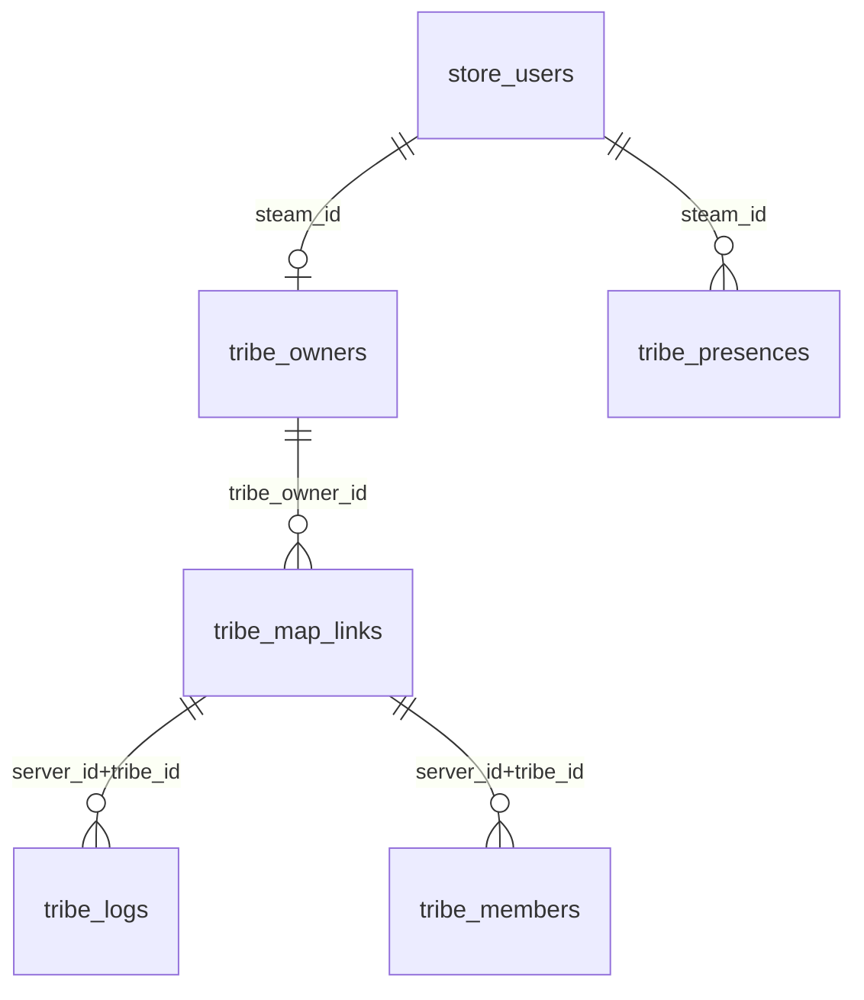

# PROJETO_AREA_TRIBO.md — Área de Tribo no Portal do Jogador

| Campo | Valor |
|-------|-------|
| **Status** | 📋 Especificação — pendente aprovação |
| **Versão** | 1.1 |
| **Data** | 10 de julho de 2026 |
| **Escopo** | Seção "Minha Área" do site ARKLAND — painel de tribo por mapa (uma tribo independente por servidor), logs espelhados, detecção automática de membros |
| **Fora de escopo** | Implementação de código, sistema de guerras, ranking de tribos, identidade unificada cross-mapa |
| **Documento relacionado** | [`PORTAL_JOGADOR_SPEC.md`](PORTAL_JOGADOR_SPEC.md), [`PROJETO_ARKLAND_MASTER.md`](PROJETO_ARKLAND_MASTER.md) |

---

## 1. Objetivo e Visão do Produto

A **Área de Tribo** é uma extensão da **Minha Área** no site ARKLAND que permite ao proprietário e membros de uma tribo:

- Ver o **status da tribo em cada mapa** do cluster (TheIsland, Ragnarok, ScorchedEarth etc.) numa única tela web — cada mapa exibe sua tribo independente.
- Consultar o **Tribe Log espelhado** de cada mapa, com abas separadas por servidor.
- Ter **detecção automática de membros** — quando um jogador entra ou sai de uma tribo in-game, o site reflete a mudança no mapa correspondente sem intervenção manual.
- Oferecer ao **proprietário da tribo** funções básicas de gestão (notas, visibilidade do log, permissões de visualização para membros).

---

## 2. Modelo de Design: Uma Tribo por Mapa

> **Princípio central do produto:** No ARKLAND, cada mapa do cluster mantém uma tribo **completamente independente**. Esse comportamento é **intencional e abraçado pelo design** — não é uma limitação a ser contornada.

### Por que esse modelo

No ARK SE, o `TribeID` é gerado localmente por cada mapa. A mesma pessoa que lidera "ARKLAND BR" no TheIsland possui um `TribeID` diferente no Ragnarok — mesmo que o nome seja idêntico. Isso é o comportamento nativo do engine, e o produto **não tenta sobrepor uma identidade global artificial sobre ele**.

**A Área de Tribo adota esse modelo como fundação:**

- Cada mapa = uma entidade de tribo separada e distinta.
- O proprietário pode pertencer a tribos em múltiplos mapas ao mesmo tempo — cada uma completamente independente da outra.
- A "Minha Área" apresenta uma **visão agregada de acompanhamento**: o dono vê todas as suas tribos por mapa em abas separadas, sem unificá-las em uma única identidade.
- Eventos de tribo têm escopo de mapa: entrar na tribo no TheIsland atualiza **apenas** a aba do TheIsland.

### Comportamento por design

| Contexto | Comportamento esperado |
|----------|------------------------|
| Jogador entra na tribo no TheIsland | Atualiza aba TheIsland → nenhum outro mapa é afetado |
| Jogador sai da tribo no Ragnarok | Atualiza aba Ragnarok → nenhum outro mapa é afetado |
| Wipe do ScorchedEarth | Tribo do ScorchedEarth é zerada; demais mapas intocados |
| Proprietário acessa "Minha Área" | Vê todas as suas tribos por mapa, cada uma com seu log e membros |
| Membro acessa "Minha Área" | Vê os mapas onde está na tribo, cada um com seu log (se visibilidade permitir) |
| Log novo gerado no Ragnarok | Aparece somente na aba Ragnarok |

### O que é o painel "Minha Tribo"

A tela **Minha Tribo** **não é uma tribo unificada** — é um **painel de acompanhamento** que agrega as tribos desconectadas vinculadas ao mesmo proprietário. Cada aba representa um mapa e exibe exclusivamente dados daquele servidor:

- Tribe Log **daquele mapa**
- Lista de membros **daquele mapa**
- TribeID local **daquele mapa**

A coluna "TribeID local" na tabela de status é informativa — não existe chave que os una tecnicamente; a vinculação é feita pelo Steam ID do proprietário.

---

## 3. Viabilidade Técnica

### Veredicto: **VIÁVEL** — com graus de automação distintos por função

| Função | Viável? | Grau de automação | Dependência crítica |
|--------|---------|-------------------|---------------------|
| Exibir nome/ID da tribo no site (por mapa) | ✅ Sim | Semi-automático | Hook `HandleNewPlayer` (já existe) |
| Tribe Log espelhado por mapa | ✅ Sim | Automático (file-tail) | Acesso ao `TribeLog.log` por servidor |
| Detectar troca de membro (adicionar/remover) | ⚠️ Parcial | Semi-automático | Novo hook C++ ou polling periódico |
| Painel agregado de tribos por mapa do mesmo dono | ✅ Sim | Automático | `steam_id` + `tribe_presences` |
| Tribe Log gerenciado pelo dono no site | ✅ Sim | Manual (UI web) | Banco + permissões |
| Notificação em tempo real (WebSocket) | ⚠️ Parcial | Automático | Infraestrutura de push (não existe ainda) |

### Fundação técnica existente

O ARK SE mantém `TribeID` local por mapa — esse é o comportamento esperado do engine. O produto trata cada `(server_id, tribe_id)` como uma entidade distinta desde o início, sem tentar criar uma chave global.

O que **existe e pode ser aproveitado imediatamente**:

1. **`FTribeData` via ArkApi** — struct C++ com `TribeID`, `TribeName`, `MembersPlayerName[]`, `MembersPlayerDataID[]`, `TribeLog[]` (ver `plugin/CustomShop/ArkServerAPI/version/Core/Public/API/ARK/Tribe.h`).
2. **`GetTribeName(player)`** — já implementado em `plugin/CustomShop/src/ShopCrossChat.cpp:155-174`, usado no CrossChat para exibir o nome da tribo nas mensagens.
3. **`HandleNewPlayer` hook** — já declarado e registrado em `plugin/CustomShop/src/Main.cpp:62-133`. Dispara a cada login de jogador.
4. **`TribeLog.log`** — arquivo gerado automaticamente pelo servidor ARK em `ShooterGame/Saved/Logs/TribeLog.log`, já lido e parseado em tempo real pelo app desktop em `src/asm_ui/asm_tribe_log.py`.
5. **`remote_agent.py`** — agente HTTP por instância que aceita comandos RCON remotos (`POST /server/{id}/rcon`) e leitura de logs. Permite que a web API consulte qualquer servidor do cluster.
6. **`HttpClient::PostJson`** no plugin C++ — mecanismo existente para enviar dados do servidor para a web API com `X-API-Key`.
7. **`portal_player_presence`** — tabela já especificada em `PORTAL_JOGADOR_SPEC.md` com campos `tribe_name`, `tribe_id`, `server_id` — base de dados já planejada.

---

## 4. Arquitetura Proposta

```mermaid
flowchart TD
    subgraph "Cada servidor ARK (por mapa)"
        A1[Evento in-game\nJogador entra/sai da tribo\nTribeLog gerado]
        A2[CustomShop.dll\nHook HandleNewPlayer\nHook OnTribeMemberChange]
        A3[TribeLog.log\nShooterGame/Saved/Logs/]
        A4[remote_agent.py\nHTTP :8901]
    end

    subgraph "ARKLAND Manager (TEK app)"
        B1[asm_tribe_log.py\nTail TribeLog.log\npor servidor]
        B2[remote_agent\ncliente HTTP]
    end

    subgraph "Web API (Flask arkshop_web)"
        C1[POST /api/tribe/presence\nX-API-Key]
        C2[GET /api/tribe/log/{map}\nlogin_required]
        C3[GET /api/tribe/status\nlogin_required]
        C4[tribe_members\ntribe_logs\nDB MySQL]
    end

    subgraph "Minha Área — UI Web"
        D1[Aba: Minha Tribo]
        D2[Abas por mapa\nTheIsland | Ragnarok | ...]
        D3[Tribe Log ao vivo\nfiltros por tipo]
        D4[Membros da tribo\nneste mapa]
    end

    A1 --> A2
    A1 --> A3
    A2 -->|POST /api/tribe/presence\nX-API-Key| C1
    A3 -->|tail a cada 30s\nvia remote_agent| A4
    A4 -->|GET /server/{id}/logs\nPolling periódico| B2
    B2 --> C2
    C1 --> C4
    C2 --> C4
    C4 --> C3
    C3 --> D1
    C2 --> D2
    D2 --> D3
    D2 --> D4
```

**Fluxo resumido:**

1. Jogador loga em qualquer mapa → `HandleNewPlayer` no CustomShop captura `steam_id`, `TribeID`, `TribeName`, lista de membros **daquele mapa**.
2. Plugin faz `POST /api/tribe/presence` → web API grava snapshot na tabela `tribe_presences` com `server_id` do mapa.
3. Paralelamente, `remote_agent.py` (ou polling do backend web) lê `TribeLog.log` de cada servidor a cada N segundos.
4. Site exibe os dados sob `Minha Área → Minha Tribo`, com abas por mapa — cada aba independente.

---

## 5. Como Detectar Mudanças de Tribo Automaticamente

### Opção A — Plugin C++ com hooks de tribo (RECOMENDADO)

**Mecanismo:** Adicionar hooks em `CustomShop` para eventos nativos do ARK via ArkApi.

Hooks disponíveis na ArkApi (ARK SE):

| Hook | Quando dispara | Dado disponível |
|------|----------------|-----------------|
| `AShooterGameMode.HandleNewPlayer` | Login de jogador | `AShooterPlayerController*` → `MyTribeData` completo |
| `ATribeManager.AddMemberToTribe` | Membro adicionado | `TribeID`, `PlayerDataID` |
| `ATribeManager.RemoveMemberFromTribe` | Membro removido | `TribeID`, `PlayerDataID` |
| `ATribeManager.RenameTribe` | Tribo renomeada | `TribeID`, novo nome |
| `AShooterGameMode.TribeChanged` (se disponível) | Qualquer mudança | varia por versão |

**Implementação:** Novo módulo `ShopTribeSync.cpp` que registra esses hooks e faz `POST /api/tribe/events` ao backend com payload JSON (similar ao `ShopCrossChat.cpp`).

**Vantagens:**
- Detecção em tempo real, sem polling.
- Dados ricos: `TribeID`, membros completos, nome.
- Reutiliza `HttpClient::PostJson` e `X-API-Key` já existentes.

**Desvantagens:**
- Requer compilação de novo módulo C++ (`.dll`) para cada servidor.
- Hooks `ATribeManager.*` podem não estar disponíveis em todas as versões do ArkApi — validar no ambiente de produção.
- Se o servidor crashar antes de enviar, o evento se perde (mitigar com polling de fallback).

**Trade-off:** Melhor opção para membership changes em tempo real. Risco baixo pois `HandleNewPlayer` já funciona e pode capturar o estado completo a cada login.

---

### Opção B — Parsing do TribeLog.log via remote_agent (JÁ PARCIALMENTE IMPLEMENTADO)

**Mecanismo:** O `src/asm_ui/asm_tribe_log.py` já faz tail de `TribeLog.log` com polling de 5s. A mesma lógica pode ser exposta via `remote_agent.py` para o backend web.

O arquivo `TribeLog.log` contém linhas no formato:
```
Day 123, 14:30:15: JogadorX was added to the Tribe by JogadorY!
Day 123, 14:31:00: JogadorZ was removed from the Tribe.
Day 123, 15:00:00: Your Tribe killed Pachy - Lvl 45!
```

**Implementação:** Endpoint no `remote_agent.py`:
```
GET /server/{id}/tribelog?since=<offset_bytes>&tribe_id=<N>
```
Retorna novas linhas do arquivo desde o offset dado.

O backend web faz polling (ex: a cada 30s) via `remote_agent` de cada servidor e grava na tabela `tribe_logs`.

**Vantagens:**
- Não requer alteração no C++ do plugin.
- O parser já existe em Python (`asm_tribe_log.py`).
- `remote_agent.py` já tem infraestrutura HTTP por servidor.

**Desvantagens:**
- Polling com latência (30s–60s).
- O `TribeLog.log` **não contém TribeID** — apenas nomes. Associação com `steam_id` precisa de cruzamento com `tribe_presences`.
- Se o arquivo for rotacionado ou limpo (wipe), histórico anterior se perde.
- Não detecta mudança de tribo se o jogador não estiver online.

**Trade-off:** Solução de baixo custo para espelhar o log. Não é suficiente sozinha para membership tracking confiável.

---

### Opção C — RCON Polling com `ListPlayers`

**Mecanismo:** Usar `rcon_client.py` (já existe) para executar `ListPlayers` em cada servidor periodicamente e comparar com o estado anterior.

```
RCON → ListPlayers
Resposta: "1. PlayerName, SteamID64 123456789"
```

**Limitação crítica:** O comando `ListPlayers` do ARK SE retorna apenas **jogadores online** com nome e SteamID. **Não retorna TribeID ou TribeName**. Para obter tribe data, seria necessário usar `GetTribeData <TribeID>` — mas esse comando não existe no RCON padrão do ARK SE.

**Vantagens:**
- Infraestrutura de RCON já existe e funciona (`rcon_client.py`, `remote_agent` expõe RCON).
- Não requer plugin C++.

**Desvantagens:**
- **Tribe data não disponível via RCON** no ARK SE (diferente do Atlas).
- Só detecta jogadores online — membership offline invisível.
- Alta frequência de polling aumenta carga no servidor.

**Trade-off:** Útil apenas como fonte de "jogadores online agora", não para tribe membership tracking.

---

### Opção D — Sentinel/Beacon Scripts

O Beacon/Sentinel (ferramenta externa de configuração do ARK) expõe eventos de tribo no script Luas configuráveis. Eventos relevantes:

- `TribeCreated` — nova tribo criada.
- `SurvivorTribeChanged` — jogador mudou de tribo.
- `TribeDestroyed` — tribo destruída.

**Vantagens:** Sem alteração no C++ do servidor.

**Desvantagens:**
- **Requer Beacon instalado e integrado** ao pipeline de configuração de cada servidor — não está presente no projeto atual.
- Os scripts Sentinel rodam fora do servidor de jogo, sem acesso à API em tempo real.
- Configuração por servidor, não global por cluster.

**Trade-off:** Não recomendado para este projeto sem refatoração significativa da infra de configuração.

---

### Recomendação de estratégia combinada (MVP → Completo)

```
MVP:   Opção A (HandleNewPlayer captura tribe snapshot por mapa) 
       + Opção B (TribeLog.log tail via remote_agent por mapa)

v1.1:  Opção A expandida com hooks ATribeManager (add/remove member)

v2.0:  Polling de consistência via Opção B como fallback para A
```

---

## 6. Modelo de Dados

### 6.1 `tribe_presences` (nova — snapshot por mapa)

```sql
CREATE TABLE tribe_presences (
  id            BIGINT AUTO_INCREMENT PRIMARY KEY,
  steam_id      VARCHAR(32) NOT NULL,
  server_id     VARCHAR(64) NOT NULL,    -- ex: "the_island", "ragnarok"
  map_name      VARCHAR(64) NOT NULL,
  tribe_id      INT NULL,               -- TribeID local do mapa (escopo: server_id)
  tribe_name    VARCHAR(128) NULL,
  is_owner      TINYINT(1) NOT NULL DEFAULT 0,
  member_rank   VARCHAR(64) NULL,       -- rank no grupo (TribeRankGroup)
  captured_at   DATETIME(6) NOT NULL,
  source        VARCHAR(16) NOT NULL DEFAULT 'login_hook',  -- 'login_hook'|'member_hook'|'polling'
  KEY idx_steam_server (steam_id, server_id),
  KEY idx_tribe_server (tribe_id, server_id),
  KEY idx_captured (captured_at DESC)
);
```

> **Nota de design:** `tribe_id` tem escopo estrito de `server_id`. Não há e não deve haver chave que una tribos entre mapas — é assim por intenção do produto.

### 6.2 `tribe_members` (nova — membership atual por mapa)

```sql
CREATE TABLE tribe_members (
  id            BIGINT AUTO_INCREMENT PRIMARY KEY,
  server_id     VARCHAR(64) NOT NULL,
  tribe_id      INT NOT NULL,
  tribe_name    VARCHAR(128) NOT NULL,
  steam_id      VARCHAR(32) NOT NULL,
  character_name VARCHAR(128) NULL,
  is_owner      TINYINT(1) NOT NULL DEFAULT 0,
  rank_name     VARCHAR(64) NULL,
  joined_at     DATETIME(6) NULL,
  last_seen_at  DATETIME(6) NULL,
  updated_at    DATETIME(6) NOT NULL,
  UNIQUE KEY uq_member_server (server_id, tribe_id, steam_id),
  KEY idx_steam (steam_id),
  KEY idx_tribe (server_id, tribe_id)
);
```

### 6.3 `tribe_logs` (nova — log espelhado por mapa)

```sql
CREATE TABLE tribe_logs (
  id            BIGINT AUTO_INCREMENT PRIMARY KEY,
  server_id     VARCHAR(64) NOT NULL,
  tribe_id      INT NULL,              -- NULL se não for possível associar
  tribe_name    VARCHAR(128) NULL,
  steam_id      VARCHAR(32) NULL,      -- NULL se linha não for de ação de jogador
  day_number    INT NULL,
  event_time    VARCHAR(16) NULL,      -- "14:30:15" (tempo do servidor, não UTC)
  event_type    VARCHAR(32) NOT NULL,  -- 'killed','structure','tamed','player','admin','other'
  raw_line      TEXT NOT NULL,
  file_offset   BIGINT NOT NULL DEFAULT 0,  -- offset no TribeLog.log (para dedup)
  captured_at   DATETIME(6) NOT NULL,
  KEY idx_server_tribe (server_id, tribe_id),
  KEY idx_steam (steam_id),
  KEY idx_captured (captured_at DESC),
  UNIQUE KEY uq_server_offset (server_id, file_offset)
);
```

### 6.4 `tribe_owners` (nova — proprietário registrado no site)

```sql
CREATE TABLE tribe_owners (
  id            BIGINT AUTO_INCREMENT PRIMARY KEY,
  steam_id      VARCHAR(32) NOT NULL,     -- dono declarado no site
  display_name  VARCHAR(128) NOT NULL,    -- nome de exibição no painel (livre)
  description   TEXT NULL,               -- descrição visível no painel
  log_visibility VARCHAR(16) NOT NULL DEFAULT 'members',  -- 'owner'|'members'|'public'
  created_at    DATETIME(6) NOT NULL,
  updated_at    DATETIME(6) NOT NULL,
  UNIQUE KEY uq_owner (steam_id)
);
```

> **Propósito:** Registra que determinado `steam_id` quer ver o painel "Minha Tribo". **Não** representa uma tribo global — é apenas o ponto de entrada para o painel agregado. O sistema encontra as tribos desse dono consultando `tribe_presences` onde `steam_id` + `is_owner = 1` em cada `server_id`.

### 6.5 `tribe_map_links` (nova — associa dono a cada tribo por mapa)

```sql
CREATE TABLE tribe_map_links (
  id            BIGINT AUTO_INCREMENT PRIMARY KEY,
  tribe_owner_id BIGINT NOT NULL REFERENCES tribe_owners(id),
  server_id     VARCHAR(64) NOT NULL,
  tribe_id      INT NOT NULL,           -- TribeID local daquele mapa
  tribe_name_local VARCHAR(128) NOT NULL,  -- nome da tribo neste mapa
  confirmed_at  DATETIME(6) NOT NULL,
  UNIQUE KEY uq_link (tribe_owner_id, server_id)
);
```

> **Propósito:** Confirma que o link entre o dono e uma tribo específica num mapa foi validado (primeira vez manual). Permite ao painel saber quais `(server_id, tribe_id)` exibir nas abas do proprietário. Após wipe, o link anterior fica obsoleto e um novo é criado no próximo login.

### 6.6 Diagrama ER simplificado



---

## 7. UI "Minha Área" — Wireframe Textual

### 7.1 Nova aba no menu lateral / abas de Minha Área

```
[ Resumo ] [ Resgate Diário ] [ Discord & Jogo ] [ Licenças ] [ Histórico ] [ 🏰 Minha Tribo ]
```

### 7.2 Tela principal — Minha Tribo

```
┌──────────────────────────────────────────────────────────────────────────────┐
│ 🏰 Minha Tribo                                                               │
├──────────────────────────────────────────────────────────────────────────────┤
│  Proprietário: Você (registrado em 01/07)                                    │
│  Descrição: [editar]       Visibilidade do log: [ Membros ▼ ]                │
├──────────────────────────────────────────────────────────────────────────────┤
│  Suas tribos por mapa                                                         │
│  ┌─────────────────┬────────────────┬──────────────┬───────────────────────┐ │
│  │ Mapa            │ Nome da tribo  │ Membros      │ Online agora          │ │
│  ├─────────────────┼────────────────┼──────────────┼───────────────────────┤ │
│  │ TheIsland       │ ARKLAND BR     │ 5            │ 2 online              │ │
│  │ Ragnarok        │ ARKLAND BR     │ 3            │ 0 online              │ │
│  │ ScorchedEarth   │ — (sem tribo)  │ —            │ —                     │ │
│  └─────────────────┴────────────────┴──────────────┴───────────────────────┘ │
│  ℹ Cada aba exibe a tribo independente daquele mapa                           │
├──────────────────────────────────────────────────────────────────────────────┤
│  [ TheIsland ] [ Ragnarok ] [ ScorchedEarth ]  ← selecione o mapa            │
│                                                                               │
│  Tribe Log — TheIsland                          ↺ atualizado há 28s          │
│  ┌────────────────────────────────────────────────────────────────────────┐  │
│  │ 🔍 Filtrar...  [ Todos ] [ Mortes ] [ Estruturas ] [ Tames ] [Jogadores] │ │
│  ├────────────────────────────────────────────────────────────────────────┤  │
│  │ [Day 501 14:30] JogadorX was added to the Tribe by JogadorY!          │  │
│  │ [Day 501 15:00] Your Tribe killed Raptor - Lvl 45 (JogadorX)!         │  │
│  │ [Day 502 08:15] JogadorZ was removed from the Tribe.                  │  │
│  └────────────────────────────────────────────────────────────────────────┘  │
│  Mostrando últimas 200 linhas  [ Exportar .txt ]                              │
├──────────────────────────────────────────────────────────────────────────────┤
│  Membros — TheIsland                                                          │
│  ┌──────────────┬───────────────┬──────────────┬───────────────────────────┐ │
│  │ Jogador      │ Rank          │ Visto em     │ Status                    │ │
│  ├──────────────┼───────────────┼──────────────┼───────────────────────────┤ │
│  │ JogadorX     │ Admin         │ há 2 min     │ 🟢 Online                 │ │
│  │ JogadorY     │ Membro        │ há 3 h       │ ⚫ Offline                │ │
│  └──────────────┴───────────────┴──────────────┴───────────────────────────┘ │
└──────────────────────────────────────────────────────────────────────────────┘
```

**Comportamento das abas:** trocar de aba (ex: TheIsland → Ragnarok) carrega o log e a lista de membros **exclusivamente** do mapa selecionado. Não há combinação de dados entre abas.

### 7.3 Fluxo de "ativar painel" (primeira vez)

```
1. Jogador acessa "Minha Tribo" → ainda sem registro no painel
2. Site detecta: "Você aparece como líder da tribo ARKLAND BR no TheIsland
   (detectado em 01/07). Deseja ativar o painel de tribo?"
3. Jogador clica "Ativar painel"
4. Site cria registro em `tribe_owners` e `tribe_map_links` para TheIsland
5. Outros mapas aparecem automaticamente conforme o jogador logar neles
```

---

## 8. Permissões

| Perfil | O que pode ver | O que pode fazer |
|--------|----------------|------------------|
| **Proprietário** | Logs de todos os mapas onde tem tribo, lista de membros, stats | Editar descrição, definir visibilidade do log, ativar/desativar mapas no painel |
| **Membro** | Logs (se `log_visibility = 'members'`), lista de membros do mapa | Consultar apenas |
| **Admin ARKLAND** | Tudo | Gerenciar tribos de qualquer jogador, forçar re-sync |
| **Visitante** | Logs públicos (se `log_visibility = 'public'`) | Nenhuma |
| **Jogador não membro** | Nada | — |

**Identificação de membro:** Cruzamento de `steam_id` com `tribe_members` por `(server_id, tribe_id)`. O site exibe somente os mapas onde o `steam_id` do usuário logado aparece como membro da tribo do proprietário.

---

## 9. Tribos por Mapa: Comportamento Esperado

### 9.1 Por design: tribos independentes em cada servidor

Cada servidor do cluster ARK mantém seu próprio `TribeID` e seu próprio `TribeLog.log`. O produto abraça essa característica do engine:

- Não existe chave estrangeira cross-mapa para tribo — e o produto **não cria uma**.
- Em wipes parciais (ex: wipe do TheIsland, Ragnarok continua), a tribo no TheIsland recebe um novo TribeID; o painel reflete isso na próxima vez que o jogador logar.
- Merge de tribos in-game resulta num novo TribeID local — o link daquele mapa é atualizado.
- O site é a única visão que **agrega** essas tribos desconectadas numa tela única, por conveniência do proprietário.

### 9.2 Como o painel agrega sem unificar

O modelo usa `tribe_owners` como ponto de registro do proprietário e `tribe_map_links` para mapear o Steam ID aos `(server_id, tribe_id)` de cada mapa onde ele tem tribo. A associação é feita assim:

1. **Detecção automática:** Quando o plugin reporta presença com `is_owner = 1`, o backend verifica se já existe um `tribe_map_links` para `(steam_id, server_id)`. Se não, cria o link automaticamente.
2. **Confirmação inicial:** Primeiro registro no painel requer confirmação do jogador no site ("Ativar painel de tribo").
3. **Pós-wipe:** Após wipe de um mapa, o link antigo fica obsoleto. Na próxima vez que o jogador logar, o plugin reporta o novo `TribeID` e o backend cria um novo link, exibindo alerta na UI: "Tribo atualizada após wipe".

### 9.3 Cluster ARK SE — separação de tribos por mapa

No cluster, personagens migram entre mapas mas **tribos não**. O jogador ao entrar num mapa novo cria uma nova tribo local (ou entra numa existente). Não existe sync automático de membership entre TheIsland e Ragnarok no nível do engine — e o produto **não simula esse sync**. Cada aba da Minha Área exibe exatamente o estado real daquele servidor.

---

## 10. Considerações Operacionais

| Situação | Comportamento no painel |
|----------|-------------------------|
| TribeLog.log não inclui TribeID | Log é associado por `server_id` + período + nome do jogador |
| RCON não expõe tribe data | Membership via hooks C++ ou file-parsing (não RCON) |
| Wipe apaga TribeLog.log | Histórico no DB é preservado; arquivo novo começa do zero |
| Merge de tribos muda TribeID | Hook `ATribeManager.MergeTribe` ou re-detecção no próximo login |
| Jogador offline | Membership atualizado no próximo login; UI mostra "último visto" |
| TribeAlliances (PvP) | `FTribeAlliance` no Tribe.h — fora do escopo MVP |
| remote_agent.py offline | Indicador de "última atualização" na UI; retry automático |
| Sobrecarga do banco com polling | Índices adequados; retenção de logs limitada a 30 dias (configurável) |

---

## 11. Fases MVP → Completo

### Fase 0 — Preparação (0,5 dia)
- Aprovar modelo de dados e fluxo de detecção preferido (Opção A vs B).
- Definir lista de `server_id` canônicos para o cluster.
- Validar que hooks `ATribeManager.*` estão disponíveis na versão atual do ArkApi em uso.

### Fase 1 — Plugin C++ (ShopTribeSync) (2–3 dias)
- Novo módulo `ShopTribeSync.cpp` no CustomShop.
- Hook `HandleNewPlayer` estendido para capturar `FTribeData` completo (TribeID, nome, membros, is_owner).
- `POST /api/tribe/presence` com payload `{steam_id, server_id, tribe_id, tribe_name, members[], is_owner}`.
- Registrar hooks de add/remove member se disponíveis no ArkApi.

### Fase 2 — Backend Web: tabelas e APIs (2–3 dias)
- Criar tabelas: `tribe_presences`, `tribe_members`, `tribe_owners`, `tribe_map_links`.
- `POST /api/tribe/presence` (`@api_key_required`) — processa snapshot do plugin.
- `GET /api/tribe/my` (`@login_required`) — retorna todas as tribos por mapa do jogador.
- `POST /api/tribe/register` (`@login_required`) — ativa o painel de tribo.

### Fase 3 — Tribe Log espelhado (2 dias)
- Estender `remote_agent.py` com endpoint `/server/{id}/tribelog?offset=N`.
- Worker Python no backend web: polling de cada servidor a cada 30s, gravar em `tribe_logs`.
- `GET /api/tribe/log/{server_id}?limit=200` (`@login_required`) com verificação de permissão.
- Parser reutiliza lógica de `asm_tribe_log.py` (regex, classificação de eventos).

### Fase 4 — UI "Minha Tribo" (2–3 dias)
- Nova aba em `#page-myarea` no `static/index.html`.
- Tabela de status por mapa, abas de log por servidor (cada aba = dados exclusivos daquele mapa).
- Filtros de evento (reutilizar categorias de `asm_tribe_log.py`).
- Tabela de membros com "último visto".

### Fase 5 — Permissões e gestão (1–2 dias)
- Formulário de edição de descrição e visibilidade do log.
- Verificação de permissão em todas as rotas (dono vs membro vs visitante).
- UI de admin para forçar re-sync.

### Fase 6 — Hardening (1–2 dias)
- Tratamento de wipe: endpoint `POST /api/tribe/wipe-reset/{server_id}` para admin.
- Alertas na UI quando link de tribo desatualizado (novo TribeID após wipe).
- Rate limiting nas rotas de plugin.
- Testes de integração.

**Total MVP (F0–F4):** ~8–11 dias  
**Completo (F0–F6):** ~10–14 dias

---

## 12. Arquivos a Criar / Alterar

### Novos arquivos

| Arquivo | Descrição |
|---------|-----------|
| `plugin/CustomShop/src/ShopTribeSync.h` | Declarações do módulo de sync de tribo |
| `plugin/CustomShop/src/ShopTribeSync.cpp` | Hooks C++ e POST /api/tribe/presence |
| `plugin/arkshop_web/tribe_routes.py` | Rotas Flask para `/api/tribe/*` |
| `plugin/arkshop_web/tribe_service.py` | Lógica de negócio: presença, membership, log por mapa |
| `plugin/arkshop_web/tribe_log_poller.py` | Worker de polling do TribeLog.log via remote_agent |

### Arquivos a alterar

| Arquivo | Alteração |
|---------|-----------|
| `plugin/CustomShop/src/Main.cpp` | Registrar hooks do ShopTribeSync na inicialização |
| `plugin/CustomShop/src/Commands.cpp` | Opcional: comando `/tribo` para jogador ver seus dados |
| `plugin/arkshop_web/app.py` | Importar e registrar `tribe_routes`; adicionar tabelas ao `_migrate_schema` |
| `plugin/arkshop_web/static/index.html` | Nova aba "Minha Tribo" em `#page-myarea` |
| `src/remote_agent.py` | Endpoint `/server/{id}/tribelog` para leitura remota |
| `docs/PROJETO_ARKLAND_MASTER.md` | Link para este documento (atualizado) |

---

## 13. Riscos

| Risco | Probabilidade | Impacto | Mitigação |
|-------|--------------|---------|-----------|
| Hooks `ATribeManager.*` indisponíveis na versão atual do ArkApi | Médio | Alto — sem detecção de add/remove | Fallback: capturar membership apenas no login (`HandleNewPlayer`) |
| TribeLog.log limpo/rotacionado sem aviso | Médio | Médio — perda de histórico | Backup agendado antes de wipe; gravar no DB logo após captura |
| Plugin C++ instável (crash do servidor) | Baixo-médio | Alto | Testar extensivamente; usar try/catch em todos os hooks novos |
| TribeID muda após wipe sem o jogador logar novamente | Alto | Baixo — link desatualizado, não crítico | UI alerta "link desatualizado"; re-vinculação no próximo login |
| Nomes de tribo diferentes entre mapas | Possível | Nenhum — cada aba é independente | Por design, o nome exibido é sempre o do mapa da aba ativa |
| Jogador em múltiplas tribos cross-mapa (comum) | Alta | Nenhum — é o uso esperado | Interface exibe uma aba por mapa, cada uma com a tribo daquele servidor |
| Sobrecarga do banco com polling frequente | Baixo | Médio | Índices adequados; limitar retenção de logs a 30 dias (configurável) |
| `remote_agent.py` offline em servidor remoto | Médio | Médio — log de um mapa para de atualizar | Indicador de "última atualização" na UI; retry automático |

---

## 14. Alternativas se Automação Completa Não For Possível

Se os hooks `ATribeManager.*` não estiverem disponíveis e a detecção automática de membership não for confiável, alternativas viáveis:

### Alternativa 1 — Semi-automático via login only
Capturar o estado completo da tribo apenas no evento `HandleNewPlayer` (já disponível). A membership é atualizada toda vez que qualquer membro loga. Funciona bem para servidores ativos. Desvantagem: jogadores offline não são detectados como removidos até o próximo login de alguém da tribo.

### Alternativa 2 — Tribe Log como fonte primária
Usar somente o TribeLog.log via `remote_agent` para inferir eventos. Menos preciso para membership mas suficiente para o log histórico. Requer zero alteração no C++.

### Alternativa 3 — Confirmação manual pelo dono
O proprietário registra manualmente os membros no site (lista de SteamIDs). O sistema apenas exibe o Tribe Log e status de online/offline. Muito mais simples de implementar, mas não atende o requisito de "totalmente automático".

### Alternativa 4 — ArkGameData.json / PrimalGameData (polling de arquivo)
O ARK salva dados de tribos no arquivo `ShooterGame/Saved/<MapName>/Tribes/<TribeID>.tribedata`. Esses arquivos binários podem ser lidos via `remote_agent` e parseados para extrair membership. Requer implementação de parser do formato `.tribedata`. Viável como fallback sem C++.

---

## 15. Referências de Código

| Arquivo | Relevância |
|---------|------------|
| `plugin/CustomShop/ArkServerAPI/version/Core/Public/API/ARK/Tribe.h` | `FTribeData`, `FTribeRankGroup`, `TribeID`, `MembersPlayerDataID`, `TribeLog[]` |
| `plugin/CustomShop/src/ShopCrossChat.cpp:155-174` | `GetTribeName()` já implementado — reutilizar |
| `plugin/CustomShop/src/Main.cpp:62-133` | `HandleNewPlayer` hook — ponto de extensão principal |
| `plugin/CustomShop/src/HttpClient.cpp` | `PostJson` — mecanismo de envio plugin→web |
| `src/asm_ui/asm_tribe_log.py` | Parser/tail do TribeLog.log — reutilizar lógica em `tribe_log_poller.py` |
| `src/remote_agent.py` | HTTP agent por servidor — adicionar endpoint `/tribelog` |
| `src/rcon_client.py` | RCON — útil para "jogadores online agora" (não tribe data) |
| `plugin/arkshop_web/app.py` | Auth Steam, `@api_key_required`, `@login_required`, `_migrate_schema` |
| `plugin/arkshop_web/static/index.html` | `#page-myarea` — aba nova aqui |
| `plugin/arkshop_web/cross_chat_routes.py` | Exemplo de rota com `tribe_name` |
| `docs/PORTAL_JOGADOR_SPEC.md` | `portal_player_presence` — tabela já planejada (base para `tribe_presences`) |

---

## 16. Referências Externas

- [Beacon Help — Tribe Events](https://help.usebeacon.app/) — `TribeCreated`, `SurvivorTribeChanged`, `TribeDestroyed`
- ArkApi Source — `ATribeManager` hooks (verificar versão em produção)
- ARK SE `.tribedata` format — documentação comunitária para parser alternativo

---

*Documento de especificação — nenhum código deve ser implementado antes da aprovação do modelo de dados (§6) e da estratégia de detecção (§5).*

---

## 17. Modelo Tribo Principal + Fobs (política do servidor)

> **Status:** ✅ Decisões administrativas registradas em 10/07/2026 — ver §17.7 (questões respondidas) e §17.9 (tabela de decisões).  
> **Contexto:** Esta seção documenta a política de tribos no ARKLAND a partir da confirmação do admin (10/07/2026) de que o servidor opera com conceito de **tribo principal** + **fobs** por mapa.

---

### 17.1 Definições

| Conceito | Definição |
|----------|-----------|
| **Tribo Principal** | A tribo que representa o grupo de jogadores no seu **mapa âncora** (mapa de origem do grupo). Tem base maior, maior quantidade de membros ativos, e é a identidade canônica do grupo no servidor. |
| **Mapa âncora** | O mapa onde a tribo principal reside. Escolha do grupo; não é imposta pelo engine. |
| **Fob** (*Forward Operating Base*) | Tribo criada por um ou mais membros da tribo principal em um **mapa secundário**. É uma entidade separada no jogo (TribeID diferente), menor em estrutura e membros, com propósito de suporte (logística, tames, base avançada). |
| **Mapa secundário** | Qualquer mapa do cluster que não é o mapa âncora daquele grupo. |
| **Owner de Fob** | Membro da tribo principal que criou ou lidera a tribo-fob em um mapa secundário. No jogo é o líder daquela tribo; no site é vinculado à tribo principal via metadado. |

> **Distinção fundamental:** A relação "principal + fob" é **política do servidor** (regra social/administrativa), não uma mecânica do jogo. No ARK SE, principal e fob são duas tribos completamente independentes, com TribeIDs distintos. O site é a única camada capaz de representar essa relação.

---

### 17.2 Cenários de membership

A tabela abaixo lista os cenários possíveis e como o site os representa:

| # | Cenário | Mapa A (principal) | Mapa B (secundário) | Representação no site |
|---|---------|-------------------|---------------------|----------------------|
| 1 | Membro só na principal | ✅ Membro da tribo | ❌ Sem presença | Aparece na tribo principal; Mapa B não exibido |
| 2 | Membro na principal + Fob X no Mapa B | ✅ Membro da tribo | ✅ Membro da fob (mesma identidade Steam) | Aparece na principal (aba Mapa A) e na fob (aba Mapa B) |
| 3 | Owner de Fob no Mapa B, membro da principal no Mapa A | ✅ Membro da tribo | ✅ Owner da tribo-fob (TribeID diferente) | Tribo principal: membro. Mapa B: exibido como "Fob — owner" |
| 4 | Membros diferentes em Fobs diferentes no mesmo mapa secundário | — | Fob X (3 membros) e Fob Y (2 membros), mesmo mapa | Duas entradas distintas na aba do mapa secundário, agrupadas sob a tribo principal se ambas forem fobs declaradas dela |
| 5 | Membro de fob que NÃO está na principal | ❌ Sem presença | ✅ Membro da fob | Fob aparece no site, porém sem vínculo automático à principal; admin pode vincular manualmente |

---

### 17.3 O que o site precisa representar vs. o que o jogo impõe

#### O que o jogo impõe (verdade do engine)

- Cada mapa tem seu próprio `TribeID` (inteiro local, sem sincronização cross-mapa).
- Não existe relação nativa entre TribeID do Mapa A e TribeID do Mapa B.
- O TribeLog de cada mapa é independente — arquivo separado por servidor.
- Um jogador pode ser membro de tribos totalmente diferentes em cada mapa (sem restrição do engine).
- Não existe "tipo" de tribo (principal vs fob) no ARK SE — essa classificação é externa.

#### O que o site precisa representar

- A relação **"esta tribo no Mapa B é fob da tribo X no Mapa A"** — metadado exclusivo do site.
- Qual mapa é o **âncora** (principal) de um grupo.
- Quais membros fazem parte da fob vs. da principal (pode ser subconjunto diferente).
- Quem é o **owner da fob** e qual é sua relação com a principal.
- Uma **visão unificada (cluster view)** dos logs de todas as tribos de um grupo (principal + fobs).

---

### 17.4 Opções de design — discussão antes de implementar

#### Opção A — "Cluster Group" somente no site (metadado, sem alterar o jogo)

**Mecanismo:** O site mantém uma tabela `tribe_cluster_groups` que associa:
- Uma tribo principal (`tribe_map_links` no mapa âncora)
- N entidades fob (`tribe_map_links` em mapas secundários), cada uma com flag `type = 'fob'`
- O admin ou o owner principal declara os vínculos via interface web

**Implementação no banco:**
```sql
tribe_cluster_groups (id, group_name, anchor_server_id, anchor_tribe_id)
tribe_cluster_members (group_id, server_id, tribe_id, type ENUM('principal','fob'), fob_owner_steam_id, declared_at)
```

**Prós:**
- Totalmente transparente para o jogo — zero alteração no plugin.
- Flexível: qualquer tribo de qualquer mapa pode ser fob de qualquer principal.
- Suporta cenário 4 (múltiplas fobs no mesmo mapa).
- Fácil de mudar sem tocar no engine.

**Contras:**
- Declaração manual (ou semi-automática): o site não sabe automaticamente qual tribo é fob de qual principal.
- Requer UX de "vincular fob" — passo a mais para o admin/owner.
- Dados podem ficar desatualizados após wipe sem re-vínculo.

---

#### Opção B — Convenção de nome + vinculação manual pelo admin

**Mecanismo:** O servidor impõe (por regra social) um padrão de nome:
- Principal: `"ARKLAND"` (ou nome livre)
- Fob: `"ARKLAND Fob Scorched"`, `"ARKLAND Fob Rag"`, etc.

O site detecta automaticamente o padrão via regex (`^(.+)\s+Fob\s+(.+)$`) e propõe o vínculo ao admin.

**Prós:**
- Detecção parcialmente automática — reduz trabalho manual.
- Sem banco extra além do já planejado.
- Legível para jogadores no próprio jogo (nome da tribo diz o que é).

**Contras:**
- Depende de disciplina de nomenclatura dos jogadores — fácil de quebrar.
- Regex pode dar falsos positivos com nomes criativos.
- Não funciona se o grupo não seguir a convenção.
- Vinculação ainda depende de confirmação manual para ser confiável.

---

#### Opção C — Plugin registra owner SteamID + mapa + tipo principal|fob

**Mecanismo:** O `HandleNewPlayer` (ou novo hook) envia ao backend:
```json
{
  "steam_id": "...",
  "server_id": "scorched_earth",
  "tribe_id": 99283,
  "tribe_type": "fob",
  "principal_map": "the_island"
}
```

O admin ou o owner declara no site "esta tribo no Mapa B é fob da minha tribo no Mapa A" — o plugin lembra e envia o tipo automaticamente nos logins subsequentes.

**Prós:**
- Dado persistente por servidor — sobrevive a reinícios.
- O plugin é a fonte de verdade, não o site.
- Permite automação futura (ex: regras de wipe por tipo).

**Contras:**
- Requer alteração no plugin C++ (novo campo no payload) **e** UX de declaração inicial.
- Acrescenta responsabilidade ao plugin para manter estado (mais complexidade).
- Se o owner muda, o dado fica desatualizado no plugin até re-declaração.
- Maior acoplamento entre plugin e lógica de negócio do site.

---

#### Comparativo das opções

| Critério | Opção A (Cluster Group) | Opção B (Naming Convention) | Opção C (Plugin + tipo) |
|----------|------------------------|----------------------------|------------------------|
| Alteração no plugin C++ | Nenhuma | Nenhuma | Sim (novo campo) |
| Detecção automática | Não | Parcial (regex) | Sim (após 1ª declaração) |
| Flexibilidade | Alta | Média | Média |
| Robustez pós-wipe | Média (re-vínculo manual) | Baixa (depende do nome) | Média (re-declaração) |
| Complexidade de implementação | Baixa-média | Baixa | Média-alta |
| Risco de dado incorreto | Baixo | Médio | Baixo |
| Suporta múltiplas fobs no mesmo mapa | ✅ | ✅ | ✅ |
| Funciona sem convenção de nome | ✅ | ❌ | ✅ |

**Recomendação:** Opção A como base, com elementos da Opção B como sugestão automática (o site detecta o padrão de nome e propõe o vínculo, mas não o força). Ver §17.9.

---

### 17.5 Implicações de UI — Minha Área

#### Layout proposto para tribo com fobs

```
[ Resumo ] [ Resgate ] [ Discord ] [ Licenças ] [ Histórico ] [ 🏰 Minha Tribo ]

┌──────────────────────────────────────────────────────────────────────────────┐
│ 🏰 Minha Tribo — ARKLAND                                                      │
├──────────────────────────────────────────────────────────────────────────────┤
│  ★ PRINCIPAL — TheIsland       TribeID: 1023847   5 membros   2 online       │
│  ┌─────────────────────────────────────────────────────────────────────────┐ │
│  │  [ Log TheIsland ]  [ Membros ]                                         │ │
│  └─────────────────────────────────────────────────────────────────────────┘ │
├──────────────────────────────────────────────────────────────────────────────┤
│  FOBs                                                                         │
│  ┌─────────────────┬──────────────┬────────────────┬────────────────────────┐ │
│  │ Mapa            │ Owner da Fob │ Membros        │ Ações                  │ │
│  ├─────────────────┼──────────────┼────────────────┼────────────────────────┤ │
│  │ Scorched Earth  │ JogadorX     │ 2              │ [ Ver Log ] [ Detalhes]│ │
│  │ Ragnarok        │ JogadorY     │ 3              │ [ Ver Log ] [ Detalhes]│ │
│  └─────────────────┴──────────────┴────────────────┴────────────────────────┘ │
│  [ + Vincular nova Fob ]                                                       │
└──────────────────────────────────────────────────────────────────────────────┘
```

#### Quem vê o quê

| Perfil | Tribo Principal | Fobs | Logs |
|--------|----------------|------|------|
| **Owner principal** | Tudo — editar, gerenciar membros, vincular fobs | Vê todas as fobs, pode desvincular | Log principal + log de todas as fobs (cluster view) |
| **Owner de fob** | Vê a principal (somente leitura se for membro) | Vê e gerencia **sua fob** | Log da sua fob + log da principal (se permissão) |
| **Membro da principal** | Vê membros e log (conforme visibilidade) | Vê lista de fobs, não acessa logs das fobs | Log da principal apenas |
| **Membro só de fob** | Vê nome da principal (read-only) | Vê log da sua fob | Log da sua fob apenas |
| **Admin ARKLAND** | Tudo | Tudo | Tudo |

---

### 17.6 Logs — separação por verdade do jogo vs. visão unificada no site

#### Realidade do jogo (game truth)

- Cada servidor ARK gera seu próprio `TribeLog.log`, independente.
- O log da tribo principal (TheIsland) e o log da tribo-fob (Scorched Earth) são **arquivos fisicamente separados**, em servidores diferentes.
- Não existe log cross-mapa nativo no ARK SE.

#### Visão do site

O site pode oferecer duas visões:

**1. Visão por mapa (padrão):**  
Abas separadas — cada aba mostra o log de um mapa (uma entidade de tribo). Fiel à verdade do jogo. Exemplo:  
`[ Log TheIsland (principal) ] [ Log Scorched Earth (Fob) ] [ Log Ragnarok (Fob) ]`

**2. Cluster View (agregada):**  
Uma timeline unificada, intercalando eventos de todos os mapas com marcação de origem:
```
[Day 501 TheIsland  14:30] JogadorX added to Tribe
[Day 501 ScorchedEarth 14:35] JogadorX joined Fob
[Day 502 TheIsland  08:15] Your Tribe killed Rex - Lvl 94
```
- Requer normalização de timestamps (servidores com dias independentes)
- Útil para o owner ver toda a atividade do cluster de uma vez
- Implementável como view/query no banco sem dado novo no jogo

**Considerações de implementação:**
- "Day N" do ARK não é calendário real — cada servidor tem seu próprio contador de dias.
- Para Cluster View, usar `captured_at` (timestamp de quando o site capturou o evento) como eixo temporal real.
- Filtros por tipo de evento funcionam igual nas duas visões.

---

### 17.7 Decisões administrativas registradas (2026-07-10)

> As questões abertas anteriores foram respondidas pelo admin em 10/07/2026. Esta seção substitui o antigo bloco "Perguntas abertas".

| # | Questão | Decisão |
|---|---------|---------|
| Q1 | Quem pode declarar uma fob? | Somente o **owner da tribo principal** pode vincular uma fob ao grupo. |
| Q2 | Aprovação de vínculo fob | A vinculação requer **aprovação do owner principal** — não é automática mesmo que o SteamID já esteja na principal. |
| Q3 | Limite de fobs por mapa | Após o mapa principal ser definido, todos os outros mapas do grupo devem ser **fobs**. Múltiplas fobs do mesmo grupo no mesmo mapa secundário são possíveis, mas cada fob é vinculada explicitamente pelo owner principal. |
| Q4 | Membro exclusivo de fob (sem presença na principal) | Membro que pertence somente a uma fob **não pode participar do split** nem da área de tribo da principal no site. **Regra adicional:** membro em uma fob em determinado mapa **não pode participar de split de outra tribo nesse mesmo mapa**. |
| Q5 | Visibilidade do log da fob | Apenas **integrantes confirmados** da tribo/fob têm acesso ao log. O owner principal pode ver logs de fobs vinculadas; o owner da fob pode ver o log da principal (somente leitura). |
| Q6 | Pós-wipe de mapa secundário | Vínculo fica como **"inativo — aguardando re-vínculo"**. O owner principal re-vincula quando a fob for recriada no mapa. |
| Q7 | Fob sem owner definido | Admin deve **intervir manualmente** para re-atribuir ownership da fob ou dissolver o vínculo. |
| Q8 | Renomeação de fob in-game | O vínculo é preservado por `TribeID`, não por nome. Se o TribeID mudar (wipe), re-vínculo é necessário. Renomear sem wipe mantém o vínculo. |
| Q9 | Fobs sobrepostas no mesmo mapa | Permitido — cada fob aparece como entrada distinta na aba do mapa. O owner principal as distingue pelo nome e pelo owner da fob. |
| Q10 | Nomenclatura de fob | **Livre** — o site usa o padrão de nome apenas como **sugestão automática** de vínculo; o vínculo final é sempre aprovado manualmente pelo owner principal. |

### 17.8 Regras decididas para fobs (sumário executivo)

- **Split de receita:** exclusivo da tribo principal. Fobs não têm configuração de split.
- **Restrição same-map:** membro em fob de um mapa não pode participar do split de outra tribo nesse mesmo mapa.
- **Visibilidade pública:** somente integrantes confirmados da tribo/fob têm acesso. Nada de configurações ou detalhes de split para visitantes externos.
- **Cross-cluster:** após o mapa principal ser definido, os demais mapas do grupo são fobs. O site representa e gerencia essa hierarquia.
- **Encomendas:** nenhum vínculo entre encomendas e split/fob.

---

### 17.9 Recomendação técnica para implementação

Com base no estado atual do codebase (sem TribeID global, com `remote_agent.py`, `asm_tribe_log.py`, e ausência de hook de tipo de tribo no plugin), a abordagem que melhor se encaixa é:

**Opção A (Cluster Group no site) como base + sugestão automática via padrão de nome (Opção B) como UX helper.**

**Justificativa:**
- O plugin atual não precisa ser alterado para o MVP — zero risco de instabilidade C++.
- A tabela `tribe_cluster_groups` + `tribe_cluster_members` é uma extensão natural do modelo `tribe_owners` / `tribe_map_links` já especificado (§6).
- A nomenclatura é livre (Q10 — decidido); o site sugere vínculos pelo nome mas não os força.
- A Cluster View de logs é apenas uma query diferente sobre `tribe_logs` já especificada — sem nova infraestrutura.

**Passos recomendados para implementação:**

1. Adicionar campos `cluster_group_id` e `tribe_type ENUM('principal','fob')` em `tribe_map_links`.
2. Criar tabela `tribe_cluster_groups` (id, group_name, anchor_server_id, anchor_tribe_id, created_by_steam_id).
3. UI: aba "Fobs" no painel Minha Tribo, acessível ao owner principal.
4. Endpoint `POST /api/tribe/fob/link` — owner principal declara vínculo de fob (com aprovação obrigatória — Q2).
5. Cluster View: `GET /api/tribe/log/cluster` — agrega logs de todos os mapas do grupo por `captured_at`.
6. Visibilidade: todas as rotas de fob exigem `steam_id` membro confirmado (R12 — sem acesso público).

> Esta seção é **documentação de especificação** — as decisões administrativas estão registradas em §17.7. O código pode ser iniciado após aprovação formal do MVP pelo admin.

---

## §18 Repartição de ganhos do mercado (tribe revenue share)

> Seção movida para arquivo dedicado por extensão:  
> **[`docs/TRIBO_REPARTICAO_MERCADO.md`](TRIBO_REPARTICAO_MERCADO.md)**  
> ✅ **Decisões administrativas registradas em 10/07/2026** — ver §18.0 do documento dedicado.

Resumo dos princípios centrais (conforme decisões de 2026-07-10):

- O membro que **lista/envia a criatura** é garantidamente o maior beneficiário — seu percentual deve ser estritamente maior que qualquer outro, com **gap mínimo de 10 p.p.** acima do próximo (sem piso fixo absoluto).
- Todos os valores em **percentuais inteiros** cuja soma deve ser exatamente 100%.
- **Visibilidade restrita:** somente integrantes confirmados da tribo têm acesso — não público.
- Recurso **desativado por padrão**; quando desativado, o fluxo funciona como hoje (100% ao vendedor).
- Qualquer membro pode fazer **opt-out** (imediato, sem cooldown); reentrada exige 45h de espera e aprovação do owner.
- **Cooldown de 48h** somente em **alterações** de configuração (não em opt-out nem desativação).
- **Opt-in por listagem** — o vendedor decide se aplica o split a cada anúncio individualmente.
- **Mínimo de venda:** 1.000 Âmbares. **Limite de membros:** 10.
- **Exclusivo da tribo principal** — fobs sem split; sem integração com encomendas.

Para especificação completa (regras R1–R14, algoritmos, fluxos, edge cases, modelo de dados, MVP): ver [`TRIBO_REPARTICAO_MERCADO.md`](TRIBO_REPARTICAO_MERCADO.md).

---

## §19 Regulamento interno da tribo

### 19.1 Propósito

O regulamento interno é um **documento autoral do owner da tribo**, destinado a comunicar observações, condutas esperadas, restrições e permissões específicas do grupo para todos os seus membros. Trata-se de uma política **interna da tribo** — diferente do [`docs/REGULAMENTO_SERVIDOR.md`](REGULAMENTO_SERVIDOR.md), que é o regulamento global do servidor ARKLAND válido para todos os jogadores independentemente de tribo.

O regulamento interno permite ao owner:
- Registrar acordos e combinações internas do grupo.
- Detalhar o que é e não é permitido dentro da dinâmica da tribo.
- Comunicar regras de convivência específicas do estilo de jogo do grupo.
- Referenciar (mas não substituir) a política de divisão de ganhos do mercado (§18).

### 19.2 Quem pode editar

#### Owner da tribo principal (mapa âncora)
O owner da tribo principal é o **único editor do regulamento principal** da tribo. Nenhum membro — mesmo com permissões elevadas in-game — pode editar o regulamento no site sem ser o owner reconhecido.

#### Owners de fob
Cada owner de fob pode criar um **adendo de regulamento** específico para sua fob. O adendo:
- É exibido como subsecção do regulamento principal (claramente demarcado como "Adendo — [Nome da Fob]").
- Não pode contradizer o regulamento principal — o regulamento da tribo âncora tem precedência.
- É editável apenas pelo owner da respectiva fob.
- Pode ser suprimido pelo owner principal a qualquer momento.

**Questão aberta para o admin:** owners de fob devem ter adendo habilitado por padrão, ou o owner principal precisa habilitar explicitamente para cada fob?

### 19.3 Estrutura do regulamento — por mapa ou cluster

O modelo adota a seguinte hierarquia:

```
Regulamento Principal (editado pelo owner da tribo âncora — mapa principal)
  └─ Adendo Fob Scorched Earth (editado pelo owner da fob SE)
  └─ Adendo Fob Ragnarok (editado pelo owner da fob Ragnarok)
  └─ ... (um adendo por fob vinculada)
```

O regulamento principal é exibido **uma única vez** (não se repete por mapa), pois representa a política do cluster group como um todo. Os adendos de fob são opcionais e aparecem aninhados abaixo do principal.

### 19.4 Formato e conteúdo permitido

O regulamento suporta dois modos de edição complementares:

#### Modo texto livre
Campo de texto com formatação básica (negrito, itálico, listas, divisores). Permite ao owner redigir o regulamento com sua própria voz e estilo. Não há template obrigatório.

#### Modo checklist estruturado (opcional)
O owner pode ativar um bloco estruturado de categorias padronizadas para facilitar a leitura:

| Categoria | Exemplos de uso |
|-----------|----------------|
| ✅ Permitido | "Recrutar amigos sem aviso prévio", "Usar todas as bases do grupo" |
| ❌ Proibido | "Vender dinos da tribo sem autorização", "Convidar desconhecidos sem votar" |
| ⚠ Atenção / observações | "Manter baterias dos geradores carregadas", "Avisar ausências longas" |
| 📋 Procedimentos | "Para ser promovido, jogar 30 dias e pedir ao owner" |

Os dois modos (texto livre + checklist) podem coexistir no mesmo regulamento.

**Limite de caracteres:**
- Regulamento principal: máximo **5.000 caracteres**.
- Adendo de fob: máximo **2.000 caracteres**.
- Limite sujeito a revisão pelo admin conforme uso real.

### 19.5 Visibilidade

| Perfil | Acesso |
|--------|--------|
| **Owner da tribo principal** | Leitura + edição do regulamento principal |
| **Owner de fob** | Leitura do principal + edição do próprio adendo |
| **Membro da tribo (qualquer mapa)** | Leitura completa (principal + adendos das fobs às quais pertence) — somente leitura |
| **Membro de fob** | Leitura do regulamento principal + leitura do adendo da sua fob |
| **Admin ARKLAND** | Leitura completa de qualquer tribo; não edita (exceto intervenção em disputa — ver §19.8) |
| **Público (não-membro)** | Ver §19.6 |

#### Regulamento público vs. privado
O owner pode marcar o regulamento como:
- **Privado (padrão):** visível apenas para membros confirmados da tribo no site.
- **Público:** qualquer visitante do site pode ler (útil para recrutamento). Adendos de fob só ficam públicos se o owner de fob também marcar como público.

### 19.6 Localização na interface

```
Minha Área
  └─ Minha Tribo
       └─ [aba] Regulamento
             ├─ Regulamento Principal
             │    ├─ Texto livre (renderizado com Markdown básico)
             │    ├─ Checklist estruturado (se ativado)
             │    └─ [botão] Editar  ← visível apenas ao owner principal
             │
             └─ Adendos de Fob (expansível por fob)
                  ├─ Adendo — Fob Scorched Earth
                  │    └─ [botão] Editar adendo  ← visível apenas ao owner da fob SE
                  └─ Adendo — Fob Ragnarok
                       └─ [botão] Editar adendo  ← visível apenas ao owner da fob Rag
```

A aba "Regulamento" fica ao lado das abas "Membros", "Log" e "Divisão de Ganhos" no painel Minha Tribo.

**Indicação de leitura:** quando o regulamento for criado ou atualizado, todos os membros que entrarem na aba Minha Tribo verão um indicador "📋 Regulamento atualizado — clique para ler". O sistema registra qual membro visualizou o regulamento e quando (util para disputas).

### 19.7 Versionamento e histórico

Cada edição do regulamento cria uma nova versão numerada. O sistema mantém **histórico completo de versões** acessível ao owner e ao admin:

| Informação registrada | Exemplo |
|-----------------------|---------|
| Número da versão | v3 |
| Autor da edição | Owner JogadorX (steam_id) |
| Data/hora da edição | 2026-07-10 14:30 UTC |
| Conteúdo anterior | Snapshot do texto antes da edição |
| Conteúdo novo | Snapshot do texto após a edição |
| Tipo de ação | `CREATED`, `UPDATED`, `VISIBILITY_CHANGED`, `ADDENDUM_CREATED`, `ADDENDUM_UPDATED`, `ADDENDUM_SUPPRESSED` |

O histórico de versões é exibido em forma de timeline na aba de auditoria da tribo (mesma trilha de auditoria do §17 — log de tribo — e do §18 — log de split). Membros veem apenas a data da última atualização; o diff completo fica acessível ao owner e ao admin.

### 19.8 Moderação e intervenção administrativa

#### Conteúdo proibido no regulamento
O regulamento **não pode conter**:
- Conteúdo ilegal (discriminação, ameaças, material protegido por direitos autorais).
- Dados pessoais de terceiros não-consentidos.
- Instruções para violação das regras do servidor ARKLAND (o regulamento interno não pode autorizar o que o regulamento do servidor proíbe).
- Spam ou links de redirecionamento malicioso.

#### Processo de remoção de conteúdo impróprio
1. **Denúncia:** qualquer membro pode denunciar o regulamento via botão "Reportar conteúdo" na aba Regulamento.
2. **Revisão admin:** o admin recebe notificação com link direto para o regulamento reportado.
3. **Ocultação preventiva:** admin pode ocultar o regulamento inteiro ou um adendo específico enquanto analisa. O owner é notificado.
4. **Ação:** admin remove o conteúdo impróprio e registra ação no log administrativo. O owner pode reeditar após a remoção.
5. **Reincidência:** segunda ocorrência pode resultar em bloqueio temporário da funcionalidade de regulamento para aquela tribo.

O admin nunca substitui o conteúdo do regulamento — apenas oculta ou remove. Qualquer edição de conteúdo é feita pelo próprio owner após notificação.

### 19.9 Relação com outras funcionalidades

| Funcionalidade | Relação com o Regulamento |
|---------------|--------------------------|
| **§18 Divisão de ganhos** | O regulamento pode **referenciar** a política de split ("nossa tribo divide os ganhos do mercado conforme configuração em Divisão de Ganhos"), mas a **configuração do split em si** é independente e gerenciada em §18. Editar o regulamento não altera o split e vice-versa. |
| **§17 Tribo Principal + Fobs** | O regulamento principal se aplica ao cluster group. Adendos de fob são opcionais e hierarquicamente subordinados. |
| **Log de tribo (§17.6)** | Edições do regulamento aparecem no log da tribo como evento `REGULAMENTO_ATUALIZADO` com versão e autor. |
| **Regulamento do servidor** | O regulamento interno da tribo **nunca substitui** o [`REGULAMENTO_SERVIDOR.md`](REGULAMENTO_SERVIDOR.md). Em caso de conflito, o regulamento do servidor prevalece. |
| **Sistema de tickets** | Disputas internas baseadas no regulamento (ex: "membro violou regra X") podem abrir ticket linkado à versão do regulamento vigente na data do incidente. |

### 19.10 Modelo de dados

```sql
-- Regulamento principal da tribo
CREATE TABLE tribe_regulations (
  id               BIGINT AUTO_INCREMENT PRIMARY KEY,
  tribe_owner_id   BIGINT NOT NULL REFERENCES tribe_owners(id),
  version          INT NOT NULL DEFAULT 1,
  content_text     TEXT NOT NULL,           -- texto livre em Markdown básico
  checklist_json   TEXT NULL,               -- JSON estruturado (opcional)
  visibility       ENUM('private','public') NOT NULL DEFAULT 'private',
  is_hidden        TINYINT(1) NOT NULL DEFAULT 0,  -- oculto por admin
  hidden_reason    TEXT NULL,
  char_count       INT NOT NULL DEFAULT 0,
  created_at       DATETIME(6) NOT NULL,
  updated_at       DATETIME(6) NOT NULL,
  updated_by       VARCHAR(32) NOT NULL,    -- steam_id do editor
  KEY idx_owner (tribe_owner_id)
);

-- Adendos de fob (subordinados ao regulamento principal)
CREATE TABLE tribe_regulation_addenda (
  id               BIGINT AUTO_INCREMENT PRIMARY KEY,
  regulation_id    BIGINT NOT NULL REFERENCES tribe_regulations(id),
  fob_map_id       VARCHAR(64) NOT NULL,    -- referência ao mapa da fob
  fob_tribe_id     INT NOT NULL,
  version          INT NOT NULL DEFAULT 1,
  content_text     TEXT NOT NULL,
  checklist_json   TEXT NULL,
  visibility       ENUM('private','public') NOT NULL DEFAULT 'private',
  is_suppressed    TINYINT(1) NOT NULL DEFAULT 0,  -- suprimido pelo owner principal
  is_hidden        TINYINT(1) NOT NULL DEFAULT 0,  -- oculto por admin
  char_count       INT NOT NULL DEFAULT 0,
  created_at       DATETIME(6) NOT NULL,
  updated_at       DATETIME(6) NOT NULL,
  updated_by       VARCHAR(32) NOT NULL,
  KEY idx_regulation (regulation_id)
);

-- Histórico de versões
CREATE TABLE tribe_regulation_history (
  id               BIGINT AUTO_INCREMENT PRIMARY KEY,
  regulation_id    BIGINT NULL REFERENCES tribe_regulations(id),
  addendum_id      BIGINT NULL REFERENCES tribe_regulation_addenda(id),
  version          INT NOT NULL,
  action           ENUM('CREATED','UPDATED','VISIBILITY_CHANGED','SUPPRESSED','HIDDEN','RESTORED') NOT NULL,
  actor_steam_id   VARCHAR(32) NOT NULL,
  old_content_text TEXT NULL,
  new_content_text TEXT NULL,
  created_at       DATETIME(6) NOT NULL,
  KEY idx_regulation (regulation_id),
  KEY idx_addendum (addendum_id)
);

-- Registro de leitura por membro (para disputas e compliance)
CREATE TABLE tribe_regulation_reads (
  id               BIGINT AUTO_INCREMENT PRIMARY KEY,
  regulation_id    BIGINT NOT NULL REFERENCES tribe_regulations(id),
  steam_id         VARCHAR(32) NOT NULL,
  regulation_ver   INT NOT NULL,
  read_at          DATETIME(6) NOT NULL,
  UNIQUE KEY uq_member_version (regulation_id, steam_id, regulation_ver)
);
```

### 19.11 MVP vs. fases futuras

#### MVP

- [ ] Tabelas `tribe_regulations` e `tribe_regulation_history`
- [ ] API `POST /api/tribe/regulation` — criar/editar (somente owner)
- [ ] API `GET /api/tribe/regulation` — consultar regulamento ativo
- [ ] Renderização básica de Markdown no frontend
- [ ] Controle de visibilidade privado/público
- [ ] Histórico de versões (somente leitura no MVP)
- [ ] Indicador "Regulamento atualizado" no painel da tribo
- [ ] Evento `REGULAMENTO_ATUALIZADO` no log da tribo (§17.6)
- [ ] Botão "Reportar conteúdo" → notificação admin

#### v1.1

- [ ] Adendos de fob (`tribe_regulation_addenda`)
- [ ] Checklist estruturado (modo dual texto+checklist)
- [ ] Registro de leitura por membro (`tribe_regulation_reads`)
- [ ] Diff visual entre versões no painel admin
- [ ] Ocultação preventiva pelo admin com notificação ao owner

#### v2.0 (long-term)

- [ ] Assinatura digital de leitura (membro confirma "Li e entendi")
- [ ] Template sugerido ao criar regulamento pela primeira vez
- [ ] Integração com sistema de tickets (vínculo automático à versão vigente na data do incidente)
- [ ] Notificação Discord quando regulamento for atualizado

### 19.12 Perguntas abertas para o admin decidir

1. **Adendo de fob habilitado por padrão** ou o owner principal precisa ativar explicitamente para cada fob?

2. **Limite de caracteres:** 5.000 (principal) e 2.000 (adendo) são adequados? O admin quer outro valor?

3. **Leitura obrigatória:** O sistema deve exigir que novos membros "assinem" o regulamento antes de acessar certas funcionalidades da tribo no site (ex: divisão de ganhos)?

4. **Regulamento público:** Deve ser possível exibir o regulamento na página pública da tribo (se existir uma) para fins de recrutamento?

5. **Conflito regulamento x split:** Se o regulamento mencionar uma política de split que contradiz a configuração real do §18, o sistema alerta o owner ou simplesmente ignora?

6. **Moderação proativa:** O site deve filtrar automaticamente palavrões ou apenas reagir a denúncias manuais?

7. **Notificações:** Quando o regulamento é atualizado, a notificação vai para canal Discord geral da tribo, DM de cada membro ou apenas indicador visual no site?

---

> Esta seção é **documentação de especificação** — nenhum código deve ser escrito até que as perguntas abertas (§19.12) sejam respondidas pelo admin.

---

## 18. Repartição de Ganhos do Mercado de Tribo

> **Especificação completa em documento dedicado:** [`docs/TRIBO_REPARTICAO_MERCADO.md`](TRIBO_REPARTICAO_MERCADO.md)  
> **Status:** ✅ Todas as decisões administrativas registradas em 10/07/2026 (ver §18.0 do documento dedicado).

Esta seção documenta a política de **divisão de receita de vendas no Comércio P2P** entre membros de uma tribo.

**Princípios centrais (decisões registradas em 10/07/2026):**

- O membro que **lista/envia o dino (lister)** deve ter sempre a **maior parcela individual** — regra relativa: seu percentual deve ser estritamente maior que qualquer outro membro, com **gap mínimo de 10 pontos percentuais** acima do próximo mais alto (sem piso fixo em % absoluta).
- Todos os valores em **percentuais inteiros**; arredondamento sempre favorece o lister.
- **Visibilidade restrita a integrantes**: somente membros confirmados da tribo têm acesso à configuração de split e histórico de divisões — não público.
- **Opt-in por listagem**: desativado por padrão — quando desativado, 100% vai ao listante (fluxo atual, sem alteração).
- **Opt-out individual**: qualquer membro pode sair do pool; sistema recalcula proporcionalmente sem cooldown; reentrada exige 45h de espera e aprovação do owner.
- **Cooldown de 48h** somente em alterações de configuração (não em opt-out nem em desativação).
- **Mínimo de venda para split:** 1.000 Âmbares.
- **Limite de membros:** 10 por split.
- **Exclusivo da tribo principal**: fobs não possuem configuração de split.
- **Sem vínculo com encomendas**: split aplica-se somente ao mercado P2P.

**Tópicos cobertos no documento completo:**

1. Decisões administrativas registradas (§18.0 — tabela de 10 decisões)
2. Princípios e regras automáticas R1–R14 (hardcoded)
3. Algoritmo de validação R1 (gap 10 p.p.) e recálculo opt-out R4
4. Fluxos completos: ativar → configurar → listar → vender → split payout → ledger
5. Opt-out: efeitos, timing, política de reentrada (45h + aprovação)
6. Copy de UI PT-BR
7. Schema do audit log
8. Intervenção de suporte (freeze, override, revert)
9. Tabela de 25 edge cases (atualizada)
10. Fases MVP e status de decisões

> O MVP pode ser aprovado para implementação — todas as questões abertas foram respondidas.
