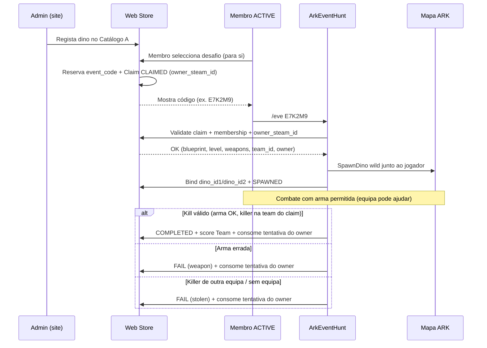

# PROJETO_ARK_EVENT_HUNT.md — Plugin ArkApi de caça a dinos de evento (PvE)

| Campo | Valor |
|-------|-------|
| **Status** | 📋 Spec + 🔧 Mode A plugin (dano % + oficiais + grant) + ✅ Mode A MVP web |
| **Versão do documento** | 1.7 |
| **Data** | 4 de agosto de 2026 |
| **Produto** | Plugin ArkApi **independente** `ArkEventHunt` — PvE jogador vs dinos de evento, pontuação para **Equipes web** (não tribos in-game) |
| **Pasta plugin** | `plugin/ArkEventHunt/` (standalone; **não** dentro de CustomShop / CustomDinoDeliver) |
| **Fora de escopo (nesta fase)** | Mode B HTTP+UI completo; plugin C++ produção |
| **UI web (alvo)** | Integrar em páginas **já existentes**: **Minha Equipe** (`#page-teams`) e **Equipes — Admin** (`#page-teams-admin`) — ver §18 |
| **Documentos relacionados** | [`SPIKE_ARK_EVENT_HUNT.md`](SPIKE_ARK_EVENT_HUNT.md), [`PROJETO_MODO_EQUIPE.md`](PROJETO_MODO_EQUIPE.md), [`REGULAMENTO_MODO_EQUIPE.md`](REGULAMENTO_MODO_EQUIPE.md), [`ARKLAND_PLUGIN_DEBUG.md`](ARKLAND_PLUGIN_DEBUG.md), [`plugin/ArkPlayer/README.md`](../plugin/ArkPlayer/README.md) *(padrão de plugin independente)* |

> **Princípio:** TribeLog **não é utilizável** para scoring/auditoria. Toda identidade de equipa vem da **Web Store (Teams)**. O plugin só observa morte, arma, ownership do claim e callbacks HTTP.

---

## 0. Resumo executivo

| Pergunta | Resposta |
|----------|----------|
| **O que é?** | Plugin ArkApi que spawna dinos **selvagens de evento**, valida regras (arma, claim, equipa) e envia score para **Teams** no site |
| **Para quem pontua?** | **Equipe web** (`team_id`), não `TribeID` in-game |
| **Modo A** | Desafio por **membro**: código único → `/eve <código>` → um dino por claim; pool partilhado; unicidade `(steam_id, challenge_id)`; score agrega na Team |
| **Modo B** | Evento público admin: `/eveadm <código>`; só equipas inscritas pontuam; leaderboard Equipe + MVP individual |
| **Códigos** | Namespace **separado** do `public_code` da loja (ex. `R21347`); padrão análogo *reserve → bind dino_id1/2* |
| **Spawn wild** | `SpawnDino` com `ForceTame = false`, nível custom + stats aleatórios (não SpawnExact tameado) |
| **Ordem de build** | Spike Die+arma+spawn → MVP Modo A → Modo B |

```
┌──────────────────────────────────────────────────────────────────┐
│  Web Store — páginas Equipes já existentes                        │
│  Minha Equipe (#page-teams)  → escolhas pessoais / scores Team (A+B) │
│  Equipes — Admin (#page-teams-admin) → cadastros A/B + ops        │
│  (Ranking Equipes / diretório: só leitura opcional de boards B)   │
└───────────────────────────────┬──────────────────────────────────┘
                                │ HTTP sessão (UI) + api_key (plugin)
┌───────────────────────────────▼──────────────────────────────────┐
│  ArkEventHunt.dll  (ArkApi plugin independente)                   │
│  /eve  /eveadm  hooks Die / arma / expire / chat                  │
└───────────────────────────────┬──────────────────────────────────┘
                                │ spawn wild
┌───────────────────────────────▼──────────────────────────────────┐
│  ARK ASE mapa (qualquer do cluster)                               │
└──────────────────────────────────────────────────────────────────┘
```

---

## 1. Visão e posicionamento

### 1.1 Visão

Criar um **loop PvE competitivo por Equipes** em que a staff regista dinos-desafio no site, **cada membro ACTIVE** reclama o seu código e caça no jogo com regras claras (arma, tentativa pessoal, anti-steal). A pontuação agrega na Equipe. Em paralelo, a staff pode correr **eventos públicos** no mapa com summon controlado, inscrição prévia e ranking Equipe + MVP, com recompensas em **posição** e **Âmbar**.

### 1.2 O que NÃO é

| Não é | É sim |
|-------|-------|
| Extensão do CustomShop | Plugin ArkApi **próprio** |
| Entrega Dino Lab / SpawnExact tameado | Spawn **wild** de evento |
| Score por tribo in-game / TribeLog | Score por **Team** web |
| Mesmo `public_code` da loja (R…) | Namespace de códigos de evento **separado** |
| Guerra PvP entre jogadores | PvE vs dino de evento (steal = FAIL do claim) |

### 1.3 Personas

| Persona | Objetivo |
|---------|----------|
| **Membro ACTIVE de Team** | Selecionar desafio no site, usar `/eve`, matar com arma correcta, pontuar a equipa |
| **Admin / staff** | Registar dinos, abrir evento Modo B, `/eveadm`, configurar armas/rewards/tames |
| **Visitante do ranking** | Ver leaderboard Equipe + MVP (Modo B) no site |
| **Agente de docs** | Manter este documento e a skill `ark-event-hunt-docs` alinhados às decisões |

---

## 2. Glossário

| Termo | Definição |
|-------|-----------|
| **Team / Equipe** | Organização web (`team_id`); ver `PROJETO_MODO_EQUIPE.md`. ≠ tribo in-game |
| **Membro ACTIVE** | Membership `status=ACTIVE` via `GET /api/teams/plugin/membership/<steam_id>` |
| **Catálogo A** | Pool partilhado de desafios registados pelo admin (Modo A) |
| **Catálogo B** | Pool **separado** de dinos de evento público (Modo B) |
| **Challenge / Desafio** | Entrada do catálogo A: blueprint, nível, armas permitidas, pontos, rewards |
| **Claim** | Reserva activa de um desafio por **um membro** (`owner_steam_id`) da sua Team (código + estado); score vai para `team_id` |
| **event_code** | Código único do claim/spawn (namespace evento; **não** `public_code` loja) |
| **public_code (loja)** | Código de auditoria de catálogo (ex. `R21347`) — **outro sistema** |
| **dino_id1 / dino_id2** | Identidade persistente do dino no motor; bind após spawn (padrão audit) |
| **Claim owner member** | `owner_steam_id` que detém o claim activo (seleccionou + `/eve`) |
| **Claim owner team** | `team_id` da equipa do membro dono (scoring + validação de kill/steal) |
| **Kill credit** | Steam/team do killer no Die **após** validar fração de dano HP de armas allowed (§10.1) |
| **FAIL** | Claim termina sem pontos (arma errada, steal, abandono, etc.); **consome** a tentativa do membro nesse desafio |
| **COMPLETED** | Kill válido; score Team; **consome** a tentativa do membro nesse desafio (Modo A) |
| **Tentativa de membro** | Unicidade Modo A: `(steam_id, challenge_id)` — no máximo **uma** tentativa terminal por membro por desafio |
| **Inscrição Modo B** | Equipa registada no evento público; só essas pontuam |
| **MVP** | Ranking individual (dano/kills) no evento Modo B |
| **Âmbar** | Moeda web creditada conforme config por dino/ranking |
| **Personal tame** | Tames do jogador permitidos ou não — flag **por dino** no catálogo |
| **Auditoria Event Hunt** | Ledger unificado (claims, summons, kills, fails, scores, Âmbar, voids, grants manuais) na **Equipes — Admin** — espírito de audit de catálogo / `amber_ledger` |
| **Entrega manual de recompensa** | Acção staff: pagar pontos hunt e/ou Âmbar em registos com `points_awarded=0` / `amber_awarded=0` (ou FAIL incorrecto / não pago por bug); sempre auditada; idempotente |

---

## 3. Decisões de produto (locked)

As decisões abaixo estão **fechadas** para a v1 do desenho. Alterações exigem update explícito deste doc + skill.

1. PvE jogador vs dinos de evento; scoring para **Teams web**, não tribos.
2. TribeLog **inutilizável** — não depender dele.
3. Plugin **independente** ArkApi (`ArkEventHunt`).
4. **Modo A** e **Modo B** coexistentes no mesmo mapa; catálogos **separados**.
5. Modo A: pool partilhado; todas as equipas / membros ACTIVE podem seleccionar os dinos registados; **um claim activo de cada vez por membro (SteamID)** — a equipa pode ter vários membros em paralelo; membros **diferentes** (incl. da mesma team) **podem** o mesmo `challenge_id`; unicidade **`(steam_id, challenge_id)`** — qualquer outcome terminal (`COMPLETED` **ou** `FAIL`) **consome** a única tentativa desse membro nesse desafio; só o dono do claim corre `/eve`; spawn ao lado desse jogador; arma errada → FAIL 0 pts; outra equipa mata → FAIL; score agrega na Team; códigos únicos namespace separado.
6. Modo B: só equipas inscritas pontuam; regras de arma por dino; personal tames configuráveis por dino; leaderboard Team + MVP; só `/eveadm` (sem `/eve` por equipa); admin summon um de cada vez, decide o próximo; spawn perto do admin; qualquer mapa do cluster; vivos no fim do evento ficam até morrer; expire anuncia no chat geral 1 min antes e ao expirar; rewards ranking **e** Âmbar configuráveis por dino.
7. Técnico: wild = `SpawnDino` ForceTame false + nível custom + stats random; tamed/SpawnExact = padrão CustomDinoDeliver (não usar para evento wild).
8. Códigos: padrão *reserve → bind dino_id1/2* análogo ao audit de catálogo, namespace separado.
9. Membership: `GET /api/teams/plugin/membership/<steam_id>`.
10. Build: spike Die+arma+spawn → MVP Modo A → Modo B.
11. **Equipes — Admin:** auditoria unificada da actividade Event Hunt (filtros team/membro/desafio/modo/status/data/valor) + opção **Entregar recompensa** em casos com reward 0 / não pago por bug (Âmbar e/ou pontos conforme config do dino/desafio); grant **só staff**, com motivo obrigatório, ligado ao registo original, **idempotente** (sem double-pay sem override explícito), sempre logado.

---

## 4. Modo A — Desafio por membro (score na Equipe)

### 4.1 Fluxo (membro ACTIVE)



### 4.2 Regras operacionais

| Regra | Detalhe |
|-------|---------|
| Pool | Todos os desafios registados são seleccionáveis por **todos** os membros ACTIVE de **todas** as equipas |
| Concorrência entre equipas | Várias equipas / membros podem ter claims do **mesmo** desafio em paralelo (códigos distintos), salvo lock futuro de “slots” (aberto — ver §15 R5) |
| Concorrência na mesma equipa | Membros **diferentes** da mesma team **podem** seleccionar / summonar o **mesmo** `challenge_id` (cada um com o seu claim e código) |
| Um de cada vez | Por **`owner_steam_id`**, no máximo **1 claim activo** (`CLAIMED` / `SPAWNED`) no Modo A — **não** há lock exclusivo por `team_id` |
| Quem selecciona | Qualquer membro **ACTIVE** — a selecção é **pessoal** (cria claim com `owner_steam_id` = esse membro) |
| Quem spawna | **Só** o `owner_steam_id` do claim via `/eve <código>` (colegas de equipa **não** usam o código alheio) |
| Spawn | Ao lado do jogador que executou `/eve` (o dono) |
| Kill pela equipa | Após spawn, qualquer membro da **mesma** `team_id` pode dar o kill credit (arma OK) → `COMPLETED` + pontos Team; a tentativa consumida é a do **dono** do claim |
| Arma errada | FAIL imediato do claim; 0 pontos; **consome** a tentativa do dono nesse desafio; dino pode ser despawnado ou marcado inválido (spike decide) |
| Steal | Morte por jogador cuja Team ≠ claim owner team → FAIL do claim (0 pts); **não** creditado à equipa ladra no Modo A; **consome** a tentativa do dono |
| Unicidade (locked) | Chave **`(steam_id, challenge_id)`**. Membro M que já tem tentativa terminal nesse desafio **não** pode seleccionar / summonar de novo. Membro N (mesmo da mesma team) **pode** |
| Consumo da tentativa | **Default locked:** qualquer estado terminal **`COMPLETED` ou `FAIL`** (weapon, stolen, expired, admin void, …) **consome** a única tentativa do membro nesse desafio. **Cancelar** um claim ainda `CLAIMED` (sem spawn) **não** consome |
| Score | Pontos do desafio → ledger da **Equipe** (`team_id`); agrega conclusões de **todos** os membros |

### 4.3 Estados do Claim (Modo A)

Ver máquina de estados §6.1.

---

## 5. Modo B — Evento público admin

### 5.1 Fluxo

```mermaid
sequenceDiagram
  participant Admin as Admin
  participant Web as Web Store
  participant Plug as ArkEventHunt
  participant ARK as Mapa
  participant T as Teams inscritas

  Admin->>Web: Cria Evento B + Catálogo B + janela
  T->>Web: Inscrição da equipa
  Admin->>Web: Abre evento (ACTIVE)
  loop Um dino de cada vez
    Admin->>Plug: /eveadm <código>
    Plug->>Web: Resolve código Catálogo B
    Plug->>ARK: Spawn wild perto do admin
    Plug->>Web: Bind + ALIVE
    Note over ARK: Qualquer jogador pode lutar;<br/>só inscritas pontuam
    Plug->>Web: Kill credit (team + steam MVP)
  end
  Admin->>Web: Encerra evento
  Note over ARK: Dinos vivos permanecem até morte
  Web->>Web: Fecha ranking; paga Âmbar/ranking
```

### 5.2 Regras operacionais

| Regra | Detalhe |
|-------|---------|
| Catálogo | **Separado** do Catálogo A |
| Pontuação | Apenas equipas **inscritas** no evento |
| Comando jogador | **Não há** `/eve` no Modo B |
| Comando admin | `/eveadm <código>` — um summon de cada vez; admin decide o próximo |
| Spawn | Perto do admin |
| Mapas | Qualquer mapa do cluster |
| Armas | Regras anexadas a **cada** registo de dino |
| Personal tames | Flag configurável **por dino** (`allow_personal_tames`) |
| Fim do evento | Dinos ainda vivos **não** despawnam automaticamente; ficam até morte natural/combate |
| Expiração de dino | Se o dino tiver TTL: anúncio chat geral **1 min antes** e **ao expirar** |
| Leaderboard | **Team** (agregado) + **MVP individual** |
| Rewards | Ranking **e** Âmbar — ambos configuráveis por dino / tabela de prémios do evento |
| Coexistência | Modo A claims e Modo B spawns no **mesmo mapa** sem partilhar códigos/catálogo |
| Unicidade de summon | **Sem** limite por membro no summon: o admin spawna dinos partilhados do Catálogo B; jogadores não fazem `/eve`. Um membro **pode** matar / contribuir em várias instâncias do mesmo tipo de dino B na mesma sessão (MVP/kills acumulam). Inscrição continua **por equipa** |

> **Nota vs Modo A:** a regra `(steam_id, challenge_id)` **não** se aplica ao Modo B. B permanece inscrição team-level + credit por kill/MVP per-member sem “uma tentativa por dino”.

### 5.3 Expiração e chat

1. Timer por instância de dino B (se `expires_at` / `ttl_sec` definido).
2. T−60s: mensagem geral (ex.: `[Evento] Rex Alfa expira em 1 minuto!`).
3. T=0: mensagem de expiração + despawn ou kill admin-safe (definir no spike; preferir despawn limpo se API permitir).
4. Se o evento encerrou mas o dino ainda está vivo **sem** TTL de instância: permanece (regra locked).

---

## 6. Máquinas de estado

### 6.1 Claim Modo A

```
                    ┌─────────────┐
         select     │   RESERVED  │  (código reservado, ainda não revelado — opcional)
                    └──────┬──────┘
                           │ emit code to team
                    ┌──────▼──────┐
         /eve OK    │   CLAIMED   │  (código válido, dino ainda não spawnnou)
                    └──────┬──────┘
                           │ spawn + bind ids
                    ┌──────▼──────┐
           ┌────────┤   SPAWNED   ├────────┐
           │        └──────┬──────┘        │
           │ weapon fail   │ valid kill    │ steal / timeout / admin void
           ▼               ▼               ▼
        ┌──────┐      ┌──────────┐    ┌──────┐
        │ FAIL │      │COMPLETED │    │ FAIL │
        └──────┘      └──────────┘    └──────┘
```

| Estado | Significado | Transições típicas |
|--------|-------------|--------------------|
| `RESERVED` | Código alocado internamente | → `CLAIMED` |
| `CLAIMED` | Membro dono tem código; aguarda `/eve` | → `SPAWNED`, → `FAIL`/`EXPIRED` (TTL claim) |
| `SPAWNED` | Dino vivo bound a `dino_id1/2` | → `COMPLETED`, → `FAIL` |
| `COMPLETED` | Kill válido; score Team; consome tentativa do `owner_steam_id` | terminal |
| `FAIL` | 0 pontos; claim morto; **também** consome tentativa do `owner_steam_id` | terminal |
| `EXPIRED` | TTL do código/claim sem spawn ou abandono; trata-se como terminal consumidor (equiv. FAIL expired) | terminal |

**Invariantes:**

- Unicidade: `(owner_steam_id, challenge_id)` com tentativa terminal (`COMPLETED` / `FAIL` / `EXPIRED`) ⇒ nova selecção **desse membro** rejeitada.
- Membros distintos (mesmo `team_id` ou não) **podem** cada um ter o seu claim do mesmo `challenge_id`.
- Um `owner_steam_id` ⇒ no máximo um claim em `{CLAIMED, SPAWNED}` (lock one-at-a-time **por membro**).
- **Não** há invariante “no máximo 1 activo por `team_id`”.
- Cancel `CLAIMED` (sem spawn) ⇒ não escreve lock de tentativa; membro pode voltar a escolher o mesmo desafio.
- Bind `event_code ↔ (dino_id1, dino_id2)` é 1:1 após spawn.
- `/eve` só é aceite se `steam_id` do jogador = `owner_steam_id` do claim.

### 6.2 Instância Modo B

```
  REGISTERED (catálogo B)
       │ /eveadm
       ▼
    ALIVE ──► KILLED (credit) ──► SCORED
       │
       ├─► EXPIRED (TTL)
       └─► ORPHAN_ALIVE (evento CLOSED; espera morte)
```

| Estado | Significado |
|--------|-------------|
| `REGISTERED` | Entrada no catálogo B com código summon |
| `ALIVE` | Spawnnado; tracking activo |
| `KILLED` | Morte registada; pending score |
| `SCORED` | Pontos/Âmbar aplicados (se elegível) |
| `EXPIRED` | TTL; anunciado; removido |
| `ORPHAN_ALIVE` | Evento fechado; tracking mínimo até morte |

### 6.3 Evento Modo B (sessão)

```
DRAFT → OPEN_INSCRIPTION → ACTIVE → CLOSING → CLOSED
```

- `ACTIVE`: `/eveadm` permitido; scores aceites para inscritas.
- `CLOSING`/`CLOSED`: novos summons bloqueados; vivos → `ORPHAN_ALIVE`.

---

## 7. Comandos

### 7.1 Jogador

| Comando | Modo | Quem | Efeito |
|---------|------|------|--------|
| `/eve <código>` | A | **Dono** do claim (`owner_steam_id`) ACTIVE | Valida código + ownership, spawna wild ao lado, bind |
| `/eve` (sem args) | A | — | Ajuda curta / status do **meu** claim activo (opcional MVP) |

### 7.2 Admin

| Comando | Modo | Quem | Efeito |
|---------|------|------|--------|
| `/eveadm <código>` | B | Admin/staff (Permissions) | Spawna próximo dino do Catálogo B perto do admin |
| `/eveadm status` *(opcional)* | B | Admin | Lista vivos / próximo código |
| RCON `ArkEventHunt.Reload` | — | Admin | Recarrega `config.json` |

### 7.3 O que NÃO existe

- `/eve` no Modo B.
- Comando de score manual por jogador.
- Dependência de comandos CustomShop / CustomDinoDeliver.

### 7.4 Permissões

- Jogador: chat command registado no ArkApi; auth via API membership + **ownership do claim** (`owner_steam_id`).
- Admin: grupo Permissions (padrão ArkPlayer/CustomShop) + validação server-side do código B.

---

## 8. Modelo de dados (sketch)

> Sketch — não é migration final. Nomes ilustrativos.

### 8.1 Catálogo A — `event_hunt_challenges`

| Campo | Tipo | Notas |
|-------|------|-------|
| `challenge_id` | PK | |
| `species_key` / `blueprint` | str | Path Blueprint |
| `display_name` | str | |
| `level` | int | Nível wild target |
| `stats_mode` | enum | `RANDOM` (default) |
| `allowed_weapons` | JSON | Lista de BP / tags / categorias (preferir presets da biblioteca) |
| `forbidden_weapons` | JSON | Opcional |
| `min_allowed_weapon_damage_ratio` | float | Default `0.80` — fracção mínima de HP de armas allowed |
| `forbid_torpor` | bool | Default `true` — torpor/tranq → FAIL `weapon` |
| `official_weapons_only` | bool | Default `true` — só vanilla/DLC |
| `grant_weapon_on_start` | bool | Default `true` — entregar arma no `/eve` |
| `grant_weapon_blueprint` | str | BP do item a entregar (preset) |
| `grant_weapon_qty` | int | Default `1` |
| `loot_on_complete` | JSON | Lista `[{blueprint, qty}, …]` — GiveItem ao **killer** só em COMPLETED; vazio = sem loot; **não** incluir ItensAlfa / Tek Alfa nos seeds |
| `points` | int | Score Team em COMPLETED |
| `amber_reward` | int | Opcional Modo A |
| `claim_ttl_sec` | int | Tempo para `/eve` após select |
| `spawn_ttl_sec` | int | Tempo máximo vivo após spawn (opcional) |
| `enabled` | bool | |
| `created_at` | ts | |

### 8.1b Biblioteca de armas — `event_hunt_weapon_presets`

| Campo | Tipo | Notas |
|-------|------|-------|
| `preset_id` | PK | |
| `name` | str | Label admin (ex. «Shotgun fabricada») |
| `blueprint` | str | Path `PrimalItem_Weapon…` oficial |
| `tag` | str | `bow` / `melee` / `firearm` / … |
| `created_at` | ts | |

Seed inicial com armas oficiais comuns; admin CRUD em Equipes — Admin («Armas oficiais salvas»).

### 8.2 Claims A — `event_hunt_claims`

| Campo | Tipo | Notas |
|-------|------|-------|
| `claim_id` | PK | |
| `challenge_id` | FK | |
| `team_id` | FK | Equipe web (scoring + steal check) |
| `owner_steam_id` | str | **Dono** da tentativa; UNIQUE parcial com status activo (ver invariantes) |
| `event_code` | str UNIQUE | Namespace evento |
| `status` | enum | Ver §6.1 |
| `selected_by_steam_id` | str | = `owner_steam_id` na v1 (quem escolheu no site) |
| `spawned_by_steam_id` | str | Quem deu `/eve` (deve = owner) |
| `dino_id1` / `dino_id2` | bigint | Bind pós-spawn |
| `server_id` / `map_name` | str | Onde spawnnou |
| `fail_reason` | str | `weapon` / `stolen` / `expired` / `admin_void` / … |
| `points_awarded` | int | Score creditado à Team (0 se FAIL / bug / void) |
| `amber_awarded` | int | Âmbar creditado (0 se não aplicável / bug / não pago) |
| `reward_status` | enum | `NONE` · `PAID` · `UNPAID` · `PARTIAL` · `MANUAL_PAID` (ver §8.10) |
| `completed_at` / `failed_at` | ts | |
| `idempotency_key` | str | Anti double-score |

Índice / constraint sugerido: no máximo um row por `owner_steam_id` com `status IN ('CLAIMED','SPAWNED')`.

### 8.3 Lock de tentativa — `event_hunt_member_challenge_locks`

Substitui o antigo conceito `event_hunt_team_completions` (lock por team).

| Campo | Tipo | Notas |
|-------|------|-------|
| `steam_id` | PK part | Membro |
| `challenge_id` | PK part | UNIQUE(`steam_id`, `challenge_id`) |
| `team_id` | FK | Team no momento do terminal (auditoria; score já foi à team) |
| `claim_id` | FK | Claim que consumiu |
| `outcome` | enum | `COMPLETED` / `FAIL` / `EXPIRED` |
| `fail_reason` | str | Se FAIL/EXPIRED |
| `consumed_at` | ts | |

> Qualquer insert nesta tabela **bloqueia** nova selecção desse `(steam_id, challenge_id)`. Cancel de `CLAIMED` **não** insere.

### 8.4 Catálogo B — `event_hunt_public_dinos`

| Campo | Tipo | Notas |
|-------|------|-------|
| `public_dino_id` | PK | |
| `event_session_id` | FK | Sessão Modo B |
| `event_code` | str UNIQUE | Para `/eveadm` |
| `blueprint` / `level` | | |
| `allowed_weapons` | JSON | |
| `allow_personal_tames` | bool | **Por dino** |
| `points_team` | int | |
| `points_mvp` | int / weight | |
| `amber_team` / `amber_mvp` | int | Configurável |
| `rank_rewards_json` | JSON | Tabela ranking |
| `loot_on_complete` | JSON | Opcional — mesmo formato do Modo A; GiveItem ao killer em kill válido |
| `ttl_sec` | int | Expiração instância |
| `sort_order` | int | Ordem sugerida (admin ainda escolhe) |

### 8.5 Sessão B — `event_hunt_sessions`

| Campo | Tipo | Notas |
|-------|------|-------|
| `event_session_id` | PK | |
| `name` | str | |
| `status` | enum | DRAFT…CLOSED |
| `map_scope` | str | `*` ou lista |
| `starts_at` / `ends_at` | ts | |
| `inscription_required` | bool | true locked |

### 8.6 Inscrições — `event_hunt_inscriptions`

| `event_session_id` | `team_id` | `inscribed_at` | `status` |

### 8.7 Instâncias B — `event_hunt_instances`

| Campo | Notas |
|-------|-------|
| `instance_id`, `public_dino_id`, `event_code` | |
| `status`, `dino_id1/2`, `spawned_by_admin`, `server_id` | |
| `expires_at`, `warned_1min` | |
| `killer_steam_id`, `killer_team_id`, `damage_json` *(futuro)* | |
| `points_awarded` / `amber_awarded` / `reward_status` | Espelho do claim A (§8.2) — 0 / `UNPAID` em fail weapon, não-inscrita, bug |

### 8.8 Leaderboard / ledger

- `event_hunt_scores` — append-only: `(session_or_mode, team_id, steam_id, points, amber, reason, claim_or_instance_id, idempotency_key)`.
- Integração Âmbar: mesmo padrão ARKBANK / `amber_ledger` (idempotente).
- Entradas de score/Âmbar **também** projectam-se na vista de auditoria (§8.10).

### 8.9 Códigos (`event_code`) — namespace separado

| Sistema | Exemplo | Uso |
|---------|---------|-----|
| Loja `public_code` | `R21347` | Audit catálogo shop / TamedName |
| Evento `event_code` | Prefixo distinto, ex. `E` + alfanumérico (`E7K2M9`) ou `H` + seq | Claims A e summons B |

**Padrão análogo ao audit:**

1. **Reserve** código ao criar claim (A) ou ao registar dino (B).
2. **Spawn** no plugin.
3. **Bind** `dino_id1`/`dino_id2` no callback.
4. Lookup posterior por IDs ou por código — **tabelas próprias**, sem colisão com `catalog_dino_*`.

### 8.10 Auditoria e grants manuais

Vista unificada (tabela ou VIEW) para **Equipes — Admin** — espírito do audit de dinos de catálogo / visibilidade de `amber_ledger`.

#### `event_hunt_audit_events` (append-only / projectado)

| Campo | Tipo | Notas |
|-------|------|-------|
| `audit_id` | PK | |
| `occurred_at` | ts | |
| `mode` | enum | `A` / `B` |
| `event_type` | enum | `CLAIM_SELECT` · `SPAWN` · `SUMMON` · `KILL` · `COMPLETE` · `FAIL` · `SCORE` · `AMBER_AWARD` · `VOID` · `CANCEL` · `EXPIRE` · `MANUAL_GRANT` · … |
| `status` | str | Estado resultante do registo fonte |
| `team_id` | FK nullable | |
| `member_steam_id` | str | Owner / killer / actor relevante |
| `challenge_id` / `public_dino_id` | FK nullable | Desafio A ou dino B |
| `source_kind` | enum | `claim` · `instance` · `score` · `grant` |
| `source_id` | bigint | `claim_id` / `instance_id` / … |
| `points_awarded` | int | Valor neste evento (pode ser 0) |
| `amber_awarded` | int | Idem |
| `reward_status` | enum | `NONE` · `PAID` · `UNPAID` · `PARTIAL` · `MANUAL_PAID` |
| `fail_reason` / `note` | str | |
| `actor_steam_id` | str nullable | Quem fez a acção (jogador ou **admin** no grant/void) |
| `server_id` / `event_code` | str | |

Filtros UI/API: `team_id`, `member_steam_id`, `challenge_id`/`public_dino_id`, `mode`, `status`/`event_type`, intervalo de datas, `points_awarded` / `amber_awarded` (ex. `=0`, `>0`, faixa).

#### `event_hunt_manual_grants`

| Campo | Tipo | Notas |
|-------|------|-------|
| `grant_id` | PK | |
| `source_kind` | enum | `claim` / `instance` |
| `source_id` | FK | Registo original (claim/kill) |
| `audit_id` | FK nullable | Linha de auditoria que originou a acção |
| `team_id` | FK | Destino do score |
| `beneficiary_steam_id` | str | Membro / killer alvo |
| `points_granted` | int | ≥ 0; tipicamente = `points` config do desafio/dino |
| `amber_granted` | int | ≥ 0 |
| `reason` | str | **Obrigatório** (nota staff — caso de bug) |
| `admin_steam_id` | str | Quem concedeu |
| `created_at` | ts | |
| `idempotency_key` | str UNIQUE | Default: `manual_grant:{source_kind}:{source_id}` |
| `override_double_pay` | bool | Default `false`; só `true` com confirmação explícita UI + flag no POST |

**Regras:**

1. Elegível a «Entregar recompensa» quando o registo fonte tem `points_awarded=0` **ou** `amber_awarded=0` **ou** `reward_status IN ('UNPAID','PARTIAL','NONE')` com outcome que **deveria** ter pago (ex. COMPLETED/KILL com bug; FAIL incorrecto confirmado por staff).
2. Valores concedidos = config actual do desafio/dino (`points` / `amber_reward` / `points_team` / `amber_*`) **ou** override numérico staff no modal (dentro do permitido pela config — documentar na UI).
3. Sem `override_double_pay`: rejeitar se já existe grant com a mesma `idempotency_key` **ou** se `reward_status=PAID|MANUAL_PAID` com valores > 0.
4. Com override: nova key `manual_grant:{source}:{id}:override:{n}` + motivo obrigatório a mencionar double-pay.
5. Grant escreve: linha em `event_hunt_manual_grants` + `event_hunt_scores` / `amber_ledger` + evento `MANUAL_GRANT` na auditoria + actualiza `points_awarded`/`amber_awarded`/`reward_status=MANUAL_PAID` no fonte.
6. **Não** reabre tentativa Modo A por si só (lock `(steam_id, challenge_id)` mantém-se). Reset de lock é ops separada (fora deste fluxo salvo pedido futuro).

---

## 9. API sketch (Web Store ↔ Plugin + UI)

Dois canais de auth:

| Canal | Auth | Consumidor |
|-------|------|------------|
| **Plugin bridge** | `api_key` (padrão Teams / CustomShop) | `ArkEventHunt.dll` |
| **UI web** | Sessão Steam (mesmo cookie que `/api/teams/my`) | `static/index.html` — Minha Equipe / Equipes — Admin |

Mapa acção UI → endpoint: **§18.6**.

### 9.1 Membership (já existe)

```
GET /api/teams/plugin/membership/<steam_id>
→ { active, steam_id, team_id, role, ... }
```

Usar em `/eve` antes de spawn.

### 9.2 Modo A — plugin + UI

| Método | Path | Canal | Função |
|--------|------|-------|--------|
| `GET` | `/api/event-hunt/a/challenges` | UI (ACTIVE) / admin | Lista desafios do pool (filtros: `enabled`, `available_for_me`) |
| `POST` | `/api/event-hunt/a/claims` | UI (ACTIVE) | Seleccionar desafio **para mim** → `event_code` + claim `CLAIMED` (`owner_steam_id`) |
| `GET` | `/api/event-hunt/a/me/summary` | UI (ACTIVE) | Snapshot do **membro**: meu activo, meus consumidos, lock pessoal |
| `GET` | `/api/event-hunt/a/team/summary` | UI (ACTIVE) | Snapshot Equipe: pontos hunt agregados, conclusões/fails da team, claims activos dos membros (leitura) |
| `GET` | `/api/event-hunt/a/team/claims` | UI (ACTIVE) | Histórico claims da team (`status`, `fail_reason`, `owner_steam_id`, paginação) |
| `GET` | `/api/event-hunt/a/me/claims` | UI (ACTIVE) | Histórico **meu** (opcional; pode derivar de team/claims filtrado) |
| `POST` | `/api/event-hunt/a/claims/<id>/cancel` | UI (ACTIVE) | Cancelar **meu** claim ainda `CLAIMED` (sem spawn) — **não** consome tentativa |
| `GET` | `/api/event-hunt/a/claims/by-code/<code>` | Plugin | Validar código + payload spawn + `owner_steam_id` |
| `POST` | `/api/event-hunt/a/claims/<id>/spawned` | Plugin | Bind `dino_id1/2`, `server_id`, `steam_id` (= owner) |
| `POST` | `/api/event-hunt/a/claims/<id>/complete` | Plugin | Kill válido + idempotency + lock membro |
| `POST` | `/api/event-hunt/a/claims/<id>/fail` | Plugin | `reason=weapon\|stolen\|expired\|…` + lock membro |
| `POST` | `/api/admin/event-hunt/a/challenges` | Admin UI | Criar desafio Catálogo A |
| `PUT` | `/api/admin/event-hunt/a/challenges/<id>` | Admin UI | Editar / enable-disable |
| `DELETE` | `/api/admin/event-hunt/a/challenges/<id>` | Admin UI | Soft-delete ou disable (preferir `enabled=false` se já houve claims) |
| `GET` | `/api/admin/event-hunt/a/claims` | Admin UI | Ops: listar claims (filtros team/steam/status/código) |
| `POST` | `/api/admin/event-hunt/a/claims/<id>/void` | Admin UI | Anular claim activo → `FAIL` admin (**consome** tentativa do owner) |

### 9.3 Modo B — plugin + UI

| Método | Path | Canal | Função |
|--------|------|-------|--------|
| `GET` | `/api/event-hunt/b/sessions/current` | UI | Sessão visível (OPEN_INSCRIPTION / ACTIVE) + estado inscrição da minha team |
| `POST` | `/api/event-hunt/b/sessions/<id>/inscribe` | UI (ACTIVE) | Inscrever Equipe (qualquer membro ACTIVE) |
| `POST` | `/api/event-hunt/b/sessions/<id>/withdraw` | UI (ACTIVE) | Desinscrever se ainda `OPEN_INSCRIPTION` |
| `GET` | `/api/event-hunt/b/sessions/<id>/leaderboard` | UI / público | Team + MVP |
| `GET` | `/api/event-hunt/b/team/summary` | UI (ACTIVE) | Pontos B da minha team + posição + melhor MVP da team |
| `GET` | `/api/event-hunt/b/codes/<code>` | Plugin | Payload `/eveadm` — exige dino `enabled`, sessão `ACTIVE`, **sem** instância `ALIVE`/`ORPHAN_ALIVE` |
| `POST` | `/api/event-hunt/b/instances/spawned` | Plugin | Bind confirm-spawn (`ALIVE`) |
| `POST` | `/api/event-hunt/b/instances/<id>/kill` | Plugin | Credit team+MVP se inscrita |
| `POST` | `/api/event-hunt/b/instances/<id>/expire` | Plugin | Expiração |
| `GET` | `/api/admin/event-hunt/b/sessions` | Admin UI | Listar sessões |
| `POST` | `/api/admin/event-hunt/b/sessions` | Admin UI | Criar sessão (DRAFT) |
| `PUT` | `/api/admin/event-hunt/b/sessions/<id>` | Admin UI | Editar metadados / janelas |
| `POST` | `/api/admin/event-hunt/b/sessions/<id>/transition` | Admin UI | `OPEN_INSCRIPTION` → `ACTIVE` → `CLOSING` → `CLOSED` |
| `GET`/`POST`/`PUT` | `/api/admin/event-hunt/b/sessions/<id>/dinos` | Admin UI | CRUD Catálogo B da sessão + `event_code` |
| `GET` | `/api/admin/event-hunt/b/sessions/<id>/inscriptions` | Admin UI | Overview de inscritas |
| `GET` | `/api/admin/event-hunt/b/instances` | Admin UI | Instâncias vivas / histórico |
| `POST` | `/api/admin/event-hunt/b/instances/<id>/void` | Admin UI | Anular credit / marcar inválida; **também** limpa `ALIVE` stuck para permitir novo `/eveadm` do mesmo código |

**`GET /b/codes/<code>` — rejeições típicas (JSON `{ok:false,error,error_code?}`):**

| HTTP | `error_code` | Causa |
|------|--------------|--------|
| 404 | — | Código inexistente no Catálogo B |
| 400 | `dino_disabled` | Dino com `enabled=false` (UI deve mostrar estado **OFF**; botão «Activar») |
| 400 | `session_not_active` | Sessão ≠ `ACTIVE` |
| 409 | `instance_alive` | Já há `ALIVE`/`ORPHAN_ALIVE` — kill/expire **ou** `POST .../b/instances/<id>/void` |

Fluxo confirm-spawn: `/eveadm` → `GET .../codes/<code>` → spawn in-game → `POST .../instances/spawned` (cria `ALIVE`). Enquanto existir vivo, o mesmo código **não** volta a resolver no by-code.

### 9.3b Auditoria admin + entrega manual de recompensa

| Método | Path | Canal | Função |
|--------|------|-------|--------|
| `GET` | `/api/admin/event-hunt/audit` | Admin UI | Lista paginada de eventos (§8.10); filtros abaixo |
| `GET` | `/api/admin/event-hunt/audit/<audit_id>` | Admin UI | Detalhe + registo fonte + grants ligados |
| `POST` | `/api/admin/event-hunt/audit/<audit_id>/grant-reward` | Admin UI | Entregar recompensa (bug / reward 0) |
| `POST` | `/api/admin/event-hunt/claims/<claim_id>/grant-reward` | Admin UI | Alias directo por claim A |
| `POST` | `/api/admin/event-hunt/instances/<instance_id>/grant-reward` | Admin UI | Alias directo por instância B |

**Query params `GET .../audit`:** `team_id`, `member_steam_id`, `challenge_id`, `public_dino_id`, `mode=A|B`, `event_type`, `status`, `reward_status`, `from`/`to` (ISO), `points_awarded_min`/`max`, `amber_awarded_min`/`max`, `unpaid_only=1`, `page`/`page_size`.

**Body `POST .../grant-reward` (sketch):**

```json
{
  "reason": "Kill válido; complete devolveu points_awarded=0 por bug R-123",
  "admin_steam_id": "76561198...",
  "grant_points": true,
  "grant_amber": true,
  "points_amount": null,
  "amber_amount": null,
  "override_double_pay": false,
  "idempotency_key": null
}
```

| Campo | Regra |
|-------|--------|
| `reason` | **Obrigatório**; mínimo razoável de chars (ex. ≥ 10) |
| `admin_steam_id` | Sessão admin (server deriva do cookie; body opcional para audit espelho) |
| `grant_points` / `grant_amber` | Pelo menos um `true`; scope = pontos hunt e/ou Âmbar da config do dino/desafio |
| `points_amount` / `amber_amount` | `null` = usar valor configurado no desafio/dino; se set, staff override explícito |
| `override_double_pay` | Default `false`; `true` só com UI de confirmação «já pago — forçar» |
| Resposta OK | `{ ok, grant_id, points_granted, amber_granted, reward_status: "MANUAL_PAID", audit_id }` |
| Erros | `409` já pago sem override · `400` reason em falta · `403` não admin · `404` fonte |

> Canal **só** Admin UI (sessão Steam staff). Plugin **não** chama grant-reward.

### 9.4 Contratos mínimos de spawn payload

```json
{
  "ok": true,
  "mode": "A",
  "event_code": "E7K2M9",
  "claim_id": 123,
  "team_id": 45,
  "owner_steam_id": "76561198000000000",
  "blueprint": "Blueprint'/Game/...'",
  "level": 150,
  "allowed_weapons": ["tag:shotgun", "BP_..."],
  "grant_weapon_on_start": true,
  "grant_weapon_blueprint": "Blueprint'/Game/.../PrimalItem_WeaponShotgun...'",
  "grant_weapon_qty": 1,
  "loot_on_complete": [
    { "blueprint": "Blueprint'/Game/.../PrimalItemArmor_RexSaddle...'", "qty": 1 }
  ],
  "allow_personal_tames": false,
  "dino_ttl_sec": 900
}
```

### 9.5 Snapshot UI — `GET /api/event-hunt/a/me/summary` (sketch)

```json
{
  "ok": true,
  "data": {
    "steam_id": "76561198000000000",
    "team_id": 45,
    "my_active_claim": {
      "claim_id": 123,
      "challenge_id": 7,
      "display_name": "Rex Shotgun 150",
      "event_code": "E7K2M9",
      "status": "CLAIMED",
      "claim_expires_at": "2026-08-03T23:00:00Z",
      "points": 500
    },
    "lock": { "one_active_per_member": true, "can_select": false, "reason": "active_claim" },
    "my_consumed": [
      { "challenge_id": 3, "display_name": "Therizino", "outcome": "COMPLETED", "points": 300, "consumed_at": "..." },
      { "challenge_id": 5, "display_name": "Giga", "outcome": "FAIL", "fail_reason": "weapon", "consumed_at": "..." }
    ],
    "scores_team": { "hunt_points_total": 800, "amber_total": 0, "completed_count_team": 2, "failed_count_team": 3 }
  }
}
```

> `GET /api/event-hunt/a/team/summary` continua a expor agregados da equipa + lista curta de `active_claims_by_members` (leitura; códigos só revelados ao **dono** na UI — ver §18).

---

## 10. Motor de regras

### 10.1 Validação de arma (dano acumulado + oficiais)

> **Locked (2026-08-04):** o golpe final **sozinho** não basta. O plugin rastreia dano HP durante o claim (`TakeDamage` + golpe fatal em `Die`).

1. Em cada hit no dino tagged, resolve-se a arma (`DamageCauser` / classe) e atribui-se o HP a **allowed** ou **other**.
2. **Arma desconhecida / tames / turrets / ambiente** → conta como **other** (estrito, anti-cheese).
3. No `Die`, exige-se:
   - `allowed_hp / (allowed_hp + other_hp) >= MinAllowedWeaponDamageRatio` (default **0.80**);
   - se `ForbidTorpor=true` (default) e houve torpor/tranq detectável → `FAIL` `weapon`;
   - killer na mesma Equipe → `COMPLETED`; outra Equipe → `FAIL` `stolen`.
4. **`OfficialWeaponsOnly` (default true):** só BPs oficiais (vanilla/DLC) contam como allowed. Heurística extra rejeita paths `/Mods/` / workshop; a **whitelist / catálogo oficial é a fonte de verdade** (não se enumeram todos os mods).
5. Match por: BP substring, `tag:` (ex. `tag:shotgun`), catálogo `OfficialWeaponCatalog` no `config.json` do plugin.
6. Sem HP rastreado no Die → `FAIL` `weapon` (não prova cumprimento).
7. **Modo B:** stubs; mesma política quando implementado.

#### 10.1.1 Biblioteca admin + entregar arma

| Peça | Função |
|------|--------|
| `event_hunt_weapon_presets` | Biblioteca **Armas oficiais salvas** (nome + BP + tag); UX primária — multi-select no criar desafio |
| CSV / BP custom | Ainda permitido para power users |
| `GrantWeaponOnStart` | Se true, no `/eve` o plugin **dá o item** oficial ao inventário (`UPrimalItem::AddNewItem`) |
| `grant_weapon_blueprint` / qty | BP a entregar (preset ou override); **não substitui** a whitelist — a whitelist deve incluir esse BP |

**Recomendação locked:** biblioteca = UX obrigatória de reutilização; grant = **default ON** em desafios estritos (todos começam com a mesma arma oficial).

#### 10.1.2 Knobs (desafio e/ou `config.json`)

| Campo | Default | Notas |
|-------|---------|-------|
| `MinAllowedWeaponDamageRatio` | `0.80` | Fração mínima de HP de armas allowed |
| `ForbidTorpor` | `true` | Qualquer torpor detectável → FAIL `weapon` |
| `OfficialWeaponsOnly` | `true` | Mods / paths suspeitos → other |
| `GrantWeaponOnStart` | `true` (novos desafios) | Entrega item no spawn |
| `OfficialWeaponCatalog` | embutido + config | Lista starter de BPs oficiais |

Fail reasons: `weapon` (ratio / torpor / oficiais) · `stolen` (outra Equipe).

#### 10.1.3 Loot on COMPLETED (`loot_on_complete`)

| Peça | Função |
|------|--------|
| Campo desafio / dino B | JSON `[{ "blueprint": "Blueprint'/Game/…'", "qty": 1 }, …]` |
| Quando | Só kill **válido** (Mode A `COMPLETED`; Mode B kill `valid=true`) |
| Quem recebe | **Killer** — inventário via `UPrimalItem::AddNewItem` (mesmo padrão `GrantWeaponOnStart`) |
| FAIL / stolen / weapon / tame | **Nunca** entrega loot |
| Idempotência | Plugin: `MarkOutcomeSent` antes do grant (1× por dino bind) |
| Inventário cheio | Chat warn (`LootInventoryFull`) + log; best-effort nos restantes stacks |
| Seeds / exemplos | Selas, armaduras, armas — **mods + vanilla**; **proibido** ItensAlfa / Tek Alfa / kits alfa nos seeds |
| Admin UI | Catálogo A: linhas loot no criar + botão **Loot** para editar |

by-code / claim-summon payload inclui `loot_on_complete` para o plugin guardar no registry no spawn.

### 10.2 Credit de kill / steal (Modo A)

| Killer | Resultado |
|--------|-----------|
| Mesma `team_id` do claim + arma OK | `COMPLETED` + score Team; consome tentativa do **`owner_steam_id`** |
| Mesma team + arma ERRADA | `FAIL` weapon; consome tentativa do owner |
| Outra team / sem team | `FAIL` stolen; consome tentativa do owner |
| Ambiente / suicide dino / despawn | `FAIL` ou `EXPIRED` (definir); **também consome** |

### 10.3 Personal tames (Modo B prioritário; A opcional)

- Se `allow_personal_tames=false`: dano (ou kill assist) de tames pessoais pode anular credit / FAIL — **precisão do hook a provar no spike**.
- Se `true`: tames permitidos sob as mesmas regras de arma do *rider* ou do dino (abrir no spike).

### 10.4 Rewards

| Modo | Score | Âmbar | Loot in-game |
|------|-------|-------|--------------|
| A | `points` → Team ledger | Opcional por desafio | `loot_on_complete` → inventário do killer no COMPLETED |
| B | Agregado Team + MVP | Por dino + tabela ranking; ambos configuráveis | `loot_on_complete` no dino B (se configurado) |

Pagamentos **idempotentes** (`idempotency_key = complete:{claim_id}` / `kill:{instance_id}`).

Correcção staff (bug / reward 0): `manual_grant:{source_kind}:{source_id}` via §9.3b — **não** substitui o fluxo automático; só completa pagamentos falhados. Loot in-game **não** é reentregue por grant manual de pontos/Âmbar (só GiveItem no Die).

---

## 11. Anti-fraude e integridade

| Risco | Mitigação |
|-------|-----------|
| Double `/eve` / double complete | Estado do claim + idempotency na API |
| Código partilhado entre membros/equipas | Código bound a `owner_steam_id` + `team_id`; `/eve` só do owner; membership check no spawn |
| Steal intencional | FAIL owner; Modo A sem reward ao ladrão; tentativa do dono consumida |
| Fake dino_id bind | Bind só imediatamente pós-spawn; rejeitar IDs já bound |
| Colisão com `public_code` loja | Namespace/tabelas separados |
| TribeLog spoof | **Não usar** TribeLog |
| Admin code leak Modo B | Códigos só UI admin / RCON; não página pública de jogador |
| Farm re-run Modo A (mesmo membro) | Tabela `event_hunt_member_challenge_locks` UNIQUE(`steam_id`,`challenge_id`) |
| Farm via “passar código” a colega | `/eve` rejeita se Steam ≠ owner; cancel sem spawn não transferível sem nova select do owner |
| Replay HTTP | api_key + idempotency + status machine |
| Jogador sai da equipa mid-claim | Revalidar membership no complete; se left → FAIL (consome) |
| Multi-mapa exploit | Claim/spawn grava `server_id`; complete só do mesmo server que spawnnou |
| Arma “errada” ambígua (tek buff) | Spike deve listar fontes de dano cobertas; documentar gaps |
| Troca de conta / multi-Steam na mesma pessoa | Fora de escopo técnico; lock é por SteamID |
| Grant manual abusivo / double-pay | Só **admin/staff** (sessão Equipes — Admin); `reason` obrigatório; `idempotency_key`; `override_double_pay` explícito; linha em `event_hunt_manual_grants` + audit `MANUAL_GRANT` (quem, quando, fonte, valores) |
| Jogador a pedir grant pela API pública | Endpoint **não** existe fora de `/api/admin/event-hunt/...`; 403 sem staff |

---

## 12. Contexto técnico (ARK / plugins irmãos)

### 12.1 Spawn

| Tipo | Como | Usar em Event Hunt? |
|------|------|---------------------|
| Tamed / cores exactas | CustomDinoDeliver `SpawnExact` | **Não** (evento é wild) |
| Wild evento | `ArkApi::SpawnDino(..., ForceTame=false)` + nível custom + stats random | **Sim** |

### 12.2 Identidade

Padrão audit catálogo: reserve code → spawn → bind `dino_id1`/`dino_id2`. Replicar em tabelas `event_hunt_*` com `event_code`.

### 12.3 Teams

`GET /api/teams/plugin/membership/<steam_id>` — bridge já existente (`team_routes.py`).

### 12.4 Layout do plugin (alvo)

```
plugin/ArkEventHunt/
  README.md                 # → este doc + SPIKE
  build_cl.bat
  configs/PluginInfo.json + config.json(.example)
  src/                      # scaffold spike (Main, HuntConfig, Commands, Hooks, Registry)
  bin/                      # ArkEventHunt.dll após build_cl.bat
```

Espelhar estrutura mínima de `plugin/ArkPlayer/` (plugin independente, SDK via CustomShop ArkServerAPI). Checklist ASE: [`SPIKE_ARK_EVENT_HUNT.md`](SPIKE_ARK_EVENT_HUNT.md).

### 12.4.1 Instalação TEK (ARKLAND Multi)

Paridade com ArkPlayer / CustomDinoDeliver:

| Via | Onde |
|-----|------|
| Por servidor | Card do mapa → aba **Plugins** → cartão **ArkEventHunt** → Instalar |
| Em lote | Painel **Loja** → **Instalar ArkEventHunt** |
| Bundle | PyInstaller empacota `plugins/ArkEventHunt.dll` + `plugins/arkeventhunt/{PluginInfo,config}.json` |

Destino no mapa: `ShooterGame/Binaries/Win64/ArkApi/Plugins/ArkEventHunt/`.  
`config.json` existente **não** é sobrescrito.

**Bridge HTTP:** o plugin precisa de `WebApiUrl` + `WebApiKey` apontando à **mesma** arkshop_web que o admin Mode B no browser. Se o mapa ARK não corre no mesmo host da loja, **não** uses `http://127.0.0.1:…` — usa `http://IP-LAN:porta`. A sync TEK da Loja escreve estes campos (como CustomDinoDeliver). Sintoma típico: UI web OK + chat `API Event Hunt inacessível` (e, em DLL antigas, mensagem enganosa de “membro ACTIVE”). `ranking_blocked` / “fora do ranking” **não** afecta membership ACTIVE.

### 12.5 Debug

Seguir padrões de [`ARKLAND_PLUGIN_DEBUG.md`](ARKLAND_PLUGIN_DEBUG.md) quando o C++ existir (categoria `EventHunt`).

---

## 13. Plano de spike + escopo MVP

### 13.1 Spike (provar viabilidade)

Checklist operacional (marcar no ASE): **[`SPIKE_ARK_EVENT_HUNT.md`](SPIKE_ARK_EVENT_HUNT.md)**. Scaffold: `/evespike` + Die hook + registry in-memory.

Ordem **obrigatória**:

1. **Die hook** — capturar morte de dino marcado (tag/name/custom data) com killer SteamID.
2. **Weapon resolve** — identificar arma/projectile do last hit com fiabilidade aceitável.
3. **Spawn wild** — `SpawnDino` ForceTame false, nível fixo, stats random, spawn offset junto ao jogador.
4. **Bind IDs** — ler `dino_id1/2` pós-spawn e correlacionar no die.
5. **Chat announce** — mensagem geral T−60s / expire (para B).

**Critério de saída do spike:** demo local: spawn → matar com arma A (OK) / arma B (detecta fail) → log structured.

### 13.2 MVP Modo A

Inclui:

- Catálogo A admin (mínimo API + SQL) na página **Equipes — Admin** (§18.4.1).
- Select + `event_code` na **Minha Equipe** (§18.2) + `/eve` pelo **dono**.
- Membership check + ownership check.
- Um claim activo **por membro** (lock UX no site).
- Lock de tentativa por `(steam_id, challenge_id)` em `COMPLETED` **e** `FAIL`.
- Membros da mesma team podem o mesmo desafio em paralelo.
- FAIL weapon + stolen (+ histórico na Minha Equipe).
- Score Team agregado (pontos; Âmbar opcional) no card Resumo.

Não inclui (MVP A):

- Modo B completo (cards B podem ficar hidden atrás de `event_hunt_mode_b_enabled`).
- UI polida de leaderboard B.
- Damage metering fino (só last hit).
- Despawn cosmética avançada.
- Página nav dedicada “Event Hunt” (fica dentro de Equipes).

### 13.3 Modo B (após MVP A)

- Sessões, inscrições, `/eveadm`, catálogo separado.
- Leaderboard Team + MVP.
- Rewards ranking + Âmbar.
- TTL + anúncios.
- `allow_personal_tames` por dino.
- Coexistência A+B no mapa.

---

## 14. Fora de escopo

| Item | Motivo |
|------|--------|
| TribeLog / TribeID scoring | Locked: inutilizável / errado |
| Merge em CustomShop ou CustomDinoDeliver | Plugin independente |
| Reutilizar `public_code` da loja | Namespace separado |
| PvP score entre jogadores | Produto é PvE vs dino |
| SpawnExact tameado como dino de evento | Wild only |
| Guerra entre Teams no mapa | Não é o loop |
| App mobile dedicada | Web + in-game cmds |
| Implementação C++ nesta entrega de docs | Spec only |
| Paridade ASA | Foco ASE/ArkApi actual |

---

## 15. Riscos abertos

| ID | Risco | Impacto | Notas |
|----|-------|---------|-------|
| R1 | Detecção de arma incompleta (mods, tek, turrets) | Alto | Spike deve inventariar gaps |
| R2 | Last-hit unfair vs damage ranking MVP | Médio | MVP B pode começar last-hit; meter depois |
| R3 | `FindNearest` / bind ID errado se outro dino perto | Alto | Preferir handle directo do spawn |
| R4 | Personal tames: atribuir dano do dino vs rider | Médio | Flag por dino; regra exacta pós-spike |
| R5 | Várias equipas no mesmo desafio A em paralelo | Baixo | Confirmar se há limite de slots globais |
| R6 | Dinos ORPHAN_ALIVE sem tracking após crash do plugin | Médio | Reconcile on boot por dino_id |
| R7 | Chat geral spam em expires | Baixo | Rate-limit / template curto |
| R8 | Latência HTTP no game thread | Alto | Timeouts curtos; fila async como Deliver |
| R9 | Jogador troca de Team entre select e kill | Médio | Revalidate; FAIL se mudou (consome tentativa do owner) |
| R10 | Formato final de `event_code` (comprimento, charset) | Baixo | Evitar confusão visual com `R#####` |
| R11 | FAIL por steal “injusto” consome tentativa do dono | Médio | Locked default v1.3; staff void/reset manual só via admin se produto pedir depois |
| R12 | Staff grant incorrecto (valor / destinatário) | Médio | Motivo + audit + valores default da config; override numérico explícito |

---

## 16. Critérios de aceitação (produto)

### Modo A

- [ ] Admin regista desafio no pool partilhado.
- [ ] Membro ACTIVE selecciona **para si**, recebe código, **só ele** `/eve` spawna ao lado.
- [ ] Arma errada → 0 pts, claim FAIL, **membro não pode** repetir esse desafio.
- [ ] Kill por outra equipa → FAIL do claim (consome tentativa do dono).
- [ ] COMPLETED / FAIL impedem o **mesmo SteamID** de repetir o desafio; **outro membro** da mesma team **pode**.
- [ ] Vários membros da mesma team podem ter claims activos **em paralelo** (desafios iguais ou diferentes).
- [ ] Pontos na Equipe web (agregado); sem uso de TribeLog.

### Modo B

- [ ] Só `/eveadm`; sem `/eve` de equipa.
- [ ] Só inscritas pontuam; leaderboard Team + MVP.
- [ ] Armas e `allow_personal_tames` por dino.
- [ ] Spawn junto ao admin; qualquer mapa.
- [ ] Vivos no fim ficam até morrer.
- [ ] Anúncio 1 min antes + ao expirar.
- [ ] Ranking e Âmbar configuráveis.
- [ ] Catálogo separado; coexiste com A.

### UI web

Checklist detalhado: **§18.7** (Minha Equipe + Equipes — Admin).

### Admin — auditoria e grants

- [ ] Equipes — Admin lista auditoria Event Hunt (claims, summons, kills, fails, scores, Âmbar, voids, grants) com filtros team / membro / desafio / modo A|B / status / data / valor de reward.
- [ ] Linhas com `points_awarded=0` ou `amber_awarded=0` ou `reward_status` unpaid mostram acção **Entregar recompensa**.
- [ ] Modal exige motivo; concede Âmbar e/ou pontos hunt conforme config (ou override explícito); grava admin, timestamp, `source_id`.
- [ ] Segundo grant sem `override_double_pay` → rejeitado (idempotente); com override → novo grant auditado.
- [ ] Grant **só** staff; jogador não vê a acção em Minha Equipe.

---

## 17. Manutenção da documentação

- Documento canónico: **este ficheiro**.
- Stub: [`plugin/ArkEventHunt/README.md`](../plugin/ArkEventHunt/README.md).
- Skill Cursor exclusiva: `.cursor/skills/ark-event-hunt-docs/` — agentes futuros devem **actualizar este spec** quando decisões de produto/técnica do plugin mudarem; **não** misturar com docs de CustomShop/DinoDeliver salvo referências cruzadas explícitas.
- Install TEK: `src/shop_integration.py` (`install_arkeventhunt_*`) + aba Plugins + botão Loja; empacotado em `ARKLAND-Multi.spec`.
- UI web: manter §18 alinhada aos labels reais de `plugin/arkshop_web/static/index.html` (**Minha Equipe**, **Equipes**, **Equipes — Admin**, **Ranking Equipes**).

---

## 18. UI Web — integração em Minha Equipe e Equipes (Admin)

> **Princípio de produto:** o Event Hunt **não** ganha página nav própria na v1. Vive dentro das áreas Equipes **já existentes** no portal (`static/index.html`), com o mesmo idioma visual (cards empilhados, `pkg-admin-table`, `btn-primary` / `btn-ghost`, logo `ArkLnd_Equipes.png`).

### 18.1 Âncoras no site actual (não reinventar)

| Label no site | `data-page` / DOM | Quem vê | Papel no Event Hunt |
|---------------|-------------------|---------|---------------------|
| **Minha Equipe** | `teams` → `#page-teams` → `#teams-root` (+ espelho em Minha Área) | Jogador autenticado com team ACTIVE | Escolhas A **pessoais**, meu código activo, meus consumidos, scores Team, inscrição B, boards B |
| **Equipes** | `teams-directory` → `#page-teams-directory` | Público / jogadores | **Sem** cadastros hunt; opcional CTA “ver evento público” se sessão B aberta |
| **Ranking Equipes** | `teams-rankings` | Público | Opcional: card extra “Caça de Evento” (board B) — não substitui Top Equipes XP |
| **Equipes** (nav admin) | `teams-admin` → `#page-teams-admin` título **Equipes — Admin** | `admin-only` | Cadastros Catálogo A/B, sessões B, ops claims/void, **auditoria** + entrega manual de recompensa, leaderboards staff |

Padrão de render actual em Minha Equipe (após `GET /api/teams/my`): **cards empilhados** — cabeçalho → Membros → Regulamento/Mural → Banco & Armazém → Marco atual → Split → Sorteio. O Event Hunt acrescenta **mais cards** no mesmo fluxo (não um SPA separado).

Bloco in-game existente (`ingame-cmds` com `/marco`): acrescentar chip **`/eve`** no mesmo painel compacto de Minha Equipe (hint: código vem do card “**O meu** desafio activo”).

### 18.2 Minha Equipe — wireframe (membros ACTIVE)

Ordem sugerida dos novos cards **depois** de “Marco atual” e **antes** de “Split” (progressão cooperativa → caça → economia mercado):

```
#page-teams
├── [existente] topbar Minha Equipe + card intro + ingame-cmds (/marco + /eve)
└── #teams-root
    ├── [existente] cabeçalho / membros / mural / banco / marco / …
    ├── ★ card: Caça de Evento — Resumo          (§18.2.1)
    ├── ★ card: O meu desafio activo (Modo A)    (§18.2.2)
    ├── ★ card: Escolher desafio (Modo A)        (§18.2.3)
    ├── ★ card: Os meus desafios (consumidos)    (§18.2.4)
    ├── ★ card: Caça da equipa (agregado)        (§18.2.5)
    ├── ★ card: Evento público (Modo B)          (§18.2.6)
    └── [existente] Split / Sorteio
```

Permissão UI: **qualquer membro ACTIVE** da equipa (igual locked §3 — não só Owner). Cada um gere **a sua** tentativa. Visitante sem team / sem login: empty state padrão (“Faça login…” / “Fundar equipe”) — **não** mostrar cards hunt.

#### 18.2.1 Card — «Caça de Evento — Resumo»

| Elemento | Conteúdo |
|----------|----------|
| Título | `Caça de Evento` (+ subtítulo “pontos da equipe · a tua tentativa é pessoal”) |
| KPIs | Pontos hunt da **equipa** · As tuas conclusões · As tuas falhas · (se B activo) pontos evento + posição |
| Lock UX | Badge se `can_select=false`: “Já tens um desafio activo — conclui ou cancela antes de escolher outro” |
| Acções | `↺ Actualizar` (re-fetch `me/summary` + `team/summary`) · link opcional para Ranking Equipes se board B |

Empty: “Ainda sem pontos de caça na equipa. Escolhe um desafio abaixo.”

#### 18.2.2 Card — «O meu desafio activo» (claim CLAIMED / SPAWNED do viewer)

| Elemento | Conteúdo |
|----------|----------|
| Estado | Chip `CLAIMED` (“código pronto”) ou `SPAWNED` (“dino no mapa”) |
| Nome do desafio | `display_name` + nível + pontos alvo |
| **Código** | `event_code` em monospace grande + botão **Copiar** + hint `in-game: /eve E7K2M9` — **só o dono** vê o código |
| Meta | TTL do claim · mapa/server se SPAWNED |
| Armas | Lista curta `allowed_weapons` (labels PT) |
| Acções | `Cancelar desafio` só se `CLAIMED` (sem spawn; **não** consome tentativa) · desabilitado se `SPAWNED` |

Empty (sem claim meu): ocultar card **ou** “Nenhum desafio activo teu” com CTA scroll para «Escolher desafio».

**Lock um-de-cada-vez (por membro):** com **meu** claim activo, botões **Escolher** desabilitados + tooltip. Colegas com claims próprios **não** bloqueiam a minha selecção.

#### 18.2.3 Card — «Escolher desafio» (catálogo A)

| Elemento | Conteúdo |
|----------|----------|
| Filtros | Busca por nome · “Só disponíveis **para mim**” (default) vs “Todos” |
| Tabela | colunas: Desafio · Nível · Armas · Pontos · Âmbar? · Estado · Acção |
| Estado por linha | `Disponível` · `Já usaste` (COMPLETED ou FAIL — disabled) · `Indisponível (teu lock activo)` · `Desactivado (staff)` |
| Acção | Botão **Escolher** → confirmação modal (“Ficas com 1 desafio activo. Membros da equipa podem fazer o mesmo dino em paralelo. Continuar?”) → POST claim → revela código no card activo |

Empty catálogo: “Staff ainda não registou desafios.”  
Empty “todos consumidos por mim”: “Já usaste todos os desafios disponíveis (conclusão ou falha). Colegas ainda podem tentar os que não usaram.”

#### 18.2.4 Card — «Os meus desafios (consumidos)»

Tabela unificada: Desafio · Outcome (`Concluído` / `Falhou`) · Motivo se FAIL · Pontos (se COMPLETED) · Data.  
Sem botão Escolher. Empty: “Ainda não consumiste nenhuma tentativa.”

> **Regra UX (locked):** FAIL **também** bloqueia re-tentar o **mesmo** desafio para este SteamID (igual a COMPLETED). Texto de ajuda de 1 linha no card.

#### 18.2.5 Card — «Caça da equipa (agregado)»

Tabela / lista: membro · desafio activo (nome + estado, **sem** código alheio) · conclusões recentes da team.  
Serve coordenação (“quem já fez o Rex”). Empty: “Ninguém da equipa tem actividade de caça ainda.”

#### 18.2.6 Card — «Evento público» (Modo B)

| Estado sessão | UI |
|---------------|-----|
| Nenhuma / DRAFT | Card colapsado ou “Não há evento público aberto.” |
| `OPEN_INSCRIPTION` | Nome · janela · botão **Inscrever equipe** / **Cancelar inscrição** · lista curta de regras |
| `ACTIVE` | Badge “Evento a decorrer” · inscrição status · **não** mostra códigos `/eveadm` · link/tabela leaderboard Team + MVP (top N) · pontos da minha team |
| `CLOSED` | Resumo final + board congelado (leitura) |

MVP: se o viewer for o MVP actual, highlight “És o MVP actual deste evento”.  
Códigos admin **nunca** aparecem aqui.  
**Sem** limite “uma tentativa por dino” por membro (Modo B inalterado neste eixo).

### 18.3 O que fica FORA de Minha Equipe (só admin)

| Capacidade | Onde vive |
|------------|-----------|
| CRUD Catálogo A (blueprint, armas, pontos, TTL, enable) | **Equipes — Admin** |
| CRUD Catálogo B + `event_code` summon | **Equipes — Admin** |
| Abrir/fechar sessão B / transições de estado | **Equipes — Admin** |
| Ver todas as inscrições / todas as equipas | **Equipes — Admin** |
| Ver claims de qualquer team / void / cancel staff | **Equipes — Admin** |
| Auditoria unificada (claims, summons, kills, fails, scores, Âmbar, voids) | **Equipes — Admin** (§18.4.4) |
| Entregar recompensa em registos com reward 0 / não pagos (bug) | **Equipes — Admin** — acção na linha de auditoria; motivo obrigatório |
| `/eveadm` e spawn | In-game (admin Permissions) — site só mostra códigos na área admin |
| Soft-delete desafios, force FAIL, reemit código | **Equipes — Admin** |
| Pagar Âmbar/ranking fora do fluxo automático | Ops admin: grant-reward (§9.3b) + padrões de «Prémios de ranking» quando aplicável |

Diretório **Equipes** (público) e fundação de team **não** misturam cadastro hunt.

### 18.4 Equipes — Admin — wireframe (cadastros + ops)

Página `#page-teams-admin` (título actual **Equipes — Admin**). Manter cards existentes (Trilha de Marcos, Prémios de ranking, Lista de equipes) e **acrescentar** secção Event Hunt **acima** da lista de equipes (cadastros primeiro, ops depois):

```
#page-teams-admin
├── [existente] Trilha de Marcos
├── [existente] Prémios de ranking
├── ★ card: Caça — Catálogo Modo A (desafios)     (§18.4.1)
├── ★ card: Caça — Evento público Modo B          (§18.4.2)
│     ├── sub: Sessão (criar / estados)
│     ├── sub: Catálogo B (dinos da sessão)
│     └── sub: Inscrições (overview)
├── ★ card: Caça — Operações                      (§18.4.3)
│     ├── Claims A (filtro + void)
│     └── Leaderboards / instâncias B
├── ★ card: Caça — Auditoria                      (§18.4.4)
│     ├── Lista filtrável (espírito audit catálogo / amber ledger)
│     └── Acção «Entregar recompensa» (reward 0 / bug)
└── [existente] Lista de equipes
```

Opcional v1.1: sub-nav pills dentro da página (`Marcos` · `Caça A` · `Caça B` · `Auditoria` · `Equipes`) se a página ficar longa — labels em PT, mesmo estilo `btn-ghost btn-sm`.

#### 18.4.1 Catálogo Modo A — CRUD

| UI | Detalhe |
|----|---------|
| Tabela | ID · Nome · Nível · Pontos · Â · Armas (resumo) · Enabled · Acções |
| Acções linha | Editar · Activar/Desactivar |
| Form criar/editar | `display_name`, blueprint/species, `level`, armas via **biblioteca multi-select** (+ CSV opcional), `min_allowed_weapon_damage_ratio`, `forbid_torpor`, `official_weapons_only`, `grant_weapon_on_start` + preset/BP, `loot_on_complete` (linhas BP+qty; nota sem alfa), `points`, `amber_reward`, TTLs, `enabled` |
| Biblioteca armas | Card **Armas oficiais salvas** — CRUD presets; usado no form do catálogo A |
| Validação | Sem blueprint → não salva; desactivar preferível a apagar se já há completions |

#### 18.4.2 Modo B — sessão + catálogo + inscrições

**Sessão**

| Campo / acção | Notas |
|---------------|-------|
| Nome, `starts_at` / `ends_at`, `map_scope` | |
| Status chip | `DRAFT` → botão **Abrir inscrições** → **Iniciar evento** → **Encerrar** |
| Confirmações | Encerrar: “Dinos vivos ficam no mapa até morrer” (regra locked) |

**Catálogo B** (por sessão)

Tabela: Ordem · Nome · Código (`event_code`) · Nível · Pts · Â · TTL · Tames · **Estado ON/OFF** · Acção **Activar/Desactivar** (rótulo = acção, não o estado — não confundir com a coluna Estado).  
Acção **Copiar código** para colar no chat `/eveadm`.  
Form: todos os campos §8.4.  
Se by-code rejeitar `instance_alive`: Instâncias B → **void** (`POST /api/admin/event-hunt/b/instances/<id>/void`) e só depois novo `/eveadm`.

**Inscrições**

Tabela: Equipe · Owner · Inscrita em · Status · Pontos actuais. Empty: “Nenhuma equipe inscrita.”

#### 18.4.3 Operações

| Bloco | Tabela / acções |
|-------|-----------------|
| Claims A | Filtros team / status / código · Void (activo) · ver fail_reason · atalho para auditoria do claim |
| Instâncias B | Vivos · Killed · Expired · Void credit · atalho para auditoria |
| Boards | Embed ou link `leaderboard` Team + MVP da sessão seleccionada |

#### 18.4.4 Auditoria + entregar recompensa (bug / reward 0)

Espírito: **audit de dinos de catálogo** + visibilidade tipo **`amber_ledger`** — timeline append-only da caça, só staff.

**Lista**

| Elemento | Detalhe |
|----------|---------|
| Título | `Caça — Auditoria` |
| Filtros | Equipe · Membro (SteamID / nick) · Desafio / dino · Modo `A`/`B` · Tipo evento · Status / `reward_status` · Intervalo de datas · Valor pontos / Âmbar (ex. «só = 0», «> 0», faixa) · toggle **Só não pagos** |
| Colunas | Data · Modo · Tipo · Equipe · Membro · Desafio/dino · Status · Pts · Â · Código · Actor · Acções |
| Paginação | Server-side (`page` / `page_size`) |
| Empty | “Sem eventos com estes filtros.” |
| Detalhe | Drawer/modal: payload fonte (`claim_id`/`instance_id`), fail_reason, grants já ligados, links ledger |

**Acção linha — «Entregar recompensa»**

| Elemento | Detalhe |
|----------|---------|
| Quando mostrar | `points_awarded = 0` **ou** `amber_awarded = 0` **ou** `reward_status ∈ {UNPAID, PARTIAL, NONE}` em linha elegível (complete/kill/fail incorrecto / Âmbar não pago por bug). Esconder se `MANUAL_PAID`/`PAID` completo — salvo staff activa «mostrar overrides». |
| Modal | Título «Entregar recompensa» · resumo do registo original · checkboxes **Pontos hunt** / **Âmbar** (pré-marcados conforme config do dino/desafio e o que está a 0) · montantes (default = config; editáveis) · **Motivo** (textarea obrigatório) · se já houve pagamento: checkbox perigoso «Forçar double-pay (`override_double_pay`)» |
| Confirmar | `POST .../grant-reward` (§9.3b) · toast OK com `grant_id` · refresh linha → `reward_status=MANUAL_PAID` + evento `MANUAL_GRANT` na lista |
| Erros UX | 409 → “Já existe entrega para este registo. Usa override só se tiveres a certeza.” · 400 motivo curto |

> **Não** reabre tentativa Modo A. Grant corrige **pagamento**, não o lock `(steam_id, challenge_id)`.

### 18.5 Empty states, permissões e lock UX (resumo)

| Caso | Comportamento |
|------|----------------|
| Sem login | Minha Equipe já trata; sem cards hunt |
| Sem team / não ACTIVE | Sem cards hunt (ou banner “Precisas de equipa ACTIVE”) |
| Qualquer ACTIVE | Pode escolher desafio A **para si**, cancelar o **seu** CLAIMED, inscrever B |
| Meu claim activo | Eu não escolho outro; código visível **só a mim**; colegas não ficam bloqueados |
| Desafio consumido por mim (COMPLETED/FAIL) | Linha sem Escolher; aparece em «Os meus desafios» |
| Colega consumiu o mesmo desafio | Continua `Disponível` **para mim** |
| Sessão B CLOSED | Só leitura boards |
| Admin-only | Tudo §18.3 — escondido de Minha Equipe |
| Auditoria / grant-reward | Só Equipes — Admin; nunca em Minha Equipe |

### 18.6 Mapa acção UI → API

#### Minha Equipe (jogador)

| Acção UI | Método + path |
|----------|----------------|
| Carregar resumo pessoal + lock | `GET /api/event-hunt/a/me/summary` |
| Carregar agregado equipa | `GET /api/event-hunt/a/team/summary` |
| Listar desafios (disponíveis para mim) | `GET /api/event-hunt/a/challenges?available_for_me=1` |
| Escolher desafio (meu claim) | `POST /api/event-hunt/a/claims` `{ challenge_id }` |
| Cancelar meu claim CLAIMED | `POST /api/event-hunt/a/claims/<id>/cancel` |
| Histórico meu / team | `GET /api/event-hunt/a/me/claims` · `GET /api/event-hunt/a/team/claims` |
| Sessão B actual + inscrição | `GET /api/event-hunt/b/sessions/current` |
| Inscrever / desinscrever | `POST .../inscribe` · `POST .../withdraw` |
| Board B + meu resumo | `GET .../leaderboard` · `GET /api/event-hunt/b/team/summary` |

#### Equipes — Admin

| Acção UI | Método + path |
|----------|----------------|
| CRUD desafios A | `GET/POST/PUT/DELETE /api/admin/event-hunt/a/challenges[/<id>]` |
| Biblioteca armas oficiais | `GET/POST/PUT/DELETE /api/admin/event-hunt/a/weapon-presets[/<id>]` |
| Listar / void claims A | `GET /api/admin/event-hunt/a/claims` · `POST .../void` |
| CRUD sessões B + transition | `GET/POST/PUT .../b/sessions` · `POST .../transition` |
| CRUD dinos B | `GET/POST/PUT .../b/sessions/<id>/dinos` |
| Overview inscrições | `GET .../b/sessions/<id>/inscriptions` |
| Instâncias / void B | `GET .../b/instances` · `POST .../void` |
| Leaderboard staff | `GET /api/event-hunt/b/sessions/<id>/leaderboard` |
| Lista / detalhe auditoria | `GET /api/admin/event-hunt/audit` · `GET .../audit/<audit_id>` |
| Entregar recompensa (bug / 0) | `POST /api/admin/event-hunt/audit/<audit_id>/grant-reward` (aliases claim/instance §9.3b) |

Plugin (`api_key`) permanece §9.2–9.3 (`by-code`, `spawned`, `complete`, `fail`, kills B) — **não** chamado pelo browser. Grant-reward é **só** Admin UI.

### 18.7 Critérios de aceitação UI (além de §16)

#### Minha Equipe

- [ ] Membro ACTIVE vê challenges **disponíveis para si**, escolhe um, recebe `event_code`, copia e **só ele** usa `/eve`.
- [ ] Com **meu** claim activo, UI impede segundo Escolher (lock por membro); outro membro da mesma team **pode** escolher (mesmo desafio).
- [ ] COMPLETED **e** FAIL listam em «Os meus desafios» e bloqueiam re-select desse desafio para mim.
- [ ] Código do claim **não** é exposto a colegas na UI.
- [ ] Resumo mostra pontos hunt **agregados da equipa**.
- [ ] Modo B: inscrição / status / board sem expor códigos admin; sem lock `(steam, dino)` de summon.
- [ ] Empty states cobrem sem catálogo / sem claim meu / sem evento B.
- [ ] Sem botões de auditoria / grant-reward.

#### Equipes — Admin

- [ ] CRUD Catálogo A funcional (enable/disable).
- [ ] Sessão B: criar, abrir inscrições, activar, encerrar.
- [ ] CRUD Catálogo B com códigos copiáveis para `/eveadm`.
- [ ] Overview de inscrições e void de claims/instâncias.
- [ ] Card **Caça — Auditoria** com filtros (team, membro, desafio, modo, status, data, valor) e tipos claim/summon/kill/fail/score/âmbar/void/grant.
- [ ] **Entregar recompensa** visível em linhas unpaid / reward 0; modal com motivo obrigatório; scope pontos e/ou Âmbar; idempotente sem override.
- [ ] Grant loga admin + timestamp + reason + `source_id`; aparece como `MANUAL_GRANT` na auditoria.
- [ ] Nada disso (CRUD/ops/auditoria/grant) aparece como acção em Minha Equipe.

### 18.8 Implementação front (notas)

- Ficheiro: `plugin/arkshop_web/static/index.html` — `loadEventHuntTeamCards()` após `loadMyTeam`; admin: `loadEventHuntAdmin()` em `loadTeamsAdmin`.
- Backend: `event_hunt_service.py` + `event_hunt_routes.py` (montado junto a `team_routes.py`); schema via `ensure_event_hunt_schema` no boot.
- Feature flag: `event_hunt_enabled` (default **ligado** se ausente).
- **v1.6 (2026-08-04):** Mode A MVP web entregue (CRUD catálogo, claim/cancel, me/team summary, plugin by-code/spawned/complete/fail, auditoria básica + grant). Mode B = stub `sessions/current`.

---

## Histórico

| Versão | Data | Notas |
|--------|------|-------|
| 1.9 | 2026-08-05 | Mode B by-code: erros `dino_disabled` / `session_not_active` / `instance_alive`; void admin para ALIVE stuck; UI Catálogo B estado ON/OFF explícito |
| 1.8 | 2026-08-05 | Loot on COMPLETED: `loot_on_complete` (A+B), GiveItem ao killer, UI Catálogo A, by-code payload; sem ItensAlfa nos seeds |
| 1.7 | 2026-08-04 | Motor de arma: % dano HP + `ForbidTorpor` + `OfficialWeaponsOnly`; biblioteca presets; `GrantWeaponOnStart` no `/eve`; UI admin |
| 1.6 | 2026-08-04 | **Mode A MVP web:** migrations + APIs §9.2 + UI Minha Equipe / Equipes Admin; testes claim/lock; Mode B stub |
| 1.5 | 2026-08-04 | Install TEK: aba Plugins + botão Loja; PyInstaller; §12.4.1; fora de escopo deixa de listar deploy empacotado |
| 1.4 | 2026-08-03 | Equipes — Admin: auditoria Event Hunt + **Entregar recompensa** (reward 0 / bugs); §8.10, §9.3b, anti-fraude, aceitação, §18.4.4; skill locked #11 |
| 1.3 | 2026-08-03 | Modo A: unicidade `(steam_id, challenge_id)`; lock one-at-a-time **por membro**; FAIL também consome; membros da mesma team podem o mesmo desafio; Modo B inalterado neste eixo; §18 / API / modelo / skill |
| 1.2 | 2026-08-02 | §18 UI Minha Equipe / Equipes — Admin; API UI+admin expandida (§9); wireframes + mapa acção→endpoint |
| 1.1 | 2026-08-02 | Spec + scaffold C++ spike |
| 1.0 | 2026-08-02 | Spec inicial a partir de decisões locked (Modos A/B, Teams, códigos, spike) |
