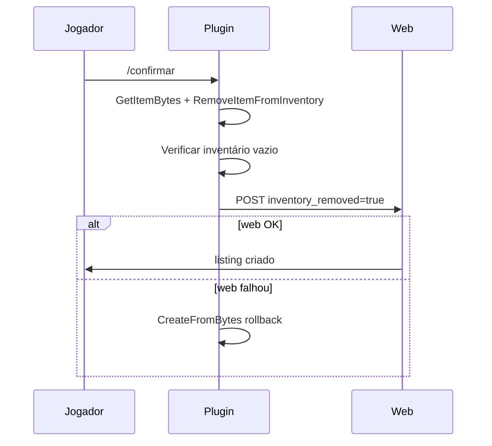
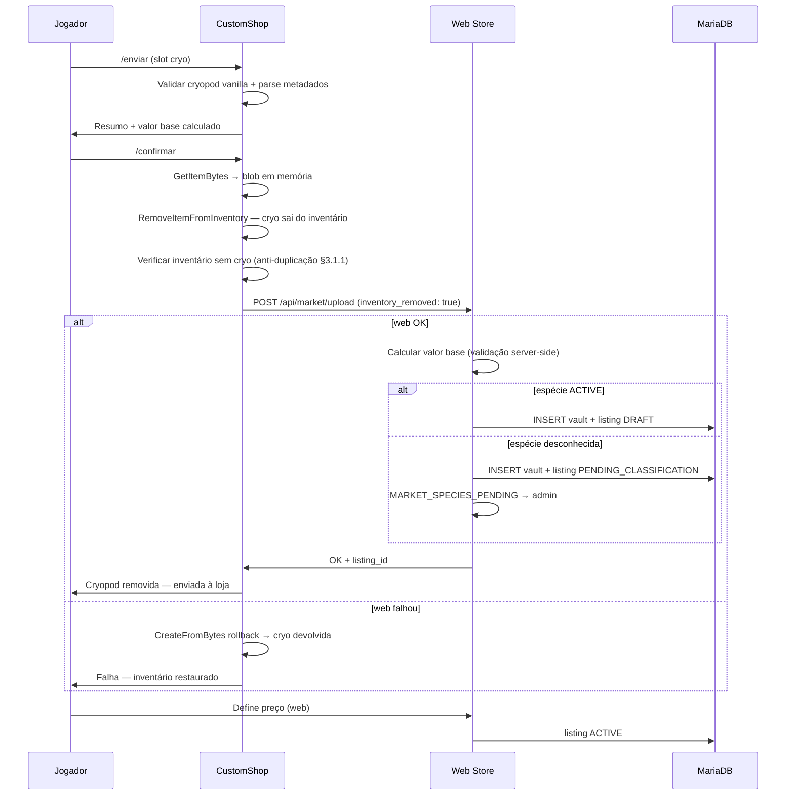

# Projeto Arkland — Sistema de Vitrine e Comércio de Dinossauros via Cryopod

| Campo | Valor |
|-------|-------|
| **Status** | 📋 Planejamento — sem implementação |
| **Versão do documento** | 1.4 |
| **Data** | 2026-06-20 |
| **Última revisão** | Tabela oficial, cálculo visível, sync loja, cadastro de espécies |
| **Escopo** | Análise, arquitetura, regras de negócio e requisitos técnicos |
| **Fora de escopo** | Código, schema definitivo, API ou deploy |

---

## Sumário executivo

O Arkland já possui infraestrutura madura para **comércio admin → jogador** (CustomShop + Web Store + fila de pedidos + cryopods na entrega), identidade Steam em todo o stack e serialização binária fiel de itens (`GetItemBytes` / `CreateFromBytes`). O marketplace **jogador → jogador** proposto neste documento é uma **extensão natural** dessa base, não um projeto greenfield.

A decisão de usar **exclusivamente Cryopods oficiais** (Extinction vanilla) elimina ambiguidade com Soul Traps (mod DinoStorage2), que hoje só existem como itens vazios no catálogo e **não possuem parser** no plugin.

**Viabilidade geral:** alta para o fluxo completo, condicionada à implementação de um módulo C++ de **leitura de cryopods do inventário do jogador** — capacidade que hoje existe apenas no sentido inverso (spawn → cryopod).

**Moeda:** todas as transações do marketplace são exclusivamente em **Âmbares** (pontos in-game). **Não há conversão, pagamento ou negociação em dinheiro real** neste fluxo — distinto e separado do PIX/doações da loja admin.

---

## 0. Decisões de produto confirmadas

| # | Decisão | Regra |
|---|---------|-------|
| P1 | Licença Nuvem | Obrigatória para **enviar** dinos ao marketplace (`licenca_nuvem` / grupo `keyvault`) |
| P2 | Taxas | **Zero taxas** de transação — valor pago = valor creditado ao vendedor |
| P3 | Stats e mutações | Pontos de status usados no cálculo **já incluem mutações**; sem bônus separado por mutação |
| P4 | Imprint | Apenas dinos **imprintados** entram no comércio (imprint > 0; recomendado validar mínimo configurável, ex. 100%) |
| P5 | Cryopod com timer | **Aceita no upload** — timer **removido permanentemente** em `/confirmar` antes do vault; resgate sempre sem timer |
| P6 | Resgate pelo proprietário | Vendedor pode **resgatar os próprios dinos** da vitrine para atualizar/re-anunciar |
| P7 | Valor mínimo absoluto | Nenhum dino **abaixo do valor sugerido pelo sistema** pode ser disponibilizado para comércio |
| P8 | Nome na Minha Área | Jogador **deve cadastrar nome de exibição** em Minha Área para comprar ou vender |
| P9 | Auditoria | **Todo o fluxo** registrado de forma minuciosa em área administrativa **dedicada** à fiscalização |
| P10 | Moeda | Vendas **exclusivamente em Âmbares** — jamais dinheiro real |
| P11 | Frontend | Evoluir a **Web Store em produção** (`plugin/arkshop_web/static/index.html`) — ver §10.4 |
| P12 | Anti-duplicação no envio | Ao **confirmar** (`/confirmar`), cryopod **deve sair do inventário** antes de persistir no vault — ver §3.1.1 |
| P13 | Cálculo visível | Toda avaliação exibe **detalhamento** do cálculo (piso + fatias do espaço bônus) — §5.7 |
| P14 | Tabela oficial pública | Área do comércio exibe **tabela de espécies nível 1** com piso, porte, teto e stats no cálculo — §5.8 |
| P15 | Paridade loja principal | Mesmo animal, **mesmo nível** → **mesmo valor raiz** na loja admin e no comércio — §5.9 |
| P16 | Sync catálogo existente | Importar dinos já cadastrados em `config.json` (`Type: dino`) para `economy_species` — §5.9 |
| P17 | Pré-cadastro ao adicionar dino na loja | Novo dino resgatável na loja principal → opção **Incluir no Comércio** + pré-cadastro admin — §5.10 |
| P18 | Espécie não cadastrada | Upload aceito **somente na área privada** do jogador; admin notificado; **zero exposição pública** até classificação — §3.1.2 |

---

## 1. Contexto e alinhamento com a infraestrutura existente

### 1.1 Componentes atuais

| Componente | Caminho / referência | Papel no marketplace |
|------------|----------------------|----------------------|
| Plugin CustomShop (C++) | `plugin/CustomShop/` | Único ponto de acesso ao inventário in-game; serialização de itens |
| Web Store (Flask) | `plugin/arkshop_web/app.py` | Autenticação Steam OpenID, saldo de pontos (Âmbar), pedidos, auditoria |
| Banco MariaDB | `setup_db.sql` → `arkland_shop` | Jogadores, transações, pedidos, inventário na nuvem |
| Inventário na nuvem | `ShopCloudInventory.cpp`, `docs/PROJETO_INVENTARIO_NUVEM.md` | Prova de conceito para upload/download de blobs |
| Cryopod na entrega | `ShopCryoDino.cpp` | Extração runtime de stats, imprint, mutações (spawn → cryo) |
| Fila de entrega | `HttpClient.cpp` + `/api/pending/*` | claim → deliver → release (modelo de escrow operacional) |
| TEK / Server Manager | `src/shop_integration.py` | Deploy, sync de config, migração SQL |

### 1.2 O que já funciona (reutilizável)

- **SteamID64** como chave de identidade (plugin, web, DB).
- **Moeda interna (pontos/Âmbar)** com histórico em `transactions`.
- **Entrega assíncrona** via pedidos `PENDENTE` com claim atômico e release em falha.
- **Serialização fiel** de cryopods preenchidos via `GetItemBytes` (cloud inventory).
- **Extração de metadados** de dino no momento do encapsulamento (`BuildCryoCustomData`).
- **Auditoria e disputas** na web store (`AuditEvent`, `disputes`).

### 1.3 Lacunas identificadas (bloqueadores)

| Lacuna | Impacto | Observação |
|--------|---------|------------|
| Ler cryopod **do inventário** do vendedor | Bloqueante | Só existe spawn → cryo, não cryo → metadados |
| Schema de listings P2P | Bloqueante | `orders` modela compra admin→jogador |
| Remoção cirúrgica de 1 cryopod | Bloqueante | Cloud inventory remove **tudo** no `/upload` |
| API de vitrine / mercado global | Bloqueante | Greenfield na web store |
| Modo relativo de preço | Médio | Requer modelo de dados específico |
| Soul Trap (DS2) | Fora de escopo | Decisão de produto: cryopod vanilla only |

---

## 2. Visão geral do sistema

### 2.1 Conceito

Um **marketplace P2P** onde jogadores depositam dinossauros encapsulados em Cryopods oficiais numa **Nuvem Arkland de comércio** (distinta do cofre `/upload` existente), definem preços vinculados a uma **economia oficial calculada**, e compradores resgatam posteriormente in-game.

### 2.2 Princípios de design

1. **Cryopod oficial = unidade atômica de comércio** — um listing = um blob serializado + metadados parseados.
2. **Proprietário comercial = quem fez upload** — SteamID do executor, nunca o imprint interno do dino.
3. **Valor econômico dinâmico** — recalculado quando multiplicadores mudam; anúncios refletem automaticamente.
4. **Valor sugerido = piso absoluto** — nenhum anúncio pode ser disponibilizado com preço inferior ao valor base calculado pelo sistema; bloqueio em upload, ativação e compra.
5. **Resgate manual** — comprador (e vendedor, no resgate próprio) recebe cryopod apenas via comando in-game.
6. **Anti-duplicação first** — ao confirmar envio, cryopod **obrigatoriamente removida** do inventário **antes** de gravar no vault (§3.1.1).
7. **Âmbar exclusivo** — toda liquidação usa saldo `players.points`; sem PIX, cartão ou moeda fiduciária no marketplace.
8. **Licença Nuvem** — requisito de elegibilidade para envio, alinhado ao ecossistema de cofre cluster-wide.
9. **Rastreabilidade total** — cada transição de estado gera evento de auditoria imutável (§9.8).
10. **Transparência econômica** — cálculo sempre visível; tabela oficial de referência nível 1 pública no comércio (§5.7–§5.8).
11. **Catálogo fechado** — nenhuma espécie aparece no mercado global sem registro **ACTIVE** em `economy_species` (§3.1.2).

### 2.3 Diagrama de arquitetura (alto nível)

```
┌─────────────────────────────────────────────────────────────────────────┐
│                           CAMADA IN-GAME (ASE)                          │
│  Comandos: /enviar, /resgatar, /shop (extensão)                         │
│  CustomShop.dll: validar cryo → extrair metadados → remover item        │
│                  → POST listing │ entregar cryo ao comprador              │
└───────────────────────────────┬─────────────────────────────────────────┘
                                │ HTTPS + X-API-Key
                                ▼
┌─────────────────────────────────────────────────────────────────────────┐
│                      WEB STORE (Flask / futuro front)                   │
│  Vitrine por SteamID │ Mercado global │ Gestão de preços │ Histórico    │
│  Cálculo econômico │ Recálculo em batch │ Compra com escrow de pontos  │
└───────────────────────────────┬─────────────────────────────────────────┘
                                │
                                ▼
┌─────────────────────────────────────────────────────────────────────────┐
│                    MariaDB arkland_shop (cluster-wide)                  │
│  market_listings │ market_cryopod_vault │ market_transactions           │
│  economy_species │ economy_multipliers │ economy_recalc_log             │
│  players (pontos) │ transactions (histórico) │ audit_events             │
└─────────────────────────────────────────────────────────────────────────┘
```

---

## 3. Regras de negócio

### 3.1 Upload (envio para a nuvem comercial)

| ID | Regra | Detalhe |
|----|-------|---------|
| U1 | Item aceito | Apenas Cryopod oficial vanilla (`PrimalItem_WeaponEmptyCryopod` preenchido) |
| U2 | Remoção cirúrgica | Remove **somente** a cryopod selecionada/usada; demais itens intactos |
| U2b | **Saída do inventário na confirmação** | Em `/confirmar`, cryopod **deve** sair do inventário — **requisito bloqueante** anti-duplicação (§3.1.1) |
| U3 | Confirmação prévia | Jogador vê resumo (espécie, stats, mutações, valor base) e confirma antes de concluir — **sem remover item no preview** |
| U4 | Proprietário | SteamID de quem executou o comando — independente de imprint ou nome do dino |
| U5 | Estado pós-upload | Inventário **sem** a cryopod; blob + metadados exclusivamente no vault comercial |
| U6 | Soul Trap | Rejeitado com mensagem clara — usar cryopod oficial |
| U7 | Cryopod vazia | Rejeitado — deve conter dino |
| U8 | Cryopod com timer | **Aceita** — aviso no preview; removida em `/confirmar` via `StripCryopodTimer` (inverso de `CryoLimitedTime`) |
| U9 | Licença Nuvem | Obrigatória — mesma verificação de `ShopCloudInventory` / `player_entitlements` (`licenca_nuvem`) |
| U10 | Imprint | Obrigatório — dino sem imprint rejeitado; imprint refletido nos metadados exibidos |
| U11 | Valor mínimo | Só prossegue se `computed_base_value` for válido; preço de venda inicial ≥ valor sugerido |
| U12 | Nome do jogador | Bloqueado se `market_display_name` não cadastrado em Minha Área (§3.7) |
| U13 | Mutações | Contabilizadas **dentro** dos pontos de status — não há linha separada de bônus econômico |

**Fluxo de confirmação sugerido:**

```
Jogador: /enviar [slot ou interação]
  → Verificar Licença Nuvem ativa
  → Verificar nome de exibição cadastrado (web; cache no plugin se disponível)
  → Plugin identifica cryopod no slot/inventário (sessão pendente em memória)
  → Avisar se cryopod com timer (será removido em /confirmar)
  → Rejeitar se imprint ausente
  → Parseia metadados (stats já incluem efeito de mutações)
  → Exibe painel/chat: espécie, nome, sexo, nível, stats breeding, mutações (informativo), imprint, valor sugerido
  → ⚠️ Cryopod PERMANECE no inventário até /confirmar

Jogador: /confirmar (timeout 2 min)
  → Mutex por steam_id
  → StripCryopodTimer() se necessário (antes de serializar)
  → GetItemBytes() → blob + SHA-256 em memória
  → RemoveItemFromInventory(cryopod) — OBRIGATÓRIO (anti-duplicação)
  → Verificar slot vazio / item ausente no inventário
  → POST web (inventory_removed: true, blob, metadata)
  → Se POST OK: MARKET_UPLOAD_CONFIRMED
  → Se POST FALHAR: CreateFromBytes(blob) rollback — MARKET_UPLOAD_ROLLBACK
```

#### 3.1.1 Garantia anti-duplicação na confirmação do envio

Requisito **estrito:** em `/confirmar`, a cryopod **deve sair do inventário** antes de persistir no vault — impossibilitar o mesmo dino in-game e na loja ao mesmo tempo.

| ID | Regra | Detalhe |
|----|-------|---------|
| AD1 | Preview não remove | Entre `/enviar` e `/confirmar`, cryopod **permanece** no inventário |
| AD2 | Remoção na confirmação | **Somente** em `/confirmar`: `RemoveItemFromInventory` |
| AD3 | Ordem fixa | bytes → remover → verificar vazio → POST web — **nunca inverter** |
| AD4 | Vault só após remoção | Web rejeita se `inventory_removed != true` |
| AD5 | Verificação pós-remoção | Plugin confirma ausência do item antes do HTTP |
| AD6 | Rollback obrigatório | POST falhou → `CreateFromBytes(blob)` devolve cryo; sem listing |
| AD7 | Mutex por jogador | Serializar `/confirmar` por `steam_id` |
| AD8 | Idempotência | `upload_id` UUID — reenvio não duplica vault |
| AD9 | Hash único | `blob_hash` em vault ativo → rejeitar |
| AD10 | Feedback | Sucesso só após remoção + vault; mensagem: *Cryopod removida do inventário* |

**Estados proibidos:** cryo no inventário + listing ACTIVE; vault persistido + cryo no inventário; `MARKET_UPLOAD_CONFIRMED` sem `inventory_verified_empty`.



#### 3.1.2 Espécie não cadastrada ou inativa

Quando o blueprint do upload **não** corresponde a espécie `ACTIVE` em `economy_species`:

| ID | Regra | Detalhe |
|----|-------|---------|
| NC1 | Upload com custódia | Cryopod removida do inventário (§3.1.1) e vault persistido |
| NC2 | Listing privado | Status `PENDING_CLASSIFICATION` — visível **somente** ao vendedor em Minha Loja |
| NC3 | Zero exposição pública | **Proibido** mercado global, vitrine pública e busca até classificação |
| NC4 | Notificação admin | `MARKET_SPECIES_PENDING` + fila **Admin → Comércio → Classificar** |
| NC5 | Mensagem jogador | Dino seguro na nuvem comercial; aguarda homologação oficial |
| NC6 | Pós-classificação | Admin ativa espécie → listing pode receber preço e ir a `ACTIVE` |
| NC7 | Resgate | Vendedor pode retirar dino (§3.6) enquanto aguarda |

**Regra absoluta:** nenhum animal na tabela pública ou mercado sem `economy_species.status = ACTIVE`.

**Cryopod com timer — validação técnica:**

- **Aceitar** cryopod com durabilidade limitada (`CryoLimitedTime`) no inventário do jogador.
- Em `/confirmar`, **antes** de serializar o blob: `StripCryopodTimer` restaura teto para ~3600s (inverso de `ShopCryoDino::AddItemDurability`).
- Metadados: `timer_stripped_on_upload: true` quando aplicável.
- Vault e **entrega** ao comprador/vendedor: cryopod **sem** timer — nunca reutilizar path de `ShopCryoDino` que aplica timer na entrega marketplace.

### 3.2 Vitrine do jogador

| ID | Regra |
|----|-------|
| V1 | Uma vitrine pública por SteamID |
| V2 | Jogador define preço **estritamente ≥ valor sugerido** (modo relativo, se habilitado, nunca abaixo de 100% do base) |
| V3 | Pode pausar/reativar anúncio sem remover cryopod do vault |
| V4 | Pode alterar preço a qualquer momento (respeitando floor) |
| V5 | Histórico de vendas, compras e uploads consultável |
| V6 | Cryopod pausada ou `PENDING_CLASSIFICATION` não aparece no mercado global |
| V7 | Listings `PENDING_CLASSIFICATION` ficam em aba **Aguardando classificação** (privada) |

### 3.3 Mercado global

Filtros propostos:

- Espécie (blueprint / nome amigável via Obelisk)
- Sexo (macho / fêmea / neutered)
- Faixa de preço (min/max)
- Pontos de HP, Dano, Peso, Estamina, Oxigênio, Comida (intervalos)
- Mutações (min/max por sexo)
- Nível
- Imprint mínimo (%)
- Vendedor (SteamID ou nome Steam via API)

Ordenação: preço, valor base, data, stats específicos, mutações.

### 3.4 Compra e transferência

| Etapa | Ação | Estado do listing |
|-------|------|-------------------|
| 1 | Comprador clica comprar (web, autenticado) | `RESERVING` |
| 2 | Débito atômico de pontos do comprador | `RESERVED` |
| 3 | Crédito integral ao vendedor (**sem taxas**) | `SOLD` |
| 4 | Cria pedido de resgate para comprador | `AWAITING_CLAIM` |
| 5 | Comprador usa `/resgatar` ou `/shop` in-game | `DELIVERED` |

**Rollback em falha:**

- Falha no débito → abort, listing volta a `ACTIVE`.
- Falha no crédito → compensação manual + alerta admin; listing permanece `RESERVED` até resolução.
- Falha na entrega in-game → pedido `PENDENTE` na fila existente; release após N tentativas; pontos estornados se indeliverable.

### 3.5 Resgate

- Comprador **não** recebe cryopod automaticamente na compra.
- Resgate via comando in-game quando online (`/resgatar`, extensão de `/shop`, ou submenu).
- Entrega: `CreateFromBytes` do blob vault → inventário (mesmo pipeline do cloud inventory).
- Cryopod entregue **sempre sem timer** — validação pós-entrega registrada na auditoria.
- Se inventário cheio: pedido permanece `PENDENTE`; mensagem orientando liberar slots.
- Timeout de resgate: avaliar expiração (ex.: 30 dias) com política de estorno ou devolução ao vendedor.

### 3.6 Resgate pelo proprietário (retirada da vitrine)

O vendedor **deve** poder recuperar dinos que enviou à própria loja, para atualizar stats, re-breed ou re-anunciar.

| ID | Regra |
|----|-------|
| R1 | Disponível para listings `ACTIVE`, `PAUSED` ou `DRAFT` (nunca `RESERVED`/`SOLD`) |
| R2 | Ação via web (Minha Loja → Retirar) ou comando in-game `/resgatar` com flag de proprietário |
| R3 | Listing passa a `WITHDRAWN`; cryopod permanece no vault até entrega confirmada |
| R4 | Fila `market_claims` com `recipient_steam_id` = vendedor; mesmo pipeline do comprador |
| R5 | Após entrega in-game: vault arquivado; listing terminal `WITHDRAWN` |
| R6 | Todo o fluxo auditado: `MARKET_SELLER_RECLAIM_REQUESTED`, `MARKET_SELLER_RECLAIM_DELIVERED` |

**Caso de uso:** jogador envia Rex → percebe que pode melhorar → retira da vitrine → resgata in-game → breed → envia novamente.

### 3.7 Minha Área — nome obrigatório do jogador

Integração com a seção **Minha Área** existente na Web Store (`page-myarea`).

| ID | Regra |
|----|-------|
| M1 | Campo **Nome de exibição no Mercado** (ex.: `market_display_name`) editável em Minha Área → card Perfil |
| M2 | Obrigatório para **qualquer** operação de compra ou venda no marketplace |
| M3 | Validação server-side: mínimo 3 caracteres, máximo 32, sem HTML; moderação de termos proibidos |
| M4 | Exibido na vitrine pública: *Loja de {market_display_name}* (não substitui Steam persona) |
| M5 | Bloqueio claro na UI e API: HTTP 403 `MARKET_NAME_REQUIRED` com link para Minha Área |
| M6 | Alteração de nome auditada: `MARKET_DISPLAY_NAME_CHANGED` |

**Gate de elegibilidade (checklist antes de comprar/vender):**

1. Login Steam ✅  
2. `market_display_name` preenchido ✅  
3. Para vender: Licença Nuvem ativa ✅  
4. Saldo suficiente (compra) ✅  

### 3.8 Cancelamento pelo vendedor

- Equivalente operacionalmente ao resgate pelo proprietário (§3.6).
- Listing arquivado com status `WITHDRAWN` ou `CANCELLED` conforme origem (web vs admin).

---

## 4. Viabilidade técnica — extração de dados da Cryopod

### 4.1 Referência: o que o plugin já extrai (spawn → cryo)

O módulo `ShopCryoDino.cpp` (`BuildCryoCustomData`) já popula `FCustomItemData` com:

| Dado | Fonte API | Viável na leitura inversa? |
|------|-----------|----------------------------|
| Espécie | `FARKDinoData.DinoClass`, `DinoName`, `DinoNameInMap` | ✅ Sim — presente em CustomDataStrings/Classes |
| Nome | `DinoName`, `DinoNameInMap` | ✅ Sim |
| Sexo | `bIsFemale`, string "Male"/"FEMALE", "NEUTERED" | ✅ Sim |
| Nível | Derivável de `FARKDinoData` / status component | ✅ Sim — requer parse do blob ou status |
| HP / Stamina / etc. (atual + max) | 12 floats current + 12 floats max | ✅ Sim — ordem fixa no CustomDataFloats |
| Mutações | `RandomMutationsMale/Female` | ✅ Sim — CustomDataDoubles |
| Imprint | `DinoImprintingQualityField` | ✅ Sim — CustomDataDoubles |
| Cores | `GetColorSetInidcesAsString` | ✅ Sim — CustomDataStrings |
| Blob completo do dino | `dinoData.DinoData` em CustomDataBytes | ✅ Sim — base para re-entrega |
| Sela equipada | Bytes da sela em CustomDataBytes[1] | ✅ Sim — opcional |
| Timestamps cuddle/mating | CustomDataDoubles | ✅ Sim — relevante para breeding cooldown |

### 4.2 Stats relevantes para breeding (economia)

Para cálculo econômico, os **pontos de status usados no breeding** correspondem aos valores **máximos tameados** (wild points rolled + level ups + **mutações já aplicadas nos stats**):

| Stat breeding | Enum ASE | Incluir na economia? |
|---------------|----------|----------------------|
| Vida (HP) | `Health` | ✅ Sim |
| Dano (Melee) | `MeleeDamageMultiplier` | ✅ Sim |
| Peso | `Weight` | ✅ Sim |
| Estamina | `Stamina` | ✅ Sim |
| Oxigênio | `Oxygen` | ✅ Sim (configurável) |
| Comida | `Food` | ✅ Sim (configurável) |
| Velocidade | `SpeedMultiplier` | ⚠️ Opcional — polêmico no meta |
| Torpor, Water, Temp, Crafting | outros enums | ❌ Geralmente excluídos |

**Decisão confirmada:**

- **Mutações não geram linha separada** no cálculo — o efeito já está nos pontos de status extraídos da cryopod.
- **Imprint é pré-requisito**, não componente opcional de preço — dinos sem imprint não entram no marketplace.
- Mutações continuam **exibidas** na UI (informativo/filtros), mas o valor econômico deriva dos stats finais.

**Recomendação:** parametrizar quais stats entram no cálculo via tabela `economy_multipliers` (multiplicador = 0 desabilita o stat).

### 4.3 Estratégia de extração (leitura do inventário)

Duas abordagens complementares:

**Abordagem A — Parse de `FCustomItemData` (preferida para UI/economia)**

1. Localizar cryopod no inventário (`UPrimalInventoryComponent`).
2. Chamar `GetCustomItemData()` no item.
3. Mapear arrays `CustomDataFloats`, `CustomDataDoubles`, `CustomDataStrings`, `CustomDataClasses` conforme layout de `BuildCryoCustomData`.
4. Validar que `CustomDataName == "Dino"` e blueprint é cryopod vanilla.
5. Serializar metadados em JSON para web + calcular valor base.

**Abordagem B — Blob binário (preferida para integridade)**

1. `GetItemBytes()` no item cryopod (padrão `ShopCloudInventory.cpp`).
2. Armazenar `MEDIUMBLOB` no vault comercial.
3. Na entrega: `CreateFromBytes()` — garantia de fidelidade bit-a-bit.

**Validação cruzada:** hash SHA-256 do blob no upload; revalidar no resgate; metadados parseados devem ser derivados do mesmo item antes da remoção.

### 4.4 Riscos de extração

| Risco | Mitigação |
|-------|-----------|
| Layout de CustomData muda entre patches ASE | Versionar parser; testes com cryopods de referência |
| Cryopod de mod disfarçada | Whitelist de blueprint path |
| Stats exibidos ≠ stats reais no blob | Sempre entregar via blob; UI mostra metadados parseados com disclaimer |
| Cryopod corrompida | Rejeitar no upload se parse falhar ou CreateFromBytes probe falhar |
| Cryopod com timer | Aceitar no upload; `StripCryopodTimer` em `/confirmar`; probe confirma vault sem timer |
| Dino sem imprint | Rejeitar no upload |

### 4.5 Metadados coletáveis e validação de segurança

Esta seção detalha **quais dados** podem ser extraídos da cryopod oficial, **como** obtê-los (incluindo a distinção valor vs pontos de breeding) e **como** usá-los no pacote de validação anti-fraude do marketplace.

#### 4.5.1 Mapeamento cryopod → campos de exibição

Layout conhecido (espelha `BuildCryoCustomData` em `ShopCryoDino.cpp`). Na leitura, o módulo `ShopCryoReader` deve parsear `GetCustomItemData()` do item no inventário:

| Dado na UI | Origem na cryopod | Índice / campo |
|------------|-------------------|----------------|
| Nome (mapa) | `CustomDataStrings` | `[0]` — `DinoNameInMap` |
| Nome (criador/breeder) | `CustomDataStrings` | `[1]` — `DinoName` |
| Cores | `CustomDataStrings` | `[2]` — string de índices |
| Neutered | `CustomDataStrings` | `[3]` |
| Sexo | `CustomDataStrings` | `[4]` — `"Male"` / `"FEMALE"` |
| Espécie | `CustomDataClasses` | `[0]` — blueprint class |
| Stats atuais (12) | `CustomDataFloats` | `[0]`–`[11]` — `CurrentStatusValues` |
| Stats máximos (12) | `CustomDataFloats` | `[12]`–`[23]` — `MaxStatusValues` |
| Gênero (bool) | `CustomDataFloats` | `[24]` — `bIsFemale` |
| Timestamp encapsulamento | `CustomDataDoubles` | `[0]` |
| Cooldown cuddle | `CustomDataDoubles` | `[1]` |
| Cooldown mating | `CustomDataDoubles` | `[2]` |
| **Mutações paterna** | `CustomDataDoubles` | `[3]` — `RandomMutationsMale` |
| **Mutações materna** | `CustomDataDoubles` | `[4]` — `RandomMutationsFemale` |
| **Imprint %** | `CustomDataDoubles` | `[5]` — `DinoImprintingQuality` (0.0–1.0) |
| Blob dino | `CustomDataBytes` | `[0]` — `FARKDinoData` |
| Sela (opcional) | `CustomDataBytes` | `[1]` |

Ordem dos 12 stats nos floats (índices 0–11 e 12–23):

`Health`, `Stamina`, `Torpidity`, `Oxygen`, `Food`, `Water`, `Temperature`, `Weight`, `MeleeDamageMultiplier`, `SpeedMultiplier`, `TemperatureFortitude`, `CraftingSpeedMultiplier`.

Para breeding/economia/UI, usar preferencialmente o bloco **Max** (`[12]`–`[23]`) nos stats relevantes: Health, Stamina, Oxygen, Food, Weight, Melee, Speed.

#### 4.5.2 Valor de stat vs pontos de breeding

| Notação | Exemplo | Origem | Uso |
|---------|---------|--------|-----|
| **Valor de stat** | Dano 254, Vida 12.480 | `MaxStatusValues` na cryopod | ✅ Extração **direta** — confiável |
| **Pontos de breeding** | 59 em dano, 80 em vida | Não armazenado como inteiro isolado | ⚠️ Requer passo adicional |

Os **pontos** (formato Dododex / Ark Smart Breeding / ASB) representam alocação wild + level-ups + mutações **por stat**. A cryopod guarda o **resultado final** (valores max), não necessariamente os inteiros de pontos exibidos na UI de breeding.

**Estratégias para obter pontos (implementação):**

| ID | Estratégia | Precisão | Complexidade |
|----|------------|----------|--------------|
| S1 | **Deploy temporário** — soltar cryo em área isolada, ler `StatusComponent` (`NumberOfLevelUpPointsAppliedTame`, bases wild), re-encapsular ou consumir blob original | Alta — idêntico ao jogo | Média |
| S2 | **Parse do blob `FARKDinoData`** — deserializar arrays base/added stats do binário interno | Alta se mapeado | Alta — frágil a patches |
| S3 | **Cálculo inverso** — `MaxStatusValues` + multiplicadores ASB/Obelisk + INI do cluster Arkland | Média — depende de config atual | Média |

**Recomendação v1:** S1 (deploy temporário no upload) para `stats[].points` exibidos na UI e auditoria; S3 como fallback se deploy falhar; valores max (`stats[].value`) sempre da cryopod (S direct).

**Decisão de produto:** mutações já estão refletidas nos valores/pontos finais — contadores `mutations_male` / `mutations_female` são **informativos e para filtros**, não entram separadamente no valor sugerido.

#### 4.5.3 Schema `metadata_json` (vault + auditoria)

Snapshot gravado no upload e **nunca editável** pelo jogador. Recálculo econômico usa campos numéricos; auditoria guarda cópia integral.

```json
{
  "parser_version": "1.0.0",
  "species_blueprint": "Blueprint'/Game/PrimalEarth/Dinos/Rex/Rex_Character_BP.Rex_Character_BP'",
  "species_key": "rex",
  "name_map": "Alpha Rex",
  "name_breeder": "Rex 224",
  "sex": "female",
  "is_neutered": false,
  "imprint_pct": 1.0,
  "mutations_male": 20,
  "mutations_female": 38,
  "colors": "0,0,0,0,0,0",
  "dino_level": 224,
  "stats_max": {
    "health":  { "value": 12480.0, "points": 80 },
    "melee":   { "value": 254.0,   "points": 59 },
    "weight":  { "value": 920.0,   "points": 42 },
    "stamina": { "value": 84.0,    "points": 0 },
    "oxygen":  { "value": 0.0,     "points": 0 },
    "food":    { "value": 0.0,     "points": 0 }
  },
  "computed_base_value": 218120,
  "extraction_method": "deploy_temp"
}
```

Colunas desnormalizadas em `market_listings` / vault derivam deste JSON para filtros do mercado global.

#### 4.5.4 Momentos de coleta e revalidação

| Momento | Ação | Quem executa |
|---------|------|--------------|
| Preview `/enviar` | Parse cryopod → exibir resumo ao jogador | Plugin C++ |
| Confirmação `/confirmar` | `StripCryopodTimer()` se necessário → `GetItemBytes()` → **remover cryo** → POST web | Plugin → Web |
| Persistência vault | Web recalcula `computed_base_value`; rejeita se imprint inválido | Web Store |
| Ativação anúncio | `effective_price >= computed_base_value`; nome mercado cadastrado | Web Store |
| Compra | Snapshot imutável em `market_audit_events` + `market_transactions` | Web Store |
| Resgate `/resgatar` | `CreateFromBytes(blob)`; comparar hash pós-entrega | Plugin C++ |
| Resgate proprietário | Mesmo pipeline; listing → `WITHDRAWN` | Plugin + Web |

**Regra:** a web **nunca** aceita metadados enviados pelo browser como fonte de verdade — apenas JSON assinado pelo plugin (`X-API-Key`) ou recálculo server-side a partir do blob armazenado.

#### 4.5.5 Pacote de validação de segurança

Três camadas complementares:

```
┌─────────────────────────────────────────────────────────┐
│ 1. INTEGRIDADE BINÁRIA                                  │
│    blob_hash = SHA-256(GetItemBytes)                    │
│    probe CreateFromBytes no upload                      │
│    hash entregue == hash vault no resgate                │
├─────────────────────────────────────────────────────────┤
│ 2. CONSISTÊNCIA METADADOS                               │
│    metadata parseado no upload == snapshot auditoria    │
│    web recalcula valor sugerido a partir de stats_max    │
│    rejeitar se plugin metadata ≠ recálculo (tolerância 0)│
├─────────────────────────────────────────────────────────┤
│ 3. REGRAS DE ELEGIBILIDADE                              │
│    cryopod vanilla · timer removido no upload · imprint obrigatório    │
│    licença nuvem · nome mercado · preço ≥ valor sugerido │
│    hash duplicado em vault ativo → rejeitar             │
└─────────────────────────────────────────────────────────┘
```

| Check | Quando | Falha → |
|-------|--------|---------|
| `blob_hash` único no vault | Upload | `MARKET_UPLOAD_REJECTED` — duplicação |
| Probe `CreateFromBytes` | Upload | Rejeitar cryo corrompida |
| `imprint_pct` > 0 (mín. configurável) | Upload | Rejeitar |
| Durabilidade padrão (sem timer) no blob | Upload pós-`/confirmar` | Rejeitar se strip falhou |
| `computed_base_value` recalculado web = plugin | Upload | Rejeitar — possível tampering |
| Espécie `ACTIVE` em `economy_species` | Ativar listing | Bloquear ACTIVE público; permitir só `PENDING_CLASSIFICATION` |
| `effective_price >= computed_base_value` | Ativar listing | Bloquear ACTIVE |
| Hash pós-entrega = vault | Resgate | `MARKET_CLAIM_FAILED` + disputa |
| Metadata resgate = metadata upload | Resgate (opcional re-parse) | Alerta CRITICAL admin |

#### 4.5.6 Registro na auditoria dedicada

Cada upload e resgate deve incluir em `market_audit_events.metadata_json`:

- Cópia integral do snapshot acima
- `blob_hash`
- `extraction_method` (`deploy_temp` | `blob_parse` | `inverse_calc`)
- `plugin_version` / `parser_version`
- Diff vazio ou motivo em caso de rejeição

Eventos correlacionados pelo `market_trace_id` permitem reconstruir linha do tempo: *upload → listagem → compra → resgate*, com stats e mutações visíveis para fiscalização admin (§9.8).

#### 4.5.7 Exibição na UI (mercado e confirmação in-game)

Formato alvo no card e na confirmação `/enviar`:

```
Rex — "Alpha Rex"                    ♀ Fêmea
Imprint 100% · Mutações: 20 / 38

Vida:    80 pts  (12.480)
Dano:    59 pts  (254)
Peso:    42 pts  (920)
Estamina: 0 pts  (84)

Valor sugerido: 218.120 Âmbar

[▼ Como calculamos]
  Valor Raiz (Rex)                    8.000
  Vida  80 × 80  =  6.400  (+ mutações já nos pts)
  Dano  59 × 700 = 41.300
  …
  Total                             218.120
```

Mutações exibidas como **paterna / materna** (`mutations_male` / `mutations_female`). Breakdown completo: §5.7.

### 4.6 Referência — ARK Smart Breeding (ASB)

Repositório estudado: `ARKStatsExtractor-dev` (ARK Smart Breeding / Dododex-compatible breeding calculator).

**O que o ASB oferece (reutilizável como referência):**

| Recurso | Local no ASB | Uso no Mercado Arkland |
|---------|--------------|------------------------|
| Cálculo **inverso** valor → pontos de breeding | `Extraction.cs`, `Stats.cs` | Fallback S3 (§4.5.2) quando deploy temporário falhar |
| Base/inc por espécie e stat | `json/values/values.json` | Port Python (`stat_points_asb.py`) — wild level + dom level a partir de `MaxStatusValues` |
| Imprint / TE / mutações | Lógica em `StatResult`, bounds wild/dom | Validar consistência; imprint já é gate de elegibilidade |
| Export Gun / save parse | `importExportGun/`, `ImportSavegame.cs` | **Não** aplicável ao fluxo cryopod in-game |

**O que o ASB não oferece:**

- Parser de `FCustomItemData` / cryopod em runtime no servidor
- Integração com plugin CustomShop ou vault web
- Leitura direta do inventário do jogador

**Estratégia de integração (sem embutir código C#):**

1. **C++ `ShopCryoReader`** — metadados e `MaxStatusValues` direto da cryopod (espelhar `ShopCryoDino.cpp`) — fonte primária.
2. **Port parcial Python** — `stat_points_asb.py` traduzindo `StatValueCalculation` + lookup em `values.json` (copiado ou sincronizado com versão Obelisk compatível com o cluster).
3. **Deploy temporário (S1)** — ler `NumberOfLevelUpPointsAppliedTame` via API ASE enquanto o port ASB não estiver maduro.

**Gap principal:** cryopod guarda **floats max** (`stats[].value`), enquanto a economia usa **pontos inteiros** (`stats[].points`). O ASB resolve exatamente essa conversão offline; no servidor, S1 ou port ASB fecham o gap.

**Artefato sugerido no repo:** `plugin/arkshop_web/data/asb_values.json` — subset de espécies homologadas, atualizado manualmente ou por script a partir do ASB quando o jogo patchar stats base.

---

## 5. Sistema econômico

### 5.1 Modelo de cálculo

```
Valor Sugerido (base) =
  Valor Raiz (espécie)
  + Σ (PontosStat[i] × MultiplicadorStat[i])   para stats habilitados
```

Os **PontosStat** são os valores finais de breeding **já incluindo mutações**. Imprint é requisito de elegibilidade, não soma adicional ao valor.

**Exemplo:**

| Componente | Valor |
|------------|-------|
| Valor Raiz (Rex) | 8.000 |
| HP 254 × 80 | 20.320 |
| Dano 254 × 700 | 177.800 |
| Peso 100 × 120 | 12.000 |
| **Total** | **218.120** |

### 5.2 Tabelas de configuração (conceitual)

**`economy_species`**

| Coluna | Tipo | Descrição |
|--------|------|-----------|
| species_key | VARCHAR PK | Identificador interno (ex: `rex`) |
| blueprint_path | VARCHAR | Path ASE para matching |
| display_name | VARCHAR | Nome PT/EN na UI |
| root_value | INT | Valor raiz fixo (nível referência) |
| catalog_item_id | VARCHAR | Vínculo `config.json` Items (ex.: `giga_femea`) |
| reference_level | INT | Nível de paridade com loja (geralmente **1**) |
| status | ENUM | `PRE_REGISTERED`, `PENDING_REVIEW`, `ACTIVE`, `DISABLED` |
| shop_price_synced_at | DATETIME | Última sync com `Price` da loja |
| activated_at, activated_by | DATETIME, VARCHAR | Homologação admin |

**`economy_multipliers`**

| Coluna | Tipo | Descrição |
|--------|------|-----------|
| stat_key | VARCHAR PK | `health`, `melee`, `weight`, … |
| multiplier | INT | Pontos por ponto de stat |
| enabled | BOOL | Incluir no cálculo |
| updated_at | DATETIME | Auditoria |

> **Removido do escopo:** tabelas `economy_mutation_bonus` e `economy_imprint_bonus` — mutações já estão nos stats; imprint é gate, não bônus.

### 5.3 Flexibilidade e ajuste administrativo

- **Painel admin na web** (ou TEK) para editar valor raiz e multiplicadores.
- **Versionamento:** cada alteração gera registro em `economy_recalc_log` com snapshot dos multiplicadores.
- **Recálculo em batch:** job assíncrono (cron ou trigger admin) recalcula `computed_base_value` em todos os listings `ACTIVE`/`PAUSED`.
- **Cache:** coluna `computed_base_value` desnormalizada no listing; recalculada, não persistida como verdade imutável.

### 5.4 Recálculo dinâmico

Quando multiplicadores mudam:

1. Admin salva nova config → `economy_recalc_log`.
2. Job calcula novo valor base para cada listing afetado.
3. Listings com preço absoluto: apenas `computed_base_value` e floor mudam; preço anunciado permanece se ainda ≥ novo floor.
4. Listings com preço relativo: preço anunciado recalculado automaticamente (ver §5.5).
5. UI reflete novos valores sem editar anúncio individual.

### 5.5 Modo de preço

| Modo | Campo no listing | Comportamento |
|------|------------------|---------------|
| **Absoluto** | `price_absolute` | Jogador define valor fixo ≥ floor; não muda com multiplicadores |
| **Relativo** | `price_offset_percent` | Preço = `computed_base_value × (1 + offset%)`; acompanha economia |

Exemplos relativos:

- `+10%` → preço = base × 1.10
- `+0%` → vende exatamente no floor
- `+50%` → premium de 50% sobre base recalculada

**Validação:** em modo relativo, offset mínimo = **0%** (preço nunca abaixo do valor sugerido). Offsets negativos proibidos.

### 5.6 Controle de mercado

| Regra | Implementação |
|-------|---------------|
| Valor sugerido | `computed_base_value` — calculado server-side, imutável pelo jogador |
| Disponibilização | Listing só pode ir a `ACTIVE` se `effective_price >= computed_base_value` |
| Bloqueio absoluto | API e plugin **recusam** qualquer tentativa de preço inferior — sem exceção silenciosa |
| Preço anunciado | `max(computed_base_value, price_absolute)` ou fórmula relativa (≥ 100% do base) |
| Taxa de transação | **0%** — `fee_amount` sempre zero; crédito integral ao vendedor |
| Recálculo | Se multiplicadores subirem o base acima do preço absoluto antigo, listing pausado ou exige revisão de preço |

### 5.7 Área de cálculo visível (transparência)

Toda interface que exibe **valor sugerido** deve incluir bloco **“Como calculamos”** — não opcional.

**Modelo v2 (proporcional — vigente desde v1.9.62):**

```
espaço_bônus = teto(porte) − root_value
fatia[stat]  = espaço_bônus × peso_efetivo × (pts_base ÷ 254)
total        = root_value + Σ fatias   → clamp [root, teto]
```

- **Pontos:** apenas **pontos base** do Spyglass `(X)` em `X-Y`; level manual `(Y)` **não entra**.
- **254:** referência de linhagem top por stat (100% da fatia daquele stat).
- **Pesos:** por `diet_class` (carnívoro / herbívoro / omnívoro), normalizados nos stats **enabled** da espécie.
- **Tier:** legenda do site — **não limita** preço na fórmula.

**Onde exibir:**

| Contexto | Conteúdo |
|----------|----------|
| Confirmação `/enviar` (in-game) | Resumo textual linha a linha |
| Detalhe do anúncio (web) | Painel expansível com breakdown completo |
| Minha Loja — definir preço | Sidebar fixa com cálculo atualizado |
| Admin — revisar listing | Mesmo breakdown + snapshot gravado |

**Formato do breakdown (exemplo Carcha moderada):**

```
Valor base (Carcha):                              29.994
Espaço bônus (teto 300.000 − base):              270.006
─────────────────────────────────────────────────────────
Vida:   78 pts × 585  =                          45.603
Dano:  105 pts × 478  =                          50.227
─────────────────────────────────────────────────────────
Valor sugerido total:                            125.825 Âmbar
Teto (porte grande):                             300.000
```

**Requisitos:**

- Cada linha de stat mostra: **nome**, **pontos base**, **taxa equivalente** (derivada, só exibição) e **subtotal**.
- Stats desabilitados em `economy_stats` são omitidos; o **total** sempre bate com o server-side.
- Gravar breakdown integral em `metadata_json.calculation_breakdown` e auditoria.
- Jogador **não edita** tetos, pesos nem valor raiz — apenas visualiza.

**Admin:** tetos, pesos por dieta e classificação por espécie em **Economia Comércio** (`/api/market/admin/economy/*`).

### 5.8 Tabela oficial de valores base (página pública do Comércio)

Seção fixa na área **Comércio** na web: **“Tabela Oficial — Valores Base (Nível 1)”**.

**Propósito:** referência pública do **piso** (`root_value`) e **teto por porte** de cada espécie homologada, alinhada à loja principal.

| Coluna | Descrição |
|--------|-----------|
| Espécie | Nome oficial (`display_name`) |
| Nível referência | Sempre **1** nesta tabela |
| Piso (Âmbar) | `root_value` — preço nível 1 na loja, **sem** pontos de breeding |
| Porte | `size_class` — pequeno / médio / grande |
| Teto | `_size_caps[size_class]` — máximo do modelo proporcional |
| Tier | Legenda S+ … C (site) |
| Stats no cálculo | Quais stats entram (`economy_stats.enabled`) |

**Tetos por porte (defaults):**

| Porte | Teto |
|-------|------|
| `large` | 300.000 Âmbar |
| `medium` | 250.000 Âmbar |
| `small` | 100.000 Âmbar |

**Regras de exibição:**

- Linha nível 1: exibe só **piso** — nenhum ponto de status aplicado.
- Classificação por espécie em `market_species_defaults.json` (`diet_class`, `size_class`, `economy_stats`).
- Ordenação: alfabética ou por valor raiz; busca por nome.
- Export CSV opcional (admin).

#### 5.8.1 Classificação econômica por espécie (26 grupos)

Fonte: `plugin/arkshop_web/data/market_species_defaults.json`. `root_value` sincroniza com `Price` do `config.json` no sync catálogo.

**Eixos:**

| Campo | Valores | Efeito |
|-------|---------|--------|
| `diet_class` | carnivore, herbivore, omnivore | Pesos HP / DM / WE / ST / SP |
| `size_class` | small, medium, large | Teto máximo + espaço bônus |
| `economy_stats[s].enabled` | bool por stat | Stat entra ou não no cálculo |
| `tier` | S+, S, A, B, C | **Só legenda** — não entra na fórmula |

**Pesos por dieta (normalizados nos stats enabled):**

| Dieta | HP | DM | WE | ST | SP |
|-------|----|----|----|----|-----|
| Carnívoro | 55% | 45% | — | — | — |
| Herbívoro | 35% | — | 40% | 25% | — |
| Omnívoro | 30% | 25% | 30% | 15% | — |

**Exemplos de enabled por espécie:**

| Espécie | Porte | Stats enabled |
|---------|-------|---------------|
| Carcha | large | HP, DM |
| Rex / Giga | large | HP, DM |
| Brachio | large | HP, WE |
| Tek Strider | large | HP, WE, ST |
| Deinonychus | small | DM, ST (override peso 70/30) |
| Desmodus | medium | HP, WE, ST |

Admin edita via **Economia Comércio → Por espécie** ou `PATCH /api/market/admin/economy/species/<key>`.

**Wireframe:**

```
┌─ Tabela Oficial — Valores Base (Nível 1) ─────────────────────────┐
│  Carcha          Nível 1   Piso 29.994   Grande   Teto 300.000     │
│    Stats: HP · DM · Tier A                                         │
│  Rex             Nível 1   Piso  8.000   Grande   Teto 300.000     │
│    Stats: HP · DM · Tier A                                         │
└───────────────────────────────────────────────────────────────────┘
```

> **Legado (v1):** multiplicadores inteiros por stat (`×720` dano) foram substituídos pelo modelo proporcional em v1.9.62. Campos `multipliers` no JSON permanecem para referência; só entram no cálculo se `pricing_mode: legacy_multipliers`.

#### 5.8.2 Modos de preço e overrides (Fase 2 — v1.9.64+)

| `pricing_mode` | Comportamento |
|----------------|---------------|
| `proportional` | **Padrão** — espaço bônus × peso × pts/254 |
| `legacy_multipliers` | Exceção: `root + Σ (pts × multiplicador JSON)` com teto por porte |

**Override de peso por stat:** `economy_stats[s].weight_override` (0–1) substitui o peso da dieta naquele stat (ex.: Deinonychus DM 0,70 · ST 0,30).

**Admin:** Economia Comércio → Por espécie → Editar (dieta, porte, modo, stats, pesos). Comércio admin → botão **Economia** abre o mesmo editor.

### 5.9 Sincronização com a loja principal (`config.json`)

**Fonte de verdade inicial:** itens `Type: "dino"` em `plugin/CustomShop/configs/config.json` — campos `Name`, `Price`, `Dinos[].Blueprint`, `Dinos[].Level`.

**Regra de paridade (P15):**

```
Se catalog_item_id + reference_level coincidem entre loja e comércio:
  economy_species.root_value  ==  Items[catalog_item_id].Price
```

Exemplo existente no catálogo:

| `item_id` | Nome | Level | Price (loja) | `root_value` (comércio) |
|-----------|------|-------|--------------|-------------------------|
| `giga_femea` | Giganotosaurus Fêmea | 1 | 15.000 | **15.000** |
| `desmodus_femea` | Desmodus Fêmea | 1 | 8.000 | **8.000** |
| `bionicgigant_femea` | Bionic Giga Fêmea | 1 | 25.000 | **25.000** |

**Job de sincronização inicial (migração v1):**

1. Escanear todos `Items` com `Type: "dino"`.
2. Para cada entrada: extrair blueprint principal (`Dinos[0].Blueprint`), level, price, name.
3. Upsert em `economy_species` com:
   - `catalog_item_id` = chave do item (ex.: `giga_femea`)
   - `reference_level` = level do config (esperado 1)
   - `root_value` = `Price`
   - `display_name` = `Name` ou `Description`
   - `status` = `PRE_REGISTERED` (admin valida multiplicadores e ativa) ou `ACTIVE` se política auto-aprovacao
4. Log em auditoria: `MARKET_CATALOG_SYNC`.

**Sincronização contínua:**

- Ao alterar `Price` de dino na loja principal → propagar para `root_value` se `catalog_item_id` vinculado (com log + recálculo listings).
- Webhook ou hook no save do catálogo (`app.py` / TEK `customshop_panel.py`).

### 5.10 Cadastro, pré-cadastro e classificação admin (categoria Comércio)

#### 5.10.1 Fluxo — novo dino na loja principal

Ao cadastrar ou publicar item resgatável `Type: dino` na loja admin/TEK:

```
Admin salva dino na loja (Name, Price, Blueprint, Level)
  → Modal/checkbox: [ ] Incluir no Comércio de Dinos
  → Se marcado:
       POST pré-cadastro economy_species
         display_name ← Name
         root_value ← Price
         blueprint_path ← Dinos[0].Blueprint
         reference_level ← Level
         catalog_item_id ← item_id
         status ← PRE_REGISTERED
       → Admin Comércio → fila "Pendentes de validação"
```

Admin conclui em **Admin → Comércio → Espécies**:

1. Revisar nome, blueprint, valor raiz (paridade loja).
2. Confirmar/herdar multiplicadores globais de status.
3. **Ativar** → `status = ACTIVE` → espécie entra na **Tabela Oficial** pública.

#### 5.10.2 Fluxo — jogador envia espécie desconhecida

```
Jogador /enviar + /confirmar
  → blueprint não encontrado em economy_species ACTIVE
  → vault OK + listing PENDING_CLASSIFICATION
  → MARKET_SPECIES_PENDING → notificação admin
  → Jogador: Minha Loja (área privada "Aguardando classificação")
Admin Comércio → Classificar nova espécie
  → Criar economy_species (nome sugerido do metadata, blueprint do upload)
  → Definir root_value + multiplicadores
  → Ativar
  → Listing elegível para preço/ACTIVE; notificar jogador
```

#### 5.10.3 Estados de `economy_species.status`

| Status | Tabela pública | Upload jogador | Anúncio público |
|--------|----------------|----------------|-----------------|
| `PRE_REGISTERED` | Não | Rejeitar ou pendente (política: pendente) | Não |
| `PENDING_REVIEW` | Não | `PENDING_CLASSIFICATION` | Não |
| `ACTIVE` | **Sim** | Permitido | Sim (demais regras OK) |
| `DISABLED` | Não | Rejeitar | Não |

**Recomendação:** upload de espécie inexistente → `PENDING_CLASSIFICATION` (não rejeitar vault — evita frustrar jogador; dino fica seguro na nuvem comercial).

#### 5.10.4 Schema ampliado — `economy_species`

| Coluna | Descrição |
|--------|-----------|
| `catalog_item_id` | FK lógica → `config.json` Items (ex.: `giga_femea`) |
| `reference_level` | Nível de paridade com loja (geralmente **1**) |
| `shop_price_synced_at` | Última sync com Price da loja |
| `status` | `PRE_REGISTERED` \| `PENDING_REVIEW` \| `ACTIVE` \| `DISABLED` |
| `activated_at` | Quando admin ativou |
| `activated_by` | SteamID admin |

---

## 6. Fluxos operacionais

### 6.1 Upload completo



### 6.2 Compra e resgate

```mermaid
sequenceDiagram
    participant C as Comprador
    participant W as Web Store
    participant DB as MariaDB
    participant P as CustomShop

    C->>W: Comprar listing (Steam auth)
    W->>DB: BEGIN; RESERVE listing; debitar pontos C; creditar V
    W->>DB: COMMIT; pedido resgate PENDENTE
    C->>P: /resgatar (in-game)
    P->>W: GET pending market claims
    P->>DB: Fetch blob vault
    P->>P: CreateFromBytes → inventário
    P->>W: POST delivered
    W->>DB: listing DELIVERED
```

### 6.3 Distinção: Nuvem Comercial vs Inventário na Nuvem

| Aspecto | `/upload` (existente) | Nuvem Comercial (novo) |
|---------|----------------------|------------------------|
| Propósito | Cofre pessoal cluster-wide | Escrow para venda |
| Escopo | Todo inventário | Uma cryopod por operação |
| Licença | Licença Nuvem **obrigatória** para enviar | Licença Nuvem |
| Visibilidade | Privado | Público quando anunciado |
| Tabela | `player_cloud_items` | `market_cryopod_vault` (proposta) |

**Recomendação:** manter sistemas **separados** para evitar conflito de estado e regras de duplicação.

---

## 7. Modelo de dados proposto (conceitual)

> Nota: schema ilustrativo para planejamento. Não é migração definitiva.

### 7.1 Entidades principais

**`market_cryopod_vault`** — custódia do blob

| Coluna | Descrição |
|--------|-----------|
| id | PK |
| item_blob | MEDIUMBLOB — serialização GetItemBytes |
| blob_hash | SHA-256 para integridade |
| metadata_json | Stats parseados no upload |
| species_key | FK lógica → economy_species |
| uploaded_at | Timestamp |
| parser_version | Versão do parser C++ |

**`market_listings`** — anúncio

| Coluna | Descrição |
|--------|-----------|
| id | PK |
| vault_id | FK → market_cryopod_vault |
| seller_steam_id | Proprietário comercial |
| status | DRAFT, ACTIVE, PAUSED, PENDING_CLASSIFICATION, RESERVING, SOLD, AWAITING_CLAIM, DELIVERED, WITHDRAWN, CANCELLED |
| price_mode | ABSOLUTE \| RELATIVE |
| price_absolute | Nullable |
| price_offset_percent | Nullable |
| computed_base_value | Cache recalculável |
| effective_price | Cache do preço final exibido |
| created_at, updated_at, sold_at | Timestamps |
| buyer_steam_id | Nullable — preenchido na venda |

**`market_transactions`** — histórico comercial

| Coluna | Descrição |
|--------|-----------|
| id | PK |
| listing_id | FK |
| buyer_steam_id, seller_steam_id | Partes |
| price_paid | Valor efetivo em **Âmbares** |
| base_value_at_sale | Snapshot do valor sugerido no momento da venda |
| fee_amount | Sempre **0** (sem taxas) |
| points_before/after (buyer/seller) | Auditoria financeira |
| created_at | Timestamp |

**`market_claims`** — fila de resgate (pode estender `orders`)

| Coluna | Descrição |
|--------|-----------|
| id | PK |
| listing_id | FK |
| recipient_steam_id | Comprador, vendedor (resgate próprio) ou admin |
| status | PENDENTE, CLAIMED, DELIVERED, FAILED |
| retry_count, last_error | Padrão orders existente |

**`market_player_profile`** — extensão de Minha Área

| Coluna | Descrição |
|--------|-----------|
| steam_id | PK |
| market_display_name | Nome obrigatório para comércio (3–32 chars) |
| name_updated_at | Timestamp |
| commerce_enabled | Cache: nome preenchido + não banido |

### 7.2 Índices recomendados

- `(status, species_key, effective_price)` — mercado global
- `(seller_steam_id, status)` — vitrine
- `(metadata_json->$.stats.health)` — se JSON nativo MariaDB; ou colunas desnormalizadas para filtros
- `(buyer_steam_id, status)` — resgates pendentes

### 7.3 Desnormalização para filtros

Para performance de busca, extrair do JSON para colunas indexadas:

`stat_health`, `stat_melee`, `stat_weight`, `stat_stamina`, `stat_oxygen`, `stat_food`, `mutations_male`, `mutations_female`, `dino_level`, `imprint_pct`, `is_female`, `is_neutered`.

Atualizadas no upload; imutáveis durante vida do listing.

---

## 8. Requisitos técnicos

### 8.1 Plugin C++ (CustomShop)

| ID | Requisito |
|----|-----------|
| P1 | Comando `/enviar` com seleção de slot ou item ativo |
| P2 | Parser cryopod vanilla (`ShopCryoReader` — módulo novo) + schema `metadata_json` (§4.5) |
| P3 | Confirmação em duas etapas com timeout — preview **sem** remoção; `/confirmar` **com** remoção (§3.1.1) |
| P4 | Remoção atômica na confirmação: bytes OK → **RemoveItemFromInventory** → verificar vazio → HTTP POST |
| P5 | Rollback obrigatório se POST falhar após remoção (`CreateFromBytes` → devolver cryo ao inventário) |
| P15 | Rejeitar POST web sem flag `inventory_removed: true`; nunca persistir vault se item ainda in-game |
| P6 | Comando `/resgatar` integrado à fila market claims (comprador **e** vendedor/proprietário) |
| P7 | Validação blueprint whitelist |
| P8 | Logs estruturados → auditoria dedicada (§9.8) |
| P9 | Probe CreateFromBytes antes de aceitar upload |
| P10 | Verificar Licença Nuvem (`ShopEntitlements`) antes de `/enviar` |
| P11 | Aceitar cryopod com timer no upload; remover em `/confirmar`; garantir entrega sem timer |
| P12 | Rejeitar dino sem imprint |
| P13 | Entrega marketplace **sem** aplicar `CryoLimitedTime` |
| P14 | Deploy temporário (ou fallback blob/ASB) para `stats[].points` no upload |

### 8.2 Web Store (Flask)

| ID | Requisito |
|----|-----------|
| W1 | Rotas REST `/api/market/*` autenticadas (jogador + API key plugin) |
| W2 | Páginas integradas à nav existente: `/mercado`, `/minha-loja`, vitrine pública |
| W3 | Painel admin: espécies, multiplicadores, recálculo, moderação, **Auditoria do Mercado** |
| W4 | Transações atômicas (InnoDB) para compra — **somente Âmbares** |
| W5 | Integração com `transactions`, `AuditEvent` e **`market_audit_events`** (§9.8) |
| W6 | Recálculo batch com progresso e log auditado |
| W7 | Rate limiting em upload e compra |
| W8 | Minha Área: campo nome obrigatório + gate em compra/venda |
| W9 | Aviso permanente: *Mercado P2P opera exclusivamente em Âmbares — sem dinheiro real* |
| W10 | `POST /api/market/upload` exige `inventory_removed: true`; recusa persistência se ausente ou falso |
| W11 | Página pública **Tabela Oficial Nível 1** + multiplicadores (`GET /api/market/species-table`) |
| W12 | Breakdown de cálculo em API listing (`calculation_breakdown`) — §5.7 |
| W13 | Hook save catálogo dino → opção **Incluir no Comércio** + pré-cadastro — §5.10 |
| W14 | Admin Comércio: filas pré-cadastro, classificação, ativação espécies |
| W15 | Job `MARKET_CATALOG_SYNC` — importar `Type: dino` do `config.json` — §5.9 |

### 8.3 Integração plugin ↔ web

Reutilizar padrão existente:

```
Header: X-API-Key: ARKSHOP_API_KEY
Base URL: Settings.WebApiUrl
```

Endpoints propostos:

| Método | Rota | Autor |
|--------|------|-------|
| POST | `/api/market/upload` | Plugin |
| POST | `/api/market/claims/claim` | Plugin |
| POST | `/api/market/claims/delivered` | Plugin |
| POST | `/api/market/claims/release` | Plugin |
| GET | `/api/market/pending/{steam_id}` | Plugin |
| GET | `/api/market/listings` | Web (público/filtros) |
| GET | `/api/market/vitrine/{steam_id}` | Web |
| PATCH | `/api/market/listings/{id}` | Web (dono) |
| POST | `/api/market/listings/{id}/purchase` | Web (comprador) |
| POST | `/api/market/listings/{id}/withdraw` | Web (vendedor) |
| PATCH | `/api/market/profile/display-name` | Web (Minha Área) |
| GET | `/api/market/species-table` | Web (público — tabela nível 1 + multiplicadores) |
| GET | `/api/market/listings/{id}/calculation` | Web (breakdown §5.7) |
| GET | `/api/market/admin/audit` | Web (admin) |
| GET/POST | `/api/market/admin/species` | Web (admin — CRUD + ativar) |
| POST | `/api/market/admin/species/sync-catalog` | Web (admin — job §5.9) |
| POST | `/api/market/admin/species/{id}/activate` | Web (admin — homologar pré-cadastro) |
| POST | `/api/market/admin/recalculate` | Web (admin) |
| POST | `/api/market/catalog/pre-register` | Web (hook save dino loja — §5.10) |

### 8.4 TEK / operações

- Migração SQL via `setup_db.sql` + auto-migrate no plugin (padrão existente).
- Config de espécies/multiplicadores exportável em JSON para sync cluster.
- Monitoramento: fila de claims pendentes, listings stuck em RESERVING.

---

## 9. Segurança e integridade

### 9.1 Duplicação de Cryopods

| Vetor | Controle |
|-------|----------|
| Upload duplicado do mesmo blob | Hash único; rejeitar hash já em vault ativo |
| Confirmar envio sem remover cryo | **§3.1.1** — remoção obrigatória em `/confirmar` antes de POST web |
| Upload + jogador mantém cryo | Ordem AD3: bytes → **RemoveItemFromInventory** → verificar vazio → vault |
| Vault persistido com cryo in-game | Web recusa sem `inventory_removed: true`; estados proibidos §3.1.1 |
| POST web falha após remoção | Rollback `CreateFromBytes(blob)` + `MARKET_UPLOAD_ROLLBACK` |
| Compra dupla | Lock pessimista/otimista em listing (`RESERVING` único) |
| Resgate duplo | Claim idempotente; status DELIVERED terminal |
| Race upload + trade/drop | Mutex por `steam_id` durante `/confirmar` (AD7) |

### 9.2 Perda de dados

- Backups regulares de `market_cryopod_vault` (blobs críticos).
- Replicação MariaDB cluster-wide já existente.
- Soft-delete proibido para blobs vendidos — arquivar com status terminal.

### 9.3 Corrupção de registros

- `blob_hash` validado no resgate.
- Probe `CreateFromBytes` no upload e periodicamente (job admin).
- `metadata_json` regenerável do blob se parser evoluir (migração).

### 9.4 Falhas durante compra

```
Estado RESERVING com timeout (ex.: 30s):
  - Se debitou e falhou depois → estorno automático + release listing
  - Se não debitou → release listing
Idempotency key por purchase request (UUID)
```

### 9.5 Falhas durante entrega

Reutilizar padrão `orders`:

- `retry_count` incrementado
- Após N falhas → disputa automática + notificação admin
- Comprador mantém direito ao dino até resolução

### 9.6 Auditoria (visão geral)

Todo evento do marketplace deve ser rastreável de ponta a ponta. A auditoria **não reutiliza apenas** a página genérica de resgates — exige **área administrativa dedicada** (§9.8).

Princípios:

- **Append-only** — eventos nunca editados ou apagados; correções geram novo evento compensatório.
- **Correlation ID** — `market_trace_id` único por upload, compra ou resgate, propagado plugin ↔ web ↔ DB.
- **Snapshot econômico** — valor sugerido, multiplicadores vigentes e preço anunciado gravados em cada transição relevante.
- **Identidade dupla** — SteamID + `market_display_name` em todo registro de parte envolvida.

### 9.7 Moderação

- Admin pode pausar listing suspeito.
- Admin pode forçar cancelamento com devolução ao vendedor.
- Blacklist de jogadores no marketplace.

### 9.8 Auditoria do Mercado — área dedicada à fiscalização

Requisito **estrito:** absolutamente **todo** o fluxo do marketplace possui registro minucioso, consultável por admins em interface separada da "Auditoria de Resgates" existente.

#### 9.8.1 Página administrativa

| Elemento | Descrição |
|----------|-----------|
| Rota UI | Nova aba admin: **Auditoria do Mercado** (`page-market-audit`) |
| API | `GET /api/market/admin/audit` com paginação, filtros e export CSV |
| Separação | Distinta de `page-audit` (resgates admin→jogador) — escopo exclusivo P2P |

#### 9.8.2 Eventos obrigatórios (lista mínima)

| event_type | Quando |
|------------|--------|
| `MARKET_UPLOAD_REQUESTED` | Jogador iniciou `/enviar` |
| `MARKET_UPLOAD_REJECTED` | Falha validação (sem licença, sem imprint, sem nome, strip timer falhou, etc.) |
| `MARKET_UPLOAD_CONFIRMED` | Cryopod **removida do inventário** e vault persistido (`inventory_verified_empty`) |
| `MARKET_UPLOAD_ROLLBACK` | POST web falhou após remoção — cryo devolvida via `CreateFromBytes` |
| `MARKET_SPECIES_PENDING` | Upload de espécie não cadastrada — fila classificação admin |
| `MARKET_SPECIES_PRE_REGISTERED` | Pré-cadastro via loja principal (checkbox Incluir no Comércio) |
| `MARKET_SPECIES_ACTIVATED` | Admin homologou espécie → entra na tabela pública |
| `MARKET_CATALOG_SYNC` | Job sync dinos `config.json` → `economy_species` |
| `MARKET_ROOT_VALUE_SYNCED` | `root_value` atualizado a partir de `Price` da loja |
| `MARKET_LISTING_PENDING_CLASSIFICATION` | Listing privado aguardando espécie ACTIVE |
| `MARKET_LISTING_PRICE_SET` | Preço definido ou alterado |
| `MARKET_LISTING_ACTIVATED` | ACTIVE — validação `price >= computed_base_value` |
| `MARKET_LISTING_PAUSED` | Pausado pelo vendedor |
| `MARKET_LISTING_WITHDRAW_REQUESTED` | Vendedor solicitou resgate próprio |
| `MARKET_PURCHASE_INITIATED` | Comprador clicou comprar |
| `MARKET_PURCHASE_COMPLETED` | Débito/crédito Âmbar concluído |
| `MARKET_PURCHASE_FAILED` | Falha + motivo + rollback |
| `MARKET_CLAIM_CLAIMED` | Plugin reservou entrega in-game |
| `MARKET_CLAIM_DELIVERED` | Cryopod entregue via CreateFromBytes |
| `MARKET_CLAIM_FAILED` | Falha entrega + retry_count |
| `MARKET_SELLER_RECLAIM_DELIVERED` | Proprietário recebeu dino de volta |
| `MARKET_ECONOMY_RECALC` | Batch de recálculo de valor sugerido |
| `MARKET_DISPLAY_NAME_CHANGED` | Nome de exibição alterado em Minha Área |
| `MARKET_ADMIN_ACTION` | Moderação manual (pausar, banir, forçar withdraw) |

#### 9.8.3 Payload de cada evento (campos mínimos)

| Campo | Descrição |
|-------|-----------|
| `id` | PK auto-increment |
| `ts` | Timestamp UTC |
| `market_trace_id` | UUID correlacionando upload→venda→resgate |
| `event_type` | Tipo da tabela acima |
| `severity` | INFO / WARN / ERROR / CRITICAL |
| `steam_id` | Ator principal |
| `counterparty_steam_id` | Comprador/vendedor/admins |
| `market_display_name` | Nome de exibição no momento do evento |
| `listing_id`, `vault_id`, `claim_id` | FKs quando aplicável |
| `blob_hash` | SHA-256 da cryopod |
| `computed_base_value`, `effective_price` | Valores econômicos |
| `points_delta`, `points_before`, `points_after` | Movimentação Âmbar |
| `parser_version`, `plugin_version`, `web_version` | Rastreio de release |
| `metadata_json` | Stats snapshot, motivo de rejeição, **`inventory_removed`**, **`inventory_verified_empty`**, `slot_before` |
| `source` | `plugin` \| `web` \| `admin` \| `system` |
| `ip_hash` | Hash do IP web (opcional, LGPD-conscious) |

#### 9.8.4 Tabela dedicada

**`market_audit_events`** — append-only, particionável por mês para retenção longa (fiscalização).

Integração com `AuditEvent` existente: eventos CRITICAL também espelhados em `audit_events` para alertas unificados, mas a **fonte de verdade** do marketplace é `market_audit_events`.

#### 9.8.5 Filtros para fiscalização

- Por `market_trace_id` (linha do tempo completa de uma transação)
- Por SteamID (comprador ou vendedor)
- Por `listing_id` / `blob_hash`
- Por tipo de evento e severidade
- Por intervalo de datas e faixa de valores Âmbar
- Por motivo de rejeição (`MARKET_UPLOAD_REJECTED`)

---

## 10. Interface do site

### 10.0 Política de moeda (destaque obrigatório)

Em **todas** as páginas do marketplace e no card de confirmação de compra:

> **O Mercado de Dinos opera exclusivamente em Âmbares** (moeda in-game do Arkland).  
> **Não é possível comprar ou vender dinossauros com dinheiro real**, PIX, cartão ou qualquer meio externo.  
> Doações PIX existentes na loja principal convertem-se em Âmbares por fluxo **separado** e **não** constituem compra P2P.

### 10.1 Card de anúncio (mercado global e vitrine)

```
┌──────────────────────────────────────────────┐
│  Rex — "Alpha Killer"          ♀ Fêmea       │
│  Nível 224 · Imprint 100% · Mutações: 20/38  │
├──────────────────────────────────────────────┤
│  HP: 254   DM: 254   Peso: 100              │
│  Estamina: 84   Oxigênio: 0   Comida: 0      │
├──────────────────────────────────────────────┤
│  Valor Sugerido:    218.120 Âmbar           │
│  [▼ Como calculamos — ver §5.7]             │
│  Preço de Venda:    250.000 Âmbar           │
│  Vendedor: Loja de JogadorX                 │
│                          [ Comprar ]         │
│  Pagamento exclusivo em Âmbares              │
└──────────────────────────────────────────────┘
```

### 10.2 Páginas e navegação

Integradas à Web Store existente (`plugin/arkshop_web/static/index.html`):

| Página / aba | Conteúdo |
|--------------|----------|
| **Comércio** (nav pública) | Mercado + **Tabela Oficial Nível 1** (§5.8) + legenda multiplicadores |
| **Mercado** | Grid + filtros — **somente** espécies `ACTIVE` |
| Detalhe do anúncio | Stats + **breakdown de cálculo** (§5.7) + preço |
| **Minha Loja** (auth) | Anúncios, preços, pausar, retirar; aba **Aguardando classificação** |
| Vitrine pública | `/loja/{steam_id}` — **sem** listings pendentes de classificação |
| **Minha Área** (existente) | + card Perfil com **Nome no Mercado** (obrigatório) |
| Histórico marketplace | Compras, vendas, retiradas |
| **Admin → Comércio** | Espécies, multiplicadores, **pendentes/pré-cadastro**, classificar novos, ativar |
| **Auditoria do Mercado** (admin) | Fiscalização — §9.8 |

### 10.3 UX de upload

- In-game: confirmação textual (mínimo viável).
- Web: deep link após upload in-game para definir preço (≥ valor sugerido).
- Se nome não cadastrado: redirect para Minha Área com banner explicativo.

### 10.4 Decisão de frontend

**Modelo escolhido:** evoluir a **Web Store em produção** (`plugin/arkshop_web/static/index.html` + Flask `app.py`).

| Critério | Flask/HTML atual | Protótipo React (`artifacts/store`) |
|----------|------------------|--------------------------------------|
| Produção hoje | ✅ Loja live, Steam OpenID, PIX, Minha Área | ❌ Não integrado ao plugin |
| Minha Área | ✅ Já existe | Reimplementar |
| Auditoria admin | ✅ Padrão `page-audit` | Reimplementar |
| Deploy | ✅ Mesmo processo `shop_integration.py` | Pipeline separado |
| Entrega in-game | ✅ Fila `/api/pending/*` madura | Sem integração |

**Abordagem incremental:**

1. Novas abas: **Comércio** (mercado + tabela oficial), Minha Loja, Admin Comércio, Auditoria do Mercado.
2. Checkbox **Incluir no Comércio** no fluxo de save de dino na loja admin/TEK.
3. Job inicial `MARKET_CATALOG_SYNC` ao deploy (§5.9).

**Motivo:** menor risco operacional, identidade visual única, reaproveitamento de auth, saldo Âmbar e Minha Área já funcionais.

---

## 11. Desafios e riscos

| # | Desafio | Severidade | Mitigação |
|---|---------|------------|-----------|
| 1 | Parser cryopod inexistente hoje | Alta | Novo módulo C++; espelhar BuildCryoCustomData |
| 2 | Patch ASE altera formato | Média | parser_version + testes regressão |
| 3 | Performance filtros no mercado | Média | Colunas desnormalizadas + índices |
| 4 | Recálculo massivo trava DB | Média | Batch chunked; horário off-peak |
| 5 | Disputas comprador/vendedor | Média | Sistema disputes existente |
| 6 | Duplicidade cryo in-game + loja | Alta | §3.1.1 — remoção obrigatória em `/confirmar` + rollback + hash |
| 7 | Cryopod com timer | Aceita upload | Removido em `/confirmar`; vault/resgate sem timer |
| 8 | Espécies de mods | Média | Whitelist por blueprint; Obelisk para nomes |
| 9 | Fraude de preço (web tampering) | Alta | Cálculo server-side; nunca confiar no client |
| 10 | Concorrência com cloud inventory | Média | Sistemas separados; mutex por jogador |
| 11 | Adoção / liquidez | Produto | Eventos, vitrine destacada, licença Nuvem já monetizada |
| 12 | Volume de auditoria | Média | Particionamento mensal; índices por trace_id e steam_id |
| 14 | Desalinhamento loja vs comércio | Média | `catalog_item_id` + sync contínua de `Price` → `root_value` |
| 15 | Espécies novas não catalogadas | Média | `PENDING_CLASSIFICATION` + fila admin Comércio |

---

## 12. Fases de implementação sugeridas (roadmap)

> Apenas planejamento — sem cronograma comprometido.

### Fase 0 — Fundação (plugin)

- `ShopCryoReader`: parse cryopod do inventário + mapeamento §4.5.1
- Deploy temporário para pontos de breeding (§4.5.2 S1) + fallback
- `metadata_json` + `blob_hash` no upload
- Testes com cryopods de referência (várias espécies, mutações, imprint)
- Endpoint upload + vault table

### Fase 1 — Economia e tabela oficial

- Tabelas `economy_species` / `economy_multipliers` (schema §5.2, §5.10.4)
- Job **`MARKET_CATALOG_SYNC`** — importar todos `Type: dino` do `config.json`
- Painel **Admin → Comércio**: pré-cadastros, ativar espécies, multiplicadores
- Página pública **Tabela Oficial Nível 1** + multiplicadores (§5.8)
- Cálculo valor sugerido + **breakdown visível** (§5.7)
- Checkbox **Incluir no Comércio** no save de dino na loja TEK/web

### Fase 2 — Vitrine e Minha Área

- Upload in-game + confirmação + gate Licença Nuvem
- **`PENDING_CLASSIFICATION`** para espécies desconhecidas (§3.1.2)
- Minha Área: `market_display_name` obrigatório
- Web: Minha Loja (+ aba aguardando classificação), preço, pausar, retirar
- Vitrine pública — **somente** listings ACTIVE de espécies ACTIVE

### Fase 3 — Mercado global

- Filtros e busca
- Página de detalhe
- Modo preço absoluto

### Fase 4 — Compra, resgate e auditoria

- Transação atômica de Âmbares (sem taxas)
- Fila de claims + `/resgatar` (comprador e vendedor)
- **`market_audit_events` + página Auditoria do Mercado**
- Histórico do jogador

### Fase 5 — Refinamentos

- Modo preço relativo (mínimo 100% do valor sugerido)
- Recálculo dinâmico batch
- Moderação, disputas market-specific
- Integração TEK para config economia
- Export CSV auditoria para fiscalização externa

---

## 13. Decisões em aberto (restantes)

| # | Tema | Opções |
|---|------|--------|
| D1 | Imprint mínimo exato | 100% fixo / configurável (ex.: ≥ 80%) |
| D2 | Stats de velocidade | Incluir / excluir no valor sugerido |
| D3 | Timeout resgate | 30 dias estorno / indefinido / lembrete |
| D4 | Comando único | `/enviar` + `/resgatar` vs extensão `/shop` |
| D5 | Preço relativo na v1 | Sim / Fase 5 |
| D6 | Espécies de mod | Whitelist manual / sync Obelisk |
| D7 | Retenção auditoria | 12 meses / 24 meses / indefinido |

### Decisões já fechadas (v1.4)

Licença Nuvem · zero taxas · stats incluem mutações · imprint obrigatório · timer removido no upload · resgate proprietário · valor sugerido = piso · nome Minha Área · auditoria dedicada · Âmbares exclusivos · frontend Web Store · remoção em `/confirmar` · **cálculo visível** · **tabela oficial nível 1** · **paridade preço loja/comércio** · **sync catálogo dino** · **pré-cadastro ao adicionar na loja** · **sem exposição pública sem espécie ACTIVE**.

---

## 14. Conclusão

O marketplace de dinossauros via Cryopod é **tecnicamente viável** sobre a infraestrutura Arkland existente. O plugin já demonstra domínio do formato cryopod na direção spawn→cryo e do pipeline de serialização binária; a web store já opera filas de entrega com escrow de pontos e auditoria.

O **trabalho crítico** concentra-se em:

1. **Leitura e validação** de cryopods do inventário do jogador (novo módulo C++).
2. **Schema e API** de listings/vault separados do cofre `/upload`.
3. **Motor econômico** configurável com recálculo dinâmico.
4. **Fluxo de compra** com transações atômicas em Âmbares (sem taxas) e resgate assíncrono in-game — incluindo **resgate pelo proprietário**.
5. **Auditoria dedicada** (`market_audit_events` + UI admin) para fiscalização integral do fluxo.

A restrição a **Cryopods oficiais**, com **timer removido na confirmação**, **imprint obrigatório** e **Licença Nuvem** para envio, define um mercado de qualidade alinhado ao meta breeding do Arkland. **Toda liquidação é em Âmbares** — separada e independente de doações PIX.

Este documento serve como base para revisão de stakeholders, estimativa de esforço e detalhamento de specs por fase — **sem substituir** documentos de implementação futuros (API OpenAPI, migrações SQL finais, wireframes).

---

## Referências internas

| Documento / código | Relevância |
|--------------------|------------|
| `plugin/CustomShop/src/ShopCryoDino.cpp` | Formato CustomData cryopod (escrita; espelho para leitura §4.5) |
| `plugin/CustomShop/src/ShopCloudInventory.cpp` | GetItemBytes / CreateFromBytes |
| `plugin/arkshop_web/app.py` | Pedidos, claim/release, auditoria |
| `setup_db.sql` | Schema base arkland_shop |
| `docs/PROJETO_INVENTARIO_NUVEM.md` | Padrão upload/download blobs |
| `docs/PROJETO_ARKLAND_MASTER.md` | SpawnExact, gap loja admin |
| `src/spawn_exact.py` | Stats breeding, cores, imprint |
| [`docs/TRIBO_REPARTICAO_MERCADO.md`](TRIBO_REPARTICAO_MERCADO.md) | **§18** — Divisão de receita de vendas P2P entre membros de tribo: piso 60% ao criador, opt-in/opt-out, audit log, 25 edge cases, 4 fases MVP |
