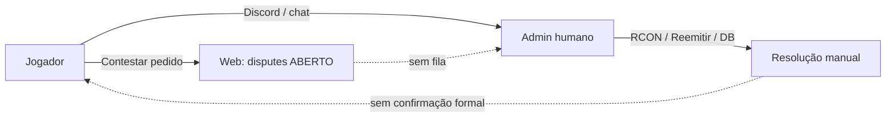
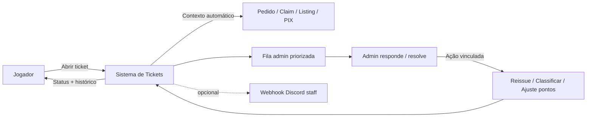
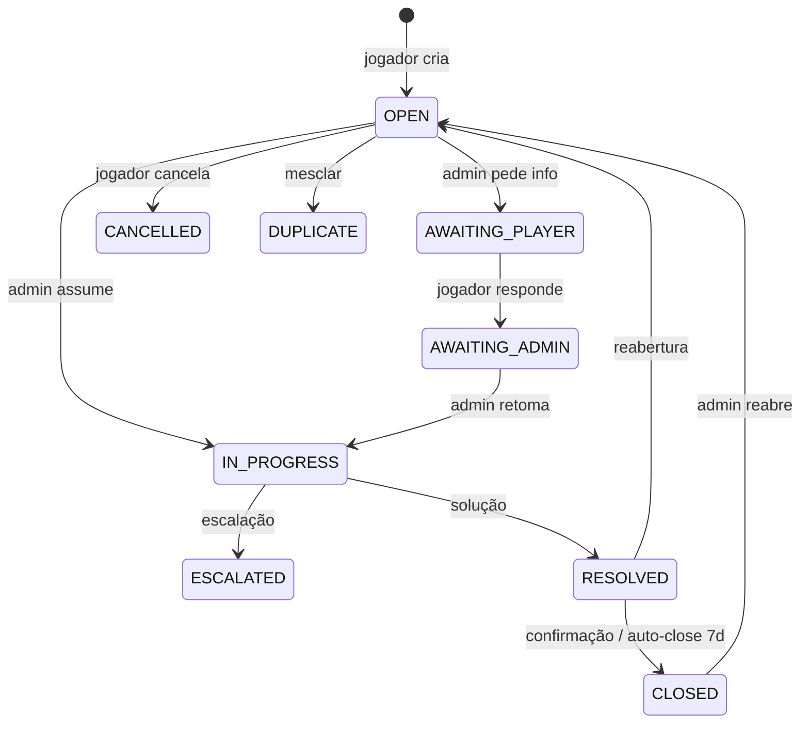

# Projeto Arkland — Sistema de Suporte (Tickets) na Web Store

| Campo | Valor |
|-------|-------|
| **Status** | 📋 Planejamento — **sem implementação** (documento para discussão) |
| **Versão do documento** | 1.0 |
| **Data** | 2026-06-21 |
| **Escopo** | Análise, arquitetura, regras de negócio, riscos e roadmap |
| **Fora de escopo** | Código, migrações SQL definitivas, wireframes finais, deploy |

---

## Sumário executivo

Hoje o suporte ao jogador no ecossistema Arkland é **informal e fragmentado**: Discord, chat in-game, contestação pontual de pedidos na web (`disputes`) e intervenção manual do admin em múltiplas abas (Auditoria, Comércio, Jogadores & Entregas, DB Manager no TEK). Não existe canal único, rastreável e com SLA para o jogador acompanhar a resolução.

Este documento propõe um **sistema de tickets integrado à Web Store** (`plugin/arkshop_web`), reutilizando autenticação Steam, vínculos com pedidos/mercado/auditoria existentes e expandindo o proto-ticket já presente na tabela `disputes`.

**Princípios:**

1. **Um lugar para o jogador** — abrir, responder e acompanhar status sem depender de Discord.
2. **Um lugar para o admin** — fila priorizada, contexto automático (pedido, claim, listing, saldo).
3. **Não duplicar auditoria** — tickets referenciam `audit_events` / `market_audit_events`; não substituem logs técnicos.
4. **Escalação clara** — P0 (perda de item/cryo) vs P3 (dúvida de uso).
5. **Implementação incremental** — Fase 1 pode ser “contestação 2.0”; Fase 4 adiciona mercado P2P e nuvem.

**Viabilidade:** alta. A stack Flask + SQLAlchemy + SPA em `index.html` já possui padrões de auth, modais, filtros paginados e timeline admin (`/api/admin/orders/<id>/timeline`). O gap principal é modelo de **thread de mensagens** + **workflow admin** + **notificações**.

---

## Sumário

1. [Contexto e estado atual](#1-contexto-e-estado-atual)
2. [Problema que o sistema resolve](#2-problema-que-o-sistema-resolve)
3. [Personas e permissões](#3-personas-e-permissões)
4. [Taxonomia de tickets](#4-taxonomia-de-tickets)
5. [Ciclo de vida e estados](#5-ciclo-de-vida-e-estados)
6. [Fluxos detalhados](#6-fluxos-detalhados)
7. [Modelo de dados proposto](#7-modelo-de-dados-proposto)
8. [API REST proposta](#8-api-rest-proposta)
9. [Interface web (jogador e admin)](#9-interface-web-jogador-e-admin)
10. [Integrações com sistemas existentes](#10-integrações-com-sistemas-existentes)
11. [Notificações e canais externos](#11-notificações-e-canais-externais)
12. [Segurança, abuso e conformidade](#12-segurança-abuso-e-conformidade)
13. [Operação admin e playbooks](#13-operação-admin-e-playbooks)
14. [Métricas e SLA](#14-métricas-e-sla)
15. [Riscos, edge cases e mitigações](#15-riscos-edge-cases-e-mitigações)
16. [Relação com `disputes` legado](#16-relação-com-disputes-legado)
17. [Roadmap de implementação sugerido](#17-roadmap-de-implementação-sugerido)
18. [Decisões em aberto](#18-decisões-em-aberto)
19. [Fora de escopo (v1)](#19-fora-de-escopo-v1)
20. [Referências internas](#20-referências-internas)

---

## 1. Contexto e estado atual

### 1.1 Componentes do ecossistema

| Componente | Caminho | Papel no suporte hoje |
|------------|---------|------------------------|
| Web Store (Flask) | `plugin/arkshop_web/app.py` | Auth Steam, pedidos, PIX, contestação, auditoria shop |
| SPA | `plugin/arkshop_web/static/index.html` | Minha Área, Admin Auditoria, Comércio, Mensagens (config in-game) |
| CustomShop (C++) | `plugin/CustomShop/` | Mensagens in-game; `/shop`, `/enviar`, nuvem, mercado |
| Mercado P2P | `market_*.py` | Listings, claims, `market_audit_events` |
| TEK / Server Manager | `src/app_tek.py`, `src/pages/` | Ops servidor, RCON, DB, sync catálogo — **não** tickets de jogador |
| Discord | `src/discord_notifier.py` | Start/stop/crash/backup — **não** suporte a jogador |

### 1.2 O que já existe (reutilizável)

| Recurso | Detalhe |
|---------|---------|
| **Auth Steam** | `session["steam_id"]`, `@login_required`, `@admin_required` |
| **Contestação** | `POST /api/player/orders/<id>/contest` → `disputes` + `orders.status=CONTESTADO` |
| **Timeline admin** | `GET /api/admin/orders/<id>/timeline` (audit + attempts + disputes + reissues) |
| **Auditoria shop** | `audit_events` — `_audit_event()` com payload JSON |
| **Auditoria mercado** | `market_audit_events` — `market_audit_event()` com trace_id |
| **Resolução admin** | `reissue`, `reprocess`, `repair-license`, retry batch pedidos |
| **UI patterns** | Tabs, modais, toast, filtros, paginação (`page-audit`, `page-market-admin`) |
| **Rate limiting** | `flask_limiter` (memory) |
| **Migração DB** | `_migrate_schema()` + `market_migrate.ensure_market_schema()` |

### 1.3 Lacunas explícitas (motivação do projeto)

| Lacuna | Impacto |
|--------|---------|
| `disputes` sem workflow admin | Status `ABERTO` para sempre; sem fila na UI |
| Sem thread de mensagens | Jogador envia um `reason` e não pode responder |
| Sem ticket para mercado P2P | Claims falhos, classificação, timer — só auditoria técnica |
| Sem ticket para PIX/nuvem/licenças | Admin investiga manualmente em várias abas |
| Sem notificação ao jogador | Resolução só visível se admin avisar no Discord |
| Aba **Mensagens** admin | Edita `config.json` Messages (textos in-game), **não** suporte |
| Discord ops ≠ suporte | Webhooks não cobrem compras/disputas |
| TEK separado da web | Admin precisa correlacionar SteamID entre ferramentas |

---

## 2. Problema que o sistema resolve

### 2.1 Situação atual (AS-IS)



### 2.2 Situação desejada (TO-BE)



### 2.3 Objetivos mensuráveis

| Objetivo | Indicador |
|----------|-----------|
| Reduzir suporte no Discord | % tickets resolvidos só pela web |
| Rastreabilidade | 100% interações admin em `ticket_messages` + audit |
| Tempo de resposta P0 | Meta configurável (ex. &lt; 4h úteis) |
| Autosserviço | % tickets fechados como “duplicado” / FAQ |
| Satisfação | Pesquisa opcional pós-fechamento (1–5) |

---

## 3. Personas e permissões

### 3.1 Personas

| Persona | Identificação | Necessidades |
|---------|---------------|--------------|
| **Jogador** | Steam OpenID | Abrir ticket, anexar contexto, responder, ver status |
| **Admin shop** | `shop_admins` / `admin_steamids.json` | Fila global, atribuir, resolver, ações em pedidos |
| **Admin mercado** | Mesmo grupo (v1) ou role futura | Classificação espécies, claims, disputas P2P |
| **Admin financeiro** | Role futura | PIX, reembolso Âmbares, disputas MP |
| **Sistema** | API key / jobs | Auto-ticket em falhas críticas (opcional Fase 3) |

### 3.2 Matriz de permissões (proposta v1)

| Ação | Jogador | Admin |
|------|---------|-------|
| Criar ticket | ✅ | ✅ (em nome de jogador, auditado) |
| Ver próprios tickets | ✅ | — |
| Ver todos os tickets | — | ✅ |
| Responder no thread | ✅ (próprio ticket, se aberto) | ✅ |
| Alterar status | — | ✅ |
| Atribuir responsável | — | ✅ |
| Vincular pedido/claim | ✅ (sugerir) | ✅ (editar) |
| Executar reissue/reprocess | — | ✅ (atalho na UI do ticket) |
| Ver tickets de outro jogador | — | ✅ |
| Banir abuso de tickets | — | ✅ (rate limit + flag) |

### 3.3 Roles futuras (v2+)

- `support_agent` — responde, não reemite
- `support_lead` — reemite, ajusta pontos
- `market_moderator` — só categoria Comércio
- Separação via tabela `shop_admins.role` ou JSON em `admin_steamids`

---

## 4. Taxonomia de tickets

Categorias alinhadas aos domínios reais do projeto (mapeados a partir de CHANGELOG, docs e mensagens in-game).

### 4.1 Categorias principais

| Código | Nome | Descrição | Prioridade default | Vínculos típicos |
|--------|------|-----------|-------------------|------------------|
| `DELIVERY_SHOP` | Entrega da loja | Comprou, não recebeu; pedido preso | P1 | `order_id` |
| `DELIVERY_MARKET` | Entrega mercado | Comprou dino P2P, `/resgatarmercado` falhou | P0/P1 | `market_claim_id`, `listing_id` |
| `UPLOAD_MARKET` | Envio ao mercado | `/enviar`/`/confirmar`, cryo, timer, espécie | P1 | vault, listing draft |
| `PIX_PAYMENT` | Doação PIX | Pago, Âmbares não creditados | P0 | `point_payment_id`, MP id |
| `POINTS_BALANCE` | Saldo Âmbares | Saldo incorreto, trade, timed points | P2 | `steam_id`, transações |
| `LICENSE` | Licenças | Nuvem, VIP, Gamma/Beta, repair | P1 | `player_entitlements`, `order_id` |
| `CLOUD_INVENTORY` | Inventário nuvem | Upload/download, limite 250, inconsistência | P1 | cloud tables |
| `MARKET_CLASSIFICATION` | Classificação espécie | Listing `PENDING_CLASSIFICATION` | P2 | `species_key`, seller ticket |
| `MARKET_DISPUTE` | Disputa P2P | Comprador vs vendedor (preço, dino errado) | P1 | `listing_id`, ambos steam_ids |
| `ACCOUNT_PROFILE` | Conta / perfil | Nome mercado, SteamID, login | P3 | `market_player_profile` |
| `BUG_REPORT` | Bug / regressão | Comportamento inesperado após update | P2 | versão app/plugin |
| `SUGGESTION` | Sugestão | Melhoria de produto | P4 | — |
| `OTHER` | Outro | Fallback | P3 | — |

### 4.2 Subcategorias (exemplos)

**`DELIVERY_SHOP`:** `pending_stuck`, `partial_delivery`, `wrong_item`, `inventory_full`, `service_unavailable`

**`UPLOAD_MARKET`:** `cryo_parse_fail`, `timer_rejected`, `imprint_rejected`, `no_cloud_license`, `critical_upload_fail` (cryo removida, vault falhou)

**`PIX_PAYMENT`:** `not_credited`, `duplicate_credit`, `wrong_amount`, `payer_data`

### 4.3 Prioridades

| Nível | Nome | Critério | SLA sugerido (discussão) |
|-------|------|----------|--------------------------|
| P0 | Crítico | Perda potencial de item/cryo/PIX | 4h |
| P1 | Alto | Bloqueio de jogo/comércio/compra | 24h |
| P2 | Médio | Funcionalidade degradada | 72h |
| P3 | Baixo | Dúvida, perfil, UX | 7d |
| P4 | Informativo | Sugestão | Sem SLA |

Prioridade pode ser **reclassificada** pelo admin com motivo auditado.

### 4.4 Mapeamento: mensagens in-game → categoria sugerida

| Mensagem (CustomShop) | Categoria sugerida |
|-----------------------|-------------------|
| `[Shop] Servico de entrega indisponivel` | `DELIVERY_SHOP` |
| `Cryopod invalida` / `enviar_timer` | `UPLOAD_MARKET` |
| `Licenca Nuvem obrigatoria` | `LICENSE` |
| `Contate um admin` (nuvem) | `CLOUD_INVENTORY` |
| `Inventario cheio` | `DELIVERY_*` |

Ideia: botão **“Abrir ticket com este erro”** no futuro (plugin envia código de erro) — Fase 4+.

---

## 5. Ciclo de vida e estados

### 5.1 Estados do ticket

| Estado | Significado | Jogador pode responder? | Admin pode responder? |
|--------|-------------|-------------------------|----------------------|
| `OPEN` | Novo, na fila | ✅ | ✅ |
| `AWAITING_PLAYER` | Admin pediu informação | ✅ | ✅ |
| `AWAITING_ADMIN` | Jogador respondeu | ✅ | ✅ |
| `IN_PROGRESS` | Admin investigando | ✅ (limitado) | ✅ |
| `ESCALATED` | Subiu para lead/senior | ✅ | ✅ |
| `RESOLVED` | Solução aplicada | ❌ (pode reabrir?) | ✅ |
| `CLOSED` | Encerrado definitivo | ❌ | ✅ (reabrir admin) |
| `CANCELLED` | Cancelado pelo jogador | ❌ | — |
| `DUPLICATE` | Mesclado em outro ticket | ❌ | — |

### 5.2 Diagrama de transições



### 5.3 Regras de negócio

- Jogador pode ter **no máximo N tickets abertos** simultâneos (sugestão: 3).
- Ticket `RESOLVED` → `CLOSED` automático após X dias sem resposta do jogador (sugestão: 7).
- Reabertura: jogador pode reabrir em até Y dias (sugestão: 14) com motivo.
- Admin **nunca** deleta ticket; apenas `CLOSED` / `DUPLICATE`.
- Toda mudança de status gera `ticket_events` + opcional `audit_events` (`ticket_status_changed`).

---

## 6. Fluxos detalhados

### 6.1 Fluxo jogador — entrega loja não recebida

1. Jogador em **Minha Área** → histórico → pedido `ENTREGUE` ou `PENDENTE`.
2. Clica **“Abrir suporte”** (novo) ou **“Contestar”** (evoluir).
3. Formulário pré-preenchido: `order_id`, item, valor, status, tentativas (se API disponível).
4. Descreve problema; anexa print (opcional Fase 2).
5. Sistema cria ticket `DELIVERY_SHOP`, prioridade P1.
6. Admin vê na fila com link para timeline + botões Reprocessar/Reemitir.
7. Admin responde: “Reemitimos pedido X; entre no servidor e use /shop.”
8. Marca `RESOLVED` → jogador confirma ou auto-close.

**Integração:** substitui/estende `POST /contest` — ver §16.

### 6.2 Fluxo — falha crítica mercado (cryo removida, upload falhou)

1. Plugin loga `MARKET_UPLOAD_FAILED` / jogador vê erro in-game.
2. **Fase 3:** sistema pode auto-criar ticket P0 com `market_trace_id`.
3. Admin vê vault state, blob_hash, logs `market_audit_events`.
4. Resolução manual documentada na thread (restauração DB — processo ops).

Referência: `ShopMarket.cpp` — remoção antes de persistir; rollback em falha.

### 6.3 Fluxo — PIX não creditado

1. Categoria `PIX_PAYMENT`, P0.
2. Campos: e-mail pagador, valor, horário, `mp_payment_id` (se souber).
3. Admin cruza `point_payments` + webhook logs.
4. Resolução: crédito manual via admin pontos + mensagem no ticket.
5. **Nunca** expor dados de cartão/MP completos na UI do jogador.

### 6.4 Fluxo — classificação de espécie (vendedor)

1. Vendedor enviou dino; listing `PENDING_CLASSIFICATION`.
2. Ticket auto-sugerido ao abrir **Minha Loja → Aguardando classificação**.
3. Admin no ticket vê `species_blueprint`, link direto para **Comércio → Classificar**.
4. Ao ativar espécie, job promove listings → ticket pode auto-`RESOLVED` (Fase 3).

### 6.5 Fluxo — disputa P2P comprador vs vendedor

1. Comprador abre `MARKET_DISPUTE` vinculado a `listing_id` / transação.
2. Sistema notifica vendedor (in-app) — **não** expõe ticket inteiro ao vendedor na v1 (só admin medeia) **OU** thread tripartite (decisão §18).
3. Admin consulta `market_audit_events`, estado do claim, cryo no vault.
4. Resolução: estorno Âmbares, reenvio claim, ban listing — conforme política.

### 6.6 Fluxo admin — criar ticket em nome do jogador

1. Admin informa SteamID + categoria.
2. Útil para migrar casos do Discord.
3. Audit: `actor_type=admin`, `created_on_behalf=true`.

---

## 7. Modelo de dados proposto

> Esquema conceitual — não é migração final.

### 7.1 Tabela `support_tickets`

| Coluna | Tipo | Notas |
|--------|------|-------|
| `id` | UUID ou BIGINT PK | Expor `ticket_number` humano (#1042) |
| `ticket_number` | INT UNIQUE | Sequencial anual `2026-00042` |
| `steam_id` | VARCHAR(32) INDEX | Autor |
| `category` | VARCHAR(32) INDEX | Taxonomia §4 |
| `subcategory` | VARCHAR(64) NULL | |
| `priority` | VARCHAR(8) | P0–P4 |
| `status` | VARCHAR(32) INDEX | §5 |
| `subject` | VARCHAR(200) | Resumo |
| `assigned_admin_steam_id` | VARCHAR(32) NULL | |
| `order_id` | VARCHAR(64) NULL INDEX | Shop |
| `listing_id` | INT NULL INDEX | Mercado |
| `claim_id` | INT NULL INDEX | Mercado |
| `point_payment_id` | INT NULL | PIX |
| `market_trace_id` | VARCHAR(64) NULL | Correlação audit |
| `server_id` | VARCHAR(64) NULL | Multi-servidor |
| `related_dispute_id` | INT NULL | Migração §16 |
| `metadata_json` | JSON/TEXT | Versões, mapa, plugin build |
| `first_response_at` | TIMESTAMP NULL | SLA |
| `resolved_at` | TIMESTAMP NULL | |
| `closed_at` | TIMESTAMP NULL | |
| `created_at` | TIMESTAMP | |
| `updated_at` | TIMESTAMP | |

### 7.2 Tabela `support_ticket_messages`

| Coluna | Tipo | Notas |
|--------|------|-------|
| `id` | BIGINT PK | |
| `ticket_id` | FK | |
| `author_type` | ENUM | `player`, `admin`, `system` |
| `author_steam_id` | VARCHAR(32) NULL | |
| `body` | TEXT | Markdown subset ou plain text |
| `is_internal` | BOOL | Nota interna admin-only |
| `attachments_json` | JSON NULL | URLs Fase 2+ |
| `created_at` | TIMESTAMP | |

### 7.3 Tabela `support_ticket_events`

Auditoria leve por ticket (além de `audit_events` global).

| Coluna | Tipo | Exemplo |
|--------|------|---------|
| `event_type` | VARCHAR | `status_changed`, `assigned`, `priority_changed`, `linked_order` |
| `payload_json` | JSON | `{from:"OPEN",to:"IN_PROGRESS"}` |

### 7.4 Tabela `support_ticket_actions` (opcional Fase 2)

Registro de ações admin disparadas da UI do ticket.

| Coluna | Tipo | Exemplo |
|--------|------|---------|
| `action_type` | VARCHAR | `reissue`, `reprocess`, `repair_license`, `points_adjust` |
| `result` | VARCHAR | `success` / `failed` |
| `ref_id` | VARCHAR | novo `order_id` |

### 7.5 Índices recomendados

- `(status, priority, created_at)` — fila admin
- `(steam_id, status)` — lista jogador
- `(order_id)`, `(listing_id)`, `(claim_id)` — deduplicação

### 7.6 Deduplicação

Ao criar ticket com mesmo `steam_id` + `order_id` + categoria em status aberto → sugerir **continuar thread existente** em vez de duplicar.

---

## 8. API REST proposta

Prefixo sugerido: `/api/support/` (ou `/api/tickets/`).

### 8.1 Jogador (`@login_required`)

| Método | Rota | Descrição |
|--------|------|-----------|
| GET | `/api/support/tickets` | Lista próprios tickets (filtro status, paginação) |
| POST | `/api/support/tickets` | Criar `{ category, subject, body, order_id?, ... }` |
| GET | `/api/support/tickets/<id>` | Detalhe + mensagens (exclui `is_internal`) |
| POST | `/api/support/tickets/<id>/messages` | Nova mensagem |
| POST | `/api/support/tickets/<id>/cancel` | `CANCELLED` se `OPEN` |
| POST | `/api/support/tickets/<id>/reopen` | Reabrir com motivo |
| POST | `/api/support/tickets/<id>/rate` | CSAT 1–5 pós-`RESOLVED` |

### 8.2 Admin (`@admin_required`)

| Método | Rota | Descrição |
|--------|------|-----------|
| GET | `/api/support/admin/tickets` | Fila global (filtros: status, priority, category, assigned, steam) |
| GET | `/api/support/admin/tickets/<id>` | Detalhe completo + notas internas |
| PATCH | `/api/support/admin/tickets/<id>` | status, priority, assign, category |
| POST | `/api/support/admin/tickets/<id>/messages` | Resposta (`is_internal` opcional) |
| POST | `/api/support/admin/tickets/<id>/merge` | `DUPLICATE` → target_id |
| GET | `/api/support/admin/stats` | Contagens abertas, SLA breach |
| POST | `/api/support/admin/tickets` | Criar em nome de jogador |

### 8.3 Atalhos de resolução (admin)

Encapsular APIs existentes — **não duplicar lógica**:

| Ação no ticket | API existente |
|----------------|---------------|
| Reemitir pedido | `POST /api/admin/orders/<id>/reissue` |
| Reprocessar | `POST /api/admin/orders/<id>/reprocess` |
| Repair licença | `POST /api/admin/orders/<id>/repair-license` |
| Timeline | `GET /api/admin/orders/<id>/timeline` |
| Auditoria mercado | `GET /api/market/admin/audit` |

### 8.4 Rate limits sugeridos

| Rota | Limite |
|------|--------|
| POST criar ticket | 5/h por steam_id |
| POST mensagem | 30/h por ticket |
| GET lista | 60/h |

### 8.5 Formato de resposta

Manter padrão atual: `{ ok: true, tickets: [...], total: N }`.

---

## 9. Interface web (jogador e admin)

### 9.1 Navegação proposta

**Jogador (sidebar):**

- Nova entrada: **🎫 Suporte** (`page-support`)
- Em **Minha Área**: bloco “Tickets abertos” + botão em cada pedido/listing

**Admin (sidebar):**

- **🎫 Suporte** (`page-support-admin`) — fila + métricas
- Badge com contagem `OPEN` + `AWAITING_ADMIN` (polling 60s)

A aba existente **Mensagens** (`page-messages`) permanece para textos `config.json` in-game — renomear label para **“Mensagens in-game”** para evitar confusão.

### 9.2 Tela jogador — lista

- Cards: `#2026-00104` · `DELIVERY_SHOP` · `AWAITING_PLAYER` · atualizado há 2h
- Filtros: Abertos / Resolvidos / Todos
- CTA: **Abrir novo ticket**

### 9.3 Tela jogador — criar ticket

Wizard em 2 passos:

1. **Categoria** (ícones + descrição curta + FAQ link)
2. **Detalhes** — assunto, descrição, vínculos opcionais:
   - Dropdown pedidos recentes (`GET /api/player/history`)
   - Dropdown listings/claims (se mercado)
   - Campo livre `order_id`

Texto legal: *“Não inclua senhas. Suporte não pede PIX fora do portal oficial.”*

### 9.4 Tela jogador — detalhe (thread)

- Timeline estilo chat (admin à direita, jogador à esquerda)
- Status badge + prioridade (somente leitura)
- Box “O que acontece agora?” conforme status
- Botão cancelar se `OPEN`

### 9.5 Tela admin — fila

Colunas: `#`, prioridade, categoria, assunto, jogador, vínculos, status, assignee, idade, SLA ⏱

Filtros rápidos: **P0 abertos**, **Sem assignee**, **PIX**, **Mercado**, **Meus**

### 9.6 Tela admin — detalhe

Layout em 3 colunas (desktop):

| Esquerda | Centro | Direita |
|----------|--------|---------|
| Dados jogador (steam, saldo resumo) | Thread + nota interna | Painel contexto |
| Links pedido/timeline | Atalhos reissue/reprocess | Audit mercado |
| Histórico tickets do jogador | Mudar status/assign | Classificar espécie |

Reutilizar estilos: `.card`, `.tbl`, modais de `page-audit`.

### 9.7 UX — autosserviço antes de abrir ticket

Modal **“Você já tentou?”** por categoria:

- Entrega: *“Entrou no servidor e usou /shop?”*
- Mercado: *“Usou /resgatarmercado com inventário livre?”*
- PIX: *“Aguardou 5 minutos após pagamento?”*

Reduz tickets duplicados.

---

## 10. Integrações com sistemas existentes

### 10.1 Shop / pedidos

| Evento | Ação no suporte |
|--------|-----------------|
| `order_contested` | Migrar para ticket ou criar ticket espelho |
| `admin_reissue` | Registrar em `support_ticket_actions` |
| Pedido `PENDENTE` > 30min | Alerta admin (job) — opcional Fase 3 |

### 10.2 Mercado P2P

| Evento `market_audit_events` | Ticket sugerido |
|------------------------------|-----------------|
| `MARKET_UPLOAD_REJECTED` | `UPLOAD_MARKET` |
| `MARKET_CLAIM_FAILED` | `DELIVERY_MARKET` |
| `MARKET_SPECIES_PENDING` | `MARKET_CLASSIFICATION` (admin) + notificar vendedor |

Correlação via `market_trace_id` em ticket e audit.

### 10.3 CustomShop (futuro)

| Ideia | Fase |
|-------|------|
| Comando `/suporte <texto>` cria rascunho web | 4 |
| Deep link `https://arkland.com.br/?support=1&err=enviar_timer` | 4 |
| Plugin envia `plugin_version` no metadata | 2 |

### 10.4 TEK / Server Manager

| Integração | Escopo |
|------------|--------|
| Link “Abrir no TEK” (deep link local `arkland://server?id=`) | v2+ |
| Tickets de **ops servidor** (crash, backup) | **Fora** — manter Discord/TEK |
| Admin copia SteamID do ticket para RCON | v1 manual |

### 10.5 Mercado Pago

- Webhook já credita pontos — ticket `PIX_PAYMENT` é **fallback** humano.
- Admin UI: link para buscar `point_payments` por e-mail/valor.

---

## 11. Notificações e canais externos

### 11.1 v1 (mínimo)

| Evento | Canal |
|--------|-------|
| Admin respondeu | Badge na web + e-mail **não** (sem SMTP v1) |
| Jogador respondeu | Badge admin na fila |
| Ticket P0 criado | Webhook Discord **staff** (canal separado de ops) |

### 11.2 v2+

| Canal | Uso |
|-------|-----|
| E-mail opcional | Jogador cadastra em perfil (GDPR/consent) |
| Push browser | Service worker — baixa prioridade |
| Discord DM bot | Complexo — evitar v1 |

### 11.3 Webhook Discord staff (proposta)

Payload enxuto:

```json
{
  "embeds": [{
    "title": "P0 — DELIVERY_MARKET #2026-00142",
    "url": "https://arkland.com.br/#support-admin/142",
    "fields": [
      {"name": "Jogador", "value": "7656119..."},
      {"name": "Assunto", "value": "Não recebi o Rex após compra"}
    ]
  }]
}
```

Config em `settings.json`: `support_discord_webhook_url`, `support_notify_priorities: ["P0","P1"]`.

---

## 12. Segurança, abuso e conformidade

### 12.1 Ameaças

| Ameaça | Mitigação |
|--------|-----------|
| Spam de tickets | Rate limit + max abertos + captcha após N/dia (futuro) |
| SteamID spoof | Só OpenID oficial |
| Vazamento dados admin | `is_internal` nunca exposto ao jogador |
| XSS em mensagens | `escHtml` / sanitização server-side |
| Engenharia social PIX | Avisos na UI; admin nunca pede transferência externa |
| Jogador A vê ticket de B | Autorização estrita por `steam_id` |

### 12.2 Dados sensíveis

- **Não** armazenar: senhas RCON, API keys, tokens MP completos.
- PIX: mascarar e-mail (`c***@gmail.com`) na visão jogador.
- Retenção: política de purge tickets `CLOSED` > 24 meses (decisão §18).

### 12.3 LGPD / privacidade

- Base legal: execução de contrato/suporte ao consumidor.
- Exportação: admin pode exportar thread (CSV/PDF) para disputa MP.
- Direito de exclusão: anonimizar `steam_id` em tickets antigos mantendo métricas.

### 12.4 Multi-tenant

Arkland é instância única (`arkland.com.br`) — sem tenant_id v1. Forks do projeto podem adicionar `shop_id` futuro.

---

## 13. Operação admin e playbooks

### 13.1 Playbook — entrega loja

1. Abrir timeline do pedido.
2. Verificar Web Store online + plugin poll (`/api/pending`).
3. Se `PENDENTE`: Reprocessar.
4. Se `ENTREGUE` mas jogador nega: verificar `order_attempts` + pedir print.
5. Reemitir se necessário; documentar novo `order_id` na thread.
6. Resolver ticket.

### 13.2 Playbook — PIX

1. Localizar `point_payments` por horário/valor/e-mail.
2. Se `credited=false` e MP aprovado: crédito manual + audit.
3. Se duplicado: escalar financeiro; não debitar sem política clara.

### 13.3 Playbook — mercado claim

1. `GET` claim status + `market_audit_events` filtrado por `claim_id`.
2. Verificar inventário cheio (mensagem plugin).
3. Release claim se preso em `CLAIMED`.
4. Comprador reexecuta `/resgatarmercado`.

### 13.4 Playbook — classificação espécie

1. Ticket vinculado a `PENDING_CLASSIFICATION`.
2. Admin → Comércio → Classificar → ativar espécie.
3. Responder vendedor com prazo estimado (SLA interno).

### 13.5 Macros de resposta (Fase 2)

Templates admin: “Pedido reemitido”, “Aguarde sync catálogo”, “Timer cryo insuficiente — recarregue no Cryofridge”.

---

## 14. Métricas e SLA

### 14.1 KPIs dashboard admin

| Métrica | Fórmula |
|---------|---------|
| Tickets abertos | count status ∉ {CLOSED,CANCELLED,DUPLICATE} |
| Tempo 1ª resposta | `first_response_at - created_at` |
| Tempo resolução | `resolved_at - created_at` |
| SLA breach | % P0/P1 acima do limiar |
| Tickets por categoria | group by category |
| Reaberturas | count reopen / resolved |
| CSAT médio | avg rating |

### 14.2 Relatórios

- Export CSV mensal (categoria, volume, tempo médio).
- Correlacionar picos com releases (`APP_VERSION`, changelog).

---

## 15. Riscos, edge cases e mitigações

| # | Cenário | Severidade | Mitigação |
|---|---------|------------|-----------|
| R1 | Ticket P0 à noite sem admin | Alta | Webhook Discord + plantão |
| R2 | Admin resolve no Discord, ticket fica aberto | Média | Obrigar fechamento na web ou macro “Resolvido externamente” |
| R3 | Jogador abre 10 tickets mesmo pedido | Média | Dedup + merge |
| R4 | Disputa P2P: ambos culpam | Alta | Admin medeia; audit mercado; política clara pré-compra |
| R5 | Cryo removida + ticket atrasado | Crítica | P0 auto + runbook vault |
| R6 | Rate limiter memory — multi-worker | Média | Redis em produção futura |
| R7 | Anexo malicioso | Média | Fase 2: só imagens, scan, tamanho max |
| R8 | Idioma — servidor BR | Baixa | PT-BR only v1 |
| R9 | Conflito ticket vs contestação legado | Média | Migração §16 |
| R10 | Admin sem tempo — fila infinita | Alta | Prioridade + autosserviço FAQ |
| R11 | Dados desync web vs in-game | Média | Timeline + audit como fonte de verdade |
| R12 | Jogador banido abre ticket | Baixa | Permitir ver tickets antigos; bloquear novos (futuro) |

### 15.1 Edge cases técnicos mapeados do projeto

| Origem | Edge case | Campo metadata sugerido |
|--------|-----------|-------------------------|
| `ShopCryoReader` | Cryo corrompida `customDatas=0` | `cryo_slot`, `parse_error` |
| Timer SavedDurability | Leitura 0 dias com 29d UI | `timer_days_ui`, `timer_days_plugin` |
| `disputes` | Contestação sem resposta admin | `related_dispute_id` |
| `market_listings` | `RESERVING` stuck | `listing_id`, status |
| Nuvem | “Contate um admin” | `cloud_snapshot_id` |
| MySQL 1093 licenças | Grant falhou | `order_id` licença |

---

## 16. Relação com `disputes` legado

### 16.1 Estado atual

```python
# app.py — Dispute
order_id, steam_id, reason, status="ABERTO", created_at
```

- Criado apenas via `POST /api/player/orders/<id>/contest`.
- **Sem** UI admin para listar/fechar.
- Aparece no modal de detalhe do pedido e na timeline.

### 16.2 Estratégias de migração (escolher uma — §18)

| Opção | Prós | Contras |
|-------|------|---------|
| **A — Substituir** | Um sistema só | Quebra API `/contest` |
| **B — Espelhar** | `/contest` cria ticket + dispute | Duplicação temporária |
| **C — Evoluir disputes** | Menos tabelas | `disputes` sem mensagens/thread |
| **D — Deprecar gradual** | `/contest` → redirect criar ticket | Dois UIs por um tempo |

**Recomendação para discussão:** **Opção B** na Fase 1 — `contest` cria `support_ticket` categoria `DELIVERY_SHOP` e mantém `disputes` por compatibilidade; Fase 3 remove `disputes`.

### 16.3 Mapeamento de status

| `disputes.status` | `support_tickets.status` |
|-------------------|--------------------------|
| `ABERTO` | `OPEN` |
| `EM_ANALISE` (novo) | `IN_PROGRESS` |
| `RESOLVIDO` (novo) | `RESOLVED` |
| `FECHADO` (novo) | `CLOSED` |

---

## 17. Roadmap de implementação sugerido

> Sem cronograma comprometido — ordem lógica de dependências.

### Fase 0 — Alinhamento (atual)

- [x] Documento de projeto (este arquivo)
- [ ] Decisões §18 fechadas com stakeholders
- [ ] Wireframes leves (opcional)
- [ ] Política de suporte publicada na home/FAQ

### Fase 1 — MVP tickets shop (4–6 semanas estimativa)

- Tabelas `support_tickets`, `support_ticket_messages`, `support_ticket_events`
- Migração em `_migrate_schema()` + testes SQLite
- API jogador + admin lista/detalhe/mensagem/status
- UI: `page-support` + `page-support-admin` (fila básica)
- Integração: `/contest` espelha ticket (Opção B)
- Atalho timeline + reissue na tela admin
- Rate limits
- Audit `ticket_*` em `audit_events`

**Critério de aceite:** jogador contesta pedido e acompanha thread; admin responde e fecha.

### Fase 2 — Contexto e produtividade

- Vínculos `listing_id`, `claim_id`, PIX
- Painel contexto (saldo, pedidos recentes, claims)
- Macros admin, notas internas
- Webhook Discord P0/P1
- Dedup na criação
- CSAT pós-resolução
- Export CSV

### Fase 3 — Mercado e automação

- Categorias mercado completas
- Auto-ticket em `MARKET_UPLOAD_FAILED` / claim failed (API plugin)
- Auto-resolve classificação espécie
- Playbooks na UI
- Deprecar `disputes` standalone

### Fase 4 — Polimento

- Anexos (screenshots)
- FAQ interativo pré-ticket
- Deep links plugin
- Roles granulares
- E-mail opcional
- i18n se necessário

---

## 18. Decisões em aberto

| # | Tema | Opções | Recomendação preliminar |
|---|------|--------|-------------------------|
| D1 | Migração disputes | A / B / C / D §16 | **B** espelhar |
| D2 | Disputa P2P: vendedor vê ticket? | Só admin / thread tripartite / ticket separado por parte | Só admin medeia v1 |
| D3 | Anexos v1? | Sim / Fase 2 | Fase 2 |
| D4 | Reabertura jogador | Sim 14d / Não / Só admin | Sim 14d com motivo |
| D5 | Max tickets abertos | 3 / 5 / ilimitado | 3 |
| D6 | SLA P0 | 4h / 8h / 24h | 4h úteis + webhook |
| D7 | Retenção dados | 12 / 24 / 36 meses | 24 meses |
| D8 | Nome da feature | Suporte / Tickets / Central de ajuda | **Suporte** na UI PT |
| D9 | Prefixo API | `/api/support` vs `/api/tickets` | `/api/support` |
| D10 | Ticket ops servidor | Dentro web / só TEK+Discord | Só TEK+Discord |
| D11 | Auto-ticket plugin | Sim Fase 3 / Nunca | Fase 3 só falhas críticas |
| D12 | CSAT obrigatório | Sim / Opcional | Opcional |

---

## 19. Fora de escopo (v1)

- Chat em tempo real (WebSocket) — polling 30–60s é suficiente
- App mobile nativo
- IA para classificar tickets
- Fórum público
- Suporte telefônico
- Integração Zendesk/Freshdesk externa
- Tickets entre jogadores sem moderação admin (disputa P2P direta)
- Billing Mercado Pago dentro do thread (disputas chargeback MP — processo separado)

---

## 20. Referências internas

| Documento / código | Relevância |
|--------------------|------------|
| `docs/PROJETO_MERCADO_CRYOPOD.md` | Disputas P2P planejadas, auditoria, P18 classificação |
| `docs/PROJETO_INVENTARIO_NUVEM.md` | Edge cases nuvem, “contate admin” |
| `docs/PENDENCIAS_WEB_STORE.md` | Integração loja↔plugin, schema |
| `docs/PROJETO_ARKLAND_MASTER.md` | Visão geral ecossistema |
| `plugin/arkshop_web/app.py` | Models, contest, audit, admin orders |
| `plugin/arkshop_web/market_listings.py` | Claims, listings, estados |
| `plugin/arkshop_web/market_audit.py` | Eventos mercado |
| `plugin/arkshop_web/static/index.html` | UI SPA, Minha Área, Auditoria |
| `plugin/CustomShop/src/ShopMarket.cpp` | Erros `/enviar`, mercado in-game |
| `plugin/CustomShop/src/Commands.cpp` | Nuvem, mensagens jogador |
| `src/pages/customshop_panel.py` | Sync catálogo, reload RCON |
| `src/discord_notifier.py` | Padrão webhooks ops |
| `CHANGELOG.md` | Histórico de bugs = categorias de ticket |

---

## Apêndice A — Exemplo de ticket completo (fictício)

```yaml
ticket_number: "2026-00104"
steam_id: "76561198171864983"
category: UPLOAD_MARKET
subcategory: timer_rejected
priority: P1
status: AWAITING_ADMIN
subject: "/enviar rejeitou Carcha com 29 dias no Cryofridge"
order_id: null
listing_id: null
metadata:
  plugin_build: "CustomShop 1.9.56"
  map: "Funny_Map"
  server: "Brighamia"
messages:
  - author: player
    body: "O jogo mostra 29d 23h na cryo mas o servidor diz 0 dias."
  - author: admin
    is_internal: true
    body: "Verificar SavedDurability — fix 1.9.56. Confirmar DLL deployada."
  - author: admin
    body: "Atualizamos o servidor. Tente /enviar novamente após reinício."
```

---

## Apêndice B — Checklist antes de implementar

- [ ] Fechar decisões D1–D12 com dono do servidor
- [ ] Definir canal Discord staff para P0
- [ ] Redigir FAQ público (link na criação de ticket)
- [ ] Validar carga em MariaDB (volume tickets + índices)
- [ ] Plano de testes: criar, responder, perm, dedup, contest espelho
- [ ] Atualizar `PROJETO_MERCADO_CRYOPOD.md` §5 disputas quando implementado

---

*Documento preparado para revisão em conjunto antes de qualquer implementação. Comentários e alterações devem ser feitos via PR ou discussão direta — versão 1.0.*
