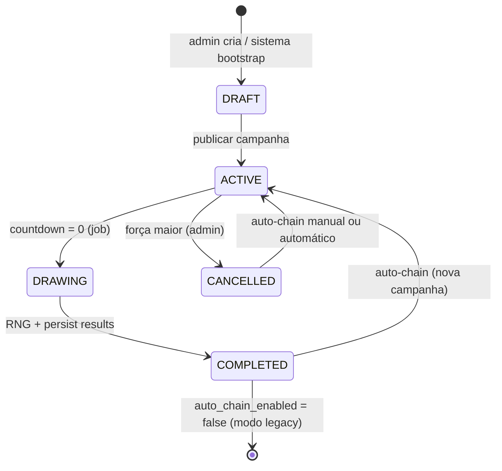

# Sorteio de Doações ARKLAND — Especificação (promoção vinculada a PIX/cartão)


| Campo                     | Valor                                                                                                                                                                                                                                                                                                                                                                 |
| ------------------------- | --------------------------------------------------------------------------------------------------------------------------------------------------------------------------------------------------------------------------------------------------------------------------------------------------------------------------------------------------------------------- |
| **Status**                | ✅ Implementado (v1.7)                                                                                                                                                                                                                                                                                                               |
| **Versão do documento**   | 1.7                                                                                                                                                                                                                                                                                                                                                                   |
| **Data**                  | 10 de julho de 2026                                                                                                                                                                                                                                                                                                                                                   |
| **Changelog v1.7**        | **Doações incrementam o prêmio:** cada **R\$ 1,00** doado adiciona **+100 Âmbares** ao prize_amber_from_donations da campanha (ex.: R\$ 5 → +500, R\$ 25 → +2.500 âmbares); prize_amber_total agora inclui essa parcela; nova coluna prize_amber_from_donations; ledger channel=lottery / event_type=lottery_donation_prize_contribution; idempotência via chave lottery:donation_prize:{campaign_id}:{payment_id} |
| **Changelog v1.6**        | **Mecanismo de entrega do prêmio:** crédito de Âmbares na conta ARKLAND (`players.points` via `_add_player_points_tx`) — **não** Steam Wallet nem pagamento em dinheiro real; copy de UI (“creditados na sua conta ARKLAND”); Âmbarômetro com `channel=lottery` (débito house / crédito jogador); regulamento v1.5 com disclaimer de moeda simbólica                  |
| **Changelog v1.5**        | **Princípio explícito:** com ≥1 titular premiado, **100% do** `prize_amber_total` é distribuído — divisão por `matched_count`, **nunca** por `W` (quantidade sorteada); números sorteados sem titular não retêm parcela nem geram rollover; exemplos canônicos 124/5/1 e 124/5/3; regulamento v1.4; APIs com `prize_pool_fully_distributed`                           |
| **Changelog v1.4**        | Divisão igualitária do prêmio entre **1–5 titulares** de números sorteados (`share = ceil(prize_amber_total / matched_count)`); subsídio do organizador até **1 Âmbar por match** para parcelas inteiras iguais; prêmio integral pago quando há ≥1 titular (números sorteados sem titular não geram rollover); transparência e APIs com valor por vencedor e subsídio |
| **Changelog v1.3**        | Bônus de rollover **+25%** quando nenhum número sorteado possui titular (`rollover_out = prize_amber_total × 1.25`); exemplos e clarificação de que o bônus incide sobre o pool integral no momento do sorteio                                                                                                                                                        |
| **Changelog v1.2**        | Compra de números com Âmbares (aleatório e reserva específica), unicidade por campanha (100–999), grade pública de disponibilidade, fórmula de prêmio com 100% das compras em Âmbares                                                                                                                                                                                 |
| **Changelog v1.1**        | Área Pública do Sorteio como feature de primeira classe (rota dedicada, hub de transparência, APIs e wireframe)                                                                                                                                                                                                                                                       |
| **Escopo**                | Sorteio promocional contínuo vinculado a doações reais (PIX/cartão) **e** compra opcional de números com Âmbares, numeração única por campanha (100–999), prêmio em Âmbares com acumulação, transparência extrema (incl. grade pública) e auto-encadeamento de campanhas                                                                                              |
| **Fora de escopo**        | Código, schema SQL definitivo, deploy, alteração da política de doações existente                                                                                                                                                                                                                                                                                     |
| **Fuso horário canônico** | **America/Sao_Paulo (UTC-3)** — exibição, countdown e regulamento                                                                                                                                                                                                                                                                                                     |


> **Ver também:** `[PROJETO_ARKLAND_MASTER.md](PROJETO_ARKLAND_MASTER.md)`, `[ambarmeter_spec.md](ambarmeter_spec.md)`, `[REGULAMENTO_SITE_IMPLEMENTACAO.md](REGULAMENTO_SITE_IMPLEMENTACAO.md)`, `[PORTAL_JOGADOR_SPEC.md](PORTAL_JOGADOR_SPEC.md)`, `[plugin/arkshop_web/pix_payments.py](../plugin/arkshop_web/pix_payments.py)`, `[plugin/arkshop_web/app.py](../plugin/arkshop_web/app.py)` (`_finalize_pix_payment`), `[plugin/arkshop_web/amber_ledger.py](../plugin/arkshop_web/amber_ledger.py)`, `[plugin/arkshop_web/poll_service.py](../plugin/arkshop_web/poll_service.py)`, `[plugin/arkshop_web/regulamento_service.py](../plugin/arkshop_web/regulamento_service.py)`.

---


## Sumário executivo


| Pergunta                   | Resposta                                                                                                                                                                                                                                                                                                                                                                                                                                                  |
| -------------------------- | --------------------------------------------------------------------------------------------------------------------------------------------------------------------------------------------------------------------------------------------------------------------------------------------------------------------------------------------------------------------------------------------------------------------------------------------------------- |
| **O que é?**               | Promoção contínua de **sorteio** na Web Store ARKLAND com **três formas** de obter números (100–999, únicos por campanha): (1) doação — **R$ 5,00** = 1 número aleatório; (2) compra com Âmbares — até **5 números aleatórios** a **1.000 Âmbares** cada; (3) reserva — número **específico** a **2.000 Âmbares** se disponível                                                                                                                           |
| **Qual o prêmio?**         | **Âmbares** — pool = base + rollover + **100%** do valor gasto em compras/reservas + **R$ 1,00 doado = +100 âmbares** (v1.7); até **5 números** sorteados por campanha; com **≥1 titular** premiado, o **pool integral** é repartido **igualmente** entre os titulares (`matched_count`, não `W`) em parcelas inteiras (`ceil`); sorteados sem titular **não** reduzem o payout; se **nenhum** sorteado tiver titular, o pool **acumula com bônus de +25%** (ex.: 100 → 125) |
| **Como recebo o prêmio?**  | Crédito automático na **conta ARKLAND** do jogador (`players.points` via `_add_player_points_tx`) — **não** Steam Wallet, **não** dinheiro real; uso exclusivo no ecossistema ARKLAND (catálogo web, mercado P2P, compra de números, etc.) — ver §3.6.2                                                                                                                                                                                                   |
| **Como encerra?**          | **Sorteio automático** quando o countdown chega a zero — sem intervenção manual para escolher vencedor                                                                                                                                                                                                                                                                                                                                                    |
| **O que acontece depois?** | **Auto-chain:** ao concluir o sorteio, uma **nova campanha inicia automaticamente** com prêmio rollover + configuração herdada                                                                                                                                                                                                                                                                                                                            |
| **Onde aparece?**          | **Área Pública do Sorteio** (`#/sorteio` — hub completo: grade 100–999, participantes, compra/reserva), **Home** (widget teaser + countdown), **Minha Área** (números por origem: doação vs compra), **Admin Sorteios** (participantes, configuração, auditoria)                                                                                                                                                                                          |
| **Diferencial**            | Transparência extrema: **grade pública** com todos os números 100–999 (disponível/ocupado), lista de participantes, RNG documentado, registros imutáveis, trilha de auditoria, integração com ledger e regulamento próprio em PT-BR                                                                                                                                                                                                                       |


**Tagline proposta:** *“Cada doação apoia o cluster — e cada Âmbar pode aumentar o prêmio na sorte.”*

**Princípio inegociável:** o sistema **nunca** permite que admin escolha manualmente o vencedor. O resultado é produzido exclusivamente por algoritmo determinístico auditável + seed criptográfica registrada antes do sorteio.

---


## 1. Visão e objetivos


### 1.1 Visão de produto

O **Sorteio de Doações ARKLAND** transforma doações voluntárias (já existentes via Mercado Pago PIX/cartão) em um **engajamento recorrente e transparente**: jogadores que apoiam o servidor recebem números da sorte proporcionais ao valor doado; periodicamente o sistema sorteia um ou mais números vencedores e credita Âmbares ao(s) titular(es).

Os números pertencem exclusivamente à **campanha ativa** — cada valor entre **100 e 999** pode ter **no máximo um titular** por campanha (900 números possíveis). A obtenção ocorre por três vias independentes: **doação** (aleatório, sem custo adicional), **compra aleatória com Âmbares** (até 5 por jogador) ou **reserva de número específico** (2.000 Âmbares, se livre). Doações e compras aleatórias atribuem números pelo sistema; apenas a reserva permite escolha explícita.

### 1.2 Objetivos


| Objetivo                         | Métrica de sucesso                                                                                           |
| -------------------------------- | ------------------------------------------------------------------------------------------------------------ |
| **Aumentar doações recorrentes** | Volume de `point_payments` creditados durante campanhas ativas                                               |
| **Transparência total**          | Qualquer visitante acessa `#/sorteio` e vê participantes (nomes mascarados), números e histórico de sorteios |
| **Operação zero-touch**          | Sorteio + nova campanha sem ação manual do admin (salvo configuração inicial)                                |
| **Confiança regulatória**        | Regulamento próprio publicado, aceite opcional/obrigatório conforme decisão legal                            |
| **Integração nativa**            | Hook em `_finalize_pix_payment`, ledger `amber_ledger`, audit_events existente                               |


### 1.3 O sorteio **não é**


| Não é                                      | É sim                                                                                                          |
| ------------------------------------------ | -------------------------------------------------------------------------------------------------------------- |
| Loteria federal regulada pela Caixa        | Promoção promocional interna do cluster ARKLAND                                                                |
| Compra de números com dinheiro real        | Números por doação são **gratuitos** (benefício promocional); compra avulsa usa apenas **Âmbares** in-game     |
| Escolha livre de qualquer número sem custo | Doação e compra aleatória = atribuição **automática**; escolha manual só via **reserva paga** (2.000 Âmbares)  |
| Prêmio em dinheiro real                    | Prêmio exclusivamente em **Âmbares** (moeda simbólica in-game)                                                 |
| Crédito na Steam Wallet / carteira Steam   | Crédito na **conta ARKLAND** (`players.points`) — o organizador **não** tem acesso à carteira Steam de ninguém |
| Pagamento em reais ou saque do prêmio      | **Sem conversão** — Âmbares só circulam no ecossistema ARKLAND                                                 |
| Sorteio manual por staff                   | Sorteio **100% automatizado** com registro imutável                                                            |


### 1.4 Relação com sistemas existentes

```
┌─────────────────────────────────────────────────────────────────────┐
│              SORTEIO DE DOAÇÕES (camada promoção + transparência)    │
│  Campanhas │ Números │ RNG auditável │ Resultados │ Auto-chain       │
└───────────────────────────────┬─────────────────────────────────────┘
                                │ dispara em doação creditada
┌───────────────────────────────▼─────────────────────────────────────┐
│  _finalize_pix_payment │ point_payments │ Mercado Pago PIX/cartão    │
└───────────────────────────────┬─────────────────────────────────────┘
                                │
┌───────────────────────────────▼─────────────────────────────────────┐
│  players.points │ amber_ledger │ audit_events │ regulamento_service   │
└─────────────────────────────────────────────────────────────────────┘
```


### 1.5 Baseline técnico existente


| Componente                        | Estado            | Referência                                                 |
| --------------------------------- | ----------------- | ---------------------------------------------------------- |
| Doações PIX/cartão                | ✅ Produção        | `pix_payments.py`, `PointPayment`, `_finalize_pix_payment` |
| Crédito de Âmbares pós-APROVADO   | ✅                 | `_add_player_points_tx` em `app.py`                        |
| Ledger unificado                  | ✅                 | `amber_ledger.py` — `record_donation`                      |
| Enquetes com job de encerramento  | ✅ Padrão          | `poll_service.py` — `close_expired_polls`                  |
| Regulamento + aceite              | ✅                 | `regulamento_service.py`                                   |
| Sugestões comunidade (admin CRUD) | ✅ Padrão UI admin | `suggestion_service.py`, `suggestion_routes.py`            |
| Home pública                      | ✅                 | `GET /api/public/home`                                     |
| Minha Área                        | ✅                 | `#page-myarea` em `static/index.html`                      |
| Sorteio de doações                | ❌ **Novo**        | Este documento                                             |
| Área Pública `#/sorteio`          | ❌ **Novo**        | §5.6, §8.2                                                 |


---


## 2. Personas


### 2.1 Doador / jogador participante

- **Objetivo:** apoiar o cluster e concorrer a Âmbares extras com transparência.
- **Necessidades:** ver seus números em Minha Área **por origem** (doação / compra / reserva), comprar até 5 aleatórios ou reservar específico, countdown até o sorteio, entender regras, histórico de campanhas anteriores.
- **Frustração:** sorteios opacos no Discord, números “reservados” por staff sem transparência, dúvida se doação entrou no sorteio, número desejado já ocupado sem grade visível.
- **Fluxo típico:** doa via PIX/cartão **ou** compra/reserva com Âmbares → recebe números → acompanha grade e countdown → confere resultado público.


### 2.2 Visitante público (logado ou não)

- **Objetivo:** entender a promoção, auditar transparência e acompanhar sorteios **sem precisar doar ou estar logado**.
- **Necessidades:**
  - Rota dedicada `**#/sorteio**` (ou `/sorteio`) acessível pelo menu principal para **todos** os visitantes
  - Campanha ativa: countdown, pool de prêmio (base + rollover), resumo das regras
  - Lista pública de participantes com **modo privacidade** (nomes mascarados — ver §13.1)
  - **Grade pública** com todos os números 100–999 (disponível vs ocupado)
  - **Todos** os números da sorte visíveis por participante na lista (transparência comunitária)
  - Histórico de sorteios passados (campanhas arquivadas, números vencedores, vencedores, prêmio pago)
  - Resultados ao vivo quando o sorteio concluir (estado `DRAWING` → `COMPLETED`)
  - Estatísticas agregadas: total de participantes, números emitidos, total doado na campanha (opcional)
  - Link para regulamento completo do sorteio
- **Frustração:** widget na home que não mostra lista completa; sorteios opacos; impossibilidade de verificar números alheios.
- **Conversão:** widget na home (teaser) → CTA “Ver sorteio completo” → Área Pública → “Doar e participar” → login Steam → fluxo de doação existente.
- **Diferença chave:** visitante público consome a **visão comunitária**; jogador logado usa **Minha Área** para visão pessoal (apenas seus números).


### 2.3 Admin / operador ARKLAND

- **Objetivo:** configurar campanhas, monitorar participação, auditar resultados — **sem** escolher vencedores.
- **Necessidades:** painel Admin Sorteios, lista de participantes exportável, logs de RNG, override apenas para **cancelar** campanha (força maior), configurar quantidade de números vencedores (1–5).
- **Restrição:** qualquer ação que altere resultado pós-sorteio deve ser **impossível** na UI e bloqueada na API.


### 2.4 Suporte / moderação

- **Objetivo:** responder tickets sobre “não recebi número”, chargeback, disputa de prêmio.
- **Necessidades:** correlacionar `payment_id` → números atribuídos → status chargeback; trilha read-only.


### 2.5 Autoridade / compliance (interno)

- **Objetivo:** documentação suficiente para demonstrar natureza promocional; compras com Âmbares in-game **não** são apostas em dinheiro real.
- **Necessidades:** regulamento modelo §14 distingue doação gratuita vs compra com moeda simbólica; grade pública comprova ausência de manipulação de números por staff.

---


## 3. Regras de negócio detalhadas


### 3.1 Elegibilidade e participação


| Regra                   | Detalhe                                                                                                                                                                  |
| ----------------------- | ------------------------------------------------------------------------------------------------------------------------------------------------------------------------ |
| **Quem participa**      | Jogador autenticado via Steam OpenID que realiza doação **creditada** durante campanha `ACTIVE`                                                                          |
| **Conta bloqueada**     | `store_users.site_access_blocked = true` → doação pode ser bloqueada pelo fluxo existente; números **não** são gerados se crédito falhar                                 |
| **Regulamento sorteio** | Aceite do regulamento específico do sorteio (versão `lottery_regulamento_version`) — gate configurável: obrigatório antes da primeira participação ou apenas informativo |
| **Regulamento geral**   | Reutilizar padrão `needs_regulamento_accept` se campanha exigir aceite geral ARKLAND                                                                                     |
| **Staff/admin**         | **Podem participar** salvo exclusão expressa em edital da campanha (ver §17 Q13)                                                                                         |


### 3.2 Três origens de números — visão geral


| Origem                 | Código interno  | Custo                                | Escolha do número                             | Limite por jogador/campanha                      | Elegibilidade                                       |
| ---------------------- | --------------- | ------------------------------------ | --------------------------------------------- | ------------------------------------------------ | --------------------------------------------------- |
| **Doação**             | `DONATION`      | R$ 5,00 = 1 número (sem custo extra) | Aleatório (sistema)                           | Ilimitado (proporcional ao valor doado)          | Doação creditada em campanha `ACTIVE`               |
| **Compra aleatória**   | `AMBER_RANDOM`  | **1.000 Âmbares** / número           | Aleatório (sistema)                           | **Máx. 5** números                               | Jogador logado; campanha `ACTIVE`; saldo suficiente |
| **Reserva específica** | `AMBER_RESERVE` | **2.000 Âmbares** / número           | Jogador escolhe **100–999** se **disponível** | Ilimitado (desde que números distintos e livres) | Idem compra aleatória                               |


**Regras comuns a todas as origens:**


| Regra                      | Detalhe                                                                                                                 |
| -------------------------- | ----------------------------------------------------------------------------------------------------------------------- |
| **Intervalo**              | Cada número ∈ **[100, 999]** (inteiro, inclusive) — **900 valores** por campanha                                        |
| **Unicidade**              | **Um único titular** por `(campaign_id, number_value)` — números **nunca se repetem** dentro da mesma campanha          |
| **Campanha**               | Válido **somente** para campanha `ACTIVE` — compras/reservas bloqueadas em `DRAFT`, `DRAWING`, `COMPLETED`, `CANCELLED` |
| **Visibilidade**           | **Todos** os números 100–999 aparecem na **grade pública** da Área Pública `#/sorteio` (disponível vs ocupado)          |
| **Contribuição ao prêmio** | Cada Âmbar gasto em compra ou reserva adiciona **100%** ao pool da campanha (1.000 → +1.000; 2.000 → +2.000)            |


### 3.2.1 Números por doação e Âmbares creditados ao jogador (R$ 5 = 1 número + 500 Âmbares)


| Regra                    | Detalhe                                                                                                      |
| ------------------------ | ------------------------------------------------------------------------------------------------------------ |
| **Proporcionalidade**    | `floor(amount_brl / 5.00)` números por doação creditada                                                      |
| **Exemplos (números)**   | R$ 5 → 1 número; R$ 12 → 2 números; R$ 4,99 → 0 números                                                     |
| **Âmbares por doação**   | `int(round(amount_brl * 100))` Âmbares somados ao **prêmio total** (`prize_amber_from_donations`) — fórmula: `prêmio += donation_reais × 100` |
| **Exemplos (Âmbares)**   | R$ 5 → 500 Âmbares; R$ 10 → 1.000 Âmbares; R$ 25 → 2.500 Âmbares                                           |
| **Constante**            | `DONATION_AMBER_PER_REAL = 100` em `lottery_service.py`                                                      |
| **Atribuição**           | Sistema sorteia números **ainda não ocupados** na campanha (ver §3.3)                                        |
| **Momento**              | Somente após `PointPayment.credited = true` em `_finalize_pix_payment`                                       |
| **Pacotes**              | Qualquer pacote de doação existente elegível; valor vem de `amount_brl`                                       |
| **Múltiplas doações**    | Cada doação creditada gera lote independente de números e Âmbares                                             |
| **Idempotência**         | Segundo processamento do mesmo `payment_id` retorna `skipped=True` sem duplicar créditos                     |
| **Escolha manual**    | **Não** — jogador não seleciona números na doação                       |


### 3.2.2 Compra aleatória com Âmbares (“apostar”)

Independente das doações — mecanismo separado na Área Pública e Minha Área.


| Regra           | Detalhe                                                                                            |
| --------------- | -------------------------------------------------------------------------------------------------- |
| **Preço**       | **1.000 Âmbares** por número                                                                       |
| **Quantidade**  | Até **5 números** por jogador por campanha (contador `amber_random_count`)                         |
| **Atribuição**  | Sistema sorteia entre números **ainda disponíveis** na campanha                                    |
| **Débito**      | `_add_player_points_tx` com delta negativo + `record_lottery_amber_purchase` (`channel=lottery`)   |
| **Prêmio**      | **+1.000 Âmbares** ao `prize_amber_from_purchases` da campanha (100% do valor pago)                |
| **API**         | `POST /api/player/lottery/buy-random` (alias `/api/lottery/buy-random`) — ver §7.2                 |
| **UI**          | Botão “Comprar número aleatório (1.000 Âmbares)” na Área Pública (auth) + contador “X/5 comprados” |
| **Regulamento** | Texto distingue compra com Âmbares de benefício promocional de doação                              |


### 3.2.3 Reserva de número específico


| Regra               | Detalhe                                                                                        |
| ------------------- | ---------------------------------------------------------------------------------------------- |
| **Preço**           | **2.000 Âmbares** por número                                                                   |
| **Escolha**         | Jogador informa número desejado ∈ [100, 999]                                                   |
| **Disponibilidade** | Operação **rejeitada** se número já ocupado na campanha (`409 Conflict`)                       |
| **Prêmio**          | **+2.000 Âmbares** ao `prize_amber_from_purchases` (100% do valor pago)                        |
| **Limite**          | Sem teto global além do pool de 900 números; não conta no limite de 5 da compra aleatória      |
| **API**             | `POST /api/player/lottery/reserve/{number}` (alias `/api/lottery/reserve/{number}`) — ver §7.2 |
| **UI**              | Clique na célula **disponível** da grade ou campo “Reservar número: [___]”                     |
| **Concorrência**    | Transação com lock em `(campaign_id, number_value)` — primeiro a confirmar vence               |


### 3.3 Unicidade e colisão de números (100–999)

**Decisão v1.2:** cada campanha possui **numeração própria e exclusiva**. O par `(campaign_id, number_value)` é **único** — não há duplicatas dentro da mesma campanha. Campanhas diferentes podem reutilizar os mesmos valores numéricos (ex.: #12 e #13 ambos podem ter o 742, mas em titulares distintos).


| Aspecto           | Regra                                                                                                                                    |
| ----------------- | ---------------------------------------------------------------------------------------------------------------------------------------- |
| **Capacidade**    | Máximo **900** números emitidos por campanha (100–999)                                                                                   |
| **Constraint DB** | `UNIQUE (campaign_id, number_value)` em `lottery_numbers`                                                                                |
| **Esgotamento**   | Quando todos os 900 estiverem ocupados, novas atribuições (doação, compra ou reserva) são **rejeitadas** com erro operacional registrado |


#### Estratégia de colisão — números aleatórios (doação e compra)

Quando o sistema precisa atribuir um número aleatório e o candidato já está ocupado:


| Política adotada (MVP) | Comportamento                                                                                                                                         |
| ---------------------- | ----------------------------------------------------------------------------------------------------------------------------------------------------- |
| **Re-sort até único**  | Sorteia candidato ∈ [100, 999]; se ocupado, repete até achar livre ou atingir **N tentativas** (ex. 50)                                               |
| **Fallback**           | Se pool quase esgotado e re-sort falhar: sorteia uniformemente entre conjunto **restante** de livres (O(1) com lista pré-computada ou query `NOT IN`) |
| **Falha total**        | Se não houver números livres → rejeitar atribuição + `audit_event lottery_pool_exhausted`                                                             |


**Não adotado:** Política de duplicatas (antiga “B”) — incompatível com grade pública e reserva específica.

#### Conflito doação vs compra vs reserva


| Cenário                                      | Resolução                                                         |
| -------------------------------------------- | ----------------------------------------------------------------- |
| Doação sorteia número já ocupado             | Re-sort automático (§ acima) — jogador **não** perde o número     |
| Compra aleatória com pool esgotado           | `409` — “Não há números disponíveis nesta campanha”               |
| Reserva de número ocupado                    | `409` — “Número {N} indisponível”; UI destaca célula como ocupada |
| Race: dois jogadores reservam o mesmo número | Primeiro commit vence; segundo recebe `409`                       |


**Nota histórica (v1.1):** Políticas A/B/C foram discutidas; v1.2 **fixa unicidade** por requisito de grade pública e reserva específica.

### 3.4 Campanha — estados e transições


| Status      | Significado                                                                              |
| ----------- | ---------------------------------------------------------------------------------------- |
| `DRAFT`     | Configurada mas não aceita doações/números                                               |
| `ACTIVE`    | Aceita novas atribuições; countdown visível                                              |
| `DRAWING`   | Countdown zerou; job executando sorteio (lock)                                           |
| `COMPLETED` | Sorteio realizado; resultados publicados                                                 |
| `CANCELLED` | Cancelada por força maior — números invalidados; tratamento conforme política de doações |


Transições automáticas: `ACTIVE` → `DRAWING` → `COMPLETED` → (auto-chain) nova campanha `ACTIVE`.

### 3.5 Configuração por campanha


| Campo                             | Tipo           | Default                          | Descrição                                                             |
| --------------------------------- | -------------- | -------------------------------- | --------------------------------------------------------------------- |
| `title`                           | string         | "Sorteio ARKLAND #N"             | Título público                                                        |
| `draw_at`                         | datetime UTC-3 | —                                | Data/hora do sorteio (admin configurável)                             |
| `winning_numbers_count`           | int 1–5        | 1                                | Quantidade de números sorteados como vencedores                       |
| `prize_amber_base`                | int            | 5000                             | Pool base de Âmbares                                                  |
| `prize_amber_rollover_in`         | int            | 0                                | Acumulado importado da campanha anterior                              |
| `prize_amber_from_purchases`      | int            | 0                                | Soma de Âmbares gastos em compras/reservas (atualizado em tempo real) |
| `prize_amber_from_donations`      | int            | 0                                | Âmbares adicionados ao pool por doações (R$ 1 = +100 âmbares, v1.7)  |
| `prize_amber_total`               | computed       | base + rollover + from_purchases + from_donations | Prêmio total em jogo (v1.7)                        |
| `amber_random_max_per_player`     | int            | 5                                | Teto de compras aleatórias por jogador/campanha                       |
| `amber_random_price`              | int            | 1000                             | Preço compra aleatória                                                |
| `amber_reserve_price`             | int            | 2000                             | Preço reserva específica                                              |
| `regulamento_version`             | string         | "1.0"                            | Versão do regulamento específico                                      |
| `allow_staff_participation`       | bool           | true                             | Se false, exclui steam_ids em grupo Admin/Staff                       |
| `auto_chain_enabled`              | bool           | true                             | Inicia próxima campanha automaticamente                               |
| `next_campaign_draw_offset_hours` | int            | 168 (7 dias)                     | Intervalo até sorteio da próxima campanha                             |


### 3.6 Sorteio e vencedores


| Regra                              | Detalhe                                                                                                                                                               |
| ---------------------------------- | --------------------------------------------------------------------------------------------------------------------------------------------------------------------- |
| **Gatilho**                        | Job detecta `draw_at <= now()` para campanha `ACTIVE`                                                                                                                 |
| **Quantidade sorteada**            | `winning_numbers_count` (1–5) inteiros distintos no intervalo [100, 999]                                                                                              |
| **RNG**                            | `secrets.SystemRandom` ou HMAC-SHA256 com seed commitada (ver §13)                                                                                                    |
| **Vencedor**                       | O `steam_id` titular do número sorteado na campanha (titular único por número — ver §3.3)                                                                             |
| **Match vencedor**                 | Número sorteado com titular `ACTIVE` na campanha — conta como **1 match** para divisão                                                                                |
| **Princípio pool integral (v1.5)** | Com **≥1 match**, **100%** de `prize_amber_total` é pago — **nunca** fração proporcional a `W`; divisão exclusivamente por `matched_count`                            |
| **Múltiplos vencedores**           | Até **5 matches**; prêmio dividido **igualmente** entre todos os matches (`share_per_match` inteiro) — algoritmo §3.6.1                                               |
| **Mesmo jogador, vários números**  | Se o mesmo `steam_id` for titular de **mais de um** número sorteado, recebe `share_per_match` **por número** (soma no crédito)                                        |
| **Sem vencedor**                   | `matched_count = 0` (nenhum número sorteado possui titular) → `rollover_out = prize_amber_total × 1.25` (**pool integral + bônus de 25%**) — ver §3.7                 |
| **Com ≥1 match**                   | Prêmio **integral** repartido entre os matches; `rollover_out = 0`; `prize_pool_fully_distributed = true`; próxima campanha inicia **somente com** `prize_amber_base` |
| **Números sorteados sem titular**  | **Não** recebem parcela, **não** reduzem o payout e **não** geram rollover — o pool inteiro vai aos matches existentes (§3.6.1)                                       |
| **Anti-padrão rejeitado**          | **Não** dividir `prize_amber_total / W` nem reter “sobra não paga” quando há ≥1 match — ex.: 124 Âmbares, 5 sorteados, 1 titular → **124** ao vencedor (não 24,8)     |
| **Subsídio do organizador**        | Se `ceil` exigir arredondamento, o cluster cobre até **1 Âmbar por match** (`prize_amber_subsidy ≤ matched_count`)                                                    |
| **Crédito prêmio**                 | Automático via `_add_player_points_tx` → `players.points` + `record_lottery_prize` (`channel=lottery`) — **um crédito por registro** em `lottery_winners`; ver §3.6.2 |
| **Notificação**                    | In-app + opcional Discord webhook                                                                                                                                     |


### 3.6.1 Divisão do prêmio — algoritmo v1.5

> **Princípio v1.5:** `W` (quantidade sorteada, 1–5) define **quantos números** entram no sorteio, **não** o denominador da divisão. Com **≥1 match**, **100%** de `prize_amber_total` é distribuído entre os `matched_count` titulares — **nunca** `prize_amber_total / W`, **nunca** sobra retida no pool.

**Entradas** (calculadas no instante do sorteio):


| Variável            | Definição                                                                               |
| ------------------- | --------------------------------------------------------------------------------------- |
| `prize_amber_total` | `base + rollover_in + from_purchases` (§3.7)                                            |
| `drawn_numbers[]`   | `W` números sorteados (`W = winning_numbers_count`, 1–5)                                |
| `matched_winners[]` | Lista `{ steam_id, winning_number }` para cada `n ∈ drawn_numbers` com titular `ACTIVE` |
| `matched_count`     | `len(matched_winners)` — **denominador da divisão**; **não** confundir com `W`          |


**Fórmula** (divisor = `matched_count`, **nunca** `W`):

```
SE matched_count = 0:
  share_per_match              = 0
  prize_amber_paid             = 0
  prize_amber_subsidy          = 0
  prize_pool_fully_distributed = false
  rollover_out                 = prize_amber_total × 1.25

SENÃO:
  share_per_match              = ceil(prize_amber_total / matched_count)
  prize_amber_paid             = share_per_match × matched_count
  prize_amber_subsidy          = prize_amber_paid - prize_amber_total
  rollover_out                 = 0
  prize_pool_fully_distributed = true   # 100% do pool repartido (v1.5)

  PARA CADA match EM matched_winners:
    lottery_winners.prize_amber = share_per_match
```

**Invariantes:**


| Invariante       | Garantia                                                                                                                |
| ---------------- | ----------------------------------------------------------------------------------------------------------------------- |
| Parcelas iguais  | Todo match recebe exatamente `share_per_match` (inteiro)                                                                |
| Teto de subsídio | `prize_amber_subsidy ≤ matched_count` (máx. **1 Âmbar** de subsídio por match)                                          |
| Pool integral    | Com ≥1 match, `prize_amber_paid ≥ prize_amber_total`, `rollover_out = 0` e `prize_pool_fully_distributed = true`        |
| Sem match        | `prize_amber_paid = 0`, `prize_pool_fully_distributed = false` e bônus +25% sobre pool integral (regra v1.3 preservada) |
| Divisor correto  | Divisão **sempre** por `matched_count`; **proibido** `prize_amber_total / W`                                            |


> **Nota:** com `prize_amber_total` inteiro e divisão por `ceil`, o subsídio real é `matched_count - (prize_amber_total mod matched_count)` quando há resto, ou **0** quando divisível — sempre ≤ `matched_count - 1`, portanto dentro do teto de 1 Âmbar/match.

**Exemplos canônicos v1.5** (`prize_amber_total = 124`):


| Cenário                      | `W` | `matched_count` | `share_per_match` | `prize_amber_paid` | Resultado                                           |
| ---------------------------- | --- | --------------- | ----------------- | ------------------ | --------------------------------------------------- |
| 5 sorteados, **1 titular**   | 5   | 1               | **124**           | 124                | Vencedor único leva **100%** do pool (não 124÷5)    |
| 5 sorteados, **3 titulares** | 5   | 3               | **42**            | 126                | Pool integral entre 3 (`124÷3→42` cada; subsídio 2) |
| 5 sorteados, **5 titulares** | 5   | 5               | **25**            | 125                | Caso clássico ceil (subsídio 1)                     |


**Tabela de exemplos complementares:**


| `prize_amber_total` | `W` sorteados | `matched_count` | `share_per_match` | `prize_amber_paid` | `subsídio` | `rollover_out` | Cenário                                                             |
| ------------------- | ------------- | --------------- | ----------------- | ------------------ | ---------- | -------------- | ------------------------------------------------------------------- |
| 124                 | 5             | 1               | **124**           | 124                | 0          | 0              | **Canônico v1.5:** 5 sorteados, 1 titular — **100%** ao vencedor    |
| 124                 | 5             | 3               | **42**            | 126                | 2          | 0              | **Canônico v1.5:** 5 sorteados, 3 titulares — pool integral entre 3 |
| 124                 | 5             | 5               | **25**            | 125                | 1          | 0              | 5 titulares — caso clássico (124÷5=24,8→25 cada)                    |
| 100                 | 5             | 2               | **50**            | 100                | 0          | 0              | 5 sorteados, 2 titulares — **pool integral** entre os 2             |
| 100                 | 3             | 1               | **100**           | 100                | 0          | 0              | 3 sorteados, 1 titular — vencedor único leva **100%**               |
| 100                 | 3             | 3               | **34**            | 102                | 2          | 0              | 3 titulares — 100÷3=33,33→34 cada                                   |
| 100                 | 5             | 0               | —                 | 0                  | 0          | **125**        | **Sem vencedor** — rollover +25%                                    |
| 23.000              | 1             | 1               | **23.000**        | 23.000             | 0          | 0              | 1 número sorteado, 1 titular                                        |
| 101                 | 5             | 5               | **21**            | 105                | 4          | 0              | Resto alto — subsídio 4 (≤5)                                        |
| 10                  | 5             | 5               | **2**             | 10                 | 0          | 0              | Divisão exata                                                       |
| 1                   | 5             | 5               | **1**             | 5                  | 4          | 0              | Pool mínimo — subsídio máximo relativo                              |


**Mesmo jogador com 2 números sorteados** (`prize_amber_total = 100`, `matched_count = 3`, jogador A titular de 2 números, jogador B de 1):

- `share_per_match = ceil(100/3) = 34`
- Jogador A: **68** Âmbares (2 × 34) · Jogador B: **34** Âmbares
- `prize_amber_paid = 102`, `prize_amber_subsidy = 2`


### 3.6.2 Mecanismo de entrega do prêmio (v1.6)

> **Princípio v1.6:** o prêmio é **sempre** entregue como crédito de Âmbares na conta do jogador **dentro do sistema ARKLAND**. Não há transferência para Steam Wallet, carteira Steam, PIX, cartão ou qualquer meio de pagamento externo.


#### O que acontece no sorteio

Após o cálculo de `share_per_match` (§3.6.1), o job de sorteio credita cada vencedor na **mesma transação** do resultado:

1. `**_add_player_points_tx(db, steam_id, share_per_match)**` — incrementa `players.points` (mesma função usada em doações PIX, crédito admin e recompensas de enquetes).
2. `**record_lottery_prize(...)**` — grava movimento no `amber_ledger` com `channel=lottery`, `event_type=lottery_prize_credited`, `signed_delta=+share_per_match`.
3. **Persistência** — `lottery_winners.prize_amber` e `points_transaction_id` (ou referência equivalente) para auditoria.

O saldo exibido no header da Web Store, em Minha Área e no painel admin (“Gerenciar Jogadores”) reflete `players.points` vinculado ao `steam_id` autenticado via Steam OpenID. A identidade da conta é mantida em `store_users` (login, bloqueio, display name); o **saldo spendável** vive em `players.points`.

#### O que o prêmio **não** é


| Não é                                          | Motivo                                                                                                   |
| ---------------------------------------------- | -------------------------------------------------------------------------------------------------------- |
| **Steam Wallet**                               | ARKLAND não possui API nem permissão para creditar saldo na carteira Steam de terceiros                  |
| **Dinheiro real (PIX, cartão, transferência)** | Prêmio é moeda virtual simbólica do cluster — sem valor monetário real nem conversão                     |
| **Item físico ou chave Steam**                 | Fora do escopo desta promoção (entregas físicas seguem fluxos próprios do catálogo, se houver)           |
| **Crédito automático in-game (RCON)**          | O prêmio entra no saldo web (`players.points`); resgates no servidor seguem o fluxo normal do CustomShop |


#### Onde o jogador gasta os Âmbares creditados

Os Âmbares do prêmio **somam-se** ao saldo existente e podem ser usados em qualquer fluxo que debite `players.points`:


| Destino                     | Exemplo                                                                          |
| --------------------------- | -------------------------------------------------------------------------------- |
| **Catálogo web**            | Resgate de kits, itens, licenças                                                 |
| **Mercado P2P**             | Compra de anúncios de outros jogadores                                           |
| **Sorteio (esta promoção)** | Compra aleatória (1.000 Âmbares) ou reserva (2.000 Âmbares) em campanhas futuras |
| **Outros débitos web**      | Qualquer feature futura que use `_add_player_points_tx` com delta negativo       |


#### Paridade com outros créditos

O prêmio de sorteio usa o **mesmo pipeline** de crédito que:


| Origem                | Função                                           | Ledger `channel` |
| --------------------- | ------------------------------------------------ | ---------------- |
| Doação PIX/cartão     | `_add_player_points_tx` + `record_donation`      | `donation`       |
| Crédito admin         | `_add_player_points_tx` + `record_movement`      | `admin`          |
| Recompensa de enquete | `_add_player_points_tx` + `record_movement`      | `community`      |
| **Prêmio de sorteio** | `_add_player_points_tx` + `record_lottery_prize` | `**lottery`**    |


Não há tipo especial de “Âmbar de prêmio” — o saldo é fungível dentro do ecossistema ARKLAND.

#### Subsídio do organizador (ledger)

Quando `prize_amber_subsidy > 0` (arredondamento `ceil`, §3.6.1), a diferença entre `prize_amber_paid` e `prize_amber_total` é aportada pelo cluster (house). No Âmbarômetro:

- **Crédito ao jogador:** `channel=lottery`, `event_type=lottery_prize_credited`, `signed_delta=+share_per_match` (por match).
- **Subsídio house (opcional, transparência):** `channel=lottery`, `event_type=lottery_prize_subsidy`, `signed_delta=+subsídio` com `counterparty_id=house` — registra o aporte sem débito de jogador; ver §11.1.

Compras de números com Âmbares já debitam o jogador (`lottery_amber_purchase`) e alimentam `prize_amber_from_purchases` — essa parcela do pool **já saiu** do saldo de participantes antes do sorteio.

### 3.7 Acumulação (rollover) e fórmula do prêmio

```
prize_amber_from_purchases(N) = Σ (amber_cost) de lottery_numbers
  onde source ∈ { AMBER_RANDOM, AMBER_RESERVE } e status = ACTIVE

prize_amber_from_donations(N) = round(amount_brl × 100)   # por doação creditada
  → R$ 1,00 = +100 âmbares | R$ 5,00 = +500 | R$ 25,00 = +2.500

prize_amber_total(N) = prize_amber_base(N)
                     + prize_amber_rollover_in(N)
                     + prize_amber_from_purchases(N)
                     + prize_amber_from_donations(N)

# Divisão — ver §3.6.1 (executada no sorteio):
matched_count(N)      = |{ n ∈ drawn_numbers : ∃ titular ACTIVE }|
share_per_match(N)    = matched_count > 0 ? ceil(prize_amber_total / matched_count) : 0
prize_amber_paid(N)   = share_per_match × matched_count
prize_amber_subsidy(N)= prize_amber_paid - prize_amber_total   # ≥ 0; coberto pelo organizador

rollover_out(N):
  SE matched_count(N) = 0:                       # sem vencedor (v1.3 preservado)
    rollover_out = prize_amber_total(N) × 1.25
    prize_pool_fully_distributed = false
  SENÃO:                                         # ≥1 match — 100% do pool pago (v1.5)
    rollover_out = 0
    prize_pool_fully_distributed = true

prize_amber_rollover_in(N+1) = rollover_out(N)
```


| Componente                   | Origem                               | Observação                                                               |
| ---------------------------- | ------------------------------------ | ------------------------------------------------------------------------ |
| `prize_amber_base`           | Config admin por campanha            | Valor fixo inicial de cada nova campanha                                 |
| `prize_amber_rollover_in`    | Campanha anterior                    | Acumulado importado (`rollover_out` da campanha anterior)                |
| `prize_amber_from_purchases` | Compras + reservas com Âmbares       | **100%** do Âmbar debitado do jogador entra no pool — não há taxa retida |
| `prize_amber_from_donations` | Doações PIX/cartão creditadas        | **R$ 1,00 doado = +100 âmbares** ao pool (v1.7); idempotente por `payment_id` |


**Pool no momento do sorteio:** `prize_amber_total` é calculado **no instante do sorteio** e inclui **todos** os componentes acima — `prize_amber_base` + `prize_amber_rollover_in` + `prize_amber_from_purchases` + `prize_amber_from_donations`. O bônus de **+25%** no cenário sem vencedor incide sobre esse **pool integral**, não apenas sobre a base ou sobre o rollover isolado.

**Exemplos de cálculo do pool:**


| base   | rollover_in | compras | `prize_amber_total` |
| ------ | ----------- | ------- | ------------------- |
| 10.000 | 5.000       | 8.000   | 23.000              |
| 5.000  | 0           | 0       | 5.000               |
| 10.000 | 12.500      | 3.000   | 25.500              |


**Exemplos de rollover sem vencedor** (`matched_count = 0` → `rollover_out = prize_amber_total × 1.25`):


| `prize_amber_total` no sorteio         | Bônus +25% | `rollover_out` (próxima campanha) |
| -------------------------------------- | ---------- | --------------------------------- |
| 100                                    | +25        | **125**                           |
| 5.000                                  | +1.250     | **6.250**                         |
| 23.000                                 | +5.750     | **28.750**                        |
| 10.000 (só base, sem rollover/compras) | +2.500     | **12.500**                        |


**Exemplo com 1 match (canônico v1.5):** `prize_amber_total = 124`, `W = 5`, `matched_count = 1` → `share = 124`, vencedor recebe **124** (100% do pool) → `rollover_out = 0`, `prize_pool_fully_distributed = true`.

**Exemplo com 3 matches (canônico v1.5):** `prize_amber_total = 124`, `W = 5`, `matched_count = 3` → `share = 42`, `prize_amber_paid = 126`, `subsídio = 2` → `rollover_out = 0`.

**Exemplo com 1 match (pool alto):** campanha com `prize_amber_total = 23.000`, `matched_count = 1` → `share = 23.000`, vencedor recebe 23.000 → `rollover_out = 0`. Campanha N+1 inicia com `prize_amber_base` configurado (ex. 10.000) e `prize_amber_rollover_in = 0`.

**Exemplo com 5 matches:** `prize_amber_total = 124`, `matched_count = 5` → `share = 25`, `prize_amber_paid = 125`, `subsídio = 1` → `rollover_out = 0`.

**Exemplo sorteados sem titular (2 de 5 com holder):** `prize_amber_total = 100`, `W = 5`, `matched_count = 2` → `share = 50`, cada titular recebe 50, `prize_amber_paid = 100` → `rollover_out = 0` — os 3 sorteados sem titular **não** retêm parcela nem reduzem o payout.

**Exemplo sem vencedor encadeado:** campanha com `prize_amber_total = 100`, ninguém acerta → `rollover_out = 125`. Campanha N+1: `prize_amber_rollover_in = 125` (mais `prize_amber_base` e novas compras).

Compras não reembolsadas em caso de cancelamento — ver §17 Q38.

### 3.8 Countdown e fuso horário


| Regra              | Detalhe                                                                             |
| ------------------ | ----------------------------------------------------------------------------------- |
| **Exibição**       | Sempre em **UTC-3 (America/Sao_Paulo)** com label explícito                         |
| **Armazenamento**  | `draw_at` em UTC no banco; conversão na API                                         |
| **Sincronização**  | Front-end atualiza a cada 1s local; servidor é fonte da verdade                     |
| **Countdown zero** | Transição para `DRAWING` no próximo tick do job (atraso máx. configurável, ex. 60s) |


### 3.9 Chargeback e estorno


| Evento                                          | Ação                                                                                                                |
| ----------------------------------------------- | ------------------------------------------------------------------------------------------------------------------- |
| Doação **APROVADA** e creditada                 | Números gerados normalmente                                                                                         |
| **ESTORNADO** / chargeback **antes** do sorteio | Números `DONATION` vinculados ao `payment_id` → status `REVOKED`; compras/reservas com Âmbares **não** são afetadas |
| Chargeback **após** sorteio e prêmio pago       | Prêmio **não** é clawback automático; registrar incidente + ticket manual (ver §14)                                 |
| Doação estornada **sem** números gerados        | Nenhuma ação no sorteio                                                                                             |


Hook proposto: extensão de `_finalize_pix_payment` quando `mapped == "ESTORNADO"` → chamar `revoke_lottery_numbers(payment_id)`.

### 3.10 Cancelamento por força maior

Admin pode cancelar campanha `ACTIVE` com motivo obrigatório (mín. 20 caracteres). Efeitos:

- Números invalidados
- Sorteio não ocorre
- Rollover preservado para próxima campanha (`prize_amber_rollover_in` da campanha cancelada, **sem** bônus de +25% — bônus só aplica após sorteio sem vencedor)
- Audit event `lottery_campaign_cancelled`
- **Não** implica reembolso de doações (Política de Doações existente)

---


## 4. Ciclo auto-chain


### 4.1 Diagrama de estados




### 4.2 Sequência auto-chain pós-sorteio

**Regra de rollover (v1.5):** após o sorteio, `rollover_out` segue §3.7 — `matched_count = 0` → `prize_amber_total × 1.25`; `matched_count ≥ 1` → **100%** do pool pago (com subsídio se necessário, §3.6.1), `rollover_out = 0` e `prize_pool_fully_distributed = true`. A campanha seguinte recebe `prize_amber_rollover_in = rollover_out` **além** de `prize_amber_base` herdado.

```mermaid
sequenceDiagram
    participant Job as lottery_draw_job
    participant DB as MariaDB
    participant RNG as lottery_rng
    participant Ledger as amber_ledger
    participant Player as players.points

    Job->>DB: lock campaign ACTIVE where draw_at <= now()
    Job->>DB: status = DRAWING
    Job->>RNG: draw winning numbers (seed committed)
    RNG-->>Job: numbers + audit blob
    Job->>DB: insert lottery_draw_results (immutable)
    Job->>DB: resolve matches (titulares dos números sorteados)
    alt matched_count >= 1
        Job->>DB: compute share_per_match = ceil(total / matched_count)
        Job->>Player: credit share_per_match per match
        Job->>Ledger: record_lottery_prize (channel=lottery) per match
        Job->>DB: prize_amber_subsidy = paid - total; rollover_out = 0; prize_pool_fully_distributed = true
    else matched_count = 0
        Job->>DB: rollover_out = prize_amber_total × 1.25
    end
    Job->>DB: status = COMPLETED
    alt auto_chain_enabled
        Job->>DB: INSERT new campaign ACTIVE
        Note over DB: rollover_in = rollover_out<br/>draw_at = now + offset
    end
    Job->>DB: commit
```


### 4.3 Bootstrap inicial

Na **primeira implantação**, admin cria campanha #1 manualmente ou seed automático:

- `prize_amber_base` = valor acordado (ex. 10.000 Âmbares)
- `draw_at` = now + 7 dias
- `winning_numbers_count` = 1
- `auto_chain_enabled` = true

---


## 5. Fluxos


### 5.1 Fluxo doador → números (origem `DONATION`)

```
Jogador logado → Doação PIX/cartão (fluxo existente)
    → Mercado Pago aprova
    → Webhook/poll → _finalize_pix_payment
        → credita Âmbares (existente)
        → record_donation (ledger — existente)
        → [NOVO] assign_lottery_numbers(campaign_id, payment_id, steam_id, amount_brl)
            → calcula qty = floor(amount_brl / 5)
            → para cada qty: sorteia número livre 100–999 (re-sort se colisão — §3.3)
            → persiste lottery_numbers (source=DONATION)
            → audit_event lottery_numbers_assigned
    → UI Minha Área atualiza lista de números (badge origem: doação)
```


### 5.1.1 Fluxo compra aleatória com Âmbares (`AMBER_RANDOM`)

```
Jogador logado → Área Pública #/sorteio ou Minha Área
    → verifica campanha ACTIVE + saldo ≥ 1.000 + count < 5
    → POST /api/player/lottery/buy-random
        → BEGIN TRANSACTION
            → lock campaign + verificar limite jogador
            → debitar 1.000 Âmbares (_add_player_points_tx negativo)
            → record_movement(lottery_amber_purchase)
            → sortear número livre (re-sort / pool restante)
            → INSERT lottery_numbers (source=AMBER_RANDOM, amber_cost=1000)
            → prize_amber_from_purchases += 1000
            → audit_event lottery_amber_random_purchased
        → COMMIT
    → UI: grade atualiza célula; contador X/5; pool de prêmio +1.000
```


### 5.1.2 Fluxo reserva de número específico (`AMBER_RESERVE`)

```
Jogador logado → grade pública #/sorteio
    → clica célula disponível OU informa número em [100, 999]
    → POST /api/player/lottery/reserve/{number}
        → BEGIN TRANSACTION
            → SELECT number FOR UPDATE — se ocupado: ROLLBACK 409
            → verificar saldo ≥ 2.000
            → debitar 2.000 Âmbares
            → record_movement(lottery_amber_purchase)
            → INSERT lottery_numbers (source=AMBER_RESERVE, number_value=N, amber_cost=2000)
            → prize_amber_from_purchases += 2000
            → audit_event lottery_amber_reserved
        → COMMIT
    → UI: célula passa de “disponível” (verde) para “ocupado” (cinza/vermelho)
```


### 5.2 Fluxo countdown (home + Área Pública + Minha Área)

```
GET /api/public/lottery/current   (Área Pública + widget home — sem auth)
GET /api/public/lottery/active    (alias legado de /current — manter compat.)
GET /api/player/lottery/me        (Minha Área — auth)

Response inclui:
  - campaign_id, title, draw_at (ISO UTC + display UTC-3)
  - prize_amber_total, prize_amber_base, prize_amber_rollover_in, prize_amber_from_purchases
  - numbers_available_count (900 - emitidos)
  - amber_random_price, amber_reserve_price, amber_random_max_per_player
  - participant_count, numbers_issued_count, total_donated_brl (opcional)
  - seconds_remaining (server-computed)
  - winning_numbers_count (quantos serão sorteados)
  - rules_summary (texto curto para exibição)
  - number_grid_url: "/api/public/lottery/campaign/{id}/number-grid"

### 5.3 Fluxo sorteio automático

```

Cron / APScheduler / thread job (padrão poll_service):
  every 30–60s:
    close_due_lottery_campaigns()
      FOR each campaign WHERE status=ACTIVE AND draw_at <= utcnow():
        BEGIN TRANSACTION
          SELECT ... FOR UPDATE
          IF still ACTIVE:
            run_draw(campaign)
            mark COMPLETED
            IF auto_chain: create_next_campaign(rollover)
        COMMIT

```

### 5.4 Fluxo resultados públicos

```

GET /api/public/lottery/campaign/{campaign_id}/results

Response:

- winning_numbers: [742, 318, 501, 889, 102]
- winning_numbers_count: 5
- matched_count: 2
- share_per_match: 50
- prize_amber_total: 100
- prize_amber_paid: 100
- prize_amber_subsidy: 0
- prize_pool_fully_distributed: true    # 100% do pool repartido (matched_count ≥ 1)
- winners: [
{ display_name_masked, winning_number: 742, prize_amber: 50 },
{ display_name_masked, winning_number: 318, prize_amber: 50 }
]
- unmatched_drawn_numbers: [501, 889, 102]   # sorteados sem titular — não reduzem payout
- draw_audit: { seed_hash, algorithm, drawn_at, record_id }
- rollover_next: 0
- next_campaign_id (se auto-chain já criou)

```

### 5.5 Fluxo admin — configurar campanha

```

Admin → #/admin/lottery
  → edit draw_at (datetime picker UTC-3)
  → edit winning_numbers_count (1–5)
  → edit prize_amber_base
  → toggle allow_staff_participation
  → view participants table (read-only numbers)
  → CANNOT edit winning numbers post-draw

```

### 5.6 Área Pública do Sorteio — hub de transparência

A **Área Pública do Sorteio** é uma página dedicada de primeira classe — **não** um modal, **não** apenas o widget da home. É o centro de transparência comunitária da promoção.

#### 5.6.1 Rota e navegação

| Aspecto | Detalhe |
|---------|---------|
| **Rota front-end** | `#/sorteio` (SPA existente) — alternativa futura: `/sorteio` se migrar para rotas path-based |
| **Visibilidade** | Item **“Sorteio”** no menu principal (header/nav) para **todos** os visitantes — logados ou não |
| **Auth** | **Nenhuma** — página 100% pública; CTAs de doação redirecionam para login Steam quando necessário |
| **SEO / compartilhamento** | URL estável para compartilhar no Discord; meta tags com título da campanha e prêmio |

#### 5.6.2 Conteúdo — campanha ativa

Quando existe campanha `ACTIVE` ou `DRAWING`:

| Bloco | Conteúdo |
|-------|----------|
| **Hero** | Título da campanha (#N), status badge (`ATIVA` / `SORTEANDO…` / `CONCLUÍDA`) |
| **Countdown** | Timer ao vivo até `draw_at` (UTC-3 explícito); congela em `DRAWING` com mensagem “Sorteio em andamento” |
| **Prêmio** | `prize_amber_total` destacado; breakdown: base + rollover + compras/reservas |
| **Regras resumidas** | R$ 5 = 1 número + 500 Âmbares · cada R$ 1 doado = 100 Âmbares · compra 1.000 Âmbares (máx. 5) · reserva 2.000 Âmbares · intervalo 100–999 únicos · até 5 números sorteados · com ≥1 titular, **100%** do prêmio repartido entre titulares (`matched_count`) · sorteio automático |
| **Grade de números** | Tabela/grid **100–999** — todas as células visíveis; cor **disponível** vs **ocupado** (ver §5.6.9) |
| **Ações (logado)** | “Comprar aleatório (1.000)” · contador compras X/5 · clique em célula livre para reservar (2.000) |
| **Estatísticas** | Participantes únicos · números emitidos / 900 · total doado (opcional) · Âmbares injetados via compras |
| **CTA** | “Doar e participar” (login se necessário) · “Ver regulamento completo” |

Fonte de dados: `GET /api/public/lottery/current`.

#### 5.6.3 Lista pública de participantes

| Requisito | Detalhe |
|-----------|---------|
| **Visibilidade** | Todos os participantes com status `ACTIVE` na campanha |
| **Por participante** | Nome mascarado (modo privacidade §13.1) + **todos** os números da sorte + badge de origem por número (`doação` / `compra` / `reserva`) + data da última atribuição |
| **Ordenação** | Por `assigned_at` desc (mais recentes primeiro) ou alfabético por nome mascarado — configurável |
| **Paginação** | Server-side; default 50 por página |
| **Busca** | Filtro por número da sorte (ex.: “742” → mostra todos os titulares) |
| **Revogados** | Números `REVOKED` (chargeback) **não** aparecem |
| **Transparência** | Números alheios são **visíveis por design** — qualquer visitante pode auditar distribuição |

Fonte de dados: `GET /api/public/lottery/campaign/{id}/participants`.

#### 5.6.4 Resultados ao vivo

| Estado campanha | Comportamento na Área Pública |
|-----------------|-------------------------------|
| `ACTIVE` | Countdown + lista participantes + stats |
| `DRAWING` | Banner “Sorteio em andamento…” + polling a cada 5s em `/current` |
| `COMPLETED` | Exibe números sorteados, matches (titulares), valor **por vencedor** (`share_per_match`), subsídio se houver, prêmio total pago, link auditoria RNG |
| Auto-chain | Após `COMPLETED`, seção “Próxima campanha #N+1” já ativa aparece abaixo |

Transição sugerida: WebSocket ou polling curto (5–10s) durante `DRAWING` → `COMPLETED`.

#### 5.6.5 Histórico de sorteios passados

Seção **“Sorteios anteriores”** na mesma página (aba ou scroll):

| Campo por campanha arquivada | Exibido |
|------------------------------|---------|
| `#sequence_number` + título | Sim |
| Data/hora do sorteio (UTC-3) | Sim |
| Números sorteados | Sim (todos os `W`, inclusive sem titular) |
| Matches / vencedores (nome mascarado) + **valor por match** | Sim |
| `share_per_match`, `prize_amber_subsidy`, `matched_count`, `prize_pool_fully_distributed` | Sim |
| Prêmio total pago (`prize_amber_paid`) | Sim |
| Rollover gerado | Sim (com indicação de bônus +25% quando aplicável) |
| Link “Ver detalhes” | Abre visão expandida da campanha |

Fonte de dados: `GET /api/public/lottery/history` + `GET /api/public/lottery/campaign/{id}`.

#### 5.6.6 Regulamento

- Link permanente: “Regulamento do Sorteio” → `/api/public/lottery/regulamento` ou modal inline
- Versão vigente (`regulamento_version`) exibida no rodapé da página

#### 5.6.7 Mapa de superfícies — o que cada área mostra

| Superfície | Público | Escopo | Profundidade |
|------------|---------|--------|--------------|
| **Widget Home** | Todos | Teaser da campanha ativa | Countdown + prêmio + stats resumidas + CTA “Ver sorteio completo” |
| **Área Pública `#/sorteio`** | Todos | Hub comunitário de transparência | Campanha + **grade 100–999** + compra/reserva (logado) + participantes + histórico |
| **Minha Área** | Jogador logado | Visão **pessoal** | Números por origem (doação / compra / reserva), limites, doações, countdown |
| **Admin Sorteios** | Staff | Operação + auditoria | SteamID completo, payment_id, export CSV, config, logs RNG |

```

```
                ┌─────────────────────────────────────┐
                │         WIDGET HOME (teaser)         │
                │  countdown · prêmio · stats · CTA   │
                └──────────────┬──────────────────────┘
                               │ "Ver sorteio completo"
                ┌──────────────▼──────────────────────┐
                │    ÁREA PÚBLICA #/sorteio (hub)      │
                │  campanha · grade 100–999 · participantes │
                │  histórico · resultados · regulamento│
                └──────────────┬──────────────────────┘
       ┌───────────────────────┼───────────────────────┐
       │                       │                       │
```


┌──────────▼─────────┐  ┌──────────▼──────────┐  ┌─────────▼─────────┐
│  MINHA ÁREA        │  │  (visitante não     │  │  ADMIN SORTEIOS   │
│  meus números      │  │   logado — só lê)   │  │  steam_id, audit  │
│  minhas doações    │  │                     │  │  config, export   │
└────────────────────┘  └─────────────────────┘  └───────────────────┘

```

#### 5.6.8 Fluxo visitante típico

```

Visitante → nav "Sorteio" → #/sorteio
  → GET /api/public/lottery/current (campanha + countdown + stats + breakdown prêmio)
  → GET /api/public/lottery/campaign/{id}/number-grid (grade 100–999 disponível/ocupado)
  → GET /api/public/lottery/campaign/{id}/participants (lista + números + origem)
  → scroll "Sorteios anteriores" → GET /api/public/lottery/history
  → clica campanha passada → GET /api/public/lottery/campaign/{id} + /results
  → [logado] compra/reserva → POST buy-random ou reserve/{number}
  → [opcional] "Doar e participar" → login Steam → doação

```

#### 5.6.9 Grade pública de números (100–999)

Painel visual obrigatório na Área Pública — **todos** os 900 números devem ser visíveis sem paginação que oculte faixas.

| Aspecto | Detalhe |
|---------|---------|
| **Layout** | Grid tabular: 10 colunas × 90 linhas (100–109 na 1ª linha … 990–999 na última) **ou** 30×30 com scroll vertical compacto — decisão UI em §17 Q37 |
| **Célula disponível** | Fundo verde claro / borda tracejada — número legível, clicável (se logado) |
| **Célula ocupada** | Fundo cinza ou vermelho suave — número legível, **não** clicável |
| **Tooltip ocupado** | “Indisponível” — **sem** revelar titular na grade (privacidade); titular visível na lista de participantes com nome mascarado |
| **Destaque pessoal** | Jogador logado vê **seus** números com borda dourada na grade (qualquer origem) |
| **Atualização** | Polling 10–30s ou invalidação após compra/reserva própria |
| **Campanhas arquivadas** | Grade read-only com estado final; link no histórico |

Fonte de dados: `GET /api/public/lottery/campaign/{id}/number-grid`.

**Transparência vs privacidade na grade:**

| Modo | O que a grade mostra |
|------|---------------------|
| **MVP (recomendado)** | Apenas estado binário: disponível / ocupado — **sem** nome na célula |
| **Alternativa** | Iniciais mascaradas na célula ocupada — pode poluir visualmente; ver §17 Q36 |

---

## 6. Modelo de dados

Padrão: `ensure_lottery_schema(engine)` idempotente — espelhar `poll_service.py` / `suggestion_service.py`.

### 6.1 Tabela `lottery_campaigns`

| Coluna | Tipo | Notas |
|--------|------|-------|
| `id` | BIGINT PK | |
| `sequence_number` | INT UNIQUE | #1, #2, #3… human-readable |
| `title` | VARCHAR(200) | |
| `status` | VARCHAR(16) | DRAFT, ACTIVE, DRAWING, COMPLETED, CANCELLED |
| `draw_at` | DATETIME(3) | UTC storage |
| `winning_numbers_count` | TINYINT | 1–5, CHECK constraint |
| `prize_amber_base` | INT | |
| `prize_amber_rollover_in` | INT DEFAULT 0 | |
| `prize_amber_from_purchases` | INT DEFAULT 0 | Soma Âmbares de compras/reservas (atualizado em tempo real) |
| `prize_amber_paid` | INT DEFAULT 0 | Σ `share_per_match × matched_count` pós-sorteio |
| `prize_amber_subsidy` | INT DEFAULT 0 | Âmbares adicionados pelo organizador (`paid - total`) |
| `prize_pool_fully_distributed` | TINYINT(1) DEFAULT 0 | `true` quando `matched_count ≥ 1` — 100% do pool repartido (v1.5) |
| `matched_winners_count` | TINYINT DEFAULT 0 | Matches com titular (≤ `winning_numbers_count`) |
| `prize_amber_rollover_out` | INT DEFAULT 0 | |
| `amber_random_price` | INT DEFAULT 1000 | |
| `amber_reserve_price` | INT DEFAULT 2000 | |
| `amber_random_max_per_player` | TINYINT DEFAULT 5 | |
| `regulamento_version` | VARCHAR(16) | |
| `allow_staff_participation` | TINYINT(1) DEFAULT 1 | |
| `auto_chain_enabled` | TINYINT(1) DEFAULT 1 | |
| `next_campaign_draw_offset_hours` | INT DEFAULT 168 | |
| `previous_campaign_id` | BIGINT NULL FK | encadeamento |
| `created_at` | DATETIME(3) | |
| `updated_at` | DATETIME(3) | |
| `completed_at` | DATETIME(3) NULL | |

Índices: `(status, draw_at)`, `(sequence_number)`.

### 6.2 Tabela `lottery_numbers`

| Coluna | Tipo | Notas |
|--------|------|-------|
| `id` | BIGINT PK | |
| `campaign_id` | BIGINT FK | |
| `steam_id` | VARCHAR(32) | |
| `payment_id` | VARCHAR(64) NULL FK → point_payments | NULL para origens `AMBER_*` |
| `source` | VARCHAR(16) | `DONATION`, `AMBER_RANDOM`, `AMBER_RESERVE` |
| `number_value` | SMALLINT | 100–999 |
| `amber_cost` | INT DEFAULT 0 | 0 para doação; 1000 ou 2000 para compras |
| `status` | VARCHAR(16) | ACTIVE, REVOKED |
| `assigned_at` | DATETIME(3) | |
| `revoked_at` | DATETIME(3) NULL | chargeback (só `DONATION`) |
| `revoke_reason` | VARCHAR(64) NULL | ex. `chargeback` |

Índices: `UNIQUE (campaign_id, number_value)`, `(campaign_id, steam_id)`, `(campaign_id, steam_id, source)` para contagem de compras aleatórias, `(payment_id)`.

### 6.3 Tabela `lottery_draw_results` (imutável)

| Coluna | Tipo | Notas |
|--------|------|-------|
| `id` | BIGINT PK | |
| `campaign_id` | BIGINT UNIQUE FK | 1 sorteio por campanha |
| `winning_numbers_json` | JSON | ex. `[742, 318]` |
| `seed_commit_hash` | VARCHAR(64) | SHA-256 do seed pré-sorteado |
| `seed_reveal` | VARCHAR(128) NULL | revelado pós-sorteado (opcional) |
| `algorithm_version` | VARCHAR(16) | ex. `arkland-v1` |
| `audit_blob_json` | JSON | `matched_count`, `share_per_match`, `prize_amber_subsidy`, participantes count, timestamp, etc. |
| `drawn_at` | DATETIME(3) | |
| `job_id` | VARCHAR(64) | idempotência |

**Regra:** INSERT only — sem UPDATE/DELETE na aplicação (triggers ou permissões DB).

### 6.4 Tabela `lottery_winners`

| Coluna | Tipo | Notas |
|--------|------|-------|
| `id` | BIGINT PK | |
| `campaign_id` | BIGINT FK | |
| `draw_result_id` | BIGINT FK | |
| `steam_id` | VARCHAR(32) | |
| `winning_number` | SMALLINT | |
| `prize_amber` | INT | `share_per_match` creditado a este match |
| `share_per_match` | INT | Cópia denormalizada para auditoria (igual em todos os matches da campanha) |
| `credited` | TINYINT(1) DEFAULT 0 | |
| `credited_at` | DATETIME(3) NULL | |
| `ledger_idempotency_key` | VARCHAR(128) | |

### 6.5 Tabela `lottery_regulamento_acceptances`

| Coluna | Tipo | Notas |
|--------|------|-------|
| `steam_id` | VARCHAR(32) PK part | |
| `version` | VARCHAR(16) PK part | |
| `accepted_at` | DATETIME(3) | |
| `ip_hash` | VARCHAR(64) NULL | opcional |

### 6.6 Tabela `lottery_audit_log` (append-only)

| Coluna | Tipo | Notas |
|--------|------|-------|
| `id` | BIGINT PK | |
| `campaign_id` | BIGINT NULL | |
| `event_type` | VARCHAR(64) | ver §13 |
| `payload_json` | JSON | |
| `created_at` | DATETIME(3) | |

Alternativa: reutilizar `audit_events` existente com `source=lottery` — preferível para unified audit (ver §17 Q1).

---

## 7. APIs

Convenções: JSON, erros `{ "ok": false, "error": "..." }`, rate limit em rotas player, admin exige `@admin_required`.

### 7.1 Público (sem auth)

Rotas consumidas pela **Área Pública `#/sorteio`** e pelo widget teaser da home.

| Método | Rota | Descrição |
|--------|------|-----------|
| GET | `/api/public/lottery/current` | **Canônica** — campanha ativa ou em `DRAWING` + countdown + prêmio + stats + resumo regras |
| GET | `/api/public/lottery/active` | Alias de `/current` (compatibilidade) |
| GET | `/api/public/lottery/history` | Campanhas `COMPLETED` — sorteados, matches, `share_per_match`, prêmio pago, subsídio, rollover |
| GET | `/api/public/lottery/campaign/{id}` | Detalhe de campanha (ativa ou arquivada): config pública, stats, status, links para participants/results |
| GET | `/api/public/lottery/campaign/{id}/participants` | Lista pública: `display_name_masked`, `numbers[]` com `source` por número, `last_assigned_at` — sem CPF/email/steam_id |
| GET | `/api/public/lottery/campaign/{id}/number-grid` | Grade 100–999: `{ number, status: "available"|"taken", is_mine? }` — `is_mine` só se auth opcional via cookie |
| GET | `/api/public/lottery/campaign/{id}/results` | Resultados + divisão (`share_per_match`, `matched_count`, `prize_amber_subsidy`) + audit (quando `COMPLETED`) |
| GET | `/api/public/lottery/regulamento` | HTML/markdown regulamento sorteio |

**Notas de contrato:**

- `{id}` aceita `campaign_id` numérico ou alias `current` (redireciona para campanha ativa).
- `/participants` suporta query params: `page`, `page_size`, `search_number` (100–999).
- Durante `DRAWING`, `/current` retorna `status: "DRAWING"` + flag `results_pending: true`.
- Rate limit leve (ex. 60 req/min/IP) em `/participants` para evitar scraping abusivo.
- **Payout (v1.5):** com `matched_count ≥ 1`, `prize_pool_fully_distributed = true` e `prize_amber_paid ≥ prize_amber_total`; divisão por `matched_count`, **nunca** por `winning_numbers_count` (`W`). Sorteados sem titular listados em `unmatched_drawn_numbers` — não reduzem payout.

### 7.2 Jogador (auth Steam)

| Método | Rota | Descrição |
|--------|------|-----------|
| GET | `/api/player/lottery/me` | Números do jogador na campanha ativa por origem + limites (compras X/5) + histórico |
| POST | `/api/player/lottery/buy-random` | Compra 1 número aleatório (1.000 Âmbares); alias: `/api/lottery/buy-random` |
| POST | `/api/player/lottery/reserve/{number}` | Reserva número específico 100–999 (2.000 Âmbares); alias: `/api/lottery/reserve/{number}` |
| POST | `/api/player/lottery/regulamento/accept` | Aceite regulamento sorteio |
| GET | `/api/player/lottery/regulamento/status` | Precisa aceitar? |

### 7.3 Admin

| Método | Rota | Descrição |
|--------|------|-----------|
| GET | `/api/admin/lottery/campaigns` | Lista campanhas |
| POST | `/api/admin/lottery/campaigns` | Criar DRAFT |
| PATCH | `/api/admin/lottery/campaigns/{id}` | Editar draw_at, prêmio, winning_count (somente ACTIVE/DRAFT) |
| POST | `/api/admin/lottery/campaigns/{id}/publish` | DRAFT → ACTIVE |
| POST | `/api/admin/lottery/campaigns/{id}/cancel` | Cancelar com motivo |
| GET | `/api/admin/lottery/campaigns/{id}/participants` | Export completo (+ payment_id, steam_id) |
| GET | `/api/admin/lottery/campaigns/{id}/audit` | Log completo + draw record |
| POST | `/api/admin/lottery/draw/trigger` | **Dev only** — forçar sorteio (desabilitado prod) |

### 7.4 Webhooks / internos

| Hook | Onde | Ação |
|------|------|------|
| `assign_lottery_numbers` | pós-crédito em `_finalize_pix_payment` | Atribui números (DONATION) |
| `buy_random_lottery_number` | POST buy-random | Compra AMBER_RANDOM |
| `reserve_lottery_number` | POST reserve/{number} | Reserva AMBER_RESERVE |
| `revoke_lottery_numbers` | status ESTORNADO | Revoga números de doação |
| `lottery_draw_job` | scheduler | Executa sorteio + auto-chain |

### 7.5 Exemplo response `/api/public/lottery/current`

```json
{
  "ok": true,
  "campaign": {
    "id": 42,
    "sequence_number": 12,
    "title": "Sorteio ARKLAND #12",
    "status": "ACTIVE",
    "draw_at_utc": "2026-07-12T03:00:00+00:00",
    "draw_at_display": "2026-07-12T00:00:00-03:00",
    "timezone_label": "Horário de Brasília (UTC-3)",
    "seconds_remaining": 604812,
    "prize_amber_total": 30500,
    "prize_amber_base": 10000,
    "prize_amber_rollover_in": 12500,
    "prize_amber_from_purchases": 8000,
    "amber_random_price": 1000,
    "amber_reserve_price": 2000,
    "amber_random_max_per_player": 5,
    "numbers_available_count": 657,
    "winning_numbers_count": 2,
    "participant_count": 87,
    "numbers_issued_count": 243,
    "total_donated_brl": 1215.00,
    "regulamento_version": "1.1",
    "rules_summary": "R$ 5 = 1 número + 500 Âmbares · cada real doado = 100 Âmbares · compra 1.000 Âmbares (máx. 5) · reserva 2.000 Âmbares · até 5 sorteados · prêmio dividido igualmente entre titulares dos sorteados.",
    "results_pending": false
  }
}
```

### 7.6 Exemplo response `/api/public/lottery/campaign/{id}/participants`

```json
{
  "ok": true,
  "campaign_id": 42,
  "page": 1,
  "page_size": 50,
  "total": 87,
  "participants": [
    {
      "display_name_masked": "Pla***One",
      "numbers": [
        { "value": 142, "source": "DONATION" },
        { "value": 587, "source": "AMBER_RANDOM" },
        { "value": 203, "source": "AMBER_RESERVE" }
      ],
      "last_assigned_at": "2026-07-04T18:32:00-03:00"
    }
  ]
}
```

### 7.7 Exemplo response `/api/public/lottery/history`

```json
{
  "ok": true,
  "page": 1,
  "campaigns": [
    {
      "id": 11,
      "sequence_number": 11,
      "title": "Sorteio ARKLAND #11",
      "draw_at_display": "2026-07-05T00:00:00-03:00",
      "winning_numbers": [742, 318],
      "winning_numbers_count": 2,
      "matched_count": 2,
      "share_per_match": 11250,
      "prize_amber_total": 22500,
      "prize_amber_paid": 22500,
      "prize_amber_subsidy": 0,
      "prize_pool_fully_distributed": true,
      "winners": [
        { "display_name_masked": "Pla***One", "winning_number": 742, "prize_amber": 11250 },
        { "display_name_masked": "Dra***Fox", "winning_number": 318, "prize_amber": 11250 }
      ],
      "rollover_out": 0
    },
    {
      "id": 12,
      "sequence_number": 12,
      "title": "Sorteio ARKLAND #12",
      "draw_at_display": "2026-07-04T00:00:00-03:00",
      "winning_numbers": [100, 200, 300, 400, 500],
      "winning_numbers_count": 5,
      "matched_count": 5,
      "share_per_match": 25,
      "prize_amber_total": 124,
      "prize_amber_paid": 125,
      "prize_amber_subsidy": 1,
      "prize_pool_fully_distributed": true,
      "winners": [
        { "display_name_masked": "Pla***One", "winning_number": 100, "prize_amber": 25 },
        { "display_name_masked": "Dra***Fox", "winning_number": 200, "prize_amber": 25 },
        { "display_name_masked": "Ark***Hunter", "winning_number": 300, "prize_amber": 25 },
        { "display_name_masked": "Sur***vivor", "winning_number": 400, "prize_amber": 25 },
        { "display_name_masked": "Tri***be", "winning_number": 500, "prize_amber": 25 }
      ],
      "unmatched_drawn_numbers": [],
      "rollover_out": 0
    },
    {
      "id": 13,
      "sequence_number": 13,
      "title": "Sorteio ARKLAND #13",
      "draw_at_display": "2026-07-03T00:00:00-03:00",
      "winning_numbers": [111, 222, 333, 444, 555],
      "winning_numbers_count": 5,
      "matched_count": 1,
      "share_per_match": 124,
      "prize_amber_total": 124,
      "prize_amber_paid": 124,
      "prize_amber_subsidy": 0,
      "prize_pool_fully_distributed": true,
      "winners": [
        { "display_name_masked": "Pla***One", "winning_number": 333, "prize_amber": 124 }
      ],
      "unmatched_drawn_numbers": [111, 222, 444, 555],
      "rollover_out": 0
    },
    {
      "id": 14,
      "sequence_number": 14,
      "title": "Sorteio ARKLAND #14",
      "draw_at_display": "2026-07-02T00:00:00-03:00",
      "winning_numbers": [100, 200, 300, 400, 500],
      "winning_numbers_count": 5,
      "matched_count": 3,
      "share_per_match": 42,
      "prize_amber_total": 124,
      "prize_amber_paid": 126,
      "prize_amber_subsidy": 2,
      "prize_pool_fully_distributed": true,
      "winners": [
        { "display_name_masked": "Pla***One", "winning_number": 100, "prize_amber": 42 },
        { "display_name_masked": "Dra***Fox", "winning_number": 300, "prize_amber": 42 },
        { "display_name_masked": "Ark***Hunter", "winning_number": 500, "prize_amber": 42 }
      ],
      "unmatched_drawn_numbers": [200, 400],
      "rollover_out": 0
    },
    {
      "id": 10,
      "sequence_number": 10,
      "title": "Sorteio ARKLAND #10",
      "draw_at_display": "2026-06-28T00:00:00-03:00",
      "winning_numbers": [415],
      "winners": [],
      "matched_count": 0,
      "prize_amber_total": 100,
      "prize_amber_paid": 0,
      "prize_pool_fully_distributed": false,
      "rollover_out": 125,
      "rollover_bonus_applied": true
    }
  ]
}
```

### 7.8 Exemplo response `/api/public/lottery/campaign/{id}/number-grid`

```json
{
  "ok": true,
  "campaign_id": 42,
  "numbers": [
    { "value": 100, "status": "available" },
    { "value": 101, "status": "taken" },
    { "value": 142, "status": "taken", "is_mine": true }
  ],
  "summary": { "available": 657, "taken": 243, "total": 900 }
}
```

### 7.9 Exemplo response `POST /api/player/lottery/buy-random`

```json
{
  "ok": true,
  "number": { "value": 456, "source": "AMBER_RANDOM", "amber_cost": 1000 },
  "amber_random_remaining": 2,
  "prize_amber_total": 23500,
  "new_balance": 8420
}
```

### 7.10 Exemplo erro `POST /api/player/lottery/reserve/742`

```json
{
  "ok": false,
  "error": "number_unavailable",
  "message": "O número 742 já está reservado nesta campanha."
}
```

---

## 8. UI — wireframes ASCII

### 8.1 Home — widget teaser (público)

```
┌──────────────────────────────────────────────────────────────────┐
│  🎲 SORTEIO ARKLAND #12                              [Regulamento]│
├──────────────────────────────────────────────────────────────────┤
│                                                                  │
│   PRÊMIO ACUMULADO          SORTEIO EM                          │
│   ┌─────────────────┐       ┌─────────────────────────────┐    │
│   │  30.500 Âmbares │       │  03d  14h  22m  08s         │    │
│   │  base+rollo+compras│    │  12/jul/2026 00:00 (UTC-3)   │    │
│   └─────────────────┘       └─────────────────────────────┘    │
│                                                                  │
│   87 participantes · 243 números emitidos · 2 números sorteados  │
│                                                                  │
│   [ Ver sorteio completo → ]     [ Doar e participar ]          │
└──────────────────────────────────────────────────────────────────┘
         │
         └── link para #/sorteio (Área Pública — hub completo)
```

### 8.2 Área Pública — `#/sorteio` (hub de transparência)

```
┌─ ARKLAND › Sorteio de Doações ───────────────────────────────────┐
│  [Campanha atual]  [Grade números]  [Participantes]  [Histórico]  [Regulamento] │
├──────────────────────────────────────────────────────────────────┤
│  🎲 SORTEIO ARKLAND #12                              ● ATIVA       │
│                                                                  │
│  ┌─ PRÊMIO EM JOGO ─────────┐  ┌─ SORTEIO EM ─────────────────┐ │
│  │  30.500 Âmbares          │  │  03d  14h  22m  08s          │ │
│  │  Base: 10.000            │  │  12/jul/2026 00:00 (UTC-3)    │ │
│  │  Rollover: +12.500       │  │                               │ │
│  │  Compras: +8.000         │  │                               │ │
│  └──────────────────────────┘  └───────────────────────────────┘ │
│                                                                  │
│  Regras: R$ 5 = 1 número + 500 Âmbares · cada R$ 1 = 100 Âmbares │
│  compra 1.000 Âmbares (máx. 5) · reserva 2.000 Âmbares · 100–999 │
│                                                                  │
│  📊 87 participantes · 243/900 números · R$ 1.215,00 doados      │
│                                                                  │
│  [ Doar e participar ]  [ Comprar aleatório — 1.000 Âmbares (2/5)]│
├──────────────────────────────────────────────────────────────────┤
│  GRADE DE NÚMEROS (100–999) — verde=disponível · cinza=ocupado   │
│  100 101 102 103 104 105 106 107 108 109                        │
│  110 111 112 ... 742★ ... 891 892 893 894 895 896 897 898 899   │
│  ... (todas as linhas até 999 — scroll vertical se necessário)   │
│  ★ = seu número (logado) · clique em verde = reservar (2.000)    │
├──────────────────────────────────────────────────────────────────┤
│  PARTICIPANTES (lista pública — nomes mascarados)                │
│  Buscar número: [ ___ ]                              Pág. 1 de 2  │
│  ┌────────────────┬──────────────────────────────┬──────────────┐ │
│  │ Participante   │ Números da sorte             │ Atualizado   │ │
│  ├────────────────┼──────────────────────────────┼──────────────┤ │
│  │ Pla***One      │ 142🎁 587🪙 203⭐         │ 04/jul 18:32 │ │
│  │ Dra***Fox      │ 891🎁 456🪙              │ 04/jul 15:10 │ │
│  │ Ark***Hunter   │ 318🎁 742⭐ 105🪙 667🪙  │ 03/jul 22:01 │ │
│  │ …              │ …  (🎁=doação 🪙=compra ⭐=reserva) │ …    │ │
│  └────────────────┴──────────────────────────────┴──────────────┘ │
├──────────────────────────────────────────────────────────────────┤
│  SORTEIOS ANTERIORES                                            │
│  ┌──────┬──────────────┬─────────────────┬──────────┬─────────┐ │
│  │ #    │ Data sorteio│ Nº vencedores   │ Vencedor │ Prêmio  │ │
│  ├──────┼──────────────┼─────────────────┼──────────┼─────────┤ │
│  │ #11  │ 05/jul 00:00│ ★742 ★318       │ 2 ganhos │ 22.500  │ │
│  │ #10  │ 28/jun 00:00│ ★415            │ —        │ rollover│ │
│  │ …    │ …            │ …               │ …        │ …       │ │
│  └──────┴──────────────┴─────────────────┴──────────┴─────────┘ │
│  [ Carregar mais ]                                               │
├──────────────────────────────────────────────────────────────────┤
│  Regulamento v1.1 · Fuso: Horário de Brasília (UTC-3)            │
└──────────────────────────────────────────────────────────────────┘
```

**Estado** `DRAWING` **/ resultados ao vivo** — overlay ou substituição do hero:

```
┌─ RESULTADO AO VIVO — Sorteio #12 ────────────────────────────────┐
│  ⏳ Sorteio concluído em 05/jul/2026 00:00 (UTC-3)               │
│                                                                  │
│  NÚMEROS SORTEADOS:   ★ 742 ★  ★ 318 ★  ★ 501 ★  ★ 889 ★  ★ 102 ★   │
│  (5 sorteados · 2 com titular)                                      │
│                                                                  │
│  VENCEDORES (share: 50 Âmbares cada):                            │
│  ★ Pla***One — número 742 — 50 Âmbares creditados na conta ARKLAND
│  ★ Dra***Fox — número 318 — 50 Âmbares creditados na conta ARKLAND
│                                                                  │
│  Prêmio total: 100 · Pago: 100 (100% do pool) · Subsídio: 0        │
│  3 sorteados sem titular — não reduzem payout                      │
│  Próximo sorteio #13 já ativo ↑                                  │
│  [ Auditoria RNG ]  seed: a3f8…  algorithm: arkland-v1           │
└──────────────────────────────────────────────────────────────────┘
```

### 8.3 Minha Área — meus números (por origem)

```
┌─ Minha Área ─────────────────────────────────────────────────────┐
│  ...                                                              │
│  ┌─ Sorteio ativo (#12) ────────────────────────────────────────┐ │
│  │  Sorteio em: 03d 14h 22m 08s                                  │ │
│  │  Por doação (3):     [142] [891] [318]                        │ │
│  │  Compras aleatórias (2/5): [587] [105]                        │ │
│  │  Reservas (1):       [203]                                    │ │
│  │  Total: 6 números · Doações: R$ 15,00 → 3 números             │ │
│  │  [ Comprar mais (1.000) ]  [ Ver grade → #/sorteio ]        │ │
│  │  [ Ver regulamento ]                                          │ │
│  │  ── Se premiado ──                                            │ │
│  │  🏆 50 Âmbares creditados na sua conta ARKLAND (sorteio #11)  │ │
│  └───────────────────────────────────────────────────────────────┘ │
└──────────────────────────────────────────────────────────────────┘
```

### 8.4 Admin Sorteios

```
┌─ Admin › Sorteios ────────────────────────────────────────────────┐
│  Campanha: [#12 Sorteio ARKLAND]  Status: ACTIVE                  │
├──────────────────────────────────────────────────────────────────┤
│  Configuração                                                     │
│  Sorteio em: [ 12/07/2026 00:00 UTC-3 ]  Nº vencedores: [2 ▼]    │
│  Prêmio base: [10000]  Rollover in: 12500  Compras: 8000  Total: 30500 │
│  [ Salvar ]  [ Cancelar campanha ]                                │
├──────────────────────────────────────────────────────────────────┤
│  Participantes (87)                          [ Exportar CSV ]     │
│  ┌──────────────┬────────────┬─────────────────┬──────────────┐  │
│  │ Nome         │ SteamID    │ Números         │ Doação       │  │
│  ├──────────────┼────────────┼─────────────────┼──────────────┤  │
│  │ PlayerOne    │ 7656…      │ 142,587,203     │ R$15 (pay_…) │  │
│  │ …            │ …          │ …               │ …            │  │
│  └──────────────┴────────────┴─────────────────┴──────────────┘  │
├──────────────────────────────────────────────────────────────────┤
│  Countdown ao vivo: 03d 14h 22m 08s                              │
└──────────────────────────────────────────────────────────────────┘
```

### 8.5 Resultados (detalhe campanha arquivada — também embutido em #/sorteio)

```
┌─ Resultado — Sorteio #11 ────────────────────────────────────────┐
│  Sorteado em 05/jul/2026 00:00 (UTC-3)                           │
│                                                                  │
│  NÚMEROS SORTEADOS:   ★ 742 ★    ★ 318 ★                         │
│                                                                  │
│  VENCEDORES:                                                     │
│  ★ PlayerOne — número 742 — 11.250 Âmbares creditados na conta ARKLAND
│  ★ PlayerTwo — número 318 — 11.250 Âmbares creditados na conta ARKLAND
│                                                                  │
│  Próximo sorteio #12 já ativo → [ Ver campanha atual ]           │
│  [ Auditoria RNG ]  seed: a3f8…  algorithm: arkland-v1           │
└──────────────────────────────────────────────────────────────────┘
```

---

### 8.6 Copy de UI — entrega do prêmio (v1.6)

Textos sugeridos para deixar explícito que o crédito é na **conta ARKLAND**, não na Steam Wallet:


| Superfície                            | Elemento                        | Copy sugerida                                                                              |
| ------------------------------------- | ------------------------------- | ------------------------------------------------------------------------------------------ |
| **Minha Área**                        | Banner pós-sorteio (vencedor)   | `🏆 {N} Âmbares creditados na sua conta ARKLAND`                                           |
| **Minha Área**                        | Tooltip / ajuda do saldo        | `Saldo spendável no ecossistema ARKLAND (catálogo, mercado, sorteio). Não é Steam Wallet.` |
| **Área Pública — resultados**         | Linha por vencedor              | `{nome_mascarado} — número {N} — {valor} Âmbares creditados na conta ARKLAND`              |
| **Área Pública — resultados ao vivo** | Idem §8.2 overlay               | Mesmo padrão com “na conta ARKLAND”                                                        |
| **Toast / notificação in-app**        | Crédito automático              | `Parabéns! {valor} Âmbares foram creditados na sua conta ARKLAND.`                         |
| **Histórico de campanhas**            | Coluna prêmio (quando premiado) | `{valor} Âmbares (conta ARKLAND)`                                                          |
| **Regulamento (link)**                | Rodapé Área Pública             | `Prêmio em moeda virtual ARKLAND — sem valor monetário real`                               |


**Evitar:** “creditados na Steam”, “saldo Steam”, “carteira”, “pagamento”, “saque”, “reais”.

---

## 9. Job automático — sorteio + auto-start próxima campanha

### 9.1 Implementação proposta

Arquivo: `plugin/arkshop_web/lottery_service.py` — espelhar estrutura de `poll_service.py`:


| Função                                                              | Responsabilidade                                 |
| ------------------------------------------------------------------- | ------------------------------------------------ |
| `ensure_lottery_schema(engine)`                                     | DDL idempotente                                  |
| `get_active_campaign(db)`                                           | Campanha ACTIVE                                  |
| `assign_numbers(db, campaign_id, payment_id, steam_id, amount_brl)` | Pós-doacao (DONATION)                            |
| `buy_random_number(db, campaign_id, steam_id)`                      | Compra AMBER_RANDOM                              |
| `reserve_number(db, campaign_id, steam_id, number_value)`           | Reserva AMBER_RESERVE                            |
| `get_number_grid(db, campaign_id, viewer_steam_id?)`                | Grade 100–999                                    |
| `revoke_numbers_for_payment(db, payment_id, reason)`                | Chargeback                                       |
| `close_due_campaigns(db)`                                           | Job principal                                    |
| `run_draw(db, campaign)`                                            | RNG + winners + rollover (×1.25 se sem vencedor) |
| `create_next_campaign(db, prev_campaign, rollover_out)`             | Auto-chain                                       |
| `lottery_meta()`                                                    | Labels/status para UI                            |


### 9.2 Scheduler

Registrar em `app.py` no startup (padrão existente para polls):

```python

```


# A cada 60 segundos

def _lottery_draw_tick():
    db = _SessionLocal()
    try:
        from lottery_service import close_due_campaigns
        close_due_campaigns(db)
        db.commit()
    except Exception as exc:
        db.rollback()
        log.exception("lottery_draw_tick: %s", exc)
    finally:
        db.close()

```

### 9.3 Idempotência do sorteio

- Lock pessimista: `SELECT ... FROM lottery_campaigns WHERE id=? FOR UPDATE`
- Se `lottery_draw_results` já existe para `campaign_id`, skip
- `job_id` = `f"draw:{campaign_id}:{draw_at.isoformat()}"` — UNIQUE

### 9.4 Falha mid-draw

Se crédito de prêmio falhar para um vencedor:

- Registrar `lottery_winner.credited = false`
- Retry job separado `retry_lottery_prizes()`
- Sorteio **não** é refeito — resultado imutável
- Admin alerta via audit severity `error`

### 9.5 Auto-start próxima campanha

Parâmetros herdados da campanha anterior:


| Campo                     | Herança                                                                              |
| ------------------------- | ------------------------------------------------------------------------------------ |
| `winning_numbers_count`   | copia                                                                                |
| `prize_amber_base`        | copia                                                                                |
| `prize_amber_rollover_in` | = `rollover_out` anterior (inclui bônus +25% se campanha anterior não teve vencedor) |
| `draw_at`                 | `now + next_campaign_draw_offset_hours`                                              |
| `sequence_number`         | +1                                                                                   |
| `title`                   | `"Sorteio ARKLAND #{sequence_number}"`                                               |
| `status`                  | ACTIVE imediato                                                                      |
| `previous_campaign_id`    | FK                                                                                   |


---

## 10. Integração PIX/cartão — `_finalize_pix_payment`

### 10.1 Ponto de hook (existente)

Após crédito bem-sucedido em `app.py`:

```python
if mapped == "APROVADO" and not payment.credited:
    new_balance = _add_player_points_tx(db, payment.steam_id, payment.points)
    payment.credited = True
    # ... audit pix_credited ...
    record_donation(db, payment_id=..., steam_id=..., points=...)
    # [NOVO] Sorteio de doações
    try:
        from lottery_service import maybe_assign_lottery_numbers
        maybe_assign_lottery_numbers(
            db,
            steam_id=payment.steam_id,
            payment_id=payment.payment_id,
            amount_brl=float(payment.amount_brl or 0),
        )
    except Exception as lottery_exc:
        log.warning("lottery assign hook: %s", lottery_exc)
```

### 10.2 Hook de estorno

Quando `mapped == "ESTORNADO"`:

```python
from lottery_service import revoke_numbers_for_payment
revoke_numbers_for_payment(db, payment_id=payment.payment_id, reason="chargeback")
```

### 10.3 Condições para atribuição


| Check                                      | Ação se falhar                                                             |
| ------------------------------------------ | -------------------------------------------------------------------------- |
| Campanha ACTIVE existe                     | Skip silencioso (log debug)                                                |
| `amount_brl >= 5`                          | Skip                                                                       |
| Jogador não excluído (staff toggle)        | Skip                                                                       |
| Aceite regulamento sorteio (se gate ativo) | Skip + notificar UI                                                        |
| `payment_id` não processado antes          | Idempotência: UNIQUE `(campaign_id, payment_id, number_index)` — só doação |


### 10.4 Condições para compra/reserva com Âmbares


| Check                        | Ação se falhar                                      |
| ---------------------------- | --------------------------------------------------- |
| Campanha ACTIVE              | `409` — campanha não aceita números                 |
| Saldo ≥ preço (1000 ou 2000) | `402` — saldo insuficiente                          |
| Compra aleatória: count < 5  | `429` — limite atingido                             |
| Reserva: número livre        | `409` — number_unavailable                          |
| Pool não esgotado (< 900)    | `409` — pool_exhausted                              |
| Aceite regulamento (se gate) | `403` + notificar UI                                |
| Idempotência reserva         | Header `Idempotency-Key` opcional para retry seguro |


### 10.5 Pacotes e cartão internacional

- Mesma regra: `amount_brl` em reais — pacotes já definem valor
- Cartão (`payment_method=card`) elegível igual PIX
- Formulários: `PIX_PAYER_FORM`, `CARD_PAYER_FORM` em `pix_payments.py` — sem alteração

### 10.6 Auditoria unificada

Eventos propostos em `audit_events`:


| event_type                       | Quando                                                   |
| -------------------------------- | -------------------------------------------------------- |
| `lottery_numbers_assigned`       | Números gerados (doação)                                 |
| `lottery_amber_random_purchased` | Compra aleatória                                         |
| `lottery_amber_reserved`         | Reserva específica                                       |
| `lottery_numbers_revoked`        | Chargeback (doação)                                      |
| `lottery_draw_started`           | Job inicia                                               |
| `lottery_draw_completed`         | Resultado persistido — payload inclui divisão §3.6.1     |
| `lottery_prize_credited`         | Prêmio pago por match                                    |
| `lottery_prize_subsidy`          | Subsídio do organizador quando `prize_amber_subsidy > 0` |
| `lottery_campaign_created`       | Auto-chain                                               |
| `lottery_campaign_cancelled`     | Força maior                                              |


---

## 11. Integração Âmbarômetro

> **Decisão v1.6:** canal dedicado `**channel=lottery`** no `amber_ledger` (atualizar tabela de canais em `[ambarmeter_spec.md](ambarmeter_spec.md)` §5.2). Compras de números e payout de prêmio ficam agrupados sob `lottery`, separados de `community` (enquetes).

### 11.1 Novos eventos no ledger

Estender `amber_ledger.py`:

```python
def record_lottery_amber_purchase(db, *, steam_id, points, campaign_id, number_value, source, **kw):
    return record_movement(
        db,
        channel="lottery",
        event_type="lottery_amber_purchase",
        signed_delta=-points,
        idempotency_key=f"lottery:purchase:{campaign_id}:{steam_id}:{number_value}",
        steam_id=steam_id,
        source_table="lottery_numbers",
        metadata_json={"campaign_id": campaign_id, "number_value": number_value, "source": source},
        **kw,
    )
```

Compras com Âmbares debitam o jogador (`players.points` via `_add_player_points_tx` negativo) e incrementam `prize_amber_from_purchases` na mesma transação.

```python
def record_lottery_prize(db, *, winner_id, steam_id, points, campaign_id,
                         winning_number, share_per_match, prize_amber_subsidy_campaign, **kw):
    return record_movement(
        db,
        channel="lottery",
        event_type="lottery_prize_credited",
        signed_delta=+points,
        idempotency_key=f"lottery:prize:{winner_id}",
        steam_id=steam_id,
        source_table="lottery_winners",
        source_id=str(winner_id),
        metadata_json={
            "campaign_id": campaign_id,
            "winning_number": winning_number,
            "share_per_match": share_per_match,
            "prize_amber_subsidy_campaign": prize_amber_subsidy_campaign,
        },
        **kw,
    )
```

**Payout de prêmio — fluxo ledger (v1.6):**


| Etapa                              | Quem                            | `signed_delta`         | `event_type`             | Notas                                                     |
| ---------------------------------- | ------------------------------- | ---------------------- | ------------------------ | --------------------------------------------------------- |
| Compra/reserva de número           | Jogador                         | `−amber_cost`          | `lottery_amber_purchase` | Débito em `players.points`; alimenta pool                 |
| Crédito ao vencedor                | Jogador premiado                | `+share_per_match`     | `lottery_prize_credited` | Par com `_add_player_points_tx` positivo                  |
| Subsídio house (se `subsídio > 0`) | House (`counterparty_id=house`) | `+prize_amber_subsidy` | `lottery_prize_subsidy`  | Aporte do organizador para `ceil`; **não** debita jogador |


O **gross** do Âmbarômetro soma `abs(signed_delta)` de créditos ao jogador (`lottery_prize_credited`) — reflete Âmbares “emitidos” ao ecossistema via sorteio. O subsídio house é movimentação interna de transparência (house → jogador via arredondamento).

Evento agregado opcional `lottery_prize_subsidy` no `lottery_audit_log` quando `prize_amber_subsidy > 0` — registra o aporte do organizador para transparência (não debita jogador).

### 11.2 Painel público

- Prêmios de sorteio contam como **movimentação gross** no Âmbarômetro (`channel=lottery`)
- Breakdown admin: `GET /api/admin/amber-stats/breakdown?channel=lottery` — separa compras (`lottery_amber_purchase`), prêmios (`lottery_prize_credited`) e subsídio (`lottery_prize_subsidy`)
- Home pode mostrar link “Sorteio” ao lado do contador Âmbarômetro → `#/sorteio`

### 11.3 Métricas admin

- Total Âmbares pagos em sorteios (all time) + subsídio acumulado do organizador
- Média de rollover por campanha
- Taxa de participação: doadores únicos / números emitidos

---

## 12. Transparência — checklist


| #   | Requisito                       | Implementação                                                                                                                                                                                                |
| --- | ------------------------------- | ------------------------------------------------------------------------------------------------------------------------------------------------------------------------------------------------------------ |
| T1  | Lista pública de participantes  | `GET .../campaign/{id}/participants` — nome mascarado + números + origem                                                                                                                                     |
| T1b | **Grade pública 100–999**       | `GET .../campaign/{id}/number-grid` — disponível/ocupado; todos os números visíveis                                                                                                                          |
| T2  | RNG documentado                 | §12.1 abaixo + link na UI resultados                                                                                                                                                                         |
| T3  | Registros imutáveis             | `lottery_draw_results` INSERT-only                                                                                                                                                                           |
| T4  | Sem escolha manual de vencedor  | API admin bloqueia PATCH em resultados                                                                                                                                                                       |
| T5  | Audit trail completo            | `audit_events` + `lottery_audit_log`                                                                                                                                                                         |
| T6  | Histórico público campanhas     | `/api/public/lottery/history` na Área Pública `#/sorteio`                                                                                                                                                    |
| T7  | UTC-3 explícito                 | Label em toda UI + API `timezone_label`                                                                                                                                                                      |
| T8  | Correlação doação ↔ número      | Admin vê `payment_id`; jogador vê suas doações em Minha Área                                                                                                                                                 |
| T9  | Chargeback visível              | Números REVOKED somem da lista pública                                                                                                                                                                       |
| T10 | Seed commit-reveal (fase 2)     | Hash pré-publicado; reveal pós-sorteado                                                                                                                                                                      |
| T11 | **Área Pública dedicada**       | Rota `#/sorteio` no nav principal — hub completo, acessível sem login                                                                                                                                        |
| T12 | **Números alheios visíveis**    | Lista pública exibe **todos** os números por participante (transparência comunitária)                                                                                                                        |
| T13 | **Resultados ao vivo**          | Polling/WebSocket durante `DRAWING` → exibição imediata em `#/sorteio`                                                                                                                                       |
| T14 | **Stats agregadas públicas**    | Participantes, números emitidos, total doado (opcional) em `/current`                                                                                                                                        |
| T15 | **Modo privacidade nomes**      | `display_name_masked` na lista pública; nome completo só em Minha Área (próprio) e Admin                                                                                                                     |
| T16 | **Distinção superfícies**       | Widget home = teaser; `#/sorteio` = hub + grade; Minha Área = visão pessoal por origem                                                                                                                       |
| T17 | **Pool de prêmio transparente** | Breakdown base + rollover + compras/reservas em `/current`                                                                                                                                                   |
| T18 | **Privacidade na grade**        | Célula ocupada sem nome; titular só na lista participantes (mascarado)                                                                                                                                       |
| T19 | **Rollover com bônus**          | Histórico e resultados exibem `rollover_out` e flag `rollover_bonus_applied` quando `matched_count = 0`                                                                                                      |
| T20 | **Entrega do prêmio explícita** | Copy UI “creditados na conta ARKLAND”; regulamento §5.1/5.6; **não** Steam Wallet — §3.6.2, §8.6                                                                                                             |
| T21 | **Divisão por vencedor**        | Resultados exibem `share_per_match`, `prize_amber` por match, `matched_count`, `prize_amber_subsidy`, `prize_pool_fully_distributed` e `unmatched_drawn_numbers`; com ≥1 match, **100%** do pool distribuído |


### 12.1 Algoritmo RNG `arkland-v1` (documentado)

```
Entrada:
  - campaign_id
  - draw_at (ISO UTC)
  - participant_count
  - numbers_issued_count
  - server_secret (env LOTTERY_SERVER_SECRET)
  - winning_numbers_count (W)
```


Passo 1 — Seed:
  seed_material = f"{campaign_id}|{draw_at}|{participant_count}|{numbers_issued_count}|{server_secret}"
  seed_hash = SHA256(seed_material)  -- publicado ANTES do sorteio (fase 2)

Passo 2 — Sorteio (W números distintos):
  pool = set()
  counter = 0
  while len(pool) < W:
    h = SHA256(f"{seed_hash}|{counter}".encode()).hexdigest()
    candidate = 100 + (int(h[:8], 16) % 900)
    pool.add(candidate)
    counter += 1

Saída:
  sorted(pool) → winning_numbers_json
  audit_blob: { seed_hash, algorithm_version, counter_final, drawn_at }

```

**Nota:** Fase MVP pode usar `secrets.SystemRandom.sample(range(100,1000), W)` com audit blob contendo `os.urandom` snapshot — fase 2 migra para determinístico commit-reveal.

---

## 13. Segurança anti-fraude


| Ameaça                      | Mitigação                                                                |
| --------------------------- | ------------------------------------------------------------------------ |
| Admin manipula vencedor     | Resultados imutáveis; sem endpoint de override; DB permissions           |
| Replay de webhook MP        | Idempotência existente em `_finalize_pix_payment`                        |
| Duplo crédito de números    | UNIQUE constraint `(campaign_id, payment_id, seq)`                       |
| Bot spam doações            | Rate limit existente + mínimo R$5                                        |
| Self-dealing staff          | Toggle `allow_staff_participation`; audit                                |
| Chargeback farming          | Revoga números; prêmio pós-chargeback = processo manual                  |
| Race no countdown           | `FOR UPDATE` + status DRAWING                                            |
| Enumerar números alheios    | API pública mostra todos — by design (transparência)                     |
| Brute force API admin       | `@admin_required` + IP allowlist TEK                                     |
| Colisão intencional         | Unicidade por campanha + re-sort; reserva atômica com `FOR UPDATE`       |
| Compra sem saldo            | Validação pré-débito; rollback transacional                              |
| Sniping de número na grade  | Lock pessimista na reserva; UI refresh após 409                          |
| Lavagem de Âmbares via pool | 100% das compras vão ao prêmio — documentar no regulamento; sem cash-out |


### 13.1 Modo privacidade — display name mascarado

Lista **pública** (Área Pública `#/sorteio`, histórico, resultados) usa `**display_name_masked`** — nunca SteamID nem nome completo.


| Contexto                           | Campo exibido                                          |
| ---------------------------------- | ------------------------------------------------------ |
| Área Pública — lista participantes | `display_name_masked`                                  |
| Área Pública — vencedores          | `display_name_masked`                                  |
| Minha Área — próprio jogador       | Nome completo (`market_display_name` ou Steam persona) |
| Admin Sorteios                     | Nome completo + SteamID                                |
| API `/api/player/lottery/me`       | Nome completo (auth)                                   |


**Algoritmo de mascaramento proposto (MVP):**

```

fonte = market_display_name || steam_persona || "Jogador"
se len(fonte) <= 3:  "***"
senão:               primeiros 3 chars + "***" + últimos N chars (N=0 se len<=6, senão 1–3)
exemplos: "PlayerOne" → "Pla***One" · "Fox" → "***" · "ArkHunter99" → "Ark***99"

```

**Regras:**

- SteamID completo **nunca** na API pública nem na UI `#/sorteio`.
- CPF, e-mail, `payment_id` — exclusivamente admin.
- Jogador logado vê **seu** nome completo em Minha Área; na lista pública `#/sorteio`, **também** aparece mascarado (consistência com demais visitantes).
- Busca por número da sorte **não** revela identidade além do nome mascarado.

---

## 14. Regulamento modelo PT-BR (sorteio vinculado a doações e compras com Âmbares)

> Documento separado publicável em `/api/public/lottery/regulamento`. Versão **1.4** — jul/2026 (alinhada à spec v1.5).

---

### REGULAMENTO DA PROMOÇÃO SORTEIO ARKLAND

**Versão 1.5 — atualizado em 05 de julho de 2026**

#### 1. Definições

1.1. **Promoção:** sorteio promocional vinculado a doações voluntárias e, opcionalmente, à aquisição de números com **Âmbares** (moeda simbólica in-game) na Web Store ARKLAND.

1.2. **Organizador:** administradores do cluster ARKLAND.

1.3. **Participante:** jogador com conta Steam vinculada que obtiver número da sorte por doação creditada e/ou compra/reserva com Âmbares durante campanha ativa.

1.4. **Número da sorte:** número inteiro entre **100 e 999**, **único por campanha** — cada valor pode ter no máximo um titular na mesma campanha.

1.5. **Campanha:** período com início e data/hora de sorteio definidos, com numeração própria (100–999 reinicia a cada nova campanha).

1.6. **Prêmio:** quantidade de **Âmbares** acumulada na campanha (base + rollover + valor integral das compras/reservas de números).

1.7. **Origens de números:**

- **Doação:** atribuição automática gratuita proporcional ao valor doado;
- **Compra aleatória:** aquisição de número sorteado pelo sistema mediante **1.000 Âmbares**;
- **Reserva:** escolha de número específico disponível mediante **2.000 Âmbares**.

#### 2. Natureza da promoção

2.1. A doação é **voluntária** e destina-se ao apoio operacional do cluster, conforme Política de Doações ARKLAND.

2.2. Números por doação são **benefício promocional gratuito**, proporcionais ao valor doado, **sem custo adicional** em reais.

2.3. A compra ou reserva com **Âmbares** é opcional, utiliza exclusivamente moeda simbólica do servidor e **não** constitui aposta em dinheiro real.

2.4. Esta promoção **não constitui** capitalização, loteria federal ou modalidade de aposta regulada em moeda fiduciária — trata-se de **promoção comercial** acessória a doação simbólica e uso de moeda virtual do jogo.

2.5. **Não há conversão** de prêmio em dinheiro real, Steam Wallet ou qualquer meio de pagamento externo.

2.6. **Moeda simbólica:** os **Âmbares** são unidade virtual de uso **exclusivo** no ecossistema ARKLAND (Web Store, mercado P2P, catálogo, promoções internas). **Não possuem valor monetário real**, não são moeda fiduciária, não são negociáveis fora da plataforma e **não** equivalem a saldo na carteira Steam ou em qualquer conta bancária.

2.7. O organizador **não** tem acesso à Steam Wallet nem à carteira de terceiros; o prêmio é creditado apenas no saldo ARKLAND do participante vencedor.

#### 3. Como participar

3.1. Acesse a Web Store ARKLAND autenticado via Steam.

3.2. **Por doação:** realize doação via PIX ou cartão (Mercado Pago) durante campanha **ativa**. A cada **R$ 5,00 (cinco reais)** doados e **creditados**, o sistema atribui **1 (um) número da sorte** aleatório entre os **disponíveis** (100–999) **e** credita **100 Âmbares por real doado** na sua conta ARKLAND (ex.: R$ 5 → 500 Âmbares; R$ 25 → 2.500 Âmbares). Valores inferiores a R$ 5,00 na mesma transação **não geram** número (mas os Âmbares são creditados normalmente).

3.3. **Por compra com Âmbares (aleatório):** na Área Pública do Sorteio, adquira até **5 (cinco)** números por campanha, a **1.000 (mil) Âmbares** cada. O sistema atribui número aleatório entre os disponíveis.

3.4. **Por reserva:** escolha número específico entre **100 e 999** que esteja **disponível**, mediante **2.000 (dois mil) Âmbares** por número.

3.5. Doações, compras e reservas válidas **somente** durante campanha ativa — sem efeito retroativo ou antecipado.

3.6. O valor integral em Âmbares pago em compras e reservas **integra o prêmio** da campanha (100%).

#### 4. Campanhas, unicidade e sorteio

4.1. Cada campanha possui numeração **própria**; números **não se repetem** entre participantes na mesma campanha (máximo 900 números).

4.2. Data e hora do sorteio publicadas em **Horário de Brasília (UTC-3)**.

4.3. O sorteio é **automático** quando o countdown chega a zero.

4.4. Por campanha, serão sorteados de **1 (um) a 5 (cinco)** números vencedores, conforme edital.

4.5. Vence o participante **titular** do número sorteado na campanha.

4.6. Se **nenhum** número sorteado possuir titular (`matched_count = 0`), o prêmio integral da campanha **acumula com acréscimo de 25%** para a campanha seguinte (ex.: prêmio de 100 Âmbares → 125 Âmbares acumulados).

4.6.1. O acréscimo de 25% incide sobre o **prêmio total** da campanha no momento do sorteio (base + acumulado anterior + compras/reservas com Âmbares).

4.6.2. Se **pelo menos um** número sorteado possuir titular (`matched_count ≥ 1`), o **prêmio total integral (100%)** é repartido **igualmente** entre todos os titulares premiados (`matched_count`), em parcelas inteiras de mesmo valor — **independentemente** de quantos números foram sorteados (`W`). A campanha seguinte inicia **apenas com o prêmio base** configurado (`rollover_out = 0`).

4.6.3. Números sorteados **sem titular** não recebem parcela, **não** reduzem o valor pago e **não** geram acumulação — o prêmio não fica retido por “vagas vazias”. Exemplos:

- 5 números sorteados, **1 titular**, prêmio de **124** Âmbares → o titular recebe **124** Âmbares (100% do pool);
- 5 números sorteados, **3 titulares**, prêmio de **124** Âmbares → cada titular recebe **42** Âmbares (pool integral entre 3);
- 5 números sorteados, **2 titulares**, prêmio de **100** Âmbares → cada titular recebe **50** Âmbares.

4.6.4. **Não se aplica** divisão proporcional à quantidade sorteada (`W`): sortear 5 números **não** implica repartir o prêmio em 5 partes iguais quando há menos titulares.

4.6.5. Quando a divisão igualitária exigir arredondamento para cima, o organizador poderá acrescentar até **1 (um) Âmbar por titular premiado** para que todos recebam o **mesmo valor inteiro**. Exemplo: prêmio 124 Âmbares, 5 titulares → cada um recebe **25** Âmbares (total pago 125, subsídio de 1 Âmbar pelo organizador).

4.6.6. O mesmo participante titular de **mais de um** número sorteado recebe a parcela **por número** (soma dos créditos).

4.7. Ao término do sorteio, **nova campanha inicia automaticamente**, salvo comunicado em contrário.

#### 5. Prêmio e acumulação

5.1. O prêmio é pago exclusivamente em **Âmbares**, creditados na **conta ARKLAND** do vencedor (saldo em `players.points` vinculado à conta Steam autenticada). **Não** há crédito na Steam Wallet nem pagamento em dinheiro real.

5.2. Prêmio total = **base** + **acumulado (rollover)** + **soma integral** das compras e reservas de números na campanha.

5.2.1. Na ausência de titular em todos os números sorteados (`matched_count = 0`), o valor acumulado para a campanha seguinte será o prêmio total **mais 25%** desse valor (ex.: 5.000 → 6.250; 100 → 125).

5.2.2. Havendo pelo menos um titular premiado, **100%** do prêmio total é dividido conforme §4.6.2–4.6.6 — **não há acumulação residual** nem retenção de “sobra”; a campanha seguinte reinicia com o prêmio base.

5.3. **Divisão entre titulares premiados:** o valor por titular é `ceil(prêmio_total ÷ matched_count)` — **não** `÷ W` (quantidade sorteada). Garante parcelas inteiras iguais. O organizador publica, após cada sorteio, o valor individual creditado a cada vencedor, confirmação de pool integralmente distribuído e o subsídio total, se houver.

5.4. O organizador **não garante** valor mínimo ou máximo além do publicado na campanha ativa.

5.5. Prêmio **não transferível** a terceiros fora da conta ARKLAND vencedora; **não** é conversível em dinheiro, Steam Wallet ou bens externos.

5.6. Os Âmbares creditados podem ser utilizados nos serviços ARKLAND (catálogo web, mercado P2P, compra de números em sorteios futuros, entre outros fluxos que debitam saldo ARKLAND), observadas as regras gerais da plataforma.

#### 6. Transparência

6.1. **Grade pública** na Área Pública do Sorteio (`#/sorteio`) exibe **todos** os números de 100 a 999 com indicação de disponibilidade.

6.2. Lista de participantes e números é **pública**, com nomes de exibição **mascarados** conforme §13.1 da especificação técnica.

6.3. Resultados, números sorteados, **valor creditado por vencedor**, subsídio do organizador (se houver) e registro de auditoria são publicados após cada sorteio.

6.4. O organizador **não altera** resultados após publicação nem atribui números manualmente fora das regras automatizadas.

6.5. Algoritmo de sorteio documentado em `[SORTEIO_DOACOES_SPEC.md](SORTEIO_DOACOES_SPEC.md)` §12.1.

#### 7. Publicidade dos resultados

7.1. Os resultados serão publicados na Web Store com os números sorteados, a quantidade de titulares premiados, o **valor individual** creditado a cada vencedor e identificação pelo **nome de exibição** da conta.

7.2. O organizador mantém registros de auditoria das operações.

#### 8. Limitações

8.1. Funcionários e administradores do cluster **podem participar**, salvo exclusão expressa em edital.

8.2. O organizador reserva-se o direito de **cancelar** campanha por motivo de força maior, conforme Política de Doações (sem reembolso de doações; tratamento de compras com Âmbares conforme §17 Q38).

8.3. Participantes com conta **bloqueada** no site não recebem números nem podem comprar/reservar.

8.4. Limite de **5 compras aleatórias** por participante por campanha — reservas específicas limitadas apenas pela disponibilidade dos 900 números.

#### 9. Chargeback e estorno

9.1. Doações estornadas **antes** do sorteio têm números de doação **cancelados**.

9.2. Compras e reservas com Âmbares **não são estornáveis** automaticamente após confirmação — salvo decisão administrativa em caso de erro técnico comprovado.

9.3. Estorno de doação **após** sorteio e pagamento de prêmio será tratado caso a caso pelo suporte.

#### 10. Proteção de dados

10.1. Dados de pagamento (CPF, e-mail) **não** são expostos publicamente.

10.2. Na grade pública, células ocupadas **não** exibem nome do titular; na lista de participantes, apenas nome **mascarado** e números.

#### 11. Alterações

11.1. O organizador pode atualizar este regulamento com nova versão; participação futura pode exigir novo aceite.

11.2. Campanha em andamento obedece regulamento vigente **no início** da campanha.

#### 12. Foro e contato

12.1. Dúvidas: ticket de suporte na Web Store ARKLAND.

12.2. Fuso horário de referência: **America/Sao_Paulo (UTC-3)**.

---

*Fim do regulamento modelo v1.5*

---

## 15. Fases de implementação — MVP → completo

### 15.1 Fase 1 — MVP (4–6 semanas estimadas)


| Entregável                      | Detalhe                                                                                                  |
| ------------------------------- | -------------------------------------------------------------------------------------------------------- |
| Schema + service                | `lottery_service.py`, tabelas core                                                                       |
| Hook doação                     | `maybe_assign_lottery_numbers` em `_finalize_pix_payment`                                                |
| Job sorteio                     | `close_due_campaigns` a cada 60s                                                                         |
| Auto-chain                      | Nova campanha ACTIVE pós-COMPLETED                                                                       |
| API pública + player            | current, history, campaign/{id}, participants, **number-grid**, results, me, **buy-random**, **reserve** |
| UI widget home                  | Teaser countdown + link “Ver sorteio completo”                                                           |
| **UI Área Pública `#/sorteio`** | Hub: campanha, **grade 100–999**, compra/reserva, participantes, histórico                               |
| UI compra/reserva               | `buy-random`, `reserve/{number}`, limites, feedback saldo                                                |
| UI Minha Área                   | Seção números por origem (doação / compra / reserva)                                                     |
| Admin básico                    | Lista participantes, edit draw_at, winning_count                                                         |
| Regulamento v1.1                | HTML estático + aceite opcional                                                                          |
| RNG MVP                         | `secrets.SystemRandom` + audit blob                                                                      |


**Fora MVP:** seed commit-reveal, Discord notify, export CSV avançado.

### 15.2 Fase 2 — Transparência reforçada (2–3 semanas)


| Entregável                     | Detalhe                                                         |
| ------------------------------ | --------------------------------------------------------------- |
| RNG determinístico             | `arkland-v1` commit-reveal                                      |
| Histórico público paginado     | `/history` + UI integrada em `#/sorteio`                        |
| Chargeback hook                | Revogação automática                                            |
| Ledger channel `lottery`       | Breakdown Âmbarômetro — compras, prêmios e subsídio house (§11) |
| Aceite regulamento obrigatório | Gate antes de números                                           |


### 15.3 Fase 3 — Polimento (2 semanas)


| Entregável                   | Detalhe                    |
| ---------------------------- | -------------------------- |
| Notificação in-app + Discord | Vencedor + nova campanha   |
| Export CSV admin             | Participantes + audit      |
| Dashboard métricas           | Rollover, conversão doação |
| Testes integração            | pytest com SQLite          |


### 15.4 Estimativa total


| Fase      | Esforço dev      | Dependências           |
| --------- | ---------------- | ---------------------- |
| MVP       | 4–6 semanas      | Doações PIX estáveis ✅ |
| Fase 2    | 2–3 semanas      | MVP em prod            |
| Fase 3    | 2 semanas        | Fase 2                 |
| **Total** | **8–11 semanas** | 1 dev full-stack       |


---

## 16. Perguntas abertas para Ciano

1. **Audit unificado:** Preferir `audit_events` existente ou tabela `lottery_audit_log` dedicada?
2. **Aceite regulamento sorteio:** Obrigatório antes da primeira doação participante ou apenas link informativo?
3. **Colisão de números:** ~~Política A/B/C~~ **Resolvido v1.2:** unicidade obrigatória + re-sort para aleatórios; reserva rejeita se ocupado.

3b. **Bônus rollover +25%:** ~~Definir fórmula~~ **Resolvido v1.3:** `matched_count = 0` → `rollover_out = prize_amber_total × 1.25` sobre pool integral no sorteio; `matched_count ≥ 1` → `rollover_out = 0`.
4. **Split de prêmio:** ~~Dividir igualmente entre N números sorteados?~~ **Resolvido v1.5:** divisor = `matched_count` (titulares premiados), **nunca** `W`; `share_per_match = ceil(prize_amber_total / matched_count)`; subsídio até 1 Âmbar/match; ver §3.6.1.
5. **Prêmio parcial / sobra retida:** ~~Pagar fração (ex. 1/3) e acumular resto?~~ **Resolvido v1.5:** com ≥1 titular, **100%** do pool distribuído; sorteados sem titular não retêm parcela; bônus +25% **exclusivo** de `matched_count = 0`.
6. **Valor base inicial:** Quantos Âmbares no `prize_amber_base` da campanha #1?
7. **Intervalo entre campanhas:** 7 dias default OK ou outro ciclo (3d, 14d)?
8. **Quantidade vencedores default:** 1 ou 2 números sorteados por campanha?
9. **Staff participação:** Permitir admin/staff por default ou excluir?
10. **Exclusão staff:** Lista steam_id fixa ou detecção por grupo PermissionsGroups?
11. **Regulamento separado:** Integrar ao regulamento geral ARKLAND ou documento independente?
12. **Versão regulamento:** Aceite por versão — força re-aceite a cada update?
13. **Cancelamento campanha:** Quem tem permissão — só superadmin ou qualquer admin loja?
14. **Discord anúncio:** Post automático em canal `#sorteio` ao publicar resultado?
15. **Nome exibição público:** `market_display_name` ou Steam persona sempre?
16. **Chargeback pós-prêmio:** Clawback automático de Âmbares ou só ticket manual?
17. **Doação < R$5:** Mostrar mensagem “faltam R$ X para próximo número”?
18. **Campanha pausada:** Precisamos estado PAUSED (sem números, countdown congelado)?
19. **Múltiplas campanhas simultâneas:** Permitir ou sempre **1 ACTIVE** global?
20. **RNG fase MVP:** `SystemRandom` suficiente ou exigir commit-reveal desde dia 1?
21. **Canal ledger:** ~~Novo `channel=lottery` ou agregar em `community`?~~ **Resolvido v1.6:** `channel=lottery` dedicado — compras (`lottery_amber_purchase`), prêmios (`lottery_prize_credited`), subsídio (`lottery_prize_subsidy`); ver §11.
22. **UI home:** Widget acima ou abaixo do Âmbarômetro?
23. **Histórico jogador:** Quantas campanhas passadas mostrar em Minha Área?
24. **Bootstrap:** Quem cria campanha #1 — seed SQL ou botão admin “Iniciar programa”?
25. **Legal review:** Consultoria jurídica externa necessária antes de go-live?
26. **Mascaramento de nomes:** Algoritmo §13.1 (3 chars + `*`** + sufixo) é suficiente ou exigir hash/anônimo total (ex. “Participante #42”)?
27. **Lista pública — opt-out:** Jogador pode solicitar exclusão do nome da lista pública mantendo números visíveis como “Anônimo #N”?
28. **Total doado público:** Exibir `total_donated_brl` agregado na Área Pública ou omitir por privacidade/compliance?
29. **Nav principal:** Posição do item “Sorteio” — ao lado de Home, Mercado, ou dentro de submenu Comunidade?
30. **Polling ao vivo:** Intervalo de refresh durante `DRAWING` — 5s, 10s, ou WebSocket desde MVP?
31. **Participantes — ordenação default:** Por data de entrada (recentes primeiro) ou alfabético por nome mascarado?
32. **Histórico inline vs abas:** Histórico de campanhas na mesma página (scroll) ou aba separada “Histórico” em `#/sorteio`?
33. **Preços configuráveis:** `amber_random_price` e `amber_reserve_price` fixos (1000/2000) ou editáveis por campanha no admin?
34. **Limite de 5 compras aleatórias:** Global por campanha ou apenas por jogador? (Spec atual: por jogador.)
35. **Reserva sem limite:** Confirmar que reservas específicas não contam no teto de 5 — apenas compras aleatórias?
36. **Grade — titular na célula:** Mostrar só disponível/ocupado (MVP) ou iniciais mascaradas na célula ocupada?
37. **Layout da grade:** 10×90, 30×30 com scroll, ou mapa de calor compacto — qual melhor em mobile?
38. **Cancelamento + compras Âmbares:** Reembolsar Âmbares de compras/reservas se campanha cancelada antes do sorteio?
39. **Pool esgotado (900/900):** Bloquear novas doações no sorteio ou só compras? Mensagem ao doador?
40. **Compliance compra Âmbares:** Revisão jurídica específica para aquisição com moeda virtual — necessária antes de go-live?
41. **Revogação compra Âmbares:** Chargeback não se aplica — há cenário de estorno admin (fraude, bug)?
42. **Nome da ação “apostar”:** Usar “Comprar número” / “Participar com Âmbares” em vez de “apostar” na UI por compliance?

---

## Apêndice A — Referência de código


| Arquivo                                     | Uso no sorteio                                 |
| ------------------------------------------- | ---------------------------------------------- |
| `plugin/arkshop_web/app.py`                 | `_finalize_pix_payment`, rotas, scheduler      |
| `plugin/arkshop_web/pix_payments.py`        | PIX/cartão, validação pagador                  |
| `plugin/arkshop_web/amber_ledger.py`        | `record_donation`, `record_movement`           |
| `plugin/arkshop_web/poll_service.py`        | Padrão schema + job encerramento               |
| `plugin/arkshop_web/suggestion_service.py`  | Padrão admin CRUD + status                     |
| `plugin/arkshop_web/regulamento_service.py` | Aceite versionado, HTML                        |
| `plugin/arkshop_web/static/index.html`      | Home widget + `#/sorteio` + Minha Área + admin |


## Apêndice B — Glossário


| Termo                            | Definição                                                                                                              |
| -------------------------------- | ---------------------------------------------------------------------------------------------------------------------- |
| **Âmbares**                      | Moeda simbólica do cluster ARKLAND — saldo em `players.points`; **sem** valor monetário real; **não** é Steam Wallet   |
| **Conta ARKLAND**                | Conta do jogador na Web Store (Steam OpenID + `store_users`); saldo spendável em `players.points`                      |
| **Entrega do prêmio**            | Crédito automático via `_add_player_points_tx` na conta ARKLAND — ver §3.6.2                                           |
| **Auto-chain**                   | Criação automática da próxima campanha após sorteio                                                                    |
| **Rollover**                     | Acumulação de prêmio não ganho; **+25% de bônus** quando `matched_count = 0`                                           |
| **Match**                        | Número sorteado com titular `ACTIVE` — **única** unidade de divisão do prêmio (`matched_count`; **não** `W`)           |
| **share_per_match**              | Parcela inteira igual creditada a cada match (`ceil(total / matched_count)`); com 1 match, equivale a **100%** do pool |
| **prize_pool_fully_distributed** | Flag API/DB: `true` quando ≥1 match — confirma que **100%** de `prize_amber_total` foi repartido (v1.5)                |
| **Subsídio do organizador**      | `prize_amber_paid - prize_amber_total` — aporte do cluster para parcelas inteiras iguais (≤ 1 Âmbar/match)             |
| **Campanha**                     | Instância temporal do sorteio                                                                                          |
| **Área Pública**                 | Página `#/sorteio` — hub de transparência comunitária do sorteio                                                       |
| **Modo privacidade**             | Mascaramento de nomes na lista pública (`display_name_masked`)                                                         |
| **Grade de números**             | Painel público 100–999 com estado disponível/ocupado por campanha                                                      |
| **Origem do número**             | `DONATION` (doação), `AMBER_RANDOM` (compra aleatória), `AMBER_RESERVE` (reserva específica)                           |
| **Compra aleatória**             | Aquisição de número com 1.000 Âmbares — até 5 por jogador/campanha                                                     |
| **Reserva**                      | Escolha de número específico com 2.000 Âmbares se disponíveli                                                          |
| **UTC-3**                        | Fuso Horário de Brasília (America/Sao_Paulo)                                                                           |


---

*Documento vivo — atualizar conforme decisões do §16 e aprovação legal.*
```

