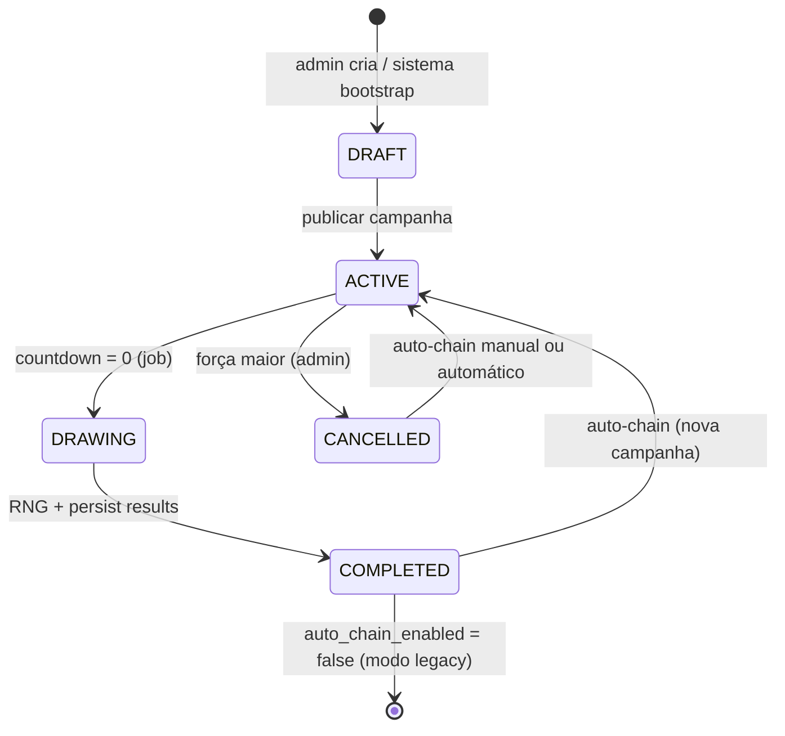
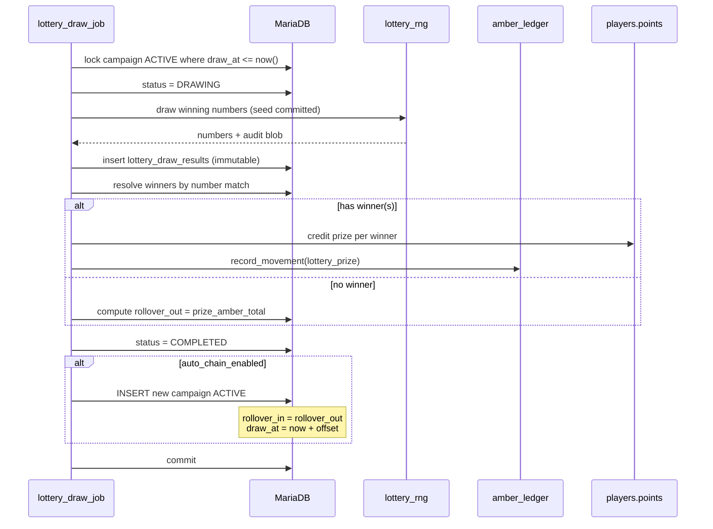

# Sorteio de Doações ARKLAND — Especificação (promoção vinculada a PIX/cartão)

| Campo | Valor |
|-------|-------|
| **Status** | 📋 Especificação para **discussão** — sem implementação |
| **Versão do documento** | 1.2 |
| **Data** | 05 de julho de 2026 |
| **Changelog v1.2** | Compra de números com Âmbares (aleatório e reserva específica), unicidade por campanha (100–999), grade pública de disponibilidade, fórmula de prêmio com 100% das compras em Âmbares |
| **Changelog v1.1** | Área Pública do Sorteio como feature de primeira classe (rota dedicada, hub de transparência, APIs e wireframe) |
| **Escopo** | Sorteio promocional contínuo vinculado a doações reais (PIX/cartão) **e** compra opcional de números com Âmbares, numeração única por campanha (100–999), prêmio em Âmbares com acumulação, transparência extrema (incl. grade pública) e auto-encadeamento de campanhas |
| **Fora de escopo** | Código, schema SQL definitivo, deploy, alteração da política de doações existente |
| **Fuso horário canônico** | **America/Sao_Paulo (UTC-3)** — exibição, countdown e regulamento |

> **Ver também:** [`PROJETO_ARKLAND_MASTER.md`](PROJETO_ARKLAND_MASTER.md), [`ambarmeter_spec.md`](ambarmeter_spec.md), [`REGULAMENTO_SITE_IMPLEMENTACAO.md`](REGULAMENTO_SITE_IMPLEMENTACAO.md), [`PORTAL_JOGADOR_SPEC.md`](PORTAL_JOGADOR_SPEC.md), [`plugin/arkshop_web/pix_payments.py`](../plugin/arkshop_web/pix_payments.py), [`plugin/arkshop_web/app.py`](../plugin/arkshop_web/app.py) (`_finalize_pix_payment`), [`plugin/arkshop_web/amber_ledger.py`](../plugin/arkshop_web/amber_ledger.py), [`plugin/arkshop_web/poll_service.py`](../plugin/arkshop_web/poll_service.py), [`plugin/arkshop_web/regulamento_service.py`](../plugin/arkshop_web/regulamento_service.py).

---

## Sumário executivo

| Pergunta | Resposta |
|----------|----------|
| **O que é?** | Promoção contínua de **sorteio** na Web Store ARKLAND com **três formas** de obter números (100–999, únicos por campanha): (1) doação — **R$ 5,00** = 1 número aleatório; (2) compra com Âmbares — até **5 números aleatórios** a **1.000 Âmbares** cada; (3) reserva — número **específico** a **2.000 Âmbares** se disponível |
| **Qual o prêmio?** | **Âmbares** — pool = base + rollover + **100%** do valor gasto em compras/reservas de números na campanha; se ninguém acertar, o prêmio **acumula** (rollover) para a campanha seguinte |
| **Como encerra?** | **Sorteio automático** quando o countdown chega a zero — sem intervenção manual para escolher vencedor |
| **O que acontece depois?** | **Auto-chain:** ao concluir o sorteio, uma **nova campanha inicia automaticamente** com prêmio rollover + configuração herdada |
| **Onde aparece?** | **Área Pública do Sorteio** (`#/sorteio` — hub completo: grade 100–999, participantes, compra/reserva), **Home** (widget teaser + countdown), **Minha Área** (números por origem: doação vs compra), **Admin Sorteios** (participantes, configuração, auditoria) |
| **Diferencial** | Transparência extrema: **grade pública** com todos os números 100–999 (disponível/ocupado), lista de participantes, RNG documentado, registros imutáveis, trilha de auditoria, integração com ledger e regulamento próprio em PT-BR |

**Tagline proposta:** *“Cada doação apoia o cluster — e pode virar Âmbares na sorte.”*

**Princípio inegociável:** o sistema **nunca** permite que admin escolha manualmente o vencedor. O resultado é produzido exclusivamente por algoritmo determinístico auditável + seed criptográfica registrada antes do sorteio.

---

## 1. Visão e objetivos

### 1.1 Visão de produto

O **Sorteio de Doações ARKLAND** transforma doações voluntárias (já existentes via Mercado Pago PIX/cartão) em um **engajamento recorrente e transparente**: jogadores que apoiam o servidor recebem números da sorte proporcionais ao valor doado; periodicamente o sistema sorteia um ou mais números vencedores e credita Âmbares ao(s) titular(es).

Os números pertencem exclusivamente à **campanha ativa** — cada valor entre **100 e 999** pode ter **no máximo um titular** por campanha (900 números possíveis). A obtenção ocorre por três vias independentes: **doação** (aleatório, sem custo adicional), **compra aleatória com Âmbares** (até 5 por jogador) ou **reserva de número específico** (2.000 Âmbares, se livre). Doações e compras aleatórias atribuem números pelo sistema; apenas a reserva permite escolha explícita.

### 1.2 Objetivos

| Objetivo | Métrica de sucesso |
|----------|-------------------|
| **Aumentar doações recorrentes** | Volume de `point_payments` creditados durante campanhas ativas |
| **Transparência total** | Qualquer visitante acessa `#/sorteio` e vê participantes (nomes mascarados), números e histórico de sorteios |
| **Operação zero-touch** | Sorteio + nova campanha sem ação manual do admin (salvo configuração inicial) |
| **Confiança regulatória** | Regulamento próprio publicado, aceite opcional/obrigatório conforme decisão legal |
| **Integração nativa** | Hook em `_finalize_pix_payment`, ledger `amber_ledger`, audit_events existente |

### 1.3 O sorteio **não é**

| Não é | É sim |
|-------|-------|
| Loteria federal regulada pela Caixa | Promoção promocional interna do cluster ARKLAND |
| Compra de números com dinheiro real | Números por doação são **gratuitos** (benefício promocional); compra avulsa usa apenas **Âmbares** in-game |
| Escolha livre de qualquer número sem custo | Doação e compra aleatória = atribuição **automática**; escolha manual só via **reserva paga** (2.000 Âmbares) |
| Prêmio em dinheiro real | Prêmio exclusivamente em **Âmbares** (moeda simbólica in-game) |
| Sorteio manual por staff | Sorteio **100% automatizado** com registro imutável |

### 1.4 Relação com sistemas existentes

```
┌─────────────────────────────────────────────────────────────────────┐
│              SORTEIO DE DOAÇÕES (camada promoção + transparência)    │
│  Campanhas │ Números │ RNG auditável │ Resultados │ Auto-chain       │
└───────────────────────────────┬─────────────────────────────────────┘
                                │ dispara em doação creditada
┌───────────────────────────────▼─────────────────────────────────────┐
│  _finalize_pix_payment │ point_payments │ Mercado Pago PIX/cartão    │
└───────────────────────────────┬─────────────────────────────────────┘
                                │
┌───────────────────────────────▼─────────────────────────────────────┐
│  players.points │ amber_ledger │ audit_events │ regulamento_service   │
└─────────────────────────────────────────────────────────────────────┘
```

### 1.5 Baseline técnico existente

| Componente | Estado | Referência |
|------------|--------|------------|
| Doações PIX/cartão | ✅ Produção | `pix_payments.py`, `PointPayment`, `_finalize_pix_payment` |
| Crédito de Âmbares pós-APROVADO | ✅ | `_add_player_points_tx` em `app.py` |
| Ledger unificado | ✅ | `amber_ledger.py` — `record_donation` |
| Enquetes com job de encerramento | ✅ Padrão | `poll_service.py` — `close_expired_polls` |
| Regulamento + aceite | ✅ | `regulamento_service.py` |
| Sugestões comunidade (admin CRUD) | ✅ Padrão UI admin | `suggestion_service.py`, `suggestion_routes.py` |
| Home pública | ✅ | `GET /api/public/home` |
| Minha Área | ✅ | `#page-myarea` em `static/index.html` |
| Sorteio de doações | ❌ **Novo** | Este documento |
| Área Pública `#/sorteio` | ❌ **Novo** | §5.6, §8.2 |

---

## 2. Personas

### 2.1 Doador / jogador participante

- **Objetivo:** apoiar o cluster e concorrer a Âmbares extras com transparência.
- **Necessidades:** ver seus números em Minha Área, countdown até o sorteio, entender regras, histórico de campanhas anteriores.
- **Frustração:** sorteios opacos no Discord, números “reservados” por staff, dúvida se doação entrou no sorteio.
- **Fluxo típico:** doa via PIX/cartão → recebe Âmbares + números automaticamente → acompanha countdown → confere resultado público.

### 2.2 Visitante público (logado ou não)

- **Objetivo:** entender a promoção, auditar transparência e acompanhar sorteios **sem precisar doar ou estar logado**.
- **Necessidades:**
  - Rota dedicada **`#/sorteio`** (ou `/sorteio`) acessível pelo menu principal para **todos** os visitantes
  - Campanha ativa: countdown, pool de prêmio (base + rollover), resumo das regras
  - Lista pública de participantes com **modo privacidade** (nomes mascarados — ver §13.1)
  - **Todos** os números da sorte visíveis por participante (transparência comunitária)
  - Histórico de sorteios passados (campanhas arquivadas, números vencedores, vencedores, prêmio pago)
  - Resultados ao vivo quando o sorteio concluir (estado `DRAWING` → `COMPLETED`)
  - Estatísticas agregadas: total de participantes, números emitidos, total doado na campanha (opcional)
  - Link para regulamento completo do sorteio
- **Frustração:** widget na home que não mostra lista completa; sorteios opacos; impossibilidade de verificar números alheios.
- **Conversão:** widget na home (teaser) → CTA “Ver sorteio completo” → Área Pública → “Doar e participar” → login Steam → fluxo de doação existente.
- **Diferença chave:** visitante público consome a **visão comunitária**; jogador logado usa **Minha Área** para visão pessoal (apenas seus números).

### 2.3 Admin / operador ARKLAND

- **Objetivo:** configurar campanhas, monitorar participação, auditar resultados — **sem** escolher vencedores.
- **Necessidades:** painel Admin Sorteios, lista de participantes exportável, logs de RNG, override apenas para **cancelar** campanha (força maior), configurar quantidade de números vencedores (1–5).
- **Restrição:** qualquer ação que altere resultado pós-sorteio deve ser **impossível** na UI e bloqueada na API.

### 2.4 Suporte / moderação

- **Objetivo:** responder tickets sobre “não recebi número”, chargeback, disputa de prêmio.
- **Necessidades:** correlacionar `payment_id` → números atribuídos → status chargeback; trilha read-only.

### 2.5 Autoridade / compliance (interno)

- **Objetivo:** documentação suficiente para demonstrar natureza promocional, não jogo de azar com apostas.
- **Necessidades:** regulamento modelo §15, política de chargeback, exclusões documentadas.

---

## 3. Regras de negócio detalhadas

### 3.1 Elegibilidade e participação

| Regra | Detalhe |
|-------|---------|
| **Quem participa** | Jogador autenticado via Steam OpenID que realiza doação **creditada** durante campanha `ACTIVE` |
| **Conta bloqueada** | `store_users.site_access_blocked = true` → doação pode ser bloqueada pelo fluxo existente; números **não** são gerados se crédito falhar |
| **Regulamento sorteio** | Aceite do regulamento específico do sorteio (versão `lottery_regulamento_version`) — gate configurável: obrigatório antes da primeira participação ou apenas informativo |
| **Regulamento geral** | Reutilizar padrão `needs_regulamento_accept` se campanha exigir aceite geral ARKLAND |
| **Staff/admin** | **Podem participar** salvo exclusão expressa em edital da campanha (ver §17 Q13) |

### 3.2 Três origens de números — visão geral

| Origem | Código interno | Custo | Escolha do número | Limite por jogador/campanha | Elegibilidade |
|--------|----------------|-------|-------------------|----------------------------|---------------|
| **Doação** | `DONATION` | R$ 5,00 = 1 número (sem custo extra) | Aleatório (sistema) | Ilimitado (proporcional ao valor doado) | Doação creditada em campanha `ACTIVE` |
| **Compra aleatória** | `AMBER_RANDOM` | **1.000 Âmbares** / número | Aleatório (sistema) | **Máx. 5** números | Jogador logado; campanha `ACTIVE`; saldo suficiente |
| **Reserva específica** | `AMBER_RESERVE` | **2.000 Âmbares** / número | Jogador escolhe **100–999** se **disponível** | Ilimitado (desde que números distintos e livres) | Idem compra aleatória |

**Regras comuns a todas as origens:**

| Regra | Detalhe |
|-------|---------|
| **Intervalo** | Cada número ∈ **[100, 999]** (inteiro, inclusive) — **900 valores** por campanha |
| **Unicidade** | **Um único titular** por `(campaign_id, number_value)` — números **nunca se repetem** dentro da mesma campanha |
| **Campanha** | Válido **somente** para campanha `ACTIVE` — compras/reservas bloqueadas em `DRAFT`, `DRAWING`, `COMPLETED`, `CANCELLED` |
| **Visibilidade** | **Todos** os números 100–999 aparecem na **grade pública** da Área Pública `#/sorteio` (disponível vs ocupado) |
| **Contribuição ao prêmio** | Cada Âmbar gasto em compra ou reserva adiciona **100%** ao pool da campanha (1.000 → +1.000; 2.000 → +2.000) |

### 3.2.1 Números por doação (R$ 5 = 1 número)

| Regra | Detalhe |
|-------|---------|
| **Proporcionalidade** | `floor(amount_brl / 5.00)` números por doação creditada |
| **Exemplos** | R$ 5 → 1 número; R$ 12 → 2 números; R$ 4,99 → 0 números |
| **Atribuição** | Sistema sorteia números **ainda não ocupados** na campanha (ver §3.3) |
| **Momento** | Somente após `PointPayment.credited = true` em `_finalize_pix_payment` |
| **Pacotes** | Qualquer pacote de doação existente elegível; valor vem de `amount_brl` |
| **Múltiplas doações** | Cada doação creditada gera lote independente de números |
| **Escolha manual** | **Não** — jogador não seleciona números na doação |

### 3.2.2 Compra aleatória com Âmbares (“apostar”)

Independente das doações — mecanismo separado na Área Pública e Minha Área.

| Regra | Detalhe |
|-------|---------|
| **Preço** | **1.000 Âmbares** por número |
| **Quantidade** | Até **5 números** por jogador por campanha (contador `amber_random_count`) |
| **Atribuição** | Sistema sorteia entre números **ainda disponíveis** na campanha |
| **Débito** | `_add_player_points_tx` com delta negativo + `record_movement` channel `lottery_amber_purchase` |
| **Prêmio** | **+1.000 Âmbares** ao `prize_amber_from_purchases` da campanha (100% do valor pago) |
| **API** | `POST /api/player/lottery/buy-random` (ver §7.2) |
| **UI** | Botão “Comprar número aleatório (1.000 Âmbares)” na Área Pública (auth) + contador “X/5 comprados” |
| **Regulamento** | Texto distingue compra com Âmbares de benefício promocional de doação |

### 3.2.3 Reserva de número específico

| Regra | Detalhe |
|-------|---------|
| **Preço** | **2.000 Âmbares** por número |
| **Escolha** | Jogador informa número desejado ∈ [100, 999] |
| **Disponibilidade** | Operação **rejeitada** se número já ocupado na campanha (`409 Conflict`) |
| **Prêmio** | **+2.000 Âmbares** ao `prize_amber_from_purchases` (100% do valor pago) |
| **Limite** | Sem teto global além do pool de 900 números; não conta no limite de 5 da compra aleatória |
| **API** | `POST /api/player/lottery/reserve/{number}` (ver §7.2) |
| **UI** | Clique na célula **disponível** da grade ou campo “Reservar número: [___]” |
| **Concorrência** | Transação com lock em `(campaign_id, number_value)` — primeiro a confirmar vence |

### 3.3 Unicidade e colisão de números (100–999)

**Decisão v1.2:** cada campanha possui **numeração própria e exclusiva**. O par `(campaign_id, number_value)` é **único** — não há duplicatas dentro da mesma campanha. Campanhas diferentes podem reutilizar os mesmos valores numéricos (ex.: #12 e #13 ambos podem ter o 742, mas em titulares distintos).

| Aspecto | Regra |
|---------|-------|
| **Capacidade** | Máximo **900** números emitidos por campanha (100–999) |
| **Constraint DB** | `UNIQUE (campaign_id, number_value)` em `lottery_numbers` |
| **Esgotamento** | Quando todos os 900 estiverem ocupados, novas atribuições (doação, compra ou reserva) são **rejeitadas** com erro operacional registrado |

#### Estratégia de colisão — números aleatórios (doação e compra)

Quando o sistema precisa atribuir um número aleatório e o candidato já está ocupado:

| Política adotada (MVP) | Comportamento |
|------------------------|---------------|
| **Re-sort até único** | Sorteia candidato ∈ [100, 999]; se ocupado, repete até achar livre ou atingir **N tentativas** (ex. 50) |
| **Fallback** | Se pool quase esgotado e re-sort falhar: sorteia uniformemente entre conjunto **restante** de livres (O(1) com lista pré-computada ou query `NOT IN`) |
| **Falha total** | Se não houver números livres → rejeitar atribuição + `audit_event lottery_pool_exhausted` |

**Não adotado:** Política de duplicatas (antiga “B”) — incompatível com grade pública e reserva específica.

#### Conflito doação vs compra vs reserva

| Cenário | Resolução |
|---------|-----------|
| Doação sorteia número já ocupado | Re-sort automático (§ acima) — jogador **não** perde o número |
| Compra aleatória com pool esgotado | `409` — “Não há números disponíveis nesta campanha” |
| Reserva de número ocupado | `409` — “Número {N} indisponível”; UI destaca célula como ocupada |
| Race: dois jogadores reservam o mesmo número | Primeiro commit vence; segundo recebe `409` |

**Nota histórica (v1.1):** Políticas A/B/C foram discutidas; v1.2 **fixa unicidade** por requisito de grade pública e reserva específica.

### 3.4 Campanha — estados e transições

| Status | Significado |
|--------|-------------|
| `DRAFT` | Configurada mas não aceita doações/números |
| `ACTIVE` | Aceita novas atribuições; countdown visível |
| `DRAWING` | Countdown zerou; job executando sorteio (lock) |
| `COMPLETED` | Sorteio realizado; resultados publicados |
| `CANCELLED` | Cancelada por força maior — números invalidados; tratamento conforme política de doações |

Transições automáticas: `ACTIVE` → `DRAWING` → `COMPLETED` → (auto-chain) nova campanha `ACTIVE`.

### 3.5 Configuração por campanha

| Campo | Tipo | Default | Descrição |
|-------|------|---------|-----------|
| `title` | string | "Sorteio ARKLAND #N" | Título público |
| `draw_at` | datetime UTC-3 | — | Data/hora do sorteio (admin configurável) |
| `winning_numbers_count` | int 1–5 | 1 | Quantidade de números sorteados como vencedores |
| `prize_amber_base` | int | 5000 | Pool base de Âmbares |
| `prize_amber_rollover_in` | int | 0 | Acumulado importado da campanha anterior |
| `prize_amber_from_purchases` | int | 0 | Soma de Âmbares gastos em compras/reservas (atualizado em tempo real) |
| `prize_amber_total` | computed | base + rollover + from_purchases | Prêmio total em jogo |
| `amber_random_max_per_player` | int | 5 | Teto de compras aleatórias por jogador/campanha |
| `amber_random_price` | int | 1000 | Preço compra aleatória |
| `amber_reserve_price` | int | 2000 | Preço reserva específica |
| `regulamento_version` | string | "1.0" | Versão do regulamento específico |
| `allow_staff_participation` | bool | true | Se false, exclui steam_ids em grupo Admin/Staff |
| `auto_chain_enabled` | bool | true | Inicia próxima campanha automaticamente |
| `next_campaign_draw_offset_hours` | int | 168 (7 dias) | Intervalo até sorteio da próxima campanha |

### 3.6 Sorteio e vencedores

| Regra | Detalhe |
|-------|---------|
| **Gatilho** | Job detecta `draw_at <= now()` para campanha `ACTIVE` |
| **Quantidade sorteada** | `winning_numbers_count` inteiros distintos no intervalo [100, 999] |
| **RNG** | `secrets.SystemRandom` ou HMAC-SHA256 com seed commitada (ver §13) |
| **Vencedor** | O `steam_id` titular do número sorteado na campanha (titular único por número — ver §3.3) |
| **Múltiplos vencedores** | Cada número sorteado tem **no máximo um** titular; prêmio dividido entre **números vencedores distintos** — ver §17 Q4/Q5 |
| **Sem vencedor** | Nenhum número sorteado possui titular → **rollover 100%** do `prize_amber_total` |
| **Prêmio parcial** | Se 1 de 3 números vencedores não tem titular, apenas prêmio proporcional acumula — ver §17 Q5 |
| **Crédito prêmio** | Automático via `_add_player_points_tx` + `record_movement` channel `lottery_prize` |
| **Notificação** | In-app + opcional Discord webhook |

### 3.7 Acumulação (rollover) e fórmula do prêmio

```
prize_amber_from_purchases(N) = Σ (amber_cost) de lottery_numbers
  onde source ∈ { AMBER_RANDOM, AMBER_RESERVE } e status = ACTIVE

prize_amber_total(N) = prize_amber_base(N)
                     + prize_amber_rollover_in(N)
                     + prize_amber_from_purchases(N)

rollover_out(N) = prize_amber_total(N) - prize_amber_paid(N)

prize_amber_rollover_in(N+1) = rollover_out(N)
```

| Componente | Origem | Observação |
|------------|--------|------------|
| `prize_amber_base` | Config admin por campanha | Valor fixo inicial |
| `prize_amber_rollover_in` | Campanha anterior | Prêmio não pago integralmente |
| `prize_amber_from_purchases` | Compras + reservas | **100%** do Âmbar debitado do jogador entra no pool — não há taxa retida |
| Doações | **Não** incrementam pool diretamente | Benefício promocional; pool cresce via base, rollover e compras |

**Exemplo:** base 10.000 + rollover 5.000 + jogadores gastaram 8.000 em compras/reservas → `prize_amber_total = 23.000`.

Se campanha N paga prêmio integral a vencedores, `rollover_out = 0`. Compras não reembolsadas em caso de cancelamento — ver §17 Q38.

### 3.8 Countdown e fuso horário

| Regra | Detalhe |
|-------|---------|
| **Exibição** | Sempre em **UTC-3 (America/Sao_Paulo)** com label explícito |
| **Armazenamento** | `draw_at` em UTC no banco; conversão na API |
| **Sincronização** | Front-end atualiza a cada 1s local; servidor é fonte da verdade |
| **Countdown zero** | Transição para `DRAWING` no próximo tick do job (atraso máx. configurável, ex. 60s) |

### 3.9 Chargeback e estorno

| Evento | Ação |
|--------|------|
| Doação **APROVADA** e creditada | Números gerados normalmente |
| **ESTORNADO** / chargeback **antes** do sorteio | Números vinculados ao `payment_id` → status `REVOKED`; removidos da lista pública de participantes ativos |
| Chargeback **após** sorteio e prêmio pago | Prêmio **não** é clawback automático; registrar incidente + ticket manual (ver §14) |
| Doação estornada **sem** números gerados | Nenhuma ação no sorteio |

Hook proposto: extensão de `_finalize_pix_payment` quando `mapped == "ESTORNADO"` → chamar `revoke_lottery_numbers(payment_id)`.

### 3.10 Cancelamento por força maior

Admin pode cancelar campanha `ACTIVE` com motivo obrigatório (mín. 20 caracteres). Efeitos:

- Números invalidados
- Sorteio não ocorre
- Rollover preservado para próxima campanha
- Audit event `lottery_campaign_cancelled`
- **Não** implica reembolso de doações (Política de Doações existente)

---

## 4. Ciclo auto-chain

### 4.1 Diagrama de estados



### 4.2 Sequência auto-chain pós-sorteio



### 4.3 Bootstrap inicial

Na **primeira implantação**, admin cria campanha #1 manualmente ou seed automático:

- `prize_amber_base` = valor acordado (ex. 10.000 Âmbares)
- `draw_at` = now + 7 dias
- `winning_numbers_count` = 1
- `auto_chain_enabled` = true

---

## 5. Fluxos

### 5.1 Fluxo doador → números (origem `DONATION`)

```
Jogador logado → Doação PIX/cartão (fluxo existente)
    → Mercado Pago aprova
    → Webhook/poll → _finalize_pix_payment
        → credita Âmbares (existente)
        → record_donation (ledger — existente)
        → [NOVO] assign_lottery_numbers(campaign_id, payment_id, steam_id, amount_brl)
            → calcula qty = floor(amount_brl / 5)
            → para cada qty: sorteia número livre 100–999 (re-sort se colisão — §3.3)
            → persiste lottery_numbers (source=DONATION)
            → audit_event lottery_numbers_assigned
    → UI Minha Área atualiza lista de números (badge origem: doação)
```

### 5.1.1 Fluxo compra aleatória com Âmbares (`AMBER_RANDOM`)

```
Jogador logado → Área Pública #/sorteio ou Minha Área
    → verifica campanha ACTIVE + saldo ≥ 1.000 + count < 5
    → POST /api/player/lottery/buy-random
        → BEGIN TRANSACTION
            → lock campaign + verificar limite jogador
            → debitar 1.000 Âmbares (_add_player_points_tx negativo)
            → record_movement(lottery_amber_purchase)
            → sortear número livre (re-sort / pool restante)
            → INSERT lottery_numbers (source=AMBER_RANDOM, amber_cost=1000)
            → prize_amber_from_purchases += 1000
            → audit_event lottery_amber_random_purchased
        → COMMIT
    → UI: grade atualiza célula; contador X/5; pool de prêmio +1.000
```

### 5.1.2 Fluxo reserva de número específico (`AMBER_RESERVE`)

```
Jogador logado → grade pública #/sorteio
    → clica célula disponível OU informa número em [100, 999]
    → POST /api/player/lottery/reserve/{number}
        → BEGIN TRANSACTION
            → SELECT number FOR UPDATE — se ocupado: ROLLBACK 409
            → verificar saldo ≥ 2.000
            → debitar 2.000 Âmbares
            → record_movement(lottery_amber_purchase)
            → INSERT lottery_numbers (source=AMBER_RESERVE, number_value=N, amber_cost=2000)
            → prize_amber_from_purchases += 2000
            → audit_event lottery_amber_reserved
        → COMMIT
    → UI: célula passa de “disponível” (verde) para “ocupado” (cinza/vermelho)
```

### 5.2 Fluxo countdown (home + Área Pública + Minha Área)

```
GET /api/public/lottery/current   (Área Pública + widget home — sem auth)
GET /api/public/lottery/active    (alias legado de /current — manter compat.)
GET /api/player/lottery/me        (Minha Área — auth)

Response inclui:
  - campaign_id, title, draw_at (ISO UTC + display UTC-3)
  - prize_amber_total, prize_amber_base, prize_amber_rollover_in, prize_amber_from_purchases
  - numbers_available_count (900 - emitidos)
  - amber_random_price, amber_reserve_price, amber_random_max_per_player
  - participant_count, numbers_issued_count, total_donated_brl (opcional)
  - seconds_remaining (server-computed)
  - winning_numbers_count (quantos serão sorteados)
  - rules_summary (texto curto para exibição)
  - number_grid_url: "/api/public/lottery/campaign/{id}/number-grid"

### 5.3 Fluxo sorteio automático

```
Cron / APScheduler / thread job (padrão poll_service):
  every 30–60s:
    close_due_lottery_campaigns()
      FOR each campaign WHERE status=ACTIVE AND draw_at <= utcnow():
        BEGIN TRANSACTION
          SELECT ... FOR UPDATE
          IF still ACTIVE:
            run_draw(campaign)
            mark COMPLETED
            IF auto_chain: create_next_campaign(rollover)
        COMMIT
```

### 5.4 Fluxo resultados públicos

```
GET /api/public/lottery/campaign/{campaign_id}/results

Response:
  - winning_numbers: [742]
  - winners: [{ display_name_masked, numbers_held: [742], prize_amber: 15000 }]
  - draw_audit: { seed_hash, algorithm, drawn_at, record_id }
  - rollover_next: 0 | N
  - next_campaign_id (se auto-chain já criou)
```

### 5.5 Fluxo admin — configurar campanha

```
Admin → #/admin/lottery
  → edit draw_at (datetime picker UTC-3)
  → edit winning_numbers_count (1–5)
  → edit prize_amber_base
  → toggle allow_staff_participation
  → view participants table (read-only numbers)
  → CANNOT edit winning numbers post-draw
```

### 5.6 Área Pública do Sorteio — hub de transparência

A **Área Pública do Sorteio** é uma página dedicada de primeira classe — **não** um modal, **não** apenas o widget da home. É o centro de transparência comunitária da promoção.

#### 5.6.1 Rota e navegação

| Aspecto | Detalhe |
|---------|---------|
| **Rota front-end** | `#/sorteio` (SPA existente) — alternativa futura: `/sorteio` se migrar para rotas path-based |
| **Visibilidade** | Item **“Sorteio”** no menu principal (header/nav) para **todos** os visitantes — logados ou não |
| **Auth** | **Nenhuma** — página 100% pública; CTAs de doação redirecionam para login Steam quando necessário |
| **SEO / compartilhamento** | URL estável para compartilhar no Discord; meta tags com título da campanha e prêmio |

#### 5.6.2 Conteúdo — campanha ativa

Quando existe campanha `ACTIVE` ou `DRAWING`:

| Bloco | Conteúdo |
|-------|----------|
| **Hero** | Título da campanha (#N), status badge (`ATIVA` / `SORTEANDO…` / `CONCLUÍDA`) |
| **Countdown** | Timer ao vivo até `draw_at` (UTC-3 explícito); congela em `DRAWING` com mensagem “Sorteio em andamento” |
| **Prêmio** | `prize_amber_total` destacado; breakdown: base + rollover + compras/reservas |
| **Regras resumidas** | R$ 5 = 1 número · compra 1.000 Âmbares (máx. 5) · reserva 2.000 Âmbares · intervalo 100–999 únicos · N vencedores · sorteio automático |
| **Grade de números** | Tabela/grid **100–999** — todas as células visíveis; cor **disponível** vs **ocupado** (ver §5.6.9) |
| **Ações (logado)** | “Comprar aleatório (1.000)” · contador compras X/5 · clique em célula livre para reservar (2.000) |
| **Estatísticas** | Participantes únicos · números emitidos / 900 · total doado (opcional) · Âmbares injetados via compras |
| **CTA** | “Doar e participar” (login se necessário) · “Ver regulamento completo” |

Fonte de dados: `GET /api/public/lottery/current`.

#### 5.6.3 Lista pública de participantes

| Requisito | Detalhe |
|-----------|---------|
| **Visibilidade** | Todos os participantes com status `ACTIVE` na campanha |
| **Por participante** | Nome mascarado (modo privacidade §13.1) + **todos** os números da sorte + badge de origem por número (`doação` / `compra` / `reserva`) + data da última atribuição |
| **Ordenação** | Por `assigned_at` desc (mais recentes primeiro) ou alfabético por nome mascarado — configurável |
| **Paginação** | Server-side; default 50 por página |
| **Busca** | Filtro por número da sorte (ex.: “742” → mostra todos os titulares) |
| **Revogados** | Números `REVOKED` (chargeback) **não** aparecem |
| **Transparência** | Números alheios são **visíveis por design** — qualquer visitante pode auditar distribuição |

Fonte de dados: `GET /api/public/lottery/campaign/{id}/participants`.

#### 5.6.4 Resultados ao vivo

| Estado campanha | Comportamento na Área Pública |
|-----------------|-------------------------------|
| `ACTIVE` | Countdown + lista participantes + stats |
| `DRAWING` | Banner “Sorteio em andamento…” + polling a cada 5s em `/current` |
| `COMPLETED` | Exibe números vencedores, vencedores (nome mascarado), prêmio pago, link auditoria RNG |
| Auto-chain | Após `COMPLETED`, seção “Próxima campanha #N+1” já ativa aparece abaixo |

Transição sugerida: WebSocket ou polling curto (5–10s) durante `DRAWING` → `COMPLETED`.

#### 5.6.5 Histórico de sorteios passados

Seção **“Sorteios anteriores”** na mesma página (aba ou scroll):

| Campo por campanha arquivada | Exibido |
|------------------------------|---------|
| `#sequence_number` + título | Sim |
| Data/hora do sorteio (UTC-3) | Sim |
| Números vencedores | Sim |
| Vencedores (nome mascarado) + prêmio pago | Sim |
| Rollover gerado | Sim |
| Link “Ver detalhes” | Abre visão expandida da campanha |

Fonte de dados: `GET /api/public/lottery/history` + `GET /api/public/lottery/campaign/{id}`.

#### 5.6.6 Regulamento

- Link permanente: “Regulamento do Sorteio” → `/api/public/lottery/regulamento` ou modal inline
- Versão vigente (`regulamento_version`) exibida no rodapé da página

#### 5.6.7 Mapa de superfícies — o que cada área mostra

| Superfície | Público | Escopo | Profundidade |
|------------|---------|--------|--------------|
| **Widget Home** | Todos | Teaser da campanha ativa | Countdown + prêmio + stats resumidas + CTA “Ver sorteio completo” |
| **Área Pública `#/sorteio`** | Todos | Hub comunitário de transparência | Campanha + **grade 100–999** + compra/reserva (logado) + participantes + histórico |
| **Minha Área** | Jogador logado | Visão **pessoal** | Números por origem (doação / compra / reserva), limites, doações, countdown |
| **Admin Sorteios** | Staff | Operação + auditoria | SteamID completo, payment_id, export CSV, config, logs RNG |

```
                    ┌─────────────────────────────────────┐
                    │         WIDGET HOME (teaser)         │
                    │  countdown · prêmio · stats · CTA   │
                    └──────────────┬──────────────────────┘
                                   │ "Ver sorteio completo"
                    ┌──────────────▼──────────────────────┐
                    │    ÁREA PÚBLICA #/sorteio (hub)      │
                    │  campanha · grade 100–999 · participantes │
                    │  histórico · resultados · regulamento│
                    └──────────────┬──────────────────────┘
           ┌───────────────────────┼───────────────────────┐
           │                       │                       │
┌──────────▼─────────┐  ┌──────────▼──────────┐  ┌─────────▼─────────┐
│  MINHA ÁREA        │  │  (visitante não     │  │  ADMIN SORTEIOS   │
│  meus números      │  │   logado — só lê)   │  │  steam_id, audit  │
│  minhas doações    │  │                     │  │  config, export   │
└────────────────────┘  └─────────────────────┘  └───────────────────┘
```

#### 5.6.8 Fluxo visitante típico

```
Visitante → nav "Sorteio" → #/sorteio
  → GET /api/public/lottery/current (campanha + countdown + stats + breakdown prêmio)
  → GET /api/public/lottery/campaign/{id}/number-grid (grade 100–999 disponível/ocupado)
  → GET /api/public/lottery/campaign/{id}/participants (lista + números + origem)
  → scroll "Sorteios anteriores" → GET /api/public/lottery/history
  → clica campanha passada → GET /api/public/lottery/campaign/{id} + /results
  → [logado] compra/reserva → POST buy-random ou reserve/{number}
  → [opcional] "Doar e participar" → login Steam → doação
```

#### 5.6.9 Grade pública de números (100–999)

Painel visual obrigatório na Área Pública — **todos** os 900 números devem ser visíveis sem paginação que oculte faixas.

| Aspecto | Detalhe |
|---------|---------|
| **Layout** | Grid tabular: 10 colunas × 90 linhas (100–109 na 1ª linha … 990–999 na última) **ou** 30×30 com scroll vertical compacto — decisão UI em §17 Q37 |
| **Célula disponível** | Fundo verde claro / borda tracejada — número legível, clicável (se logado) |
| **Célula ocupada** | Fundo cinza ou vermelho suave — número legível, **não** clicável |
| **Tooltip ocupado** | “Indisponível” — **sem** revelar titular na grade (privacidade); titular visível na lista de participantes com nome mascarado |
| **Destaque pessoal** | Jogador logado vê **seus** números com borda dourada na grade (qualquer origem) |
| **Atualização** | Polling 10–30s ou invalidação após compra/reserva própria |
| **Campanhas arquivadas** | Grade read-only com estado final; link no histórico |

Fonte de dados: `GET /api/public/lottery/campaign/{id}/number-grid`.

**Transparência vs privacidade na grade:**

| Modo | O que a grade mostra |
|------|---------------------|
| **MVP (recomendado)** | Apenas estado binário: disponível / ocupado — **sem** nome na célula |
| **Alternativa** | Iniciais mascaradas na célula ocupada — pode poluir visualmente; ver §17 Q36 |

---

## 6. Modelo de dados

Padrão: `ensure_lottery_schema(engine)` idempotente — espelhar `poll_service.py` / `suggestion_service.py`.

### 6.1 Tabela `lottery_campaigns`

| Coluna | Tipo | Notas |
|--------|------|-------|
| `id` | BIGINT PK | |
| `sequence_number` | INT UNIQUE | #1, #2, #3… human-readable |
| `title` | VARCHAR(200) | |
| `status` | VARCHAR(16) | DRAFT, ACTIVE, DRAWING, COMPLETED, CANCELLED |
| `draw_at` | DATETIME(3) | UTC storage |
| `winning_numbers_count` | TINYINT | 1–5, CHECK constraint |
| `prize_amber_base` | INT | |
| `prize_amber_rollover_in` | INT DEFAULT 0 | |
| `prize_amber_from_purchases` | INT DEFAULT 0 | Soma Âmbares de compras/reservas (atualizado em tempo real) |
| `prize_amber_paid` | INT DEFAULT 0 | preenchido pós-sorteio |
| `prize_amber_rollover_out` | INT DEFAULT 0 | |
| `amber_random_price` | INT DEFAULT 1000 | |
| `amber_reserve_price` | INT DEFAULT 2000 | |
| `amber_random_max_per_player` | TINYINT DEFAULT 5 | |
| `regulamento_version` | VARCHAR(16) | |
| `allow_staff_participation` | TINYINT(1) DEFAULT 1 | |
| `auto_chain_enabled` | TINYINT(1) DEFAULT 1 | |
| `next_campaign_draw_offset_hours` | INT DEFAULT 168 | |
| `previous_campaign_id` | BIGINT NULL FK | encadeamento |
| `created_at` | DATETIME(3) | |
| `updated_at` | DATETIME(3) | |
| `completed_at` | DATETIME(3) NULL | |

Índices: `(status, draw_at)`, `(sequence_number)`.

### 6.2 Tabela `lottery_numbers`

| Coluna | Tipo | Notas |
|--------|------|-------|
| `id` | BIGINT PK | |
| `campaign_id` | BIGINT FK | |
| `steam_id` | VARCHAR(32) | |
| `payment_id` | VARCHAR(64) NULL FK → point_payments | NULL para origens `AMBER_*` |
| `source` | VARCHAR(16) | `DONATION`, `AMBER_RANDOM`, `AMBER_RESERVE` |
| `number_value` | SMALLINT | 100–999 |
| `amber_cost` | INT DEFAULT 0 | 0 para doação; 1000 ou 2000 para compras |
| `status` | VARCHAR(16) | ACTIVE, REVOKED |
| `assigned_at` | DATETIME(3) | |
| `revoked_at` | DATETIME(3) NULL | chargeback (só `DONATION`) |
| `revoke_reason` | VARCHAR(64) NULL | ex. `chargeback` |

Índices: `UNIQUE (campaign_id, number_value)`, `(campaign_id, steam_id)`, `(campaign_id, steam_id, source)` para contagem de compras aleatórias, `(payment_id)`.

### 6.3 Tabela `lottery_draw_results` (imutável)

| Coluna | Tipo | Notas |
|--------|------|-------|
| `id` | BIGINT PK | |
| `campaign_id` | BIGINT UNIQUE FK | 1 sorteio por campanha |
| `winning_numbers_json` | JSON | ex. `[742, 318]` |
| `seed_commit_hash` | VARCHAR(64) | SHA-256 do seed pré-sorteado |
| `seed_reveal` | VARCHAR(128) NULL | revelado pós-sorteado (opcional) |
| `algorithm_version` | VARCHAR(16) | ex. `arkland-v1` |
| `audit_blob_json` | JSON | participantes count, timestamp, etc. |
| `drawn_at` | DATETIME(3) | |
| `job_id` | VARCHAR(64) | idempotência |

**Regra:** INSERT only — sem UPDATE/DELETE na aplicação (triggers ou permissões DB).

### 6.4 Tabela `lottery_winners`

| Coluna | Tipo | Notas |
|--------|------|-------|
| `id` | BIGINT PK | |
| `campaign_id` | BIGINT FK | |
| `draw_result_id` | BIGINT FK | |
| `steam_id` | VARCHAR(32) | |
| `winning_number` | SMALLINT | |
| `prize_amber` | INT | |
| `credited` | TINYINT(1) DEFAULT 0 | |
| `credited_at` | DATETIME(3) NULL | |
| `ledger_idempotency_key` | VARCHAR(128) | |

### 6.5 Tabela `lottery_regulamento_acceptances`

| Coluna | Tipo | Notas |
|--------|------|-------|
| `steam_id` | VARCHAR(32) PK part | |
| `version` | VARCHAR(16) PK part | |
| `accepted_at` | DATETIME(3) | |
| `ip_hash` | VARCHAR(64) NULL | opcional |

### 6.6 Tabela `lottery_audit_log` (append-only)

| Coluna | Tipo | Notas |
|--------|------|-------|
| `id` | BIGINT PK | |
| `campaign_id` | BIGINT NULL | |
| `event_type` | VARCHAR(64) | ver §13 |
| `payload_json` | JSON | |
| `created_at` | DATETIME(3) | |

Alternativa: reutilizar `audit_events` existente com `source=lottery` — preferível para unified audit (ver §17 Q1).

---

## 7. APIs

Convenções: JSON, erros `{ "ok": false, "error": "..." }`, rate limit em rotas player, admin exige `@admin_required`.

### 7.1 Público (sem auth)

Rotas consumidas pela **Área Pública `#/sorteio`** e pelo widget teaser da home.

| Método | Rota | Descrição |
|--------|------|-----------|
| GET | `/api/public/lottery/current` | **Canônica** — campanha ativa ou em `DRAWING` + countdown + prêmio + stats + resumo regras |
| GET | `/api/public/lottery/active` | Alias de `/current` (compatibilidade) |
| GET | `/api/public/lottery/history` | Campanhas `COMPLETED` paginadas — números vencedores, vencedores mascarados, prêmio pago, rollover |
| GET | `/api/public/lottery/campaign/{id}` | Detalhe de campanha (ativa ou arquivada): config pública, stats, status, links para participants/results |
| GET | `/api/public/lottery/campaign/{id}/participants` | Lista pública: `display_name_masked`, `numbers[]` com `source` por número, `last_assigned_at` — sem CPF/email/steam_id |
| GET | `/api/public/lottery/campaign/{id}/number-grid` | Grade 100–999: `{ number, status: "available"|"taken", is_mine? }` — `is_mine` só se auth opcional via cookie |
| GET | `/api/public/lottery/campaign/{id}/results` | Resultados + audit summary (quando `COMPLETED`) |
| GET | `/api/public/lottery/regulamento` | HTML/markdown regulamento sorteio |

**Notas de contrato:**

- `{id}` aceita `campaign_id` numérico ou alias `current` (redireciona para campanha ativa).
- `/participants` suporta query params: `page`, `page_size`, `search_number` (100–999).
- Durante `DRAWING`, `/current` retorna `status: "DRAWING"` + flag `results_pending: true`.
- Rate limit leve (ex. 60 req/min/IP) em `/participants` para evitar scraping abusivo.

### 7.2 Jogador (auth Steam)

| Método | Rota | Descrição |
|--------|------|-----------|
| GET | `/api/player/lottery/me` | Números do jogador na campanha ativa por origem + limites (compras X/5) + histórico |
| POST | `/api/player/lottery/buy-random` | Compra 1 número aleatório (1.000 Âmbares); body vazio; respeita limite 5/campanha |
| POST | `/api/player/lottery/reserve/{number}` | Reserva número específico 100–999 (2.000 Âmbares) se disponível |
| POST | `/api/player/lottery/regulamento/accept` | Aceite regulamento sorteio |
| GET | `/api/player/lottery/regulamento/status` | Precisa aceitar? |

### 7.3 Admin

| Método | Rota | Descrição |
|--------|------|-----------|
| GET | `/api/admin/lottery/campaigns` | Lista campanhas |
| POST | `/api/admin/lottery/campaigns` | Criar DRAFT |
| PATCH | `/api/admin/lottery/campaigns/{id}` | Editar draw_at, prêmio, winning_count (somente ACTIVE/DRAFT) |
| POST | `/api/admin/lottery/campaigns/{id}/publish` | DRAFT → ACTIVE |
| POST | `/api/admin/lottery/campaigns/{id}/cancel` | Cancelar com motivo |
| GET | `/api/admin/lottery/campaigns/{id}/participants` | Export completo (+ payment_id, steam_id) |
| GET | `/api/admin/lottery/campaigns/{id}/audit` | Log completo + draw record |
| POST | `/api/admin/lottery/draw/trigger` | **Dev only** — forçar sorteio (desabilitado prod) |

### 7.4 Webhooks / internos

| Hook | Onde | Ação |
|------|------|------|
| `assign_lottery_numbers` | pós-crédito em `_finalize_pix_payment` | Atribui números (DONATION) |
| `buy_random_lottery_number` | POST buy-random | Compra AMBER_RANDOM |
| `reserve_lottery_number` | POST reserve/{number} | Reserva AMBER_RESERVE |
| `revoke_lottery_numbers` | status ESTORNADO | Revoga números de doação |
| `lottery_draw_job` | scheduler | Executa sorteio + auto-chain |

### 7.5 Exemplo response `/api/public/lottery/current`

```json
{
  "ok": true,
  "campaign": {
    "id": 42,
    "sequence_number": 12,
    "title": "Sorteio ARKLAND #12",
    "status": "ACTIVE",
    "draw_at_utc": "2026-07-12T03:00:00+00:00",
    "draw_at_display": "2026-07-12T00:00:00-03:00",
    "timezone_label": "Horário de Brasília (UTC-3)",
    "seconds_remaining": 604812,
    "prize_amber_total": 30500,
    "prize_amber_base": 10000,
    "prize_amber_rollover_in": 12500,
    "prize_amber_from_purchases": 8000,
    "amber_random_price": 1000,
    "amber_reserve_price": 2000,
    "amber_random_max_per_player": 5,
    "numbers_available_count": 657,
    "winning_numbers_count": 2,
    "participant_count": 87,
    "numbers_issued_count": 243,
    "total_donated_brl": 1215.00,
    "regulamento_version": "1.0",
    "rules_summary": "R$ 5 = 1 número · compra 1.000 Âmbares (máx. 5) · reserva 2.000 Âmbares · números únicos 100–999.",
    "results_pending": false
  }
}
```

### 7.6 Exemplo response `/api/public/lottery/campaign/{id}/participants`

```json
{
  "ok": true,
  "campaign_id": 42,
  "page": 1,
  "page_size": 50,
  "total": 87,
  "participants": [
    {
      "display_name_masked": "Pla***One",
      "numbers": [
        { "value": 142, "source": "DONATION" },
        { "value": 587, "source": "AMBER_RANDOM" },
        { "value": 203, "source": "AMBER_RESERVE" }
      ],
      "last_assigned_at": "2026-07-04T18:32:00-03:00"
    }
  ]
}
```

### 7.7 Exemplo response `/api/public/lottery/history`

```json
{
  "ok": true,
  "page": 1,
  "campaigns": [
    {
      "id": 11,
      "sequence_number": 11,
      "title": "Sorteio ARKLAND #11",
      "draw_at_display": "2026-07-05T00:00:00-03:00",
      "winning_numbers": [742, 318],
      "winners": [
        { "display_name_masked": "Pla***One", "winning_number": 742, "prize_amber": 11250 }
      ],
      "prize_amber_paid": 22500,
      "rollover_out": 0
    }
  ]
}
```

### 7.8 Exemplo response `/api/public/lottery/campaign/{id}/number-grid`

```json
{
  "ok": true,
  "campaign_id": 42,
  "numbers": [
    { "value": 100, "status": "available" },
    { "value": 101, "status": "taken" },
    { "value": 142, "status": "taken", "is_mine": true }
  ],
  "summary": { "available": 657, "taken": 243, "total": 900 }
}
```

### 7.9 Exemplo response `POST /api/player/lottery/buy-random`

```json
{
  "ok": true,
  "number": { "value": 456, "source": "AMBER_RANDOM", "amber_cost": 1000 },
  "amber_random_remaining": 2,
  "prize_amber_total": 23500,
  "new_balance": 8420
}
```

### 7.10 Exemplo erro `POST /api/player/lottery/reserve/742`

```json
{
  "ok": false,
  "error": "number_unavailable",
  "message": "O número 742 já está reservado nesta campanha."
}
```

---

## 8. UI — wireframes ASCII

### 8.1 Home — widget teaser (público)

```
┌──────────────────────────────────────────────────────────────────┐
│  🎲 SORTEIO ARKLAND #12                              [Regulamento]│
├──────────────────────────────────────────────────────────────────┤
│                                                                  │
│   PRÊMIO ACUMULADO          SORTEIO EM                          │
│   ┌─────────────────┐       ┌─────────────────────────────┐    │
│   │  22.500 Âmbares │       │  03d  14h  22m  08s         │    │
│   │  base+rollo+compras│    │  12/jul/2026 00:00 (UTC-3)   │    │
│   └─────────────────┘       └─────────────────────────────┘    │
│                                                                  │
│   87 participantes · 243 números emitidos · 2 números sorteados  │
│                                                                  │
│   [ Ver sorteio completo → ]     [ Doar e participar ]          │
└──────────────────────────────────────────────────────────────────┘
         │
         └── link para #/sorteio (Área Pública — hub completo)
```

### 8.2 Área Pública — `#/sorteio` (hub de transparência)

```
┌─ ARKLAND › Sorteio de Doações ───────────────────────────────────┐
│  [Campanha atual]  [Grade números]  [Participantes]  [Histórico]  [Regulamento] │
├──────────────────────────────────────────────────────────────────┤
│  🎲 SORTEIO ARKLAND #12                              ● ATIVA       │
│                                                                  │
│  ┌─ PRÊMIO EM JOGO ─────────┐  ┌─ SORTEIO EM ─────────────────┐ │
│  │  22.500 Âmbares          │  │  03d  14h  22m  08s          │ │
│  │  Base: 10.000            │  │  12/jul/2026 00:00 (UTC-3)    │ │
│  │  Rollover: +12.500       │  │                               │ │
│  │  Compras: +8.000         │  │                               │ │
│  └──────────────────────────┘  └───────────────────────────────┘ │
│                                                                  │
│  Regras: R$ 5 = 1 número · compra 1.000 Âmbares (máx. 5) ·       │
│          reserva 2.000 Âmbares · números únicos 100–999           │
│                                                                  │
│  📊 87 participantes · 243/900 números · R$ 1.215,00 doados      │
│                                                                  │
│  [ Doar e participar ]  [ Comprar aleatório — 1.000 Âmbares (2/5)]│
├──────────────────────────────────────────────────────────────────┤
│  GRADE DE NÚMEROS (100–999) — verde=disponível · cinza=ocupado   │
│  100 101 102 103 104 105 106 107 108 109                        │
│  110 111 112 ... 742★ ... 891 892 893 894 895 896 897 898 899   │
│  ... (todas as linhas até 999 — scroll vertical se necessário)   │
│  ★ = seu número (logado) · clique em verde = reservar (2.000)    │
├──────────────────────────────────────────────────────────────────┤
│  PARTICIPANTES (lista pública — nomes mascarados)                │
│  Buscar número: [ ___ ]                              Pág. 1 de 2  │
│  ┌────────────────┬──────────────────────────────┬──────────────┐ │
│  │ Participante   │ Números da sorte             │ Atualizado   │ │
│  ├────────────────┼──────────────────────────────┼──────────────┤ │
│  │ Pla***One      │ 142🎁 587🪙 203⭐         │ 04/jul 18:32 │ │
│  │ Dra***Fox      │ 891🎁 456🪙              │ 04/jul 15:10 │ │
│  │ Ark***Hunter   │ 318🎁 742⭐ 105🪙 667🪙  │ 03/jul 22:01 │ │
│  │ …              │ …  (🎁=doação 🪙=compra ⭐=reserva) │ …    │ │
│  └────────────────┴──────────────────────────────┴──────────────┘ │
├──────────────────────────────────────────────────────────────────┤
│  SORTEIOS ANTERIORES                                            │
│  ┌──────┬──────────────┬─────────────────┬──────────┬─────────┐ │
│  │ #    │ Data sorteio│ Nº vencedores   │ Vencedor │ Prêmio  │ │
│  ├──────┼──────────────┼─────────────────┼──────────┼─────────┤ │
│  │ #11  │ 05/jul 00:00│ ★742 ★318       │ 2 ganhos │ 22.500  │ │
│  │ #10  │ 28/jun 00:00│ ★415            │ —        │ rollover│ │
│  │ …    │ …            │ …               │ …        │ …       │ │
│  └──────┴──────────────┴─────────────────┴──────────┴─────────┘ │
│  [ Carregar mais ]                                               │
├──────────────────────────────────────────────────────────────────┤
│  Regulamento v1.0 · Fuso: Horário de Brasília (UTC-3)            │
└──────────────────────────────────────────────────────────────────┘
```

**Estado `DRAWING` / resultados ao vivo** — overlay ou substituição do hero:

```
┌─ RESULTADO AO VIVO — Sorteio #12 ────────────────────────────────┐
│  ⏳ Sorteio concluído em 05/jul/2026 00:00 (UTC-3)               │
│                                                                  │
│  NÚMEROS SORTEADOS:   ★ 742 ★    ★ 318 ★                         │
│                                                                  │
│  VENCEDORES:                                                     │
│  ★ Pla***One — número 742 — 11.250 Âmbares creditados           │
│  ★ Dra***Fox — número 318 — 11.250 Âmbares creditados           │
│                                                                  │
│  Próximo sorteio #13 já ativo ↑                                  │
│  [ Auditoria RNG ]  seed: a3f8…  algorithm: arkland-v1           │
└──────────────────────────────────────────────────────────────────┘
```

### 8.3 Minha Área — meus números (por origem)

```
┌─ Minha Área ─────────────────────────────────────────────────────┐
│  ...                                                              │
│  ┌─ Sorteio ativo (#12) ────────────────────────────────────────┐ │
│  │  Sorteio em: 03d 14h 22m 08s                                  │ │
│  │  Por doação (3):     [142] [891] [318]                        │ │
│  │  Compras aleatórias (2/5): [587] [105]                        │ │
│  │  Reservas (1):       [203]                                    │ │
│  │  Total: 6 números · Doações: R$ 15,00 → 3 números             │ │
│  │  [ Comprar mais (1.000) ]  [ Ver grade → #/sorteio ]        │ │
│  │  [ Ver regulamento ]                                          │ │
│  └───────────────────────────────────────────────────────────────┘ │
└──────────────────────────────────────────────────────────────────┘
```

### 8.4 Admin Sorteios

```
┌─ Admin › Sorteios ────────────────────────────────────────────────┐
│  Campanha: [#12 Sorteio ARKLAND]  Status: ACTIVE                  │
├──────────────────────────────────────────────────────────────────┤
│  Configuração                                                     │
│  Sorteio em: [ 12/07/2026 00:00 UTC-3 ]  Nº vencedores: [2 ▼]    │
│  Prêmio base: [10000]  Rollover in: 12500  Total: 22500          │
│  [ Salvar ]  [ Cancelar campanha ]                                │
├──────────────────────────────────────────────────────────────────┤
│  Participantes (87)                          [ Exportar CSV ]     │
│  ┌──────────────┬────────────┬─────────────────┬──────────────┐  │
│  │ Nome         │ SteamID    │ Números         │ Doação       │  │
│  ├──────────────┼────────────┼─────────────────┼──────────────┤  │
│  │ PlayerOne    │ 7656…      │ 142,587,203     │ R$15 (pay_…) │  │
│  │ …            │ …          │ …               │ …            │  │
│  └──────────────┴────────────┴─────────────────┴──────────────┘  │
├──────────────────────────────────────────────────────────────────┤
│  Countdown ao vivo: 03d 14h 22m 08s                              │
└──────────────────────────────────────────────────────────────────┘
```

### 8.5 Resultados (detalhe campanha arquivada — também embutido em #/sorteio)

```
┌─ Resultado — Sorteio #11 ────────────────────────────────────────┐
│  Sorteado em 05/jul/2026 00:00 (UTC-3)                           │
│                                                                  │
│  NÚMEROS SORTEADOS:   ★ 742 ★    ★ 318 ★                         │
│                                                                  │
│  VENCEDORES:                                                     │
│  ★ PlayerOne — número 742 — 11.250 Âmbares creditados           │
│  ★ PlayerTwo — número 318 — 11.250 Âmbares creditados           │
│                                                                  │
│  Próximo sorteio #12 já ativo → [ Ver campanha atual ]           │
│  [ Auditoria RNG ]  seed: a3f8…  algorithm: arkland-v1           │
└──────────────────────────────────────────────────────────────────┘
```

---

## 9. Job automático — sorteio + auto-start próxima campanha

### 9.1 Implementação proposta

Arquivo: `plugin/arkshop_web/lottery_service.py` — espelhar estrutura de `poll_service.py`:

| Função | Responsabilidade |
|--------|------------------|
| `ensure_lottery_schema(engine)` | DDL idempotente |
| `get_active_campaign(db)` | Campanha ACTIVE |
| `assign_numbers(db, campaign_id, payment_id, steam_id, amount_brl)` | Pós-doacao (DONATION) |
| `buy_random_number(db, campaign_id, steam_id)` | Compra AMBER_RANDOM |
| `reserve_number(db, campaign_id, steam_id, number_value)` | Reserva AMBER_RESERVE |
| `get_number_grid(db, campaign_id, viewer_steam_id?)` | Grade 100–999 |
| `revoke_numbers_for_payment(db, payment_id, reason)` | Chargeback |
| `close_due_campaigns(db)` | Job principal |
| `run_draw(db, campaign)` | RNG + winners + rollover |
| `create_next_campaign(db, prev_campaign, rollover_out)` | Auto-chain |
| `lottery_meta()` | Labels/status para UI |

### 9.2 Scheduler

Registrar em `app.py` no startup (padrão existente para polls):

```python
# A cada 60 segundos
def _lottery_draw_tick():
    db = _SessionLocal()
    try:
        from lottery_service import close_due_campaigns
        close_due_campaigns(db)
        db.commit()
    except Exception as exc:
        db.rollback()
        log.exception("lottery_draw_tick: %s", exc)
    finally:
        db.close()
```

### 9.3 Idempotência do sorteio

- Lock pessimista: `SELECT ... FROM lottery_campaigns WHERE id=? FOR UPDATE`
- Se `lottery_draw_results` já existe para `campaign_id`, skip
- `job_id` = `f"draw:{campaign_id}:{draw_at.isoformat()}"` — UNIQUE

### 9.4 Falha mid-draw

Se crédito de prêmio falhar para um vencedor:

- Registrar `lottery_winner.credited = false`
- Retry job separado `retry_lottery_prizes()`
- Sorteio **não** é refeito — resultado imutável
- Admin alerta via audit severity `error`

### 9.5 Auto-start próxima campanha

Parâmetros herdados da campanha anterior:

| Campo | Herança |
|-------|---------|
| `winning_numbers_count` | copia |
| `prize_amber_base` | copia |
| `prize_amber_rollover_in` | = `rollover_out` anterior |
| `draw_at` | `now + next_campaign_draw_offset_hours` |
| `sequence_number` | +1 |
| `title` | `"Sorteio ARKLAND #{sequence_number}"` |
| `status` | ACTIVE imediato |
| `previous_campaign_id` | FK |

---

## 10. Integração PIX/cartão — `_finalize_pix_payment`

### 10.1 Ponto de hook (existente)

Após crédito bem-sucedido em `app.py`:

```python
if mapped == "APROVADO" and not payment.credited:
    new_balance = _add_player_points_tx(db, payment.steam_id, payment.points)
    payment.credited = True
    # ... audit pix_credited ...
    record_donation(db, payment_id=..., steam_id=..., points=...)
    # [NOVO] Sorteio de doações
    try:
        from lottery_service import maybe_assign_lottery_numbers
        maybe_assign_lottery_numbers(
            db,
            steam_id=payment.steam_id,
            payment_id=payment.payment_id,
            amount_brl=float(payment.amount_brl or 0),
        )
    except Exception as lottery_exc:
        log.warning("lottery assign hook: %s", lottery_exc)
```

### 10.2 Hook de estorno

Quando `mapped == "ESTORNADO"`:

```python
from lottery_service import revoke_numbers_for_payment
revoke_numbers_for_payment(db, payment_id=payment.payment_id, reason="chargeback")
```

### 10.3 Condições para atribuição

| Check | Ação se falhar |
|-------|----------------|
| Campanha ACTIVE existe | Skip silencioso (log debug) |
| `amount_brl >= 5` | Skip |
| Jogador não excluído (staff toggle) | Skip |
| Aceite regulamento sorteio (se gate ativo) | Skip + notificar UI |
| `payment_id` não processado antes | Idempotência: UNIQUE `(campaign_id, payment_id, number_index)` |

### 10.4 Pacotes e cartão internacional

- Mesma regra: `amount_brl` em reais — pacotes já definem valor
- Cartão (`payment_method=card`) elegível igual PIX
- Formulários: `PIX_PAYER_FORM`, `CARD_PAYER_FORM` em `pix_payments.py` — sem alteração

### 10.5 Auditoria unificada

Eventos propostos em `audit_events`:

| event_type | Quando |
|------------|--------|
| `lottery_numbers_assigned` | Números gerados |
| `lottery_numbers_revoked` | Chargeback |
| `lottery_draw_started` | Job inicia |
| `lottery_draw_completed` | Resultado persistido |
| `lottery_prize_credited` | Prêmio pago |
| `lottery_campaign_created` | Auto-chain |
| `lottery_campaign_cancelled` | Força maior |

---

## 11. Integração Âmbarômetro

### 11.1 Novos eventos no ledger

Estender `amber_ledger.py`:

```python
def record_lottery_prize(db, *, winner_id, steam_id, points, campaign_id, **kw):
    return record_movement(
        db,
        channel="community",  # ou channel="lottery" se novo canal
        event_type="lottery_prize_credited",
        signed_delta=points,
        idempotency_key=f"lottery:prize:{winner_id}",
        steam_id=steam_id,
        source_table="lottery_winners",
        source_id=str(winner_id),
        metadata_json={"campaign_id": campaign_id},
        **kw,
    )
```

### 11.2 Painel público

- Prêmios de sorteio contam como **movimentação gross** no Âmbarômetro
- Breakdown opcional: `channel:lottery` ou agregado em `community`
- Home pode mostrar link “Sorteio” ao lado do contador Âmbarômetro → `#/sorteio`

### 11.3 Métricas admin

- Total Âmbares pagos em sorteios (all time)
- Média de rollover por campanha
- Taxa de participação: doadores únicos / números emitidos

---

## 12. Transparência — checklist

| # | Requisito | Implementação |
|---|-----------|---------------|
| T1 | Lista pública de participantes | `GET .../campaign/{id}/participants` — nome mascarado + todos os números |
| T2 | RNG documentado | §12.1 abaixo + link na UI resultados |
| T3 | Registros imutáveis | `lottery_draw_results` INSERT-only |
| T4 | Sem escolha manual de vencedor | API admin bloqueia PATCH em resultados |
| T5 | Audit trail completo | `audit_events` + `lottery_audit_log` |
| T6 | Histórico público campanhas | `/api/public/lottery/history` na Área Pública `#/sorteio` |
| T7 | UTC-3 explícito | Label em toda UI + API `timezone_label` |
| T8 | Correlação doação ↔ número | Admin vê `payment_id`; jogador vê suas doações em Minha Área |
| T9 | Chargeback visível | Números REVOKED somem da lista pública |
| T10 | Seed commit-reveal (fase 2) | Hash pré-publicado; reveal pós-sorteado |
| T11 | **Área Pública dedicada** | Rota `#/sorteio` no nav principal — hub completo, acessível sem login |
| T12 | **Números alheios visíveis** | Lista pública exibe **todos** os números por participante (transparência comunitária) |
| T13 | **Resultados ao vivo** | Polling/WebSocket durante `DRAWING` → exibição imediata em `#/sorteio` |
| T14 | **Stats agregadas públicas** | Participantes, números emitidos, total doado (opcional) em `/current` |
| T15 | **Modo privacidade nomes** | `display_name_masked` na lista pública; nome completo só em Minha Área (próprio) e Admin |
| T16 | **Distinção superfícies** | Widget home = teaser; `#/sorteio` = hub; Minha Área = visão pessoal |

### 12.1 Algoritmo RNG `arkland-v1` (documentado)

```
Entrada:
  - campaign_id
  - draw_at (ISO UTC)
  - participant_count
  - numbers_issued_count
  - server_secret (env LOTTERY_SERVER_SECRET)
  - winning_numbers_count (W)

Passo 1 — Seed:
  seed_material = f"{campaign_id}|{draw_at}|{participant_count}|{numbers_issued_count}|{server_secret}"
  seed_hash = SHA256(seed_material)  -- publicado ANTES do sorteio (fase 2)

Passo 2 — Sorteio (W números distintos):
  pool = set()
  counter = 0
  while len(pool) < W:
    h = SHA256(f"{seed_hash}|{counter}".encode()).hexdigest()
    candidate = 100 + (int(h[:8], 16) % 900)
    pool.add(candidate)
    counter += 1

Saída:
  sorted(pool) → winning_numbers_json
  audit_blob: { seed_hash, algorithm_version, counter_final, drawn_at }
```

**Nota:** Fase MVP pode usar `secrets.SystemRandom.sample(range(100,1000), W)` com audit blob contendo `os.urandom` snapshot — fase 2 migra para determinístico commit-reveal.

---

## 13. Segurança anti-fraude

| Ameaça | Mitigação |
|--------|-----------|
| Admin manipula vencedor | Resultados imutáveis; sem endpoint de override; DB permissions |
| Replay de webhook MP | Idempotência existente em `_finalize_pix_payment` |
| Duplo crédito de números | UNIQUE constraint `(campaign_id, payment_id, seq)` |
| Bot spam doações | Rate limit existente + mínimo R$5 |
| Self-dealing staff | Toggle `allow_staff_participation`; audit |
| Chargeback farming | Revoga números; prêmio pós-chargeback = processo manual |
| Race no countdown | `FOR UPDATE` + status DRAWING |
| Enumerar números alheios | API pública mostra todos — by design (transparência) |
| Brute force API admin | `@admin_required` + IP allowlist TEK |
| Colisão intencional | Política B documentada; split rules claras |

### 13.1 Modo privacidade — display name mascarado

Lista **pública** (Área Pública `#/sorteio`, histórico, resultados) usa **`display_name_masked`** — nunca SteamID nem nome completo.

| Contexto | Campo exibido |
|----------|---------------|
| Área Pública — lista participantes | `display_name_masked` |
| Área Pública — vencedores | `display_name_masked` |
| Minha Área — próprio jogador | Nome completo (`market_display_name` ou Steam persona) |
| Admin Sorteios | Nome completo + SteamID |
| API `/api/player/lottery/me` | Nome completo (auth) |

**Algoritmo de mascaramento proposto (MVP):**

```
fonte = market_display_name || steam_persona || "Jogador"
se len(fonte) <= 3:  "***"
senão:               primeiros 3 chars + "***" + últimos N chars (N=0 se len<=6, senão 1–3)
exemplos: "PlayerOne" → "Pla***One" · "Fox" → "***" · "ArkHunter99" → "Ark***99"
```

**Regras:**

- SteamID completo **nunca** na API pública nem na UI `#/sorteio`.
- CPF, e-mail, `payment_id` — exclusivamente admin.
- Jogador logado vê **seu** nome completo em Minha Área; na lista pública `#/sorteio`, **também** aparece mascarado (consistência com demais visitantes).
- Busca por número da sorte **não** revela identidade além do nome mascarado.

---

## 14. Regulamento modelo PT-BR (sorteio vinculado a doações)

> Documento separado publicável em `/api/public/lottery/regulamento`. Versão inicial **1.0** — jul/2026.

---

### REGULAMENTO DA PROMOÇÃO SORTEIO ARKLAND

**Versão 1.0 — atualizado em 05 de julho de 2026**

#### 1. Definições

1.1. **Promoção:** sorteio promocional gratuito vinculado a doações voluntárias na Web Store ARKLAND.

1.2. **Organizador:** administradores do cluster ARKLAND.

1.3. **Participante:** jogador com conta Steam vinculada que realizar doação creditada durante campanha ativa.

1.4. **Número da sorte:** número inteiro entre **100 e 999**, atribuído automaticamente pelo sistema — **sem escolha pelo participante**.

1.5. **Campanha:** período com início e data/hora de sorteio definidos, durante o qual doações geram números.

1.6. **Prêmio:** quantidade de **Âmbares** (moeda simbólica do servidor) acumulada na campanha.

#### 2. Natureza da promoção

2.1. A doação é **voluntária** e destina-se ao apoio operacional do cluster, conforme Política de Doações ARKLAND.

2.2. Os números da sorte são **benefício promocional gratuito**, proporcionais ao valor doado, **sem custo adicional**.

2.3. Esta promoção **não constitui** capitalização, loteria federal ou modalidade de aposta regulada — trata-se de **promoção comercial** acessória a doação simbólica.

2.4. **Não há conversão** de prêmio em dinheiro real.

#### 3. Como participar

3.1. Acesse a Web Store ARKLAND autenticado via Steam.

3.2. Realize doação via PIX ou cartão (Mercado Pago) durante campanha **ativa**.

3.3. A cada **R$ 5,00 (cinco reais)** doados e **creditados**, o sistema atribui **1 (um) número da sorte** aleatório entre 100 e 999.

3.4. Valores inferiores a R$ 5,00 na mesma transação **não geram** número.

3.5. O participante **não escolhe** seus números.

3.6. Doações creditadas **antes** ou **depois** da campanha ativa **não geram** números retroativos ou antecipados.

#### 4. Campanhas e sorteio

4.1. Cada campanha possui data e hora de sorteio publicadas em **Horário de Brasília (UTC-3)**.

4.2. O sorteio é **automático** quando o countdown chega a zero — sem intervenção humana na escolha dos números vencedores.

4.3. Por campanha, serão sorteados de **1 (um) a 5 (cinco)** números vencedores, conforme configurado no edital da campanha.

4.4. Vence o participante que possuir o **mesmo número** sorteado, vinculado à campanha.

4.5. Se um número sorteado não possuir titular, o prêmio correspondente **acumula** para a campanha seguinte.

4.6. Ao término do sorteio, **nova campanha inicia automaticamente**, salvo comunicado em contrário.

#### 5. Prêmio e acumulação

5.1. O prêmio é pago exclusivamente em **Âmbares**, creditados na conta Steam do vencedor.

5.2. Cada campanha possui prêmio **base** + **acumulado** (rollover) de campanhas anteriores sem vencedor.

5.3. O organizador **não garante** valor mínimo ou máximo de prêmio além do publicado na campanha ativa.

5.4. Prêmio **não transferível** a terceiros, salvo conta Steam vencedora.

#### 6. Transparência

6.1. Lista de participantes e números é **pública** na **Área Pública do Sorteio** (`#/sorteio`), com nomes de exibição **mascarados** conforme §13.1.

6.2. Resultados, números sorteados e registro de auditoria são publicados após cada sorteio.

6.3. O organizador **não altera** resultados após publicação.

6.4. Algoritmo de sorteio documentado em [`SORTEIO_DOACOES_SPEC.md`](SORTEIO_DOACOES_SPEC.md) §12.1.

#### 7. Publicidade dos resultados

7.1. Os resultados serão publicados na Web Store com os números sorteados e identificação dos vencedores pelo **nome de exibição** da conta.

7.2. O organizador mantém registros de auditoria das operações.

#### 8. Limitações

8.1. Funcionários e administradores do cluster **podem participar**, salvo exclusão expressa em edital — §17 Q13.

8.2. O organizador reserva-se o direito de **cancelar** campanha por motivo de força maior, devolvendo apenas o tratamento já previsto para doações (sem reembolso, conforme Política de Doações).

8.3. Participantes com conta **bloqueada** no site não recebem números.

#### 9. Chargeback e estorno

9.1. Doações estornadas **antes** do sorteio têm números **cancelados**.

9.2. Estorno **após** sorteio e pagamento de prêmio será tratado caso a caso pelo suporte, sem prejuízo à integridade do sorteio já realizado.

#### 10. Proteção de dados

10.1. Dados de pagamento (CPF, e-mail) **não** são expostos publicamente.

10.2. Apenas nome de exibição **mascarado** e números aparecem na lista pública; dados de pagamento permanecem privados.

#### 11. Alterações

11.1. O organizador pode atualizar este regulamento com nova versão; participação futura pode exigir novo aceite.

11.2. Campanha em andamento obedece regulamento vigente **no início** da campanha.

#### 12. Foro e contato

12.1. Dúvidas: ticket de suporte na Web Store ARKLAND.

12.2. Fuso horário de referência: **America/Sao_Paulo (UTC-3)**.

---

*Fim do regulamento modelo v1.0*

---

## 15. Fases de implementação — MVP → completo

### 15.1 Fase 1 — MVP (4–6 semanas estimadas)

| Entregável | Detalhe |
|------------|---------|
| Schema + service | `lottery_service.py`, tabelas core |
| Hook doação | `maybe_assign_lottery_numbers` em `_finalize_pix_payment` |
| Job sorteio | `close_due_campaigns` a cada 60s |
| Auto-chain | Nova campanha ACTIVE pós-COMPLETED |
| API pública + player | current, history, campaign/{id}, participants, results, me |
| UI widget home | Teaser countdown + link “Ver sorteio completo” |
| **UI Área Pública `#/sorteio`** | Hub completo: campanha, participantes, histórico, resultados ao vivo |
| UI Minha Área | Seção números pessoais |
| Admin básico | Lista participantes, edit draw_at, winning_count |
| Regulamento v1 | HTML estático + aceite opcional |
| RNG MVP | `secrets.SystemRandom` + audit blob |

**Fora MVP:** seed commit-reveal, Discord notify, export CSV avançado.

### 15.2 Fase 2 — Transparência reforçada (2–3 semanas)

| Entregável | Detalhe |
|------------|---------|
| RNG determinístico | `arkland-v1` commit-reveal |
| Histórico público paginado | `/history` + UI integrada em `#/sorteio` |
| Chargeback hook | Revogação automática |
| Ledger channel `lottery` | Breakdown Âmbarômetro |
| Aceite regulamento obrigatório | Gate antes de números |

### 15.3 Fase 3 — Polimento (2 semanas)

| Entregável | Detalhe |
|------------|---------|
| Notificação in-app + Discord | Vencedor + nova campanha |
| Export CSV admin | Participantes + audit |
| Dashboard métricas | Rollover, conversão doação |
| Testes integração | pytest com SQLite |

### 15.4 Estimativa total

| Fase | Esforço dev | Dependências |
|------|-------------|--------------|
| MVP | 4–6 semanas | Doações PIX estáveis ✅ |
| Fase 2 | 2–3 semanas | MVP em prod |
| Fase 3 | 2 semanas | Fase 2 |
| **Total** | **8–11 semanas** | 1 dev full-stack |

---

## 16. Perguntas abertas para Ciano

1. **Audit unificado:** Preferir `audit_events` existente ou tabela `lottery_audit_log` dedicada?
2. **Aceite regulamento sorteio:** Obrigatório antes da primeira doação participante ou apenas link informativo?
3. **Colisão de números:** Política A (re-sort), B (duplicatas permitidas) ou C (expandir intervalo)?
4. **Split de prêmio:** Se 2 jogadores têm o mesmo número vencedor, cada um recebe **100%** do prêmio ou **50%/50%**?
5. **Prêmio parcial:** Se sorteamos 3 números e só 1 tem titular, pagamos 1/3 e acumulamos 2/3?
6. **Valor base inicial:** Quantos Âmbares no `prize_amber_base` da campanha #1?
7. **Intervalo entre campanhas:** 7 dias default OK ou outro ciclo (3d, 14d)?
8. **Quantidade vencedores default:** 1 ou 2 números sorteados por campanha?
9. **Staff participação:** Permitir admin/staff por default ou excluir?
10. **Exclusão staff:** Lista steam_id fixa ou detecção por grupo PermissionsGroups?
11. **Regulamento separado:** Integrar ao regulamento geral ARKLAND ou documento independente?
12. **Versão regulamento:** Aceite por versão — força re-aceite a cada update?
13. **Cancelamento campanha:** Quem tem permissão — só superadmin ou qualquer admin loja?
14. **Discord anúncio:** Post automático em canal `#sorteio` ao publicar resultado?
15. **Nome exibição público:** `market_display_name` ou Steam persona sempre?
16. **Chargeback pós-prêmio:** Clawback automático de Âmbares ou só ticket manual?
17. **Doação < R$5:** Mostrar mensagem “faltam R$ X para próximo número”?
18. **Campanha pausada:** Precisamos estado PAUSED (sem números, countdown congelado)?
19. **Múltiplas campanhas simultâneas:** Permitir ou sempre **1 ACTIVE** global?
20. **RNG fase MVP:** `SystemRandom` suficiente ou exigir commit-reveal desde dia 1?
21. **Canal ledger:** Novo `channel=lottery` ou agregar em `community`?
22. **UI home:** Widget acima ou abaixo do Âmbarômetro?
23. **Histórico jogador:** Quantas campanhas passadas mostrar em Minha Área?
24. **Bootstrap:** Quem cria campanha #1 — seed SQL ou botão admin “Iniciar programa”?
25. **Legal review:** Consultoria jurídica externa necessária antes de go-live?
26. **Mascaramento de nomes:** Algoritmo §13.1 (3 chars + `***` + sufixo) é suficiente ou exigir hash/anônimo total (ex. “Participante #42”)?
27. **Lista pública — opt-out:** Jogador pode solicitar exclusão do nome da lista pública mantendo números visíveis como “Anônimo #N”?
28. **Total doado público:** Exibir `total_donated_brl` agregado na Área Pública ou omitir por privacidade/compliance?
29. **Nav principal:** Posição do item “Sorteio” — ao lado de Home, Mercado, ou dentro de submenu Comunidade?
30. **Polling ao vivo:** Intervalo de refresh durante `DRAWING` — 5s, 10s, ou WebSocket desde MVP?
31. **Participantes — ordenação default:** Por data de entrada (recentes primeiro) ou alfabético por nome mascarado?
32. **Histórico inline vs abas:** Histórico de campanhas na mesma página (scroll) ou aba separada “Histórico” em `#/sorteio`?

---

## Apêndice A — Referência de código

| Arquivo | Uso no sorteio |
|---------|----------------|
| `plugin/arkshop_web/app.py` | `_finalize_pix_payment`, rotas, scheduler |
| `plugin/arkshop_web/pix_payments.py` | PIX/cartão, validação pagador |
| `plugin/arkshop_web/amber_ledger.py` | `record_donation`, `record_movement` |
| `plugin/arkshop_web/poll_service.py` | Padrão schema + job encerramento |
| `plugin/arkshop_web/suggestion_service.py` | Padrão admin CRUD + status |
| `plugin/arkshop_web/regulamento_service.py` | Aceite versionado, HTML |
| `plugin/arkshop_web/static/index.html` | Home widget + `#/sorteio` + Minha Área + admin |

## Apêndice B — Glossário

| Termo | Definição |
|-------|-----------|
| **Âmbares** | Moeda simbólica do cluster ARKLAND |
| **Auto-chain** | Criação automática da próxima campanha após sorteio |
| **Rollover** | Acumulação de prêmio não ganho |
| **Campanha** | Instância temporal do sorteio |
| **Área Pública** | Página `#/sorteio` — hub de transparência comunitária do sorteio 