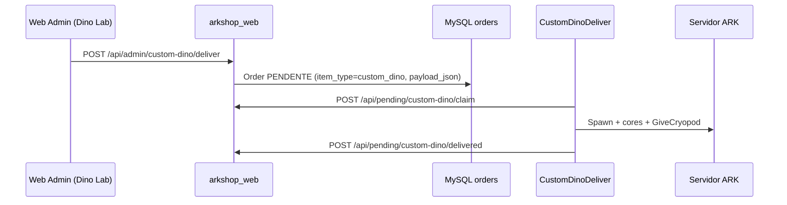
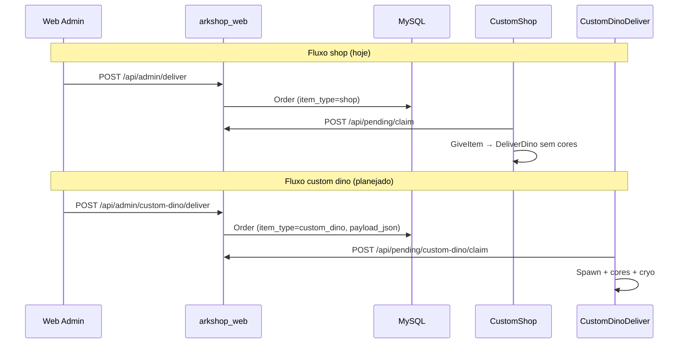

# Especificação: entrega de dinos com cores customizadas (CustomDinoDeliver + Web Store)

**Data:** 2026-07-03  
**Escopo:** pesquisa técnica e especificação arquitetural — **sem implementação**  
**Workspace:** `arkland-multi`  
**Status da decisão:** plugin/DLL **separado** do CustomShop (confirmado pelo produto)

> **Ver também:** [`docs/PROJETO_MERCADO_CRYOPOD.md`](PROJETO_MERCADO_CRYOPOD.md) (serialização de cores em cryopod), [`docs/PROJETO_ARKLAND_MASTER.md`](PROJETO_ARKLAND_MASTER.md) (gap SpawnExact vs loja), [`docs/PROJETO_SISTEMA_SUPORTE_TICKETS.md`](PROJETO_SISTEMA_SUPORTE_TICKETS.md) (compensações via suporte).

---

## Resumo executivo

| Pergunta | Resposta |
|----------|----------|
| **O fluxo atual entrega cores exatas?** | **Não** |
| **É tecnicamente viável?** | **Sim — com implementação** |
| **Onde vive a implementação?** | **Plugin separado** `CustomDinoDeliver.dll` — **não** `CustomShop.dll` |
| **Onde vive a UI admin?** | **Seção dedicada** na Web Store (ex.: “Entrega Custom” / “Dino Lab”) — **não** dentro de Jogadores & Entregas / catálogo |
| **Viabilidade imediata (zero código)?** | **Parcial** — apenas via workaround manual (SpawnExact em `Commands[]` do catálogo CustomShop) |
| **Recomendação** | Novo plugin C++ + endpoints/UI admin próprios; infraestrutura de fila HTTP compartilhada com namespace separado |

### Top finding (uma linha)

**Não hoje; sim com plugin dedicado** — a infraestrutura de cryopod já persiste cores (`ColorSetIndices` + blob `FARKDinoData`), mas nem `CustomShop.DeliverDino` nem `/api/admin/deliver` aplicam cores; um plugin separado pode spawnar, colorir e entregar em cryopod sem acoplar a loja/catálogo.

---

## Parte I — Arquitetura (11 seções)

| # | Tópico | Seção |
|---|--------|-------|
| 1 | Decisão: plugin/DLL separado (`CustomDinoDeliver`) | §1 |
| 2 | Por que separar do CustomShop | §2 |
| 3 | Infraestrutura compartilhada (HTTP, poll) | §3 |
| 4 | Web UI dedicada — **Dino Lab** | §4 |
| 5 | Estrutura do plugin (`plugin/CustomDinoDeliver/`) | §5 |
| 6 | Separação de API (`/custom-dino/*` vs `/deliver`) | §6 |
| 7 | Banco de dados (`item_type=custom_dino`) | §7 |
| 8 | Tabela comparativa CustomShop vs CustomDinoDeliver | §8 |
| 9 | Deploy (DLL em todos os mapas) | §9 |
| 10 | Fases de implementação (plugin primeiro) | §10 |
| 11 | Perguntas em aberto (atualizadas) | §11 |

---

## 1. Decisão arquitetural (AD-001)

| Aspecto | Decisão |
|---------|---------|
| **Plugin de jogo** | **DLL separada:** `CustomDinoDeliver.dll` — **não** faz parte de `CustomShop.dll` |
| **Local no repositório** | `plugin/CustomDinoDeliver/` |
| **CustomShop.dll** | Permanece responsável por loja, kits, mercado P2P, pontos, nuvem — **sem** lógica de dino custom com cores |
| **Web Store** | Área admin **Dino Lab** + rotas `/api/admin/custom-dino/*` |
| **Canal de entrega** | Mesmo padrão HTTP plugin↔web (`pending` / `claim` / `delivered`), poll e processamento **isolados** |

> **Nome alternativo descartado para v1:** `ArklandDinoForge` — documentação usa **`CustomDinoDeliver`** como canônico.

---

## 2. Por que separar do CustomShop (não estender `DeliverDino`)

| Motivo | Detalhe |
|--------|---------|
| **Isolamento de domínio** | Entrega ad-hoc de dino com paleta é um produto de **compensação/suporte/lab**, não item de catálogo |
| **Deploy independente** | Atualizar cores, espécies ou regras de spawn **sem** redeployar/reiniciar lógica de mercado ou promoções |
| **Área admin separada** | Evita poluir “Jogadores & Entregas” e o fluxo de resgate de `item_id` do `config.json` |
| **CustomShop focado** | Mantém `config.json` (~11k linhas) e `ShopStore.cpp` estáveis; reduz risco de regressão em compras, kits e mercado |
| **Permissões distintas** | Admins de “entregar item da loja” ≠ admins de “forjar dino com 6 regiões de cor” |
| **Auditoria clara** | Eventos `custom_dino_deliver` separados de `admin_deliver` / compras |
| **Evolução futura** | Stats SpawnExact, presets, templates e integração com tickets sem inflar CustomShop |

### O que **não** muda

- Jogador continua recebendo via **mesma experiência in-game** (cryopod no inventário / nuvem, conforme config)
- **Mesmo** `arkshop_web`, **mesmo** MySQL, **mesma** API key de plugin
- CustomShop **não** ganha campo `Colors` em `Dinos[]` do catálogo (catálogo simples permanece sem cores)

**Fluxo desejado (Dino Lab):** selecionar espécie → 6 cores → nível/sexo → jogador → entregar em cryopod → registrar motivo/ticket.

---

## 3. Infraestrutura compartilhada

### 3.1 Canal de entrega (HTTP plugin ↔ Web Store)

Ambos os plugins usam o **mesmo servidor** `arkshop_web` e o **mesmo banco** `orders`, mas com **namespaces distintos**:

```
┌─────────────────┐     ┌──────────────────┐     ┌─────────────────────┐
│  CustomShop     │     │   arkshop_web    │     │ CustomDinoDeliver   │
│  HttpClient     │────▶│  MySQL orders    │◀────│  HttpClient         │
│  poll shop/kit  │     │  + audit_events  │     │  poll custom_dino   │
└─────────────────┘     └──────────────────┘     └─────────────────────┘
         │                        │                         │
         └────────────────────────┴─────────────────────────┘
                    X-API-Key, delivery_mode=plugin
```

### 3.2 Estratégia de poll (recomendada)

**Opção A — Endpoint de claim filtrado (preferida):**

| Plugin | Endpoint | Filtro |
|--------|----------|--------|
| CustomShop | `POST /api/pending/claim` (existente) | `item_type IN ('shop','kit')` — comportamento atual |
| CustomDinoDeliver | `POST /api/pending/custom-dino/claim` (novo) | `item_type = 'custom_dino'` |

Vantagens: zero ambiguidade; cada DLL só vê seus pedidos; CustomShop não precisa de alteração no loop de entrega.

**Opção B — Claim compartilhado com campo `handler`:**

Estender `/api/pending/claim` com query/body `handler=customshop|custom_dino`. Funciona, mas acopla contratos e exige mudança no CustomShop para ignorar tipos alheios.

**Decisão documentada:** **Opção A** — endpoint dedicado para o novo plugin.

### 3.3 Padrão HttpClient

O novo plugin deve **copiar/adaptar** o padrão WinHTTP de `plugin/CustomShop/src/HttpClient.cpp`:

- User-Agent distinto: `CustomDinoDeliver/1.0`
- Mesma `X-API-Key` em `config.json`
- Mesmos helpers: `claim` → entregar in-game → `POST .../delivered` ou `release` em falha
- **Sem** link estático ou include cruzado entre DLLs — duplicação controlada ou futuro `ArklandPluginCommon` (fora do escopo v1)

### 3.4 Ciclo de vida do pedido (custom dino)



---

## 4. Web UI — área dedicada (Dino Lab)

### 4.1 Navegação

Nova entrada no menu admin da Web Store — **fora** de Catálogo / Jogadores & Entregas:

| Label (PT-BR) | Rota front | Permissão sugerida |
|---------------|------------|-------------------|
| **Dino Lab** (ou “Entrega Custom”) | `#/admin/dino-lab` | `admin.custom_dino` (nova) |

Ícone sugerido: paleta / DNA — distinto de “entregar resgate” da loja.

### 4.2 Wireframe

```
┌──────────────────────────────────────────────────────────────────┐
│  Admin › Dino Lab › Nova entrega                                 │
├──────────────────────────────────────────────────────────────────┤
│  Jogador     [🔍 Buscar nome/SteamID ▼]  7656119…  [Online: ●]   │
│  Espécie     [🔍 Rex — Tyrannosaurus     ▼]  [Vanilla] [Mod: —]  │
│  Nível       [ 150 ]    Sexo (●) M  ( ) F    [ ] Castrado        │
│  ── Cores (6 regiões) ─────────────────────────────────────────  │
│  Região 0 Body    [14 ▼] ████ Red    … Região 5 [ 0 ▼]           │
│  Entrega     (●) Cryopod  ( ) No chão                             │
│  Motivo      [ Compensação suporte #4521          ]              │
│              [ Pré-visualizar JSON ]  [ 🚚 Entregar agora ]     │
└──────────────────────────────────────────────────────────────────┘
```

Sub-abas: **Nova entrega** · **Histórico** (`item_type=custom_dino`) · **Presets** (fase 2).

### 4.3 O que **não** fazer na UI

- Botão “Dino customizado” em **Jogadores & Entregas** (fluxo CustomShop)
- `Colors[]` no `config.json` do CustomShop
- Histórico misturado com resgates de catálogo sem filtro

---

## 5. Estrutura proposta do plugin

### 5.1 Layout de pastas

```
plugin/CustomDinoDeliver/
├── CMakeLists.txt / CustomDinoDeliver.vcxproj
├── configs/
│   ├── PluginInfo.json
│   └── config.json              # URL web, API key, defaults cryo, allowlist espécies
├── src/
│   ├── Main.cpp                 # Load/UnLoad Ark API
│   ├── DinoConfig.cpp/h         # Leitura config.json
│   ├── DinoDeliver.cpp/h       # Spawn, ApplyColors, GiveCryopod
│   ├── DinoHttpClient.cpp/h     # Poll claim/delivered (namespace próprio)
│   ├── DinoCommands.cpp/h       # Opcional: /dinolab status, reload config
│   └── pch.h
└── ArkServerAPI/                # Submodule/cópia igual CustomShop
```

### 5.2 `PluginInfo.json` (rascunho)

```json
{
  "FullName": "CustomDinoDeliver",
  "Description": "Entrega administrativa de dinos com cores customizadas — ARKLAND",
  "Version": 1.0,
  "MinApiVersion": 0.0,
  "Dependencies": ["Permissions"]
}
```

### 5.3 `config.json` do plugin (rascunho)

```json
{
  "WebStoreUrl": "https://shop.arkland.example",
  "ApiKey": "…",
  "PollIntervalSeconds": 15,
  "DefaultDeliverAs": "cryopod",
  "CryopodBlueprint": "/Game/.../Cryopod",
  "AllowGroundSpawnOnFullInventory": true,
  "AllowedSpecies": [],
  "LogLevel": "info"
}
```

`AllowedSpecies` vazio = confiar na validação da Web; preenchido = segunda barreira no servidor.

### 5.4 Comandos in-game (opcionais v1)

| Comando | Função |
|---------|--------|
| `/dinodeliver reload` | Recarrega `config.json` (admin) |
| `/dinodeliver pending` | Lista pedidos custom pendentes do jogador mirado (debug) |

Não obrigatório na v1 — entrega 100% via Web admin é suficiente.

### 5.5 Código de entrega (núcleo)

Reutiliza **conhecimento** de `ShopCryoDino.cpp` (spawn, gender, cryo, `GetColorSetInidcesAsString`), mas implementado **nesta DLL** — sem chamar símbolos exportados do CustomShop.

---

## 6. Separação de API (Web Store)

### 6.1 Rotas admin (novas)

| Método | Rota | Uso |
|--------|------|-----|
| `POST` | `/api/admin/custom-dino/deliver` | Criar pedido de entrega com payload completo |
| `GET` | `/api/admin/custom-dino/species` | Lista espécies + metadados de paleta (Obelisk cache) |
| `GET` | `/api/admin/custom-dino/orders` | Histórico/filtro de entregas custom |
| `GET` | `/api/admin/custom-dino/orders/<id>` | Detalhe + payload + status |

### 6.2 Rotas plugin (novas)

| Método | Rota | Uso |
|--------|------|-----|
| `POST` | `/api/pending/custom-dino/claim` | Reserva pedidos `custom_dino` |
| `POST` | `/api/pending/custom-dino/delivered` | Confirma entrega |
| `POST` | `/api/pending/custom-dino/release` | Reabre após falha |

### 6.3 Rotas existentes — **sem alteração de contrato**

| Rota | Continua para |
|------|---------------|
| `POST /api/admin/deliver` | Shop / kit do catálogo CustomShop |
| `POST /api/pending/claim` | CustomShop apenas |

**Não** usar `/api/admin/deliver` com `item_type` hack para dinos custom — payload é estruturalmente diferente (6 cores, blueprint livre, sem `item_id` de catálogo).

### 6.4 Payload `POST /api/admin/custom-dino/deliver`

```json
{
  "steam_id": "7656119XXXXXXXXXX",
  "species_blueprint": "Blueprint'/Game/PrimalEarth/Dinos/Rex/Rex_Character_BP.Rex_Character_BP'",
  "level": 150,
  "gender": "female",
  "neutered": false,
  "colors": [14, 14, 14, 0, 0, 0],
  "deliver_as": "cryopod",
  "note": "compensação ticket #1234",
  "ticket_id": "4521"
}
```

Resposta:

```json
{
  "ok": true,
  "order_id": "cd_20260703_abc123",
  "status": "PENDENTE",
  "queued": true
}
```

---

## 7. Modelo de dados (banco)

### 7.1 Abordagem recomendada: `item_type` + `payload_json`

Reutilizar tabela `orders` existente com convenção explícita:

| Campo | Valor para custom dino |
|-------|------------------------|
| `item_type` | `custom_dino` |
| `item_id` | UUID curto ou `__custom_dino__` + slug estável |
| `amount` | `1` |
| `payload_json` | **Novo campo** (TEXT/JSON) — blueprint, level, gender, colors, deliver_as, note |
| `original_order_id` | Opcional: `ticket:#4521` para rastreio |

**Por que não tabela separada na v1:** reaproveita status (`PENDENTE` → `ENTREGANDO` → `ENTREGUE`), UI de pedidos do jogador, idempotência e ferramentas admin existentes.

### 7.2 Abordagem alternativa: tabela `custom_dino_orders`

| Prós | Contras |
|------|---------|
| Schema limpo, migrations isoladas | Duplicar lógica de status/claim; duas fontes de verdade |
| Consultas admin mais simples | Jogador vê pedidos em dois lugares |

**Decisão documentada:** `orders` + `item_type=custom_dino` + `payload_json` na v1; tabela dedicada só se volume ou relatórios exigirem.

### 7.3 Auditoria

Registrar em `audit_events`:

```json
{
  "event_type": "custom_dino_deliver",
  "actor_steam_id": "admin…",
  "target_steam_id": "7656119…",
  "order_id": "…",
  "details": { "species": "rex", "colors": [14,14,14,0,0,0], "level": 150 }
}
```

### 7.4 Metadados de paleta (Web UI)

```json
{
  "species_key": "rex",
  "blueprint": "Blueprint'/Game/.../Rex_Character_BP.Rex_Character_BP'",
  "color_regions": [
    { "index": 0, "label": "Body", "max_index": 40, "swatches": [
      { "id": 14, "name": "Red", "hex": "#8B0000" }
    ]}
  ]
}
```

Fonte: cache Obelisk ASB (mesmo padrão do ASM). Fallback: entrada numérica 0–255.

---

## 8. Comparação de responsabilidades (CustomShop vs CustomDinoDeliver)

| Responsabilidade | CustomShop.dll | CustomDinoDeliver.dll |
|------------------|----------------|----------------------|
| Catálogo `Items` / `Kits` | ✅ | ❌ |
| Compras, pontos, licenças | ✅ | ❌ |
| Mercado P2P cryopod | ✅ | ❌ |
| `DeliverDino` sem cores (catálogo `Type:dino`) | ✅ | ❌ |
| Spawn + aplicar 6 cores + cryo | ❌ | ✅ |
| Poll `item_type=shop/kit` via `/api/pending/claim` | ✅ | ❌ |
| Poll `item_type=custom_dino` via `/api/pending/custom-dino/claim` | ❌ | ✅ |
| Admin `POST /api/admin/deliver` | ✅ | ❌ |
| Admin `POST /api/admin/custom-dino/deliver` | ❌ | ✅ |
| Comandos `/shop`, `/enviar` | ✅ | ⚠️ Opcional (`/dinodeliver`) |
| `config.json` da loja (~11k linhas) | ✅ | ❌ |
| `config.json` próprio do plugin | ❌ | ✅ |
| UI Jogadores & Entregas | ✅ | ❌ |
| UI **Dino Lab** | ❌ | ✅ |

---

## 9. Deploy

### 9.1 Servidor de jogo (cada mapa)

| Artefato | Destino |
|----------|---------|
| `CustomDinoDeliver.dll` | `ShooterGame/Binaries/Win64/ArkApi/Plugins/CustomDinoDeliver/` |
| `config.json` + `PluginInfo.json` | `…/Plugins/CustomDinoDeliver/configs/` |

**Junto** com CustomShop já instalado — mesma versão em **todos** os mapas do cluster.

### 9.2 Ordem de rollout sugerida

1. Deploy `arkshop_web` com rotas novas (feature flag `custom_dino_enabled=false`)
2. Deploy DLL em um mapa de staging
3. Teste end-to-end staging
4. Copiar DLL para todos os mapas; habilitar flag na web
5. Conceder permissão `admin.custom_dino` apenas a grupo admin restrito

### 9.3 Dependências runtime

- Ark Server API (mesma versão mínima que CustomShop)
- Plugin `Permissions` (padrão ARKLAND)
- **Não** depende de CustomShop.dll carregado — apenas coexistência

### 9.4 Configuração web

Em `settings` do servidor (ou env):

```json
{
  "custom_dino_enabled": true,
  "custom_dino_plugin_poll": true
}
```

---

## 10. Fases de implementação (plugin separado primeiro)

### Fase 0 — Fundação (web + schema)

- [ ] Migration: coluna `payload_json` em `orders` (se ausente)
- [ ] `item_type = 'custom_dino'` documentado no ORM
- [ ] Rotas `/api/pending/custom-dino/*` e `/api/admin/custom-dino/deliver` (stub OK)
- [ ] Feature flag `custom_dino_enabled`
- [ ] Permissão `admin.custom_dino`

### Fase 1 — Plugin mínimo (MVP) — **prioridade**

- [ ] Scaffold `plugin/CustomDinoDeliver/`
- [ ] `DinoDeliver`: spawn + `Colors[6]` + `GiveCryopod` (referência: `ShopCryoDino.cpp`, sem link DLL)
- [ ] `DinoHttpClient`: poll `/api/pending/custom-dino/claim` → delivered/release
- [ ] Teste manual: Rex vanilla, cryo, releitura de cores

### Fase 2 — Web UI Dino Lab

- [ ] Nav **Dino Lab** (item de menu separado)
- [ ] Formulário completo + histórico `custom_dino`
- [ ] Auditoria `custom_dino_deliver`

### Fase 3 — Paletas e qualidade

- [ ] Obelisk swatches, validação `PreventColorizationRegions`
- [ ] Testes API Python + checklist in-game
- [ ] Link `ticket_id` com suporte

### Fase 4 — Extras (opcional)

- [ ] Presets, SpawnExact stats, `/dinodeliver`, notificação in-game

### O que **não** fazer

- Estender `CustomShop.DeliverDino` ou catálogo com `Colors[]`
- Unificar poll no CustomShop
- Montar blob `DinoData` na Web

---

## 11. Perguntas em aberto

### Resolvidas (decisão de produto)

| Pergunta | Decisão |
|----------|---------|
| Plugin único vs separado do CustomShop? | **Separado** — `CustomDinoDeliver.dll` |
| UI dentro de Jogadores & Entregas / catálogo? | **Não** — **Dino Lab** dedicado |
| Reutilizar `POST /api/admin/deliver`? | **Não** — `POST /api/admin/custom-dino/deliver` |
| Nome do plugin | **`CustomDinoDeliver`** (canônico) |

### Ainda em aberto

1. **Escopo de stats:** só cores + nível + sexo, ou SpawnExact completo (imprint, mutações)?
2. **Cryopod obrigatório** ou spawn no chão quando inventário cheio?
3. **Mods:** allowlist fechada ou blueprint livre com disclaimer?
4. **Preview visual:** swatches Obelisk na v1 ou campos numéricos?
5. **Presets** na v1 ou fase 2?
6. **Notificação in-game** ao receber dino custom?
7. **Tabela dedicada** `custom_dino_orders` no futuro ou só `orders.payload_json`?
8. **`ticket_id` obrigatório** para compensações?
9. **Permissão:** grupo `DinoLab` no Permissions ou flag web apenas?

---

## Parte II — Pesquisa técnica

## A. Estado atual do código

### A.1 CustomShop — `DeliverDino` (`ShopCryoDino.cpp`)

Entrada suportada no JSON `Dinos[]`:

| Campo | Suportado | Observação |
|-------|-----------|------------|
| `Blueprint` | ✅ | Obrigatório |
| `Level` | ✅ | Default 150 |
| `ForceTame` | ✅ | Default true |
| `Neutered` | ✅ | |
| `Gender` | ✅ | `male` / `female` |
| `SaddleBlueprint` | ✅ | Opcional |
| `Cryopod` / `PreventCryo` | ✅ | Override por entrada |
| **`Colors` / cores** | ❌ | **Não existe — e não será adicionado** (AD-001) |

Fluxo atual: `SpawnDino` → `ApplyGender` → opcional `GiveCryopod`. `SpawnDino` **não** recebe cor.

### A.2 Cryopod — onde as cores ficam

Em `BuildCryoCustomData` (`ShopCryoDino.cpp`):

```cpp
FString color_indices;
dino->GetColorSetInidcesAsString(&color_indices);
customItemData.CustomDataStrings.Add(color_indices);  // índice [2] na cryo
```

Também `dino->GetDinoData(&dinoData)` → blob `FARKDinoData.DinoData` (cores incluídas). **CustomDinoDeliver deve replicar este pipeline após aplicar cores.**

### A.3 Web Store — `/api/admin/deliver` (CustomShop)

```
POST /api/admin/deliver
{ steam_id, item_type, item_id, amount }
```

- Cria `Order` PENDENTE; CustomShop faz poll em `/api/pending/claim`
- **Sem** payload de dino customizado — permanece assim

### A.4 SpawnExact (ASM / Server Manager)

- `src/spawn_exact.py` — `COLOR_COUNT = 6`
- Export para kit CustomShop: workaround manual, **fora** do escopo Dino Lab
- Nenhum item no `config.json` atual contém `SpawnExact`

---

## B. Detalhes da API ARK (headers no repositório)

Fonte: `plugin/CustomShop/ArkServerAPI/version/Core/Public/API/ARK/Actor.h`

### B.1 `FARKDinoData`

```cpp
struct FARKDinoData {
    UClass* DinoClass;
    TArray<unsigned char> DinoData;
    FString DinoNameInMap;
    FString DinoName;
};
```

### B.2 `APrimalDinoCharacter` — colorização

| Membro / método | Uso |
|-----------------|-----|
| `ColorSetIndicesField()` | 6 regiões — índices na paleta da espécie |
| `GetColorSetInidcesAsString()` | Serialização `"r0,r1,r2,r3,r4,r5"` |
| `MulticastUpdateAllColorSets(c0…c5)` | Aplica as 6 de uma vez |
| `RefreshColorization(force)` | Reaplica visual |

### B.3 Limites

| Aspecto | Valor |
|---------|-------|
| Regiões | **6** (fixo ASE) |
| Semântica | Índice na paleta Obelisk/ASB — **não** RGB |
| Faixa típica | 0–255; **0 = padrão/wild** na região |
| Mods | Paletas próprias; validação frouxa ou allowlist |

---

## C. Onde as cores vivem (resumo)

```
┌─────────────────────────────────────────────────────────────┐
│  Admin quer cores [c0..c5]  (Dino Lab)                      │
└───────────────────────────┬─────────────────────────────────┘
                            │
        ┌───────────────────┼───────────────────┐
        ▼                   ▼                   ▼
  CustomDinoDeliver   ColorSetIndices      Cryopod blob
  Spawn + paint       + RefreshColorization  (mercado P2P)
        │                   │                   │
        └─────────┬─────────┴─────────┬─────────┘
                  ▼                   ▼
           APrimalDinoCharacter  →  FARKDinoData.DinoData
                  │                   +
                  └──── GetColorSetInidcesAsString → cryo strings[2]
```

| Canal | Cores exatas? | Plugin |
|-------|---------------|--------|
| CustomShop `DeliverDino` | ❌ | CustomShop |
| CustomDinoDeliver | ✅ (planejado) | CustomDinoDeliver |
| Cryopod blob mercado | ✅ | CustomShop (mercado) |
| SpawnExact manual | ✅ | Nenhum (ASM) |

---

## D. Opções técnicas ranqueadas (pós AD-001)

### Opção 1 — Plugin separado CustomDinoDeliver + Dino Lab (RECOMENDADA)

**Descrição:** Nova DLL com spawn, aplicação de cores, cryopod e poll HTTP próprio; Web com área admin dedicada.

| Prós | Contras |
|------|---------|
| Isolamento total do CustomShop | Segundo projeto C++ para manter |
| Deploy e permissões independentes | Duplicar HttpClient/cryo helpers |
| Alinha com decisão de produto | Testes por espécie/mod em ambos ambientes |
| Mesma fila `orders` | Migration `payload_json` na web |

**Esforço estimado:** 4–6 dias (plugin + web + UI + testes 2–3 espécies + 1 mod)

---

### Opção 2 — Estender `DeliverDino` no CustomShop

**Status:** **Rejeitada** (AD-001) — mantida aqui só como referência histórica.

---

### Opção 3 — Catálogo CustomShop + SpawnExact (workaround)

Paliativo operacional via ASM; **não** substitui Dino Lab.

---

### Opção 4 — RCON SpawnExact na entrega

Segunda escolha de emergência; sem cryopod automatizado; pior que Opção 1.

---

### Opção 5 — Blob cryo pré-capturada

Adequado ao mercado P2P; inadequado para “montar na UI”.

---

### Opção 6 — Montar `CustomItemData` na Web

**Não recomendada** — layout binário frágil.

---

## E. Riscos e limitações

| Risco | Impacto | Mitigação |
|-------|---------|-----------|
| Duas DLLs com lógica cryo similar | Divergência de bugs | Testes compartilhados; comentário de paridade com `ShopCryoDino.cpp` |
| Índice de cor inválido | Cor errada | Obelisk + validação no plugin |
| Plugin novo ausente em um mapa | Pedido preso em PENDENTE | Health check; alerta se `custom_dino` pendente > N min |
| Região `PreventColorization` | Cor ignorada | UI desabilita região |
| Patch ASE altera cryo | Regressão | Testes pós-patch; versionar parser |
| Jogador offline | Pedido PENDENTE | Comportamento esperado |
| Inventário cheio | Falha cryo | Fallback spawn no chão (config) |

---

## F. Referências no repositório

| Arquivo | Relevância |
|---------|------------|
| `plugin/CustomShop/src/ShopCryoDino.cpp` | **Referência** para cryo/cores — não estender |
| `plugin/CustomShop/src/HttpClient.cpp` | Padrão HTTP a replicar no novo plugin |
| `plugin/CustomShop/src/ShopStore.cpp` | Fluxo GiveItem — **não** usado por custom dino |
| `plugin/arkshop_web/app.py` | `orders`, `/api/pending/claim`, `_admin_deliver_order` |
| `src/spawn_exact.py` | Formato 6 cores / SpawnExact |
| `docs/PROJETO_MERCADO_CRYOPOD.md` | Cores em `CustomDataStrings` |
| `docs/PROJETO_SISTEMA_SUPORTE_TICKETS.md` | Compensações e auditoria |
| `docs/market_admin_audit_improvements.md` | Padrões de auditoria admin (referência) |

---

## Apêndice A — Pseudocódigo CustomDinoDeliver

```cpp
// DinoDeliver.cpp — após SpawnDino + ApplyGender:
if (payload.colors.size() == 6) {
  for (int i = 0; i < 6; ++i) {
    dino->ColorSetIndicesField()[i] = static_cast<char>(payload.colors[i]);
  }
  dino->MulticastUpdateAllColorSets_Implementation(
      c[0], c[1], c[2], c[3], c[4], c[5]);
  dino->RefreshColorization(true);
}
GiveCryopod(player, dino);  // mesmo layout CustomDataStrings[2] que mercado
```

---

## Apêndice B — Fluxo comparativo (shop vs custom dino)



---

*Documento atualizado com decisão arquitetural AD-001 — validação in-game recomendada antes da implementação.*
