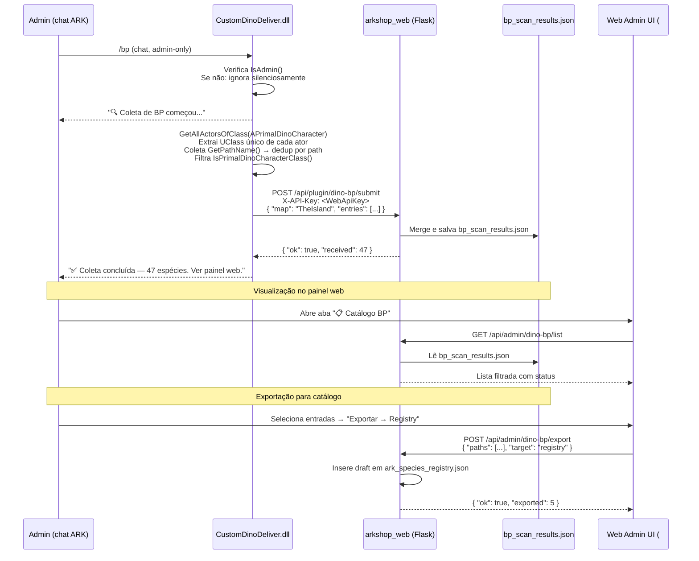
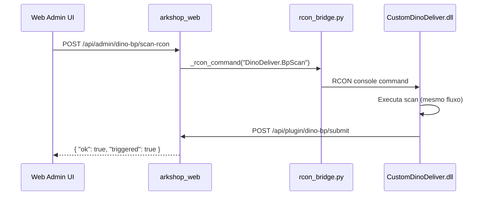

# Dino Lab — Coleta Automática de Blueprints (`/bp`)

| Campo | Valor |
|-------|-------|
| **Status** | 📋 **Especificado — aguarda implementação** |
| **Versão** | 1.0 |
| **Data** | 2026-07-10 |
| **Escopo** | Decisões arquiteturais, UX, formato de dados, endpoints, fases — **sem código de produção** |
| **Relacionado** | [`docs/DINO_LAB_SPEC.md`](DINO_LAB_SPEC.md) — spec do Dino Lab operacional |

> **Resumo em uma linha:** o comando `/bp` no chat do ARK escaneia as criaturas carregadas no servidor, extrai os blueprint paths (vanilla + mods), e disponibiliza a lista no painel admin do Dino Lab para consulta e exportação ao catálogo.

---

## Sumário

1. [Objetivo e contexto](#1-objetivo-e-contexto)
2. [Decisões arquiteturais](#2-decisões-arquiteturais)
3. [Fluxo completo](#3-fluxo-completo)
4. [UX do chat — mensagens exatas](#4-ux-do-chat--mensagens-exatas)
5. [UI web — aba Catálogo BP no Dino Lab Admin](#5-ui-web--aba-catálogo-bp-no-dino-lab-admin)
6. [Abordagens de coleta — trade-offs e recomendação](#6-abordagens-de-coleta--trade-offs-e-recomendação)
7. [Resposta direta: precisa estar spawnada?](#7-resposta-direta-precisa-estar-spawnada)
8. [Formato JSON — `bp_scan_results.json`](#8-formato-json--bp_scan_resultsjson)
9. [API endpoints](#9-api-endpoints)
10. [Fluxo "Partilhar com catálogo"](#10-fluxo-partilhar-com-catálogo)
11. [Ficheiros a criar/alterar — checklist](#11-ficheiros-a-criaralterar--checklist)
12. [Fases MVP / 2 / 3 com estimativas](#12-fases-mvp--2--3-com-estimativas)
13. [Riscos e limitações](#13-riscos-e-limitações)
14. [Pré-requisitos para implementar](#14-pré-requisitos-para-implementar)
15. [Referências](#15-referências)

---

## 1. Objetivo e contexto

### O problema

O catálogo de espécies do ARKLAND (`ark_species_registry.json`, `market_species_defaults.json`, `config.json` da loja) é **100% mantido à mão**. Para adicionar um novo dino de mod, um admin precisa saber o blueprint path exato — ex: `Blueprint'/Game/Mods/2047/Dinos/AbyssShark/AbyssShark_BP.AbyssShark_BP_C'` — sem nenhuma ferramenta que os extraia automaticamente.

Isso causa:
- Erros de digitação em paths (`_Character_BP` vs `_BP`, maiúsculas erradas)
- Mods novos não adicionados ao catálogo por desconhecimento dos paths
- Dependência de fontes externas (Beacon, Dododex) que **não cobrem mods privados**

### A solução proposta

Um comando `/bp` no chat do ARK (admin-only) que:
1. Escaneia as criaturas vivas no servidor
2. Extrai os blueprint paths diretamente da memória do jogo (vanilla + todos os mods carregados)
3. Envia a lista para o `arkshop_web` via HTTP
4. Disponibiliza os resultados no painel admin do **Dino Lab** para visualização e exportação

### Contexto do servidor ARKLAND

- **Engine**: ARK Survival Evolved (ASE), **não** ASA
- **Plugin SDK**: ArkServerAPI v3 (C++)
- **Mods relevantes**: Aquatica/Abyss (mod privado, paths em `/Game/Abyss/`), mods workshop em `/Game/Mods/`
- **Catálogo atual**: ~79 espécies — 36 `/Game/Mods/`, 28 `/Game/Abyss/`, 8 `/Game/PrimalEarth/`, 7 DLCs oficiais
- **Fonte crítica**: `ark_species_registry.json` é e continuará sendo a fonte de verdade para espécies Abyss

---

## 2. Decisões arquiteturais

### AD-001 — Integrar no Dino Lab, não no CustomShop

**Decisão:** o `/bp` fica no plugin `CustomDinoDeliver` (Dino Lab), **não** no `CustomShop`.

**Justificativa:**

| Critério | CustomDinoDeliver (Dino Lab) | CustomShop |
|---|---|---|
| Já usa `GetAllActorsOfClass(APrimalDinoCharacter)` | ✅ `DinoDeliver.cpp` linha 266 | ❌ Não |
| Já tem WinHTTP bidirecional para `arkshop_web` | ✅ `DinoHttpClient.cpp` | ✅ Diferente |
| Chat commands admin já registados (`/dinolab`) | ✅ `DinoCommands.cpp` | ✅ Sim, mas estilo diferente |
| Risco de regressão em `config.json` (11k linhas) | ✅ Zero — plugin isolado | ❌ Alto |
| UI web admin dedicada a dinos | ✅ Já existe em `index.html` | ❌ Criação do zero |
| Propósito filosófico | ✅ Ferramenta staff sobre criaturas | ❌ Loja pública |
| Deploy independente | ✅ `CustomDinoDeliver.dll` separado | ❌ Requer rebuild do CustomShop |

### AD-002 — Scan primário via atores vivos (Abordagem A)

**Decisão:** MVP usa `GetAllActorsOfClass(APrimalDinoCharacter)` para encontrar criaturas no mapa atual.

**Justificativa:** Esta função já está em produção em `DinoDeliver.cpp` (linhas 265-275 e 294-298), portanto o risco técnico é zero. O scan de GObjects (Abordagem B) é mais completo mas nunca testado no contexto deste plugin.

**Limitação aceita:** captura apenas espécies com pelo menos um exemplar vivo no mapa no momento do scan.

### AD-003 — HTTP POST do plugin → `arkshop_web` (não RCON)

**Decisão:** o plugin posta os resultados diretamente via HTTP (WinHTTP), usando o endpoint `/api/plugin/dino-bp/submit` com `X-API-Key`. **Não** via resposta RCON.

**Justificativa:** o padrão de HTTP bidirecional já existe em `DinoHttpClient.cpp` (endpoints `/api/pending/custom-dino/claim`, `/delivered`, `/release`). RCON tem limite de tamanho de mensagem que seria problemático para listas longas.

### AD-004 — Config.json da loja NUNCA recebe escrita automática

**Decisão:** exportar ao `CustomShop/configs/config.json` é sempre **modo draft** — a web gera um preview JSON para o admin copiar/colar. Nunca escrita automática.

**Justificativa:** o arquivo tem ~11.000 linhas e é o coração da loja em produção. Um erro de escrita pode derrubar o sistema de shop para todos os jogadores.

---

## 3. Fluxo completo

### Diagrama de sequência



### Fluxo alternativo — trigger via RCON (sem interação no chat)



---

## 4. UX do chat — mensagens exatas

As mensagens são enviadas **somente ao admin que executou o comando**. Nenhum blueprint path é exibido no chat. Lista completa sempre no site.

| Situação | Cor | Mensagem |
|---|---|---|
| Início da coleta | Branco/neutro | `🔍 Coleta de BP começou...` |
| Conclusão com sucesso | Verde | `✅ Coleta concluída — 47 espécies encontradas. Ver painel web.` |
| Coleta já em andamento | Amarelo | `⏳ Coleta de BP já em andamento. Aguarde.` |
| Falha ao enviar para a web | Vermelho | `⚠️ Coleta finalizada, mas falha ao enviar ao servidor web. Cheque os logs.` |
| Sem permissão (não admin) | — | Sem mensagem (ignora silenciosamente) |

**Implementação de referência** — padrão idêntico ao já existente em `DinoCommands.cpp`:

```cpp
// Padrão já usado no CmdPollImpl() — mesmo mecanismo para /bp
ArkApi::GetApiUtils().SendServerMessage(controller, FColorList::Green, "✅ Coleta concluída...");
```

---

## 5. UI web — aba Catálogo BP no Dino Lab Admin

### Localização

A página `dino-lab-admin` já existe em `static/index.html`. A feature adiciona uma **nova aba** dentro do sistema de abas existente:

```
🧬 Dino Lab — Entrega customizada
┌───────────────────────────────────────────────────────────────────────┐
│ [Nova entrega] [Histórico] [Encomendas] [Galeria cores] [IDs bloq.] [📋 Catálogo BP] ← NOVA
└───────────────────────────────────────────────────────────────────────┘
```

### Conteúdo da aba "📋 Catálogo BP"

```
┌─────────────────────────────────────────────────────────────────────────┐
│ Última coleta: 10/07/2026 00:51 — Mapa: TheIsland — 47 espécies         │
│ [↺ Forçar nova coleta via RCON]                                          │
│                                                                          │
│ Filtro: [🔍 buscar por nome...] [Apenas mods ▼] [Só novos ▼]            │
│                                                                          │
│ ☐ Selecionadas: 0   [📤 Exportar selecionadas → Registry]               │
│                                                                          │
│ ┌──────────────────────────────────────────────────────────────────────┐ │
│ │ ☐  Rex              PrimalEarth/Dinos/Rex/Rex_Character_BP   ✅ reg  │ │
│ │ ☐  Carcha           PrimalEarth/Dinos/Carcha/Carcha_Char_BP  ✅ reg  │ │
│ │ ☑  AbyssShark_Mod   Mods/2047/Dinos/AbyssShark/AbyssShark_BP ⚠️ novo │ │
│ │ ☑  Unknown_2047_X   Mods/2047/Dinos/Unknown/Unknown_BP       ⚠️ novo │ │
│ └──────────────────────────────────────────────────────────────────────┘ │
└─────────────────────────────────────────────────────────────────────────┘
```

### Colunas da tabela

| Coluna | Fonte | Descrição |
|---|---|---|
| Checkbox | — | Seleção para exportação em massa |
| Nome inferido | Heurística do path | Ex: `Rex_Character_BP_C` → `Rex` |
| Caminho interno | `inner` do JSON | `/Game/PrimalEarth/...` truncado |
| Status | Cruzamento com registry | `✅ no registry` / `⚠️ novo` / `📤 exportado` |
| Botão "Copiar path" | — | Copia path completo `Blueprint'...'` |

---

## 6. Abordagens de coleta — trade-offs e recomendação

### Abordagem A — Scan de atores vivos (GetAllActorsOfClass)

**Mecanismo:** itera `GetAllActorsOfClass(world, APrimalDinoCharacter::GetPrivateStaticClass(), &actors)`, extrai `GetClass()->GetPathName()` de cada ator, deduplica.

**Já em produção em:** `DinoDeliver.cpp` linhas 265–275 e 294–298.

| Critério | Avaliação |
|---|---|
| Complexidade de implementação | ⭐ Muito baixa — padrão já testado |
| Cobertura vanilla | ✅ Total (se houver exemplares vivos) |
| Cobertura mods | ✅ Total (se houver exemplares vivos do mod) |
| Cobertura de espécies raras não-spawnadas | ❌ Zero |
| Dinos em cryopod | ❌ Não aparecem |
| Risco de crash | ⭐ Mínimo |
| Performance | ✅ Aceitável (~100–300ms para 1000 atores) |

**Recomendação: usar como MVP.**

---

### Abordagem B — Iteração de GObjects (UClass globais)

**Mecanismo:** itera `GUObjectArray` (ou `TObjectIterator<UClass>`) filtrando subclasses de `APrimalDinoCharacter`. Captura **todas** as `UClass` carregadas na memória — inclui espécies que nunca spawnaram.

| Critério | Avaliação |
|---|---|
| Complexidade de implementação | ⭐⭐⭐ Média |
| Cobertura | ✅ Total de tudo carregado em memória |
| Cobertura de espécies não-spawnadas | ✅ Sim |
| Risco de crash | ⚠️ Array pode mudar durante iteração (prefixar com lock) |
| Performance | ⚠️ Mais lento (~100.000+ objetos a filtrar) |
| Testado neste plugin | ❌ Não |

**Recomendação: Fase 2 ou Fase 3, como complemento da Abordagem A.**

---

### Abordagem C — Spawn containers (NPCZoneManager / NPCSpawnEntriesContainer)

**Mecanismo:** `GetAllActorsOfClass(ANPCSpawnEntriesContainerBase)` → itera o array de spawn entries de cada container, extraindo as `UClass*` de cada entrada.

| Critério | Avaliação |
|---|---|
| Complexidade de implementação | ⭐⭐ Média-baixa |
| Cobertura | ✅ Espécies configuradas para spawnar (sem precisar estar vivas) |
| Espécies configuráveis via admin não-spawnables | ✅ Sim |
| Espécies de mods não registados em spawn entries | ❌ Não |
| Risco de crash | ✅ Baixo (atores estáticos) |
| Documentação do ArkServerAPI para esses campos | ⚠️ Escassa |

**Recomendação: Fase 2, combinada com A para melhor cobertura.**

---

### Abordagem D — Leitura de arquivos offline (.uasset / .pak)

**Mecanismo:** o Server Manager (Python) lê os arquivos `.pak` dos mods instalados no servidor e extrai os paths de blueprint sem o jogo estar rodando.

| Critério | Avaliação |
|---|---|
| Complexidade de implementação | ⭐⭐⭐⭐ Alta — requer parser de formato proprietário |
| Cobertura | ✅ Total — tudo no disco |
| Dependência do servidor ativo | ✅ Zero — funciona offline |
| Ferramentas disponíveis | Parcialmente — `ArkTools`, `ark-data-reader` (externos) |
| Mods com assets obfuscados | ❌ Pode não funcionar |
| Integração com o projeto atual | ❌ Requer novos componentes Python |

**Recomendação: não implementar — complexidade não justifica o ganho.**

---

### Abordagem E — Beacon Discovery API

**Mecanismo:** `GET /v4/ark/blueprints?contentPackId=<UUID>` — busca blueprints do catálogo Beacon por content pack (vanilla, DLCs oficiais).

| Critério | Avaliação |
|---|---|
| Complexidade de implementação | ⭐ Muito baixa — `beacon_client.py` já existe |
| Cobertura vanilla + DLCs oficiais | ✅ Excelente |
| Cobertura mods workshop | ⚠️ Apenas se o autor publicou no Beacon |
| Cobertura mod Abyss (privado) | ❌ Zero — não indexado no Beacon |
| Campos retornados | `path`, `label`, `classString`, `contentPackId`, `creatureId` |
| ASA equivalente | ✅ `/v4/arksa/blueprints` existe |

**Já usado em:** `src/beacon_client.py` (ARK Prime, contentPackId `30bbab29-...`).  
**Recomendação: Fase 3 — enriquecimento de metadados** (`label`, `matureTime`) para entradas já no registry.

---

### Recomendação híbrida por fase

| Fase | Abordagem | Cobertura esperada |
|---|---|---|
| MVP | A (atores vivos) | ~70% das espécies se o servidor estiver ativo |
| Fase 2 | A + C (atores + spawn containers) | ~85–90% |
| Fase 3 | A + C + E (+ Beacon para DLCs oficiais) | ~95% (Abyss sempre manual) |

---

## 7. Resposta direta: precisa estar spawnada?

### Depende da abordagem.

**Abordagem A (MVP recomendado):** **Sim, precisa ter pelo menos um exemplar vivo no servidor no momento do scan.** O `/bp` só vê o que está instanciado como ator no mapa atual.

**Implicação prática:** para capturar um dino raro de mod que quase nunca spawna naturalmente, o admin precisa spawnar um exemplar manualmente (via `cheat` ou RCON) antes de rodar `/bp`.

**Abordagem B (GObjects):** **Não — captura qualquer UClass carregada na memória**, incluindo espécies que nunca spawnaram desde o boot do servidor. Mais completo, mas o scan é mais pesado e nunca testado neste plugin.

**Ler do arquivo (.pak / .uasset) sem o jogo rodando:** **Não precisa nem do servidor ativo.** Mas requer ferramentas externas de leitura de `.pak` e é impraticável sem integração específica.

### Conclusão

Para o caso de uso principal do ARKLAND:
- Servidor está sempre rodando com ~200–500 wild dinos por mapa
- Mods Abyss têm criaturas spawnando ativamente
- Admin pode spawnar 1 exemplar de cada espécie desejada antes do scan

**→ A Abordagem A é suficiente para o MVP.** A limitação de "precisa estar spawnada" é contornável operacionalmente.

---

## 8. Formato JSON — `bp_scan_results.json`

**Localização:** `plugin/arkshop_web/data/bp_scan_results.json`

### Estrutura completa

```json
{
  "schema_version": 1,
  "last_scan": {
    "scanned_at": "2026-07-10T03:51:00Z",
    "server_id": "island_pvp",
    "map_name": "TheIsland",
    "total": 47,
    "duration_ms": 2400,
    "source": "chat_/bp"
  },
  "blueprints": [
    {
      "path": "Blueprint'/Game/PrimalEarth/Dinos/Rex/Rex_Character_BP.Rex_Character_BP_C'",
      "inner": "/Game/PrimalEarth/Dinos/Rex/Rex_Character_BP",
      "class_name": "Rex_Character_BP_C",
      "display_name_inferred": "Rex",
      "is_mod": false,
      "mod_id": null,
      "count_alive": 12,
      "first_seen": "2026-07-10T03:51:00Z",
      "in_registry": true,
      "exported_at": null
    },
    {
      "path": "Blueprint'/Game/Mods/2047/Dinos/AbyssShark/AbyssShark_BP.AbyssShark_BP_C'",
      "inner": "/Game/Mods/2047/Dinos/AbyssShark/AbyssShark_BP",
      "class_name": "AbyssShark_BP_C",
      "display_name_inferred": "AbyssShark",
      "is_mod": true,
      "mod_id": "2047",
      "count_alive": 3,
      "first_seen": "2026-07-10T03:51:00Z",
      "in_registry": false,
      "exported_at": null
    },
    {
      "path": "Blueprint'/Game/Abyss/Dinos/Dakosaurus/Dakosaurus_Character_BP.Dakosaurus_Character_BP_C'",
      "inner": "/Game/Abyss/Dinos/Dakosaurus/Dakosaurus_Character_BP",
      "class_name": "Dakosaurus_Character_BP_C",
      "display_name_inferred": "Dakosaurus",
      "is_mod": true,
      "mod_id": "abyss_private",
      "count_alive": 7,
      "first_seen": "2026-07-10T03:51:00Z",
      "in_registry": true,
      "exported_at": "2026-07-10T04:00:00Z"
    }
  ]
}
```

### Campos explicados

| Campo | Tipo | Descrição |
|---|---|---|
| `path` | string | Path completo ARK: `Blueprint'/Game/...'` |
| `inner` | string | Path interno sem o wrapper `Blueprint'...'` |
| `class_name` | string | Nome da UClass: `Rex_Character_BP_C` |
| `display_name_inferred` | string\|null | Heurística: remove `_Character_BP_C`, `_BP_C` do fim |
| `is_mod` | bool | `true` se path contém `/Game/Mods/` ou `/Game/Abyss/` |
| `mod_id` | string\|null | ID numérico do mod (de `/Game/Mods/<ID>/`) ou `"abyss_private"` |
| `count_alive` | int | Quantidade de exemplares vivos no scan (Abordagem A) |
| `first_seen` | ISO 8601 | Timestamp do primeiro scan que viu esta entrada |
| `in_registry` | bool | Se está em `ark_species_registry.json` no momento do scan |
| `exported_at` | ISO 8601\|null | Quando foi exportado para o registry (null = nunca) |

---

## 9. API endpoints

### Endpoints do plugin C++ → `arkshop_web`

| Método | Rota | Auth | Descrição |
|---|---|---|---|
| `POST` | `/api/plugin/dino-bp/submit` | `X-API-Key` | Recebe lista de BPs do plugin. Merge com JSON existente (não apaga entradas antigas). |

**Body (plugin → web):**
```json
{
  "map": "TheIsland",
  "server_id": "island_pvp",
  "source": "chat_/bp",
  "entries": [
    {
      "path": "Blueprint'/Game/.../Rex_Character_BP.Rex_Character_BP_C'",
      "class_name": "Rex_Character_BP_C",
      "count_alive": 12
    }
  ]
}
```

**Resposta:**
```json
{ "ok": true, "received": 47, "new": 3, "updated": 44 }
```

---

### Endpoints admin web

| Método | Rota | Auth | Descrição |
|---|---|---|---|
| `GET` | `/api/admin/dino-bp/list` | `admin_required` | Lista BPs com filtros opcionais (`?only_new=1`, `?mod_id=2047`) |
| `GET` | `/api/admin/dino-bp/stats` | `admin_required` | Resumo: total, data do último scan, contagem por mod, contagem novos |
| `POST` | `/api/admin/dino-bp/export` | `admin_required` | Exporta selecionados para `ark_species_registry.json` (draft com `confidence: scan`) |
| `POST` | `/api/admin/dino-bp/scan-rcon` | `admin_required` | Dispara nova coleta enviando `DinoDeliver.BpScan` via RCON (requer plugin com console command) |

**Body do `/api/admin/dino-bp/export`:**
```json
{
  "paths": [
    "Blueprint'/Game/Mods/2047/Dinos/AbyssShark/AbyssShark_BP.AbyssShark_BP_C'"
  ],
  "target": "registry"
}
```

---

## 10. Fluxo "Partilhar com catálogo"

Há **dois destinos** possíveis, com política de segurança diferente:

### Destino 1 — `ark_species_registry.json` (escrita automática ✅ seguro)

**Quando usar:** para espécies que vão aparecer no formulário do Dino Lab ou no mercado P2P (Genoma).

**Entrada gerada pelo export:**
```json
{
  "species_key": "scan_abyssshark_2047",
  "display_name": "AbyssShark",
  "blueprint_paths": ["/Game/Mods/2047/Dinos/AbyssShark/AbyssShark_BP"],
  "confidence": "scan",
  "mod": "2047",
  "tier": "C",
  "scan_map": "TheIsland",
  "scan_timestamp": "2026-07-10T03:51:00Z",
  "notes": "Auto-scan draft — preencher display_name, tier e confidence"
}
```

O admin depois edita `display_name`, `tier` e muda `confidence` para `"medium"` ou `"high"` quando verificado.

### Destino 2 — `CustomShop/configs/config.json` (somente draft ❌ nunca escrita automática)

**Quando usar:** para espécies que vão ter item de loja com preço em Âmbar.

**O export gera apenas um preview JSON** para o admin copiar/colar manualmente:
```json
{
  "_DRAFT_NOTE": "Colar em config.json dentro de Commands[] — preencher Id, Price e Description",
  "Id": "NEW_SCAN_ABYSSSHARK",
  "Type": "dino",
  "Blueprint": "/Game/Mods/2047/Dinos/AbyssShark/AbyssShark_BP",
  "Price": 0,
  "Description": "⚠️ Auto-scan draft — preencher"
}
```

### Regra de decisão

| Destino | Escrita automática | Precisa de aprovação manual |
|---|---|---|
| `ark_species_registry.json` | ✅ Sim (com `confidence: scan`) | Apenas edição pós-export |
| `market_species_defaults.json` | ✅ Sim (seguro) | Apenas edição pós-export |
| `CustomShop/configs/config.json` | ❌ **Nunca** | Preview JSON para cópia manual |

---

## 11. Ficheiros a criar/alterar — checklist

### Plugin C++ — `plugin/CustomDinoDeliver/`

| Ficheiro | Operação | Conteúdo resumido |
|---|---|---|
| `src/BpScan.h` | **CRIAR** | Declara `struct BpScanEntry`, `std::vector<BpScanEntry> ScanBlueprints(UWorld*)` |
| `src/BpScan.cpp` | **CRIAR** | Itera `GetAllActorsOfClass(APrimalDinoCharacter)`, extrai `GetClass()->GetPathName()`, deduplica, normaliza path |
| `src/DinoCommands.cpp` | **ALTERAR** | Adicionar `CmdBpScan()`, guard `IsAdmin()`, flag `g_scan_in_progress`, chamar `BpScan::ScanBlueprints()` + HTTP post |
| `src/DinoHttpClient.h/.cpp` | **ALTERAR** | Adicionar `PostBlueprintScan(const nlohmann::json&)` — POST para `/api/plugin/dino-bp/submit` |
| `src/Main.cpp` | **ALTERAR** | Registrar `AddChatCommand("/bp", &CmdBpScan)` em `Commands::Register()` |
| `configs/config.json` | **ALTERAR** | Adicionar `"BpScanEnabled": true` |

### Web Python — `plugin/arkshop_web/`

| Ficheiro | Operação | Conteúdo resumido |
|---|---|---|
| `bp_scan_service.py` | **CRIAR** | `save_bp_scan()`, `load_bp_scan()`, `export_to_registry()`, `infer_display_name()` |
| `bp_scan_routes.py` | **CRIAR** | Endpoints `/api/plugin/dino-bp/submit`, `/api/admin/dino-bp/list`, `/stats`, `/export`, `/scan-rcon` |
| `app.py` | **ALTERAR** | `register_bp_scan_routes(app, ...)` no bloco de blueprint registration |
| `data/bp_scan_results.json` | **CRIAR** (gerado) | Criado automaticamente no primeiro POST do plugin |

### Web UI — `plugin/arkshop_web/static/index.html`

| Mudança | Localização |
|---|---|
| Nova aba `catalog-bp` | Dentro do `<div>` com abas de `dino-lab-admin` |
| Tabela com checkbox, busca client-side, badge status | Conteúdo da aba |
| Botão "Exportar → Registry" com modal de confirmação | Na aba |
| Botão "Forçar coleta via RCON" | No topo da aba |

---

## 12. Fases MVP / 2 / 3 com estimativas

### Fase 1 — MVP (estimativa: 1–2 dias)

**Objetivo:** scan básico + visualização no painel.

**C++ (DinoCommands.cpp + BpScan.h/.cpp + DinoHttpClient):**
- [ ] Handler `/bp` com guard `IsAdmin()` e flag de deduplicação
- [ ] `BpScan::ScanBlueprints()` — Abordagem A (atores vivos)
- [ ] `HttpClient::PostBlueprintScan()` — POST para `/api/plugin/dino-bp/submit`
- [ ] Mensagens de chat exatas conforme seção 4

**Python (bp_scan_service.py + bp_scan_routes.py + app.py):**
- [ ] `POST /api/plugin/dino-bp/submit` — persiste em `bp_scan_results.json`
- [ ] `GET /api/admin/dino-bp/list` — retorna lista com filtros
- [ ] `GET /api/admin/dino-bp/stats` — resumo

**UI (index.html):**
- [ ] Nova aba "📋 Catálogo BP" na página `dino-lab-admin`
- [ ] Tabela com path, nome inferido, status "no registry" / "novo"
- [ ] Botão "Copiar path completo"

**Não inclui:** exportação, trigger RCON, GObjects scan.

---

### Fase 2 — Exportação + cobertura ampliada (estimativa: 2–3 dias adicionais)

**Objetivo:** exportar entradas ao registry + melhor cobertura.

- [ ] `POST /api/admin/dino-bp/export` → `ark_species_registry.json` (draft automático)
- [ ] Preview JSON para `config.json` (nunca escrita automática)
- [ ] Modal de confirmação no UI com campo de nome amigável
- [ ] Badge `📤 exportado` nas entradas já exportadas
- [ ] Scan de spawn containers (Abordagem C) como complemento à Abordagem A
- [ ] Merge de scans de múltiplos mapas (`server_id` como chave)
- [ ] `POST /api/admin/dino-bp/scan-rcon` — trigger via RCON

---

### Fase 3 — Enriquecimento com Beacon (estimativa: 1 dia adicional)

**Objetivo:** enriquecer entradas com metadados oficiais.

- [ ] Cruzar paths escaneados com `beacon_client.py` para obter `label`, `matureTime`, `incubationTime`
- [ ] Indicador "verificado via Beacon" nas entradas correspondentes
- [ ] Estender `beacon_client.py` com múltiplos `contentPackId` (Aberration, Genesis 2, Fjordur, etc.)
- [ ] Scan via GObjects (Abordagem B) como fallback para servidores com poucos wild dinos

---

## 13. Riscos e limitações

| Risco | Severidade | Mitigação |
|---|---|---|
| Espécies raras não spawnadas durante o scan | ⚠️ Médio | Documentar para admin spawnar exemplares antes do `/bp` |
| `GetAllActorsOfClass` chamado com servidor `NotReady` | ⚠️ Médio | Guard `GetApiUtils().GetStatus() == ServerStatus::Ready` — já padrão em `DinoHttpClient.cpp:230` |
| Dois scans simultâneos (lag + dados inconsistentes) | ⚠️ Médio | Flag global `g_scan_in_progress` com mutex — mesmo padrão do `g_deliver_inflight` em `DinoHttpClient.cpp` |
| `GetClass()->GetPathName()` retorna nome curto em vez de path completo | ⚠️ Médio | Testar no ambiente de build — usar `GetClass()->GetFullName()` como fallback |
| False positives: NPC humanos, bosses, ghosts | Baixo | `IsPrimalDinoCharacterClass()` já existe em `DinoDeliver.cpp` e filtra corretamente |
| Admin não autorizado usa `/bp` | 🔴 Alto | Guard `IsAdmin()` obrigatório — nenhuma saída sem validação. Modelo: `DinoBridge.cpp` |
| Escrita acidental no `config.json` da loja | 🔴 Alto | Regra arquitetural AD-004: **sempre draft**, nunca escrita automática |
| Crash durante iteração de GObjects (Fase 2) | ⚠️ Médio | Testar em staging antes de produção; usar `TObjectIterator` com cuidado em contexto de game thread |
| Paths de mods com variantes (ex: male/female, juvenile) | Baixo | Em ASE, sexo é flag `bIsFemale`, não UClass separada. Variantes de tamanho podem ser UClass separadas — aceitar como entradas distintas |
| HTTP timeout durante scan grande (>500ms) | Baixo | WinHTTP já tem timeout; o plugin responde ao chat antes de aguardar o POST |
| `bp_scan_results.json` cresce indefinidamente | Baixo | Manter apenas último scan por `server_id`; scans antigos são sobrescritos |

---

## 14. Pré-requisitos para implementar

### Ambiente de build

- [ ] Visual Studio 2022 com suporte a C++17
- [ ] ArkServerAPI v3 headers disponíveis em `plugin/CustomDinoDeliver/ArkServerAPI/` (já existem)
- [ ] nlohmann/json disponível (já usado em `DinoHttpClient.cpp`)
- [ ] WinHTTP linkado (já configurado no projeto)

### Conhecimento necessário (responsável pela implementação)

- [ ] Entender o padrão de `AddChatCommand` em `DinoCommands.cpp` — base para o `/bp`
- [ ] Entender `GetAllActorsOfClass` em `DinoDeliver.cpp` linhas 265–275 — base para o scan
- [ ] Entender `HttpRequest` / `PostDeliveredCallback` em `DinoHttpClient.cpp` — base para o POST
- [ ] Entender rotas Flask em `custom_dino_routes.py` — base para os novos endpoints
- [ ] Conhecer o formato de `ark_species_registry.json` para o export correto

### Teste antes do deploy

- [ ] Testar `/bp` em ambiente de staging (servidor ARK de teste)
- [ ] Verificar que `GetClass()->GetPathName()` retorna o path completo (ex: `/Game/PrimalEarth/...`) e não apenas o nome curto
- [ ] Confirmar que `IsAdmin()` bloqueia jogadores não-admin
- [ ] Testar POST de lista grande (200+ entradas) sem timeout
- [ ] Verificar que o JSON resultante não sobrescreve entradas anteriores de outros mapas

### Sem necessidade de nova infraestrutura

- WinHTTP: já configurado
- Flask + endpoints: padrão já estabelecido
- `X-API-Key` auth: já em uso
- `ark_species_registry.json`: já existe e tem parser

---

## 15. Referências

### No repositório

| Path | Relevância |
|---|---|
| `plugin/CustomDinoDeliver/src/DinoCommands.cpp` | Base para registrar `/bp` (padrão `AddChatCommand`) |
| `plugin/CustomDinoDeliver/src/DinoDeliver.cpp` L265–275 | `GetAllActorsOfClass(APrimalDinoCharacter)` — base do scan |
| `plugin/CustomDinoDeliver/src/DinoHttpClient.cpp` | HTTP POST bidirecional — padrão para `PostBlueprintScan` |
| `plugin/CustomDinoDeliver/src/DinoBridge.cpp` | `IsAdmin()`, `GetSteamId()` — autenticação |
| `plugin/arkshop_web/custom_dino_routes.py` | Padrão de rotas Flask com `api_key_required` e `admin_required` |
| `plugin/arkshop_web/data/ark_species_registry.json` | Destino primário do export |
| `plugin/arkshop_web/data/market_species_defaults.json` | Destino secundário opcional |
| `plugin/CustomShop/configs/config.json` | **Não modificar automaticamente** — somente draft manual |
| `src/beacon_client.py` | Integração Beacon (Fase 3) |
| `tools/sync_dinos_from_beacon.py` | Padrão de sync com Beacon |
| `plugin/arkshop_web/static/index.html` | UI admin — onde adicionar a aba "Catálogo BP" |
| `docs/DINO_LAB_SPEC.md` | Spec completo do Dino Lab operacional |

### Links externos

| Recurso | URL |
|---|---|
| ArkServerAPI (GitHub) | https://github.com/ServersHub/ServerAPI |
| Beacon API — Blueprints ARK | https://help.usebeacon.app/api/v4/classes/ark/blueprint/ |
| Beacon API — Blueprints ASA | https://help.usebeacon.app/api/v4/classes/arksa/blueprint/ |
| Beacon API — Content Packs | https://help.usebeacon.app/api/v4/classes/contentpack/ |
| ARK Prime contentPackId | `30bbab29-44b2-4f4b-a373-6d4740d9d3b5` |

### Transcrições de análise (contexto desta doc)

| Tema | Arquivo |
|---|---|
| Estudo de viabilidade original (`/bp` no CustomShop) | `agent-transcripts/.../6355c9af-3cf0-4cd6-af57-816c1a39c27e.jsonl` |
| Integração no Dino Lab (AD-001) | `agent-transcripts/.../31902773-d2bb-4ba7-8a43-ecc986f898ac.jsonl` |
| UX do chat e UI web | `agent-transcripts/.../de8df40f-94ea-4280-9544-c6a8a4f74d36.jsonl` |
| Beacon API — análise técnica | `agent-transcripts/.../a43152c2-5c46-469b-aab3-7c225cb16cc1.jsonl` |
| Spawn vs. leitura de arquivo (GObjects, PrimalGameData) | `agent-transcripts/.../c035943f-417a-42cf-bfec-2c0c124bd6a9.jsonl` |

---

*Documento criado em 2026-07-10 — ARKLAND Project.*
